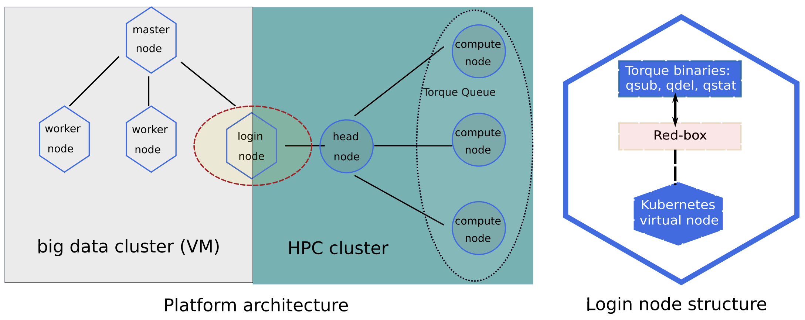
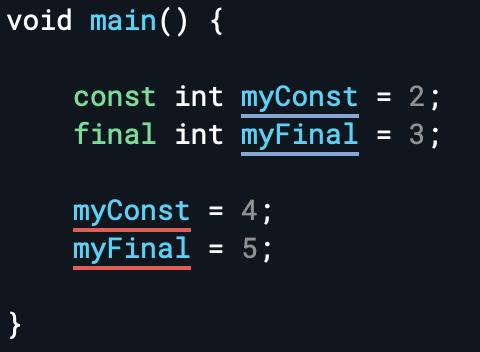

# 2021.12

## 12/1 (Wed)

### Clean Code - 4장. 주석

클린 코드 4장 주석을 읽고 정리했다. 주석 사용을 최대한 지양하고 코드로 의미를 표현하는 것이 좋다는 것과, 그럼에도 주석을 사용하는 것이 도움이 되는 케이스에 대해서 배울 수 있었다.

  * [#4 주석](/clean-code/04_comments.md)

## 12/2 (Thur)

### 운영체제 강의 - Monitor

운영체제 6부를 마무리했다. 프로세스 동기화와 상호배제를 Programming language 단에서 구현한 개념인 monitor에 대해 학습하고 정리했다. 정리한 내용은 아래 페이지 마지막에 추가했다. 운영체제 재밌다.

* [#6 프로세스 동기화와 상호 배제 (2)](/operating-system/course_CPA310-operating-system/07_process-synchronization-os.md)

## 12/5 (Sun)

### Singularity on HPC Cluster

HPC Cluster 환경에서 컨테이너를 배포하고 스케줄링하는 방법에 대해 학습했다. 오늘은 흐름을 이해하는 정도로 학습했으며, 본격적으로 포스트로 정리해볼 예정이다.

- Docker가 컨테이너 생태계의 표준으로 자리잡은지 수 년이 지났으나, 매우 고성능을 요구하는 HPC cluster에서는 Docker를 사용하지 않는다. Docker는 마이크로 서비스를 위한 다양한 기능과 편의성을 제공하는 대신, 파일 시스템, 네트워크 등 여러 측면에서 성능 저하가 불가피하기 때문이다. 

- 컨테이너의 장점을 살리면서도 성능 저하가 없고, 그러면서도 기존의 MPI 환경과 쉽게 결합할 수 있는 HPC 환경을 구축하기 위해서는 Docker가 아닌 HPC용 컨테이너를 사용해야 하며, 대표적인 오픈소스 컨테이너에는 Singularuty 가 있다. Singularity는 dependency 문제를 해결하는 이미지 포맷을 가질 수 있음과 동시에, native host 수준의 성능을 보장하며 오버헤드를 최소화 한다.

- 다만, Singularity는 기능과 문서 측면에서 상당히 불편하다. 컨테이너의 성능 오버헤드를 최소화하고, 기존의 MPI 환경과의 결합을 추구한다는 것은 그만큼 마이크로 서비스를 위한 컨테이너의 기능을 포기한다는 것을 의미한다. 즉, 네트워크 네임스페이스를 사용하지 않고, 컨테이너 프로세스를 호스트와 격리하지 않으며, 컨테이너 이미지는 라이브러리를 wrapping하는 정도로만 최소한의 가상화를 적용하는 것이다. 이러한 맥락에서 HPC 컨테이너의 기능 부족은 일종의 trade-off 처럼 필연적인 것일 수 있다.

- HPC 컨테이너의 부족한 management 및 scheduling 기능을 보완하기 위해 Kubernetes를 사용하여 HPC 환경을 제어하려는 시도들이 이루어지고 있다. Kubernetes가 제어하는 Cloud cluster와 HPC cluster를 연결하여 HPC의 성능 저하를 방지하면서도 Kubernetes의 관리 기능의 이점을 취하려는 목적으로 연구가 진행된다.



- [[HPC] HPC 컨테이너 생태계의 특징 비교 및 참고 레퍼런스 링크](https://m.blog.naver.com/alice_k106/221004605778)
- [Singularity: Container for Science](http://www.hpcadvisorycouncil.com/events/2017/stanford-workshop/pdf/GMKurtzer_Singularity_Keynote_Tuesday_02072017.pdf#43)

## 12/6 (Mon)

### RH Linux: 시스템 접속 및 파일 시스템

Linux 교육 첫 날 배운 것을 다음 두 페이지에 정리했다. Linux 콘솔에 접속하는 방법과 파일 시스템에 대해 학습했으며, ssh key 생성, linux 파일 시스템 구조 등 기존에 모호하게 알던 것들을 개념적으로 정리할 수 있었다.

  * [#1 Linux 시스템 접속하기](/operating-system/course_redhat-linux/01_linux-system-access.md)
  * [#2 Linux 파일 시스템](/operating-system/course_redhat-linux/02_linux-file-system.md)

## 12/7 (Tue)

### RH Linux: 파일 사이의 링크 관리하기

리눅스에서 파일 및 디렉터리 사이에 링크를 생성하고 관리하는 방법에 대해 학습했다. 다음 페이지 하단에 정리했다.

  * [#2 Linux 파일 시스템](/operating-system/course_redhat-linux/02_linux-file-system.md)

## 12/8 (Wed)

### RH Linux: 파일 시스템 권한 관리

리눅스에서 파일 및 디렉터리에 권한을 설정하는 방법에 대해 다음 페이지에 정리했다.

  * [#4 Linux 파일 시스템 권한 관리](/operating-system/course_redhat-linux/04_linux-file-access.md)

## 12/10 (Fri)

### Flutter: Stateful Widget

flutter에서 버튼을 눌렀을 때 화면 이미지가 바뀌도록 기능하는 Stateful Widget을 구현했다. StatefulWidget을 상속받는 class를 생성하고, class 변수와 onPressed() 함수를 사용하여 버튼이 클릭되었을 때 이미지를 변경하도록 구현할 수 있다.

```dart
class DicePage extends StatefulWidget {
  @override
  _DicePageState createState() => _DicePageState();
}

class _DicePageState extends State<DicePage> {
  int leftDiceNumber = 1;
  int rightDiceNumber = 1;

  @override
  Widget build(BuildContext context) {
    return Center(
      child: Row(
        children: <Widget>[
          Expanded(
            child: FlatButton(
              onPressed: () {
                //function
                setState(() {
                  leftDiceNumber = Random().nextInt(6) + 1;
                  print('diceNumber = $leftDiceNumber');
                });
              },
              child: Image.asset('images/dice$leftDiceNumber.png'),
            ),
          ),
          Expanded(
            child: FlatButton(
              onPressed: () {
                setState(() {
                  rightDiceNumber = Random().nextInt(6) + 1;
                  print('diceNumber = $rightDiceNumber');
                });
              },
              child: Image.asset('images/dice$rightDiceNumber.png'),
            ),
          ),
        ],
      ),
    );
  }
}
```

## 12/13 (Mon)

### Kubernetes - Container

오늘 들었던 쿠버네티스 교육 중에 학습한 내용을 정리했다. 오늘은 컨테이너와 쿠버네티스 개요에 대해 학습했다.

* [#1 Container Overview](/virtualization/kubernetes/course_kubernetes/01_container-overview.md)

## 12/14 (Tue)

### Kubernetes - Kubernetes Overview

쿠버네티스 기본 구조와 아키텍처에 대해 다음 페이지에 정리했다.

* [#2 Kubernetes Overview](/virtualization/kubernetes/course_kubernetes/02_kubernetes-overview.md)

## 12/15 (Wed)

### Kubernetes - Object/Deployment/Pod

쿠버네티스 오브젝트, 오브젝트 배포 전략, 컨테이너 생애 주기 및 진단 등에 대해 학습하고 각각 다음 페이지에 정리했다.

* [#3 Basic Kubernetes Objects](/virtualization/kubernetes/course_kubernetes/03_basic-kubernetes-objects.md)
* [#4 Deployment Management](/virtualization/kubernetes/course_kubernetes/04_deployment-management.md)
* [#5 Container Configuration](/virtualization/kubernetes/course_kubernetes/05_container-configuration.md)

## 12/16 (Thur)

### Kubernetes - Network/Volume/ConfigMap/Job

쿠버네티스 네트워킹, 볼륨, configMap 및 Job 에 해당하는 오브젝트들에 대해 학습하고 아래 페이지에 정리했다. 개념적인 내용 위주로 정리를 했는데, 차차 깊은 config도 이해하고 정리할 수 있었으면 좋겠다.

* [#6 Kubernetes Networking](/virtualization/kubernetes/course_kubernetes/06_kubernetes-networking.md)
* [#7 Kubernetes Volume](/virtualization/kubernetes/course_kubernetes/07_kubernetes-volume.md)
* [#8 ConfigMap, Secret, Job](/virtualization/kubernetes/course_kubernetes/08_config-and-workloads.md)

### Dart: Arrow Functions

Dart 언어에서 사용되는 `=>` 문법은 single-line 함수 또는 single-line return 결과를 간편하게 표현해주는 문법이다. 아래 코드에서 다음 두 문법은 동일하다.

```dart
// #1
int add(int n1, int n2) {
  return n1 + n2;
}

// #2
int add(int n1, int n2) => n1 + n2;
```

## 12/20 (Mon)

### Flutter: ThemeData class

- ThemeData class를 사용하면 전체 App의 디자인 테마를 한 번에 정리할 수 있다.
- MaterialApp 하위 트리에 `theme: ThemeData`를 추가하여 사용할 수 있다.
- primary color, secondary color. text color, dark/light mode 등을 지정할 수 있다.

### PS: Binary Tree

Binray Tree 두 문제를 풀었다. Binary Tree는 다음과 같은 문제 유형에서 사용할 수 있다.

- 문제 유형: 구간의 정보에 대한 문제(구간의 합, 최소값, 최대값)
- PS idea
  + 구간의 정보를 갖는 노드를 이진 트리로 만든다.
  + 저장 공간은 배열보다 큰 2의 제곱수 * 2배 크기로 만든다.
  + 구현 방법은 다양하나, 일반적으로 DFS + post order로 구현한다.

## 12/22 (Wed)

### CKA with Practical Tests

회사에서 틈틈이 CKA 강의를 들었다. Lec 2. 수업을 듣고 실습을 진행했다. 다음 페이지에 정리하고 있다.

* [[Udmey_CKA] #1 Core Concepts](/virtualization/kubernetes/udemy_cka/01_core-cooncept.md)

## 12/23,24,27

### CKA with Practical Tests

Udemy CKA with Practical Tests 강의를 듣고 정리하고 있다. 다음 페이지에 정리했다.

* [[Udmey_CKA] #2 Scheduling](/virtualization/kubernetes/udemy_cka/02_scheduling.md)
* [[Udmey_CKA] #3 Monitoring and Logging](/virtualization/kubernetes/udemy_cka/03_monitoring-and-logging.md)
* [[Udmey_CKA] #4 Application Lifecycle Management](/virtualization/kubernetes/udemy_cka/04_application-lifecycle-management.md)

## 12/28 (Tue)

### [Dart] Final vs. Const

- Dart에서는 final과 const 키워드를 통해 변수의 값을 변경할 수 없게 한다.
  
  

- const 의 경우 컴파일 할 때만 상수를 정의할 수 있다. 다시 말하면, const 로 정의한 상수는 런타임에서 정의되는 값을 설정할 수 없다. 반면 final 은 런타임에서 결정되는 값도 설정할 있다.
  + 예를 들어 DateTime.now() 의 경우 런타임에서 호출 될 때마다 결과 값이 다른데 이런 경우에는 변수를 const 로 설정할 수 없다. 결국 const 로 설정하는 값은 대부분 리터럴이 될 것이다.

- final과 const 로 배열을 정의하는 경우에도 차이가 있다. 다음 예시에서 final으로 선언한 배열에는 새로운 값을 추가할 수 있다. 반면, const로 선언한 배열에는 새로운 값을 추가하는 것이 불가능하다. 기존 배열을 새로운 것으로 바꾸는 것은 const, final 모두 불가능하다.

  ```dart
  final List<String> finalList = [];
  const List<String> constList = [];
  finalList.add('final');
  // compile error
  finalList = ['final2'];

  // compile error
  constList.add('const');
  ```

- 다음과 같이 class의 변수를 구현할 때 지정할 때, final 변수는 class를 초기화할 때 값을 지정해줄 수 있다. 하지만, const 변수는 class를 초기화할 때 값을 지정할 수 없으며, 코드가 컴파일되는 시점에 특정 값을 가져야 한다. 아래 코드에서 final Color colour 를 const Color colour로 변경하면 에러가 발생한다.

  ```dart
  class ReusableCard extends StatelessWidget {
    ReusableCard({@required this.colour, this.cardChild});

    final Color colour;
    final Widget cardChild;

    @override
    Widget build(BuildContext context) {
      return Container(
        child: cardChild,
        margin: EdgeInsets.all(15.0),
        decoration: BoxDecoration(
          color: colour,
          borderRadius: BorderRadius.circular(10.0),
        ),
      );
    }
  }
  ```

## 12/29 (Wed)

### Kubernetes - Cluster Maintenance, Security

Udemy CKA 강의 중 Cluster Maintenance, Security를 듣고 정리했다.

* [[Udmey_CKA] #5 Cluster Maintanence](/virtualization/kubernetes/udemy_cka/05_cluster-maintenance.md)
* [[Udmey_CKA] #6 Security](/virtualization/kubernetes/udemy_cka/06_security.md)

