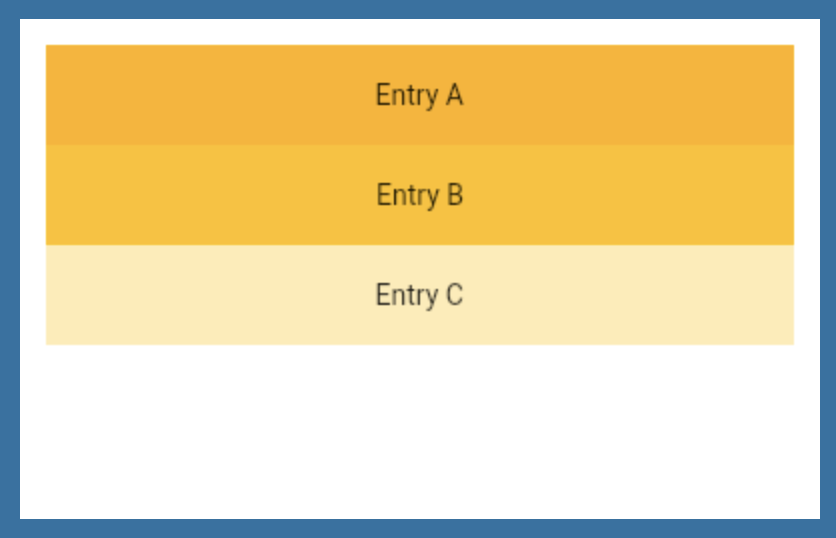
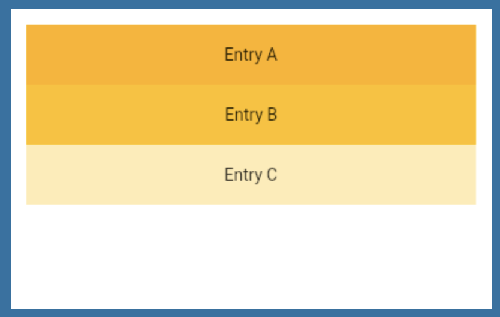
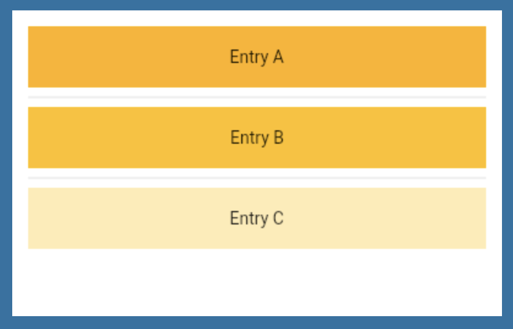

# 2022.01

## 1/3 (Mon)

### Kubernetes - Security, Storage

CKA 강의 중 Security 파트를 마무리하고 Storage 파트 전체를 수강하고 정리했다.

* [[Udmey_CKA] #6 Security](/virtualization/kubernetes/udemy_cka/06_security.md)
* [[Udmey_CKA] #7 Storage](/virtualization/kubernetes/udemy_cka/07_storage.md)
  
## 1/4,5 (Tue,Wed)

### Kubernetes - Networking

Kubernetes network를 공부했다. 네트워크 기본 개념에 대해 학습하고, 쿠버네티스 Pod 및 클러스터에서 네트워크 통신을 하는 방법에 대해 정리했다.

* [[Udmey_CKA] #8 Network](/virtualization/kubernetes/udemy_cka/08_network.md)

## 1/6 (Thur)

### Flutter Navigator

Flutter에서 Navigator 속성을 사용하면 앱 내에서 페이지를 이동이 가능하다. Navigator.push 를 사용하여 이동할 페이지를 push함면 해당 페이지로 이동하게 되고, Nagvigator.pop 을 사용하면 다시 기존 페이지로 돌아온다.

```dart
    BottomButton(
    onTap: () {
        Navigator.push(
        context,
        MaterialPageRoute(
            builder: (context) {
            return ResultsPage();
            },
        ),
        );
    },
    buttonTitle: "CALCULATE",
    ),
```

## 1/7 (Fri)

### Flutter - Constant Naming Rule

Flutter에서 컴포넌트 속성을 상수화하여 저장할 때는 변수명 앞에 k를 붙이는 naming rule을 사용한다. 다음과 같이 constant.dart를 구성하여 여러 상수와 스타일 등등을 모아 두면, 빠르고 쉽게 코드를 재사용할 수 있다.

```dart
import 'package:flutter/material.dart';

const kBottomContainerHeight = 80.0;
const kActiveCardColor = Color(0xFF1D1E33);
const kInactiveCradColor = Color(0xFF111328);
const kBottomContainerColor = Color(0xFFEB1555);

const kLabelTextStyle = TextStyle(
  fontSize: 18.0,
  color: Color(0xFF8D8E98),
);

const kNumberTextStyle = TextStyle(
  fontSize: 50.0,
  fontWeight: FontWeight.w900,
);
```

만약 이미 정의한 상수에서 특정 값만 바꾸고 싶다면, .copyWith 메서드를 사용할 수 있다. 원하는 상수를 불러온 후, copyWith 매서드를 덧붙여 속성을 수정하면 된다.

```dart 
Text(
    "TextExample",
    style: kLabelTextStyle.copyWith(color: Colors.black)
),
```

## 1/10 (Mon)

### Python SQLite3 Module

sqlite3 모듈은 파이썬 표준 라이브러리로, SQLite에 대한 인터페이스를 제공한다. sqlite3를 import 하면 데이터베이스를 쉽게 이용할 수 있다. python에서 sqlite3 모듈을 사용하는 방법을 다음 페이지에 정리했다.

* [Python SQLite3 모듈 사용하기](/language/python/python-sqlite3-module.md)

## 1/11 (Tue)

### CKA Mock Test 정리 - 1

CKA Mock Test를 풀고 그 중 Test 2, 3 문제와 풀이를 정리했다. 다음 페이지에 정리해두었다.

* [[Udmey_CKA] #9 Problem Solving](/virtualization/kubernetes/udemy_cka/09_problem-solving.md)

## 1/12 (Wed)

### CKA Mock Test 정리 - 2

CKA Mock Test 1과 Ligtening Lab 문제를 풀고 풀이를 정리했다. 다음 페이지에 정리해두었다.

* [[Udmey_CKA] #9 Problem Solving](/virtualization/kubernetes/udemy_cka/09_problem-solving.md)

## 1/13 (Thur)

### grep 명령어 정리

linux에서 grep은 파일에서 특정 문자열을 검색하기 위한 명령어다. grep 옵션에 대해 정리해보자.

1. 기본적으로 grep은 다음 형태로 사용된다.

  ```shell
  grep [옵션] [문자열(정규표현식)] [파일명]
  ```

2. grep에서 사용되는 정규 표현식 메타 문자

  - ^
    + 행의 시작 지시자 
    + '^test': test로 시작하는 모든 행과 대응함.
  - $
    + 행의 끝 지시자 
    + 'test$': test로 끝나는 모든 행과 대응함. 
  - .
    + 정확히 하나의 문자와 대응 
    + 't.s.': 총 4개의 문자로 이루어진 문자열을 검색하는 데, 첫 번째는 't' 세 번째는 's'인 문자열을 모두 대응함.
  - *
    + 선행 문자와 같은 문자 0개 또는 임의 개수와 대응
    + 'test*': 'test'를 기본으로 뒤에 아무 문자나 포함하여도 모두 대응함.
  - []
    + [] 사이의 문자 집합 중, 하나와 대응 
    + '[Tt]est': 'test' 나 'Test'를 대응함.
  - [-]
    + [] 안의 범위에 포함되는 한 문자와 대응
    + '[A-T]': A와 T 사이 범위에 포함되는 한 문자와 대응함.
  - [^ ]
    + 문자집합에 속하지 않는 한 문자와 대응 
    + '[^A-T]est': A와 T 사이 범위에 포함되지 않는 한 문자와 est가 붙은 문자열만 검색함.
  - <
    + 단어의 시작 지시자 
    + '<test': test로 시작하는 단어를 포함하는 행과 대응 
  - >
    + 단어의 끝 지시자 
    + 'test>': test로 끝나는 단어를 포함하는 행과 대응 
  - (..)
    + 다음 사용을 위해서 태그를 붙임. 
    + '(tes)ing': 지정된 부분을 태그 1에 저장한다. 나중에 태그 값을 참고하려면 \1을 쓴다. 맨 왼쪽부터 시작하여 태그를 9개까지 쓸 수 있다. 왼쪽 예에서는 tes가 레지스터1에 저장되고, 나중에 \1로 참고할 수 있다. 
  - x{m}
    + 문자 x를 m번 반복한다. 
    + 't{5}': 문자 t가 5회 연속으로 나오는 모든 행을 대응함. 
  - x{m,}
    + 적어도 m번 반복한다. 
    + 't{5,}': 문자 t가 최소한 5회 반복되는 모든 행과 대응함. 
  - x{m,n}
    + m회 이상 n회 이하 반복한다. 
    + 't{5,10}': 문자 t가 5회에서 10회 사이의 횟수로 연속으로 나오는 문자열과 대응함.

3. grep 옵션
  - -b
    + 검색 결과의 각 행 앞에 검색된 위치의 블록 번호를 표시한다. 검색 내용이 디스크 어느 곳에 위치했는 지를 알아내는데 유용하다. 
  - -c
    + 검색 결과를 출력하는 대신에 찾아낸 행의 총 개수를 출력한다.
  - -h
    + 파일 이름을 출력하지 않는다. 
  - -i
    + 대소문자를 구분하지 않는다. (대소문자 같은 취급) 
  - -I
    + 대소문자를 구분한다.
  - -l
    + 패턴이 존재하는 파일의 이름만 출력한다.
  - -m 숫자
    + 최대로 표시될 수 있는 결과를 제한한다. 
  - -n
    + 파일 내에서 행 번호를 함께 출력한다. 
  - -s
    + 에러 메시지 외에는 출력하지 않는다. 
  - -v
    + 패턴이 존재하지 않는 행만 출력한다. 
  - -w
    + 패턴 표현식을 하나의 단어로 취급하여 검색한다. 
  - -x
    + 패턴 표현식을 하나의 라인으로 취급하여 검색한다.

## 1/14 (Fri)

### Netfilter와 iptables

#### Netfilter 개요

Netfilter는 리눅스의 커널 모듈로서 네트워크 패킷을 처리하기 위한 프레임워크다. Netfilter는 다음과 같은 기능을 한다.
  + NAT(Network Address Trannslation): 사설 IP와 공인 IP를 변환, 포트 변환 등
  + Packet filtering: 특정 패킷을 차단 또는 허용. 서버의 접근 제어 또는 방화벽 구현 가능
  + Packet Mangling: 필요시 패킷 헤더의 값을 변경

#### Netfilter 구조

Netfilter는 커널에서 패킷을 처리하는 과정에서 5개의 후킹(hooking) 지점을 제공하여, 원하는 룰에 따라 패킷 처리를 할 수 있게 지원한다. 5개의 후킹 지점은 다음과 같다.

- PREROUTING: 인터페이스를 통해 들어온 패킷을 가장 먼저 처리하는 단계로, 목적지 주소를 변경할 수 있다.
- INPUT: 인터페이스를 통해 로컬 프로세스로 들어오는 패킷을 처리하는 단계. INPUT에서 패킷 허용/차단 등의 처리 후 user space로 전달한다.
- OUTPUT: 프로세스에서 처리한 패킷을 처리하는 단계로, 패킬 허용/차단 처리 후에 kernel space로 전달한다.
- FORWARD: 다른 호스트로 통과시켜 보낼 패킷에 대한 허용/차단 처리를 한다. 방화벽이나 IPS 등 내가 수신하는 패킷이 아니라 지나가는 패킷을 처리하는 단계다.
- POSTROUTING: 인터페이스를 통해  나갈 패킷에 대한 처리르 하는 단계롤, 출발지 주소를 변경할 수 있다.

#### iptables

이렇게 netfilter에는 내가 원하는 대로 접근을 통제하도록 규칙을 부여해야 하는데, netfilter에 쉽게 룰을 넣기 위해 사용하는 것이 iptables라는 실행 프로그램이다. iptable을 사용하면 netfilter의 룰을 조회하거나 새로운 룰을 저장할 수 있다.

## 1/17 (Mon)

### CNN(Convolution Neural Network)

CNN은 특정 모델을 한정하는 것은 아니며, convolution layer와 pooling layer의 조합으로 만들어진 모델을 통틀어 CNN 모델이라고 한다. 블랙박스 모델인 layers들을 convolution과 pooling의 조합을 이것저것 만들어 보면서 최적을 결과 값이 나올때, 이름이 붙어진 모델이 된다.


CNN은 크게 두 부분으로 나뉜다. 하나는 특징을 추출하는 feature extraction이고, 다른 하나는 feature extraction를 통과한 이후에 물체를 판단하고 결과값을 도출하는 classification 이다. Feature extraction은 convolution layer와 pooling layer가 섞여 있고, classification은 fully-connected layer로 이루어져 있다.

#### Convolution Layer

Convolution layer는 이미지의 특징을 파악하고 추출하는 역할을 한다. 이미지의 크기보다 작은 filter를 사용하여, filter로 이미지의 특징을 판별한다.


위와 같이 32x32 픽셀의 컬러 이미지가 있다고 해보자. 컬러 이미지는 RGB의 속성을 갖기 때문에 32x32 외에도 3개의 채널 값을 갖는다. 만약 흑백 이미지라면 채널 값은 1이 될 것이다.


5x5x3 짜리 filter를 사용한다고 해보자. 이 때, filter를 사용하여 이미지의 특징을 추출하게 되는데, 이미지의 왼쪽 상단부터 filter를 대고 같은 자리에 있는 숫자들을 내적하는 방법을 사용한다. 


그 결과는 위 그림과 같다. 이렇게 계산하는 과정을 convolution 연산이라고 이야기한다. Convolution 연산에는 여러 옵션이 있는데, filter를 몇 칸씩 이동시킬지 결정하는 stride와, output의 사이즈가 줄어드는 것을 방지하기 위한 zero padding 등이 있다.

#### Activation Function

딥러닝 네트워크에서는 노드에 들어오는 값들에 대해 곧바로 다음 레이어로 전달하지 않고 주로 비선형 함수를 통과시킨 후 전달한다. 이때 사용하는 함수를 활성화 함수(Activation Function)라고 부른다. 이러한 이유로 convolution 연산 후에 activation function을 통과시켜주며, 가장 많이 사용하는 activation function 은 ReLU이다. ReLU 함수는 양수는 그대로, 음수는 0으로 통과시키는 함수다.


#### Pooling Layer

Pooling layer은 추출한 특징을 강화하는 계층이다. convolution layer랑 비슷하지만, 값들 중 특정값만 유지하고 나머지 값은 버리는 특성을 갖는다. Pooling layer의 종류에는 max pooling, average pooling, overlapping pooling이 있다.


Pooling 중 가장 많이 쓰이는 max pooling에 대해 알아보자. max pooling은 filter size를 기준으로 가장 큰 값만 남기고 나머지를 제거한다. pooling을 적절하게 사용한다면 overfitting을 방지하는 결과를 얻을 수 있다.


#### Reference

- [CNN에서 pooling이란?](https://hobinjeong.medium.com/cnn에서-pooling이란-c4e01aa83c83)
- [Convolutional Neural Network(CNN) _기초 개념](https://han-py.tistory.com/230)

## 1/18 (Tue)

### CNN - ResNet Model

ResNet은 2015년 ILSVRC에서 우승을 차지한 알고리즘으로, 마이크로소프트에서 개발한 알고리즘이다. (“Deep Residual Learning for Image Recognition”)


ResNet은 152계층으로 기존 모델들에 비해 약 7배 이상 깊은 계층을 가지며, 정확도는 매우 높다. 혹시 layer의 깊이가 깊을수록 무조건 성능이 더 좋아지는 것일까? 그런 것은 아니다.


ResNet 저자들은 20층의 네트워크와 56층의 네트워크를 비교했는데, 그 결과 오히려 더 깊은 구조를 갖는 56층의 네트워크가 더 나쁜 성능을 보이는 것을 확인했다. 새로운 방식 없이 무조건 망을 깊게 만드는 것은 성능 개선에 효과가 없음을 확인한 것이다.

이를 해결하기 위해 ResNet에서는 Residual Block이라는 핵심 개념이 등장한다. Residual Block은 기존 망과 달리 입력값을 출력값에 더해줄 수 있도록 지름길(shortcut)을 하나 만드는 것이다.


기존의 신경망은 입력값 x를 타겟값 y로 매핑하는 함수 H(x)를 얻는 것이 목적이다. 하지만, ResNet은 F(x) + x를 최소화하는 것을 목적으로 한다. input x 는 현재 시점에서 변할 수 없는 값이므로, F(x)를 0에 가깝게 만드는 것이 목적이 되며, F(x)가 0이 되면 출력과 입력이 x로 같아지게 된다.

F(x) = H(x) - x 이므로 F(x)를 최소화하는 것은 H(x) - x를 최소로 해주는 것과 같고, H(x) - x를 잔차(residual)라고 한다. 잔차를 최소화하는 것이 목적이므로 ResNet이라는 이름이 붙게 되었다.


ResNet은 기본적으로 VGG-19 구조를 뼈대로 한다. VGG-19 구조에 convolution 층들을 추가해서 깊게 만든 후에, shortcut들을 추가하면 ResNet의 기본 구조가 된다.

34층의 ResNet은 처음을 제외하고는 균일하게 3x3 사이즈의 컨볼루션 필터를 사용했다. 그리고 특성맵의 사이즈가 반으로 줄어들 때, 특성맵의 depth를 2배로 높였다. Residual block의 효과를 파악하기 위해 18층과 34층의 성능을 비교한 결과는 다음과 같다.


Plain 에서는 계층이 깊을수록 성능이 떨어졌지만, shortcut을 사용할 경우 계층이 깊을수록 더 개선된 성능을 보였다. 

#### Reference

- [[CNN 알고리즘들] ResNet의 구조](https://bskyvision.com/644)

## 1/19 (Wed)

### TORQUE / Slurm

#### TORQUE


TORQUE 구조는 하나의 head node와 여러 개의 compute node로 구성되어 있다.

- node 구성
  + login node (optional)
    * 어떤 경우에는 job이 먼저 login node로 들어갔다가 head node로 전달된다.
  + head node (1개)
    * 전체 TORQUE 시스템을 관리한다.
    * pbs_server daemon 과 job scheduler daemon 이 있다.
    * 클러스터에 있는 compute node 리스트를 head node에 저장한다.
  + compute node (여러개)

- TORQUE에서 job submission 절차

  1. `qsub` 명령어를 통해 job이 head node로 제출된다. job은 주로 PBS (Portable Batch System) script로 쓰여진다. `qsub` 의 결과로 job ID가 반환된다.
  2. job ID와 job 특징 등을 포함한 job의 기록이 생성되고, pbs_server으로 전달된다.
  3. pbs_server는 job 기록을 job scheduler 으로 전달한다. job scheduler는 job을 job queue에 넣고, job queue에 스케줄링 알고리즘을 적용한다.
  4. scheduler가 job을 실행하기 위한 적절한 node의 리스트를 찾으면, job 정보를 pbs_server으로 반환한다. node 리스트 중 첫 번째 노드가 Mother superior가 되고, 나머지 node들은 sister MOMs 또는 sister nodes가 된다.
  pbs_server는 자원을 할당하고 job 관리와 실행 정보 등을 mom superior node에 설치된 pbs_mom daemon으로 전달한다. 이제 할당된 compute node에서 job을 실행할 수 있다.
  5. compute node의 pbs_mom은 job의 실행을 관리하고 자원 사용률을 모니터링한다. pbs_mom은 job 실행에 대한 모든 성공, 실패, 완료 등의 결과를 수집하고, job의 상태를 pbs_server으로 전달한다.

- TORQUE에서 node들은 queues 라는 서로 다른 그룹으로 파티셔닝된다. 각 queue에서 관리자는 walltime, job size 등의 리소스 제한을 설정한다. 이러한 특징은 대규모의 HPC 클러스터의 job 스케줄링에 유용한데, nodes들이 서로 다르고, 특정 node가 특정한 유저를 위해 예약될 수도 있기 때문이다.

#### Slurm


- Slurm 구조는 1개 또는 2개의 Slurm servers와 여러 개의 compute node로 구성되어 있다.
- Slurm server는 `slurmctld` daemon을 통해 클러스터 자원과 job을 관리한다.
- Slurm server와 `slurmctld` 들은 active/passive mode로 배포되는데, 신뢰성 높은 computing cluster 서비스를 제공하기 위함이다.
- 각 compute node는 `slurmd` daemon을 갖는데, 이는 job의 입력과 실행을 담당한다.
- 클러스터에는 `slurmdbd` 라는 daemon이 있는데, 이는 클러스터의 정보들을 수집하고 기록하는 역할을 한다.
- `slurmrestd`는 REST API를 통해 Slurm과 상호작용하기 위해 사용된다.
- Slurm 자원 리스트는 slurm server에 slrum.conf라는 파일에 저장되어 있다. 이 파일에는 CPU, 메모리, 파티션 정보, node 정보 등 클러스터에 대한 정보가 저장되어 있다.

#### Reference

- [Container orchestration on HPC systems through Kubernetes](https://journalofcloudcomputing.springeropen.com/articles/10.1186/s13677-021-00231-z)

## 1/21 (Fri)

### Configure Neovim

Linux에 Neovim을 사용한 개발 환경을 구축하고 있다. nvim(neovim)은 vim에 여러 확장 기능을 추가한 편집기다. 다음과 같이 nvim을 셋업하고 있다.

- vim-plug: nvim 패키지 매니저
- CoC(Conquer of Completion): 실시간 자동 완성 기능을 지원해주는 플러그인
- LSP(Language Server Protocol): 자동 완성, 정의로 이동, 모든 참조 검색 등의 기능을 제공
- nvim-treesitter: 구문을 파싱하여 세부적인 하이라이팅을 제공

## 1/24 (Mon)

### Flutter TIL

#### textTheme Class

프로젝트에서 ThemeData 내에 textTheme을 정의해두면, 프로젝트 내에서 textTheme을 불러 사용할 수 있다.

```dart
// theme.dart
ThemeData lightThemeData(BuildContext context) {
  return ThemeData.light().copyWith(
    ...
    textTheme: GoogleFonts.interTextTheme(Theme.of(context).textTheme)
        .apply(bodyColor: kContentColorLightTheme),
    ...
  )
}
```

textTheme을 사용하고 싶을 경우에는 다음과 같이 Theme.of(context) 를 사용하여 원하는 text 스타일을 호출한다. 이때, copyWith method는 기존 정의한 text style을 복사하되 일부 field를 변경하고자할 때 사용한다. 아래 예시에서는 copyWith method를 사용하여 색상 투명도를 변경했다.

```dart
Text(
  "Skip",
  style: Theme.of(context).textTheme.bodyText1!.copyWith(
      color: Theme.of(context)
          .textTheme
          .bodyText1!
          .color!
          .withOpacity(0.8)),
),
```

#### fittedBox Class

FittedBox는 child의 크기와 위치를 fit 속성값에 따라 부모에게 맞추는 위젯이다. 다음 예시에서 FittedBox의 child는 해당 Box 범위를 벗어나지 않고 크기가 고정된다.

```dart
FittedBox(
  child: TextButton(
    onPressed: () => Navigator.push(
      context,
      MaterialPageRoute(
        builder: (context) => SigninOrSignupScreen(),
      ),
    ),
    child: Row(
      children: [
        Text(
          "Skip",
          style: Theme.of(context).textTheme.bodyText1!.copyWith(
              color: Theme.of(context)
                  .textTheme
                  .bodyText1!
                  .color!
                  .withOpacity(0.8)),
        ),
        SizedBox(
          width: kDefaultPadding / 4,
        ),
        Icon(
          Icons.arrow_forward_ios,
          size: 16,
          color: Theme.of(context)
              .textTheme
              .bodyText1!
              .color!
              .withOpacity(0.8),
        ),
      ],
    ),
  ),
)
```

#### Spacer(flex: N)

spacer는 row, column 등에서 공간을 만들어 주는 위젯이다. Spacer()를 작성하면 위젯과 위젯 사이에 빈 공간이 생긴다. Spacer(flex: 2)와 같이 flex 값을 지정하면 flex 속성을 설정하지 않은 쪽의 2배의 공간을 차지한다. (Expanded의 flex 속성과 동일하다.)

```dart
child: Column(
  children: [
    Spacer(flex: 2),
    Image.asset("assets/images/welcome_image.png"),
    Spacer(flex: 3),
    Text(
      "Welcome to our freedom \nmessaing app",
      textAlign: TextAlign.center,
      style: Theme.of(context)
          .textTheme
          .headline5!
          .copyWith(fontWeight: FontWeight.bold),
    ),
    Spacer(),
    Text(
      "Freedom talk any person of your \nmother language.",
      style: TextStyle(
        color: Theme.of(context)
            .textTheme
            .bodyText1!
            .color!
            .withOpacity(0.64),
      ),
    ),
    Spacer(flex: 3),
  ]
)
```

#### Navigator

Navigator는 화면을 전환하기 위해 사용하는 기능이다. Flutter에서 screen과 page는 route라고 불린다. 하나의 route에서 다른 route로 이동할 때는 Navigator.push()를 사용하여 route를 Navigator에 의해 관리되는 route 스택에 추가한다. 두 번째 route를 닫고 이전 route로 돌아가고 싶을 경우, Navigator.pop()을 사용하여 route 스택에서 현재 route를 제거할 수 있다.

```dart
Navigator.push(
  context,
  MaterialPageRoute(
    builder: (context) => SigninOrSignupScreen(),
  ),
),
```

#### MediaQuery

Flutter에서 화면 크기, 텍스트 배율, 24시간 포멧, 기기 방향 등 시스템에 대한 정보를 얻기 위해서는 MediaQuery라는 클래스를 사용한다. 다음과 같은 방법으로 화면 정보를 읽을 수 있다.

```dart
MediaQuery.of(context).size                // 앱 화면 크기
MediaQuery.of(context).size.height         // 앱 화면 높이
MediaQuery.of(context).size.width          // 앱 화면 너비
MediaQuery.of(context).platformBrightness  // 화면 밝기
```

## 1/25 (Tue)

### vimtutor Summary

#### 커서 이동

- `hjkl`: 기본 방향키 이동
- `0`, `$`: 줄의 처음과 끝으로 이동
- `gg`, `G`: 문서의 처음과 끝으로 이동
- `#G`: #번째 줄로 이동
- `Ctrl + o`: 이전 커서 위치로 이동
- `Ctrl + i`: 커서 다시 되돌아가기
- `w`: 다음 단어의 첫 글자로 이동 (word)
- `e`: 현재 단어를 포함하여 다음 단어의 끝 글자로 이동 (end of word)
- `%`: 가까운 괄호로 이동

#### 입력 모드

- `i`: 커서 바로 위에서 입력 모드 시작
- `a`: 커서 위치 바로 다음에서 입력 모드 시작
- `A`: 커서 줄 끝에서 입력 모드 시작
- `o`: 커서 다음 줄에 줄을 추가하여 입력 모드 시작
- `O`: 커서 이전 줄에 줄을 추가하여 입력 모드 시작

#### 지우기

- `x`: 커서 위치의 글자 삭제
- `dw`: 커서 위치부터 단어 끝까지 삭제
- `d$`: 커서 위치부터 줄 끝까지 삭제
- `dd`: 줄 전체 삭제
- `d + # + (option)`: #번 반복 실행

- 참고로, vim에서 지우는 것은 잘라내기와 같다. 직전에 지운 내용을 붙여넣기 할 수 있다.

#### 수정

- `R`: 커서 위치부터 수정 모드 시작
- `r`: 커서 위치 문자 1개 수정
- `cw`: 현재 커서부터 한 단어를 지우고 입력 모드로 변경
- `c$`: 현재 커서부터 줄 끝까지 지우고 입력 모드로 변경
- `c + # + (option)`: #번 반복 실행

#### 실행 취소

- `u`: 실행 취소
- `U`: 해당 줄의 모든 변경 사항 취소
- `ctrl + r`: 다시 실행

#### 선택, 복사, 붙여넣기

- `v`: 선택 모드 시작. v 입력 후 hjkl로 직접 영역 선택 가능
  + 선택 후 d 입력 시 선택 영역 삭제
  + 선택 후 y 입력 시 선택 영역 복사
  + 선택 후 :w filename 입력 시 선택 영역 저장

- `yw`: 한 단어 복사
- `y$`: 줄 끝까지 복사
- `y + # + (option)`: #번 반복 실행

- `p`: 붙여넣기

#### 외부 명령 실행

- `:!` shell command
  + :!ls 를 하면 터미널 실행 결과 보여줌

#### 파일 read/write

- `:q!`: 저장 안하고 나가기
- `:wq`: 저장하고 나가기
- `:w`: 저장
- `:r filename`: 파일을 읽어서 현재 커서부터 그 내용 불러오기
- `:r :!ls`: 외부 명령 결과를 현재 커서 위치에 불러오기

#### 찾기, 바꾸기

- `/`, `?`: 찾기. /는 순방향, ?는 역방향
  + 찾은 후 n으로 다음 검색, shift + n 으로 이전 검색

- `:s`: 찾아서 바꾸기 명령
  + `:s/old/new`: 현재 위치한 줄에서 제일 가까운 old를 new로 변경
  + `:s/old/new/g`: 현재 위치한 줄의 모든 old를 new로 변경
  + `#1,#2s/old/new/g`: #1번째 줄부터 #2번째 줄까지 모든 old를 new로 변경
  + `:%s/old/new`: 문서 전체에서 제일 가까운 old를 new로 변경
  + `:%s/old/new/g`: 문서 전체에서 모든 old를 new로 변경
  + `:%s/old/new/g`: 문서 전체에서 모든 old를 new로 변경 (하나씩 물어봄)

## 1/26 (Wed)

### [Go] 데이터 타입, 변수와 상수

Go Language 의 데이터 타입, 변수와 상수 선언 방법을 공부하고 정리했다.

  * [Go 데이터 타입, 변수와 상수](/language/golang/01_go-variable-constant.md)


## 1/27 (Thur)

### Flutter TIL

#### ListView

리스트로 그려줄 데이터가 많지 않을 경우에는 다음과 같이 Container를 직접 지정하여 그려줄 수 있다.



```dart
ListView(
  padding: const EdgeInsets.all(8),
  children: <Widget>[
    Container(
      height: 50,
      color: Colors.amber[600],
      child: const Center(child: Text('Entry A')),
    ),
    Container(
      height: 50,
      color: Colors.amber[500],
      child: const Center(child: Text('Entry B')),
    ),
    Container(
      height: 50,
      color: Colors.amber[100],
      child: const Center(child: Text('Entry C')),
    ),
  ],
)
```

데이터가 많을 경우에는 List에 데이터를 넣어두고, Listview.build를 사용하여 하나씩 불러올 수 있다.



```dart
final List<String> entries = <String>['A', 'B', 'C'];
final List<int> colorCodes = <int>[600, 500, 100];

ListView.builder(
  padding: const EdgeInsets.all(8),
  itemCount: entries.length,
  itemBuilder: (BuildContext context, int index) {
    return Container(
      height: 50,
      color: Colors.amber[colorCodes[index]],
      child: Center(child: Text('Entry ${entries[index]}')),
    );
  }
);
```

Listview.separated를 사용하면 리스트 사이에 공백을 넣을 수 있다.



```dart
final List<String> entries = <String>['A', 'B', 'C'];
final List<int> colorCodes = <int>[600, 500, 100];

ListView.separated(
  padding: const EdgeInsets.all(8),
  itemCount: entries.length,
  itemBuilder: (BuildContext context, int index) {
    return Container(
      height: 50,
      color: Colors.amber[colorCodes[index]],
      child: Center(child: Text('Entry ${entries[index]}')),
    );
  },
  separatorBuilder: (BuildContext context, int index) => const Divider(),
);
```

#### InkWell

InkWell은 사용자의 동작을 감지했을 때 잉크가 퍼지는 듯한 애니메이션 효과를 보이는 위젯이다. onTap, onDoubleTap, onLongPress등 위젯 터치에 반응할 때 자식 위젯의 변화를 어떻게 나타낼 것인지 지정할 수 있다. 자식 위젯의 변화 이외에도 Navigator로 화면 전환 지정도 가능하다.

```dart
InkWell(
  onTap: () {},
  child: Container(
    ...
  ),
)
```

#### Stack, Positioned, ClipBehavior

Stack은 위젯들을 겹쳐서 보여줄 수 있는 위젯이다. Stack은 가장 큰 child의 사이즈를 따라간다. Stack 내에서 위젯의 위치를 조정하고 싶을 경우에는 Positioned라는 위젯을 쓴다. Positioned 위젯은 Stack 내부에서만 작동한다.

```dart
child: Stack(
  clipBehavior: Clip.none,
  alignment: Alignment.center,
  children: [
    Container(
      width: double.infinity,
      height: 2,
      color: message.isSender
          ? Colors.white
          : kPrimaryColor.withOpacity(0.4),
    ),
    Positioned(
      left: 0,
      child: Container(
        height: 8,
        width: 8,
        decoration: BoxDecoration(
          color: message.isSender ? Colors.white : kPrimaryColor,
          shape: BoxShape.circle,
        ),
      ),
    )
  ],
),
```

Stack에서 여러 위젯을 겹치고 위치를 조정하다 보면, 제일 큰 위젯을 기준으로 그 밖의 영역으로 벗어난 부분은 잘리게 된다. 만약 범위를 벗어나더라도 잘리지 않고 보이게 하고 싶다면, 다음과 같이 clipBehavior를 Clip.none으로 설정하면 된다. 참고로 clipBehavio의 기본값은 clipBehavior: Clip.hardEdge 이다.

```dart
child: Stack(
  clipBehavior: Clip.none,
  ...
)
```
