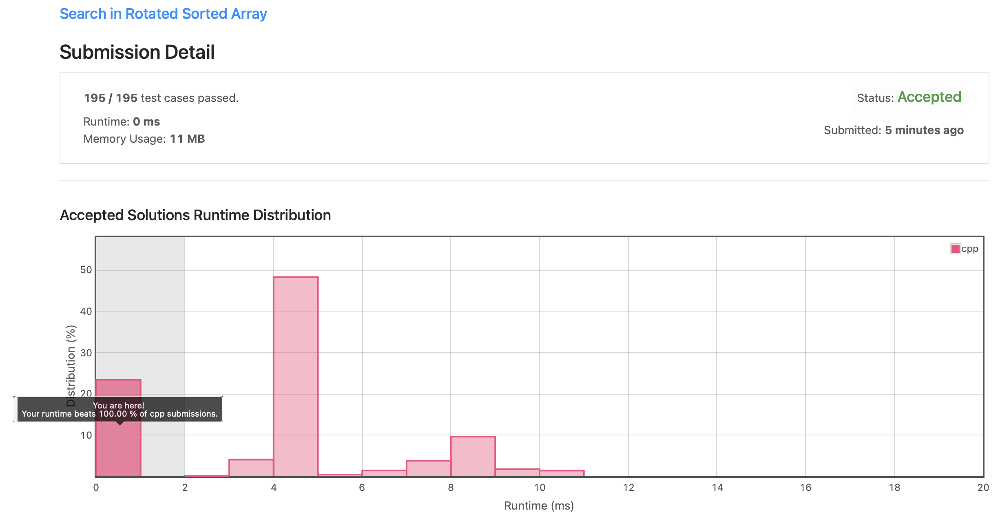

# Leetcode 33. Search in Rotated Sorted Array (C++)

Date: 2021.09.17

## 문제

https://leetcode.com/problems/search-in-rotated-sorted-array/

- input: 오름차순 정렬한 후 특정 pivot index를 기준으로 rotate한 정수형 배열 nums, 정수 target
- output: 주어진 배열에서 target이 위치한 index 반환
- constraint: 시간 복잡도 O(log n) 내로 작성

## 알고리즘

### 이진 탐색

O(log n)의 시간 복잡도로 코드를 작성해야 했기 때문에 Divide and Conquer 방식으로 이진 탐색을 구현했다.

주어진 배열이 그냥 오름차순 배열이 아닌, 특정 pivot index을 기준으로 index를 순환(rotate)시킨 배열인 것이 생각하기가 까다로웠다. pivot을 직접 구할 것인가, pivot을 대략적으로 찾을 것인가, 아예 pivot을 고려하지 않고 풀 것인가에 대해 고민하는 시간이 길었다. 처음에는 pivot을 고려하지 않는 코드를 짰다가, 결국 pivot의 상대 위치를 이용하여 문제를 해결하는 방식으로 최종 구현했다.

middle값을 기준으로 왼쪽으로 이동해야할 지, 오른쪽으로 이동해야할 지 결정하려면 pivot의 상대적인 위치만 있다면 충분하다. middle 값을 기준으로 pivot이 어느 편에 있는지 알기 위해서는, middle 좌우 배열이 오름차순인지 확인하면 된다. 둘 중 오름차순이 아닌 영역에 pivot이 위치해 있다.

### 시간 복잡도

Divide and conquer 방식을 사용할 경우, 탐색을 반복할 때마다 탐색 대상이 1/2 씩 줄어든다. 따라서 아래 알고리즘은 log n의 시간 복잡도를 갖는다.

## 제출 코드 (C++)

```C++
class Solution {
public:
    int search(vector<int>& nums, int target) {
        
        int index = -1;
        int left = 0, right = nums.size()-1;
    
        if(nums.size() == 0) return index;
        
        while(left <= right){

            int middle = (left + right) / 2;
            
            if(nums[middle] == target){
                return middle;
            }
            if(nums[middle] > target){
                if(nums[left] > target && nums[middle] > nums[right])
                    left = middle + 1;
                else                
                    right = middle - 1;
            }
            else if(nums[middle] < target){
                if(nums[right] < target && nums[left] > nums[middle])
                    right = middle - 1;
                else
                    left = middle + 1;
            }
        }
        
        return index;        
    }

};
```

