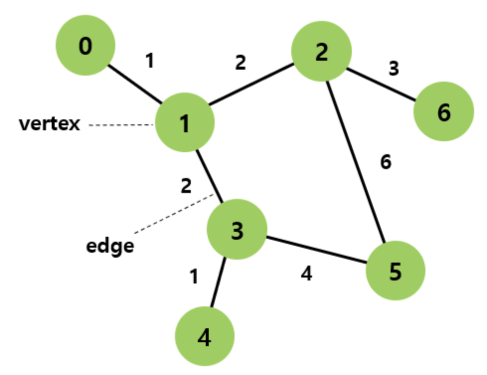
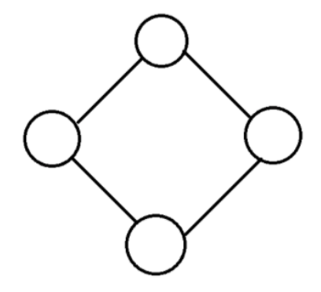
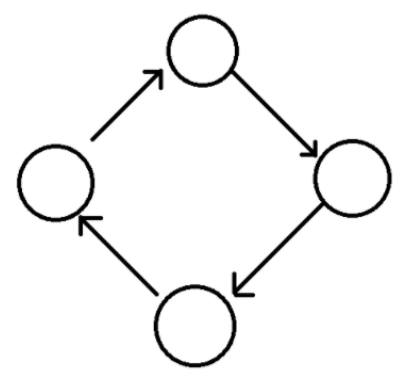
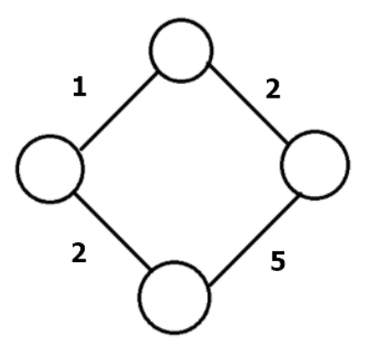
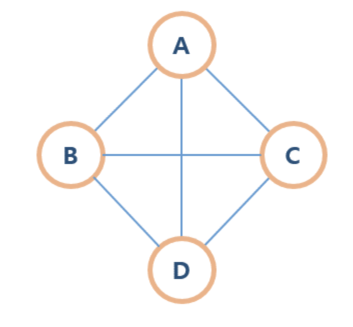
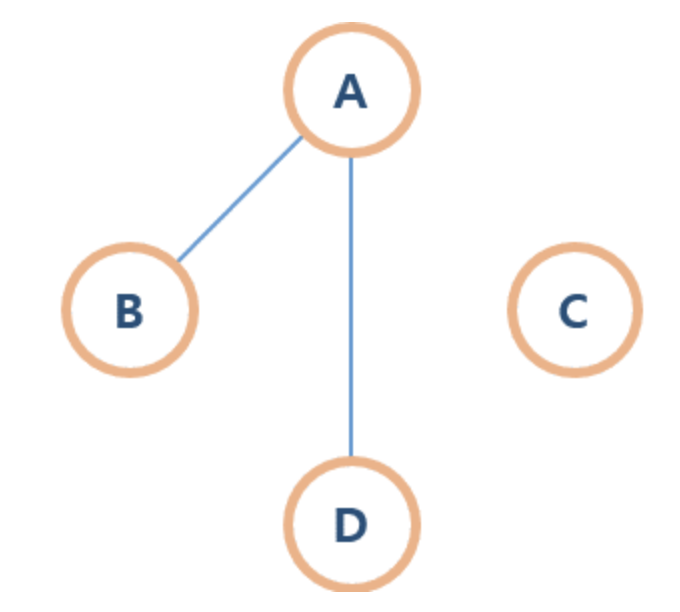
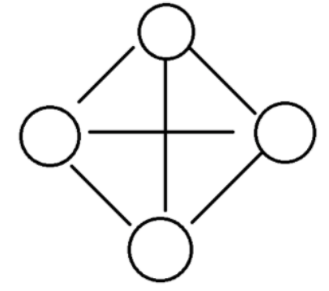
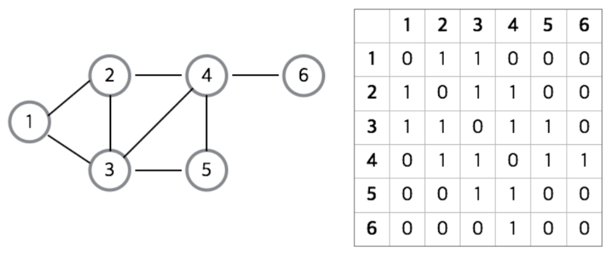
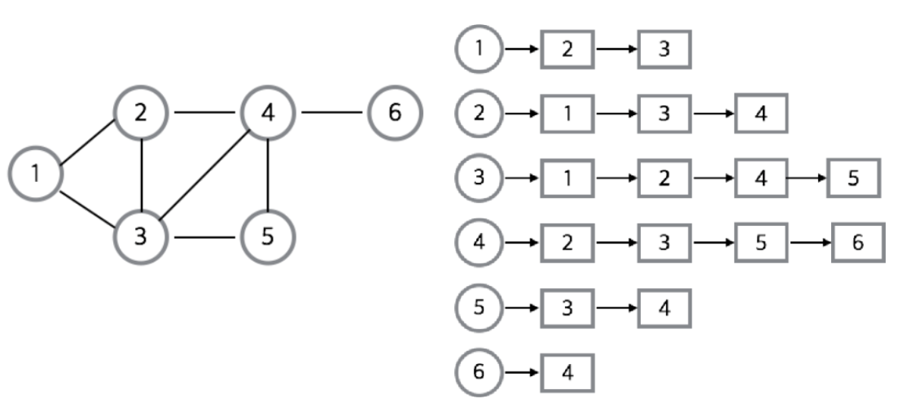
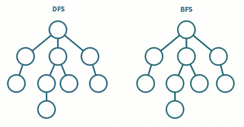

# Graph

## 이 페이지를 읽으면 알 수 있는 것

- 그래프란 무엇인가?
- 그래프의 종류에는 어떤 것이 있는가?
- 그래프는 어떤 자료구조를 사용하여 구현할 수 있는가?
- 그래프를 탐색하는 방법에는 어떤 것이 있는가?

## 그래프

그래프는 정점과 간선으로 이루어진 자료 구조다. 그래프를 사용하면 연결되어 있는 객체 사이의 관계를 표현할 수 있다.

## 용어

- 정점(vertex): 노드(node)라고도 부르며, 정점에는 데이터가 저장된다.
- 간선(edge): 링크(link)라고도 부르며, 정점 사이의 관계를 나타낸다.
- 인접 정점(adjacent vertex): 어떤 정점에서 간선에 의해 직접 연결된 정점
- 차수(degree): 무방향 그래프에서 하나의 정점에 인접한 정점의 수

    - 무방향 그래프에 존재하는 모든 정점의 차수 합 = 무방향 그래프 간선 수 * 2

- 진출 차수(out-degree): 방향 그래프에서 사용하는 용어로, 특정 노드에서 외부 노드로 향하는 간선의 수
- 진입 차수(in-degree): 방향 그래프에서 사용하는 용어로, 외부 노드에서 특정 노드로 향하는 간선의 수

    - 방향 그래프에 존재하는 정점의 진입 차수 또는 진출 차수의 합 = 방향 그래프 간선의 수

## 그래프의 종류

### 무방향 vs 방향 그래프

- 무방향 그래프 (Undirected Graph)

    

    + 간선에 방향성이 없으므로 간선을 통해 양 방향으로 이동할 수 있다.
    + 정점 A와 정점 B를 연결하는 간선은 (A, B)와 같이 정점의 쌍으로 표현한다.
        * (A, B) = (B, A)

- 방향 그래프 (Directed Graph)

    

    + 간선에 방향성이 존재하는 그래프
    + A->B로만 갈 수 있는 간선은 <A, B>로 표현한다.
        * <A, B> != <B, A>

### 가중치 그래프

- 가중치 그래프(Weighted Graph)

    

    + 간선에 비용이나 가중치가 할당된 그래프
    + `네트워크`라고도 부른다.

### 연결 vs 비연결 그래프

- 연결 그래프 (Connected Graph)

    

    + 무방향 그래프에 있는 모든 정점쌍에 대해 항상 경로가 존재하는 그래프
    + 예를 들어, 트리는 순환하지 않는 연결 그래프다.

- 비연결 그래프 (Unconnected Graph)

    

    + 무방향 그래프에서 특정 정점쌍 사이에 경로가 존재하지 않는 그래프

### 순환 vs 비순환 그래프

- 순환 그래프 (Cyclic Graph)
    + 단순 경로의 시작 정점과 종료 정점이 동일한 그래프

- 비순환 그래프 (Acyclic Graph)
    + 순환이 존재하지 않는 그래프

### 완전 그래프
- 완전 그래프 (Complete Graph)

    

    + 그래프에 속해 있는 모든 정점이 서로 연결된 그래프
    + 무방향 완전 그래프에서 정점의 개수 V와 간선의 개수 E는 다음과 같은 관계를 갖는다.
        * E = V * (V - 1) / 2

## 그래프 구현 방법

### 인접 행렬(Adjacency Matrix)

인접 행렬은 그래프의 노드간 관계를 2차원 배열로 만든 것이다. 배열에서 (i, j) 위치의 값이 1이라면, i번째 노드에서 j번째 노드로 향하는 간선이 있다는 의미다. 무방향 또는 양방향의 경우 (i, j)와 (j, i) 위치 모두에 1을 넣어주면 된다. 그래프에 간선이 많이 존재하는 밀집 그래프의 경우 인접 행렬을 사용하는 것이 유리하다.

#### 장점

- 두 정점이 연결되어 있는지 O(1) 안에 알 수 있다.
- 정점의 차수는 O(N) 안에 알 수 있다.
- 구현이 간편하다.

#### 단점

- 어떤 노드에 인접한 노드를 찾기 위해서는 모든 노드를 순회해야 한다.
- 그래프에 존재하는 모든 간선의 수를 알기 위해서는 인접 행렬 전체를 조사해야 한다. O(V^2)의 시간 복잡도를 갖는다.
- 무조건 V*V의 배열 공간이 필요하기 때문에, 필요 이상의 공간이 낭비된다.

### 인접 리스트(Adjacency List)

인접 리스트는 각 그래프 정점의 인접 정점을 연결 리스트(linked list)로 표현한 것이다. 그래프에 간선이 매우 많은 것이 아니라면, 메모리 효율을 위해 그래프를 인접 리스트로 표현하는 것이 일반적인 방법이다.

#### 장점

- 어떤 정점의 인접 정점을 쉽게 찾을 수 있다.
- 그래프에 존재하는 모든 간선의 수를 알기 위해서는 O(V+E)의 시간 복잡도가 소요된다.
- 필요한 만큼의 공간만 사용하여 공간의 낭비가 적다.

#### 단점

- 특정 두 점이 연결되어있는지 확인하려면 정점의 차수만큼의 시간이 필요하다.
- 구현이 비교적 복잡하다.

## 시간 및 복잡도

### 인접 행렬

- 두 노드가 연결되었는 지 확인: O(1)
- 한 노드에 연결된 모든 노드 확인: O(V)
- 공간 복잡도: O(V^2)

### 인접 리스트

- 두 노드가 연결되었는 지 확인: O(V)
- 한 노드에 연결된 모든 노드 확인: O(E)
- 공간 복잡도: O(V + E)

## 그래프의 탐색

그래프를 탐색하는 방법에는 크게 깊이 우선 탐색(DFS)과 너비 우선 탐색(BFS) 방법이 있다.

### 깊이 우선 탐색(DFS, Depth First Search)

루트 노드에서 시작해서 다음 분기로 넘어가기 전에 해당 분기를 완벽하게 탐색하는 방식이다. 특정 분기를 갈 수 있는 만큼 최대한 깊이 탐색하고, 더 이상 탐색할 곳이 없다면 이전 정점으로 돌아가는 방식으로 그래프를 순회한다. 재귀 함수 또는 stack 을 사용하여 구현한다.

모든 노드를 방문하고자 하거나, 경로의 특징을 저장해야 할 때 DFS를 사용한다. 너비 우선 탐색보다 구현이 간단하나, 속도는 더 느리다.

### 너비 우선 탐색(BFS, Breadth First Search)

루트 노드에서 시작하여 인접한 노드를 먼저 탐색하는 방법이다. 깊게 탐색하기 전에 먼저 넓게 탐색한다. Queue를 사용하여 구현한다.

두 노드 사이의 최단 경로 또는 임의의 경로를 찾고 싶을 때 BFS를 사용한다.

## Reference

- https://coding-factory.tistory.com/610
- https://j3sung.tistory.com/745