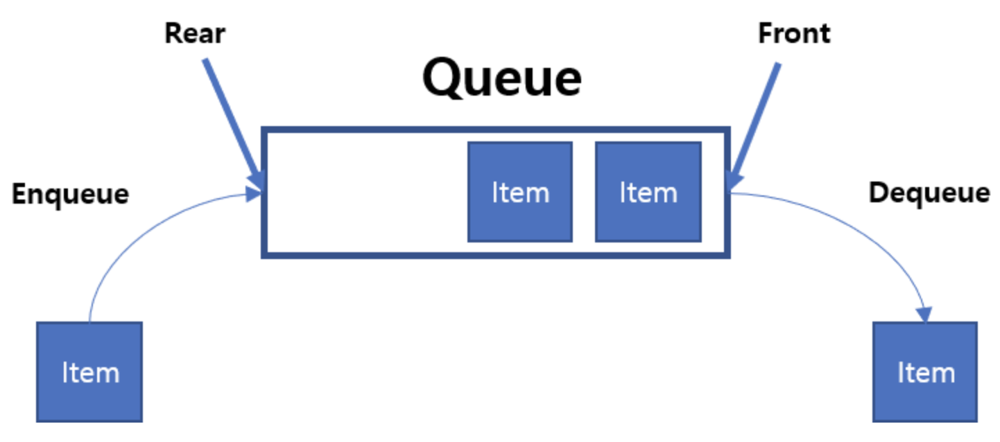
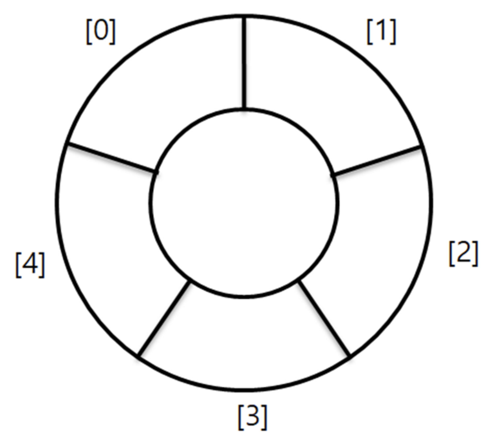

# Queue and Circular Queue

## 이 페이지를 읽으면 알 수 있는 것

- Queue은 무엇이며 어떻게 동작하는가?
- Queue의 특징은 무엇이며 언제 활용되는가?
- Circular Queue란 무엇이며 왜 필요한가?
- Queue을 코드로 구현하기 (C++)

## 개요

Queue은 FIFO(First In First Out) 구조를 가진 자료 구조이다. 좌우 입구가 모두 열린 길다란 원통형 통의 구조를 가지며, 한쪽 끝에서는 데이터를 입력하고 반대쪽 입구에서는 데이터를 꺼낸다. Queue 자료 구조에서는 가장 먼저 쌓인 데이터가 가장 먼저 밖으로 나오게 된다.



## 동작 및 용어

- `Enqueue`: Queue에 데이터를 입력하는 동작
- `Dequeue`: Queue에서 데이터를 꺼내는 동작
- `Front`: Queue에서 가장 먼저 입력된 데이터의 위치. Dequeue의 대상이 된다.
- `Rear`: Queue에서 가장 마지막에 입력된 데이터의 위치. Enqueue의 대상이 된다.

## Circular Queue (순환 큐)

배열로 Queue를 구현할 때는 문제가 한 가지 있다. 배열로 Queue를 구현할 때는 Front와 Rear의 index를 추가함으로써 동작을 구현한다. 예를 들어, Enqueue 동작은 Rear 위치를 한 칸 뒤로 밀어 새로운 데이터를 삽입하며, Dequeue 동작은 Front 위치를 한 칸 뒤로 밀어 맨 처음 데이터를 삭제한다. 이 동작을 계속 하다보면 배열의 앞쪽 공간이 남게 되어 메모리가 낭비된다는 문제가 발생한다. 만약 Rear가 배열의 끝에 도달하는 경우, 전체 데이터를 앞쪽의 빈 공간으로 이동시켜야 하는데 이 또한 번거로운 작업이다.

이러한 문제를 해결하기 위해 순환 큐의 개념이 등장한다. 순환 큐는 처음과 끝이 연결된 형태로, Rear의 위치가 배열의 끝에 도달하더라도 Rear의 위치를 다시 배열의 처음으로 옮김으로서 메모리 효율을 높일 수 있다. 순환 큐는 배열의 시작과 끝의 구분이 없기 때문에, 배열의 앞쪽 공간이 남는 것은 앞으로 사용할 수 있는 뒷쪽 공간이 남는 것과 같은 의미가 된다.



## 시간 복잡도

- Enqueue: O(1)
- Dequeue: O(1)

## 장단점

- 장점
  - 데이터의 삽입 및 삭제가 빠르다.
- 단점
  - 중간에 위치한 데이터로의 접근이 어렵다.

## 활용 예시

데이터를 입력된 순서대로 처리해야 할 때 주로 사용된다.

- BFS
- 콜센터 대기 순서 저장하기
- 프로세스 곤리

## 구현 (C++)

### 함수 소개

Queue 자료 구조를 구현하기 위해서는 일반적으로 아래 함수들이 필요하다.

```C++
bool IsEmpty(Queue* queue);
```

- Queue가 비었으면 true, 그렇지 않으면 false를 반환한다.

```C++
bool IsFull(Stack* stack);
```

- Queue가 다 찼으면 true, 그렇지 않으면 false를 반환한다.
- Queue의 MAX_SIZE가 정해져 있는 경우 필요하다.

```C++
void enqueue(Queue* queue, Data val);
```
- Queue의 Rear에 새로운 val 값을 추가한다.

```C++
Data dequeue(Queue* queue);
```

- Queue의 Front에 위치한 데이터를 제거하고, 해당 값을 반환한다.

### 배열을 이용한 Circular Queue 구현

배열으로 Queue를 구현할 때 메모리 바효율 발생을 막기 위해 Circular Queue를 구현했다. front는 Queue의 시작을 의미하며 실제 데이터는 front의 다음 index부터 저장되기 시작한다. rear은 Queue에 가장 마지막으로 들어온 데이터의 index를 저장한다. 순환 큐를 구하기 위해서는 나머지 개념을 이용하면 배열의 끝에 왔을 때 쉽게 가장 처음 위치로 index를 이동시킬 수 있다.

```C++
#include<iostream>
using namespace std;

#define MAX_SIZE 6

template <typename T>
class Queue{
private:
    T queue[MAX_SIZE + 2];
    int front, rear;

public:
    Queue() : front(0), rear(0) {}; // 생성자
    ~Queue() {}; // 소멸자

    // Queue가 비었으면 true, 그렇지 않으면 false 반환
    bool IsEmpty(){
        if(front == rear) return true;
        else return false;
    }

    // Queue가 꽉 찼으면 true, 그렇지 않으면 false 반환
    bool IsFull(){
        if((rear+1) % MAX_SIZE == front) return true;
        else return false;
    }

    // rear를 한 칸 늘리고 데이터 저장
    void enqueue(T val){
        if(IsFull()){
            cout << "Queue is Full." << endl;
            return ;
        }
        rear = (rear+1) % MAX_SIZE;
        queue[rear] = val;
    }

    // front를 한 칸 늘리고 기존 front 값 반환
    T dequeue(){
        if(IsEmpty()){
            cout << "Queue is Empty." << endl;
            return 0;
        }
        T tmp = queue[front];
        front = (front+1) % MAX_SIZE;
        return tmp;
    }

    // Queue에 저장한 값 출력
    void show(){
        if(IsEmpty()){
            cout << "Queue is Empty." << endl;
            return ;
        }

        int cur;
        for(int i=0; i<MAX_SIZE; i++){
            cur = (front+i+1) % MAX_SIZE;
            cout << queue[cur] << " ";
            if(cur == rear) break;
        }
        cout << endl;
    }
};

int main(){

    Queue<int> queue;

    queue.enqueue(1);
    queue.enqueue(2);
    queue.enqueue(3);
    queue.enqueue(4);
    queue.enqueue(5);
    queue.enqueue(6); // Queue is Full
    queue.show(); // 1, 2, 3, 4, 5

    queue.dequeue();
    queue.dequeue();
    queue.dequeue();
    queue.show(); // 4, 5

    queue.enqueue(6);
    queue.enqueue(7);
    queue.enqueue(8);
    queue.enqueue(9); // Queue is Full
    queue.show(); // 4, 5, 6, 7, 8

}
```

### Linked List를 이용한 Linear Queue 구현

Linked List를 이용해서는 순환하지 않는 일반 Queue를 구현했다. front는 Queue에 가장 먼저 입력된 node를, rear는 Queue에 가장 늦게 입력된 node를 가리킨다.

```C++
#include<iostream>
using namespace std;

#define MAX_SIZE 5

template <typename T>
struct Node{
    T Data;
    struct Node<T> *next = NULL;
};

template <typename T>
class Queue{
private:
    struct Node<T> *front, *rear;
    int size = 0;

public:
    Queue() : front(NULL), rear(NULL), size(0) {}; // 생성자
    ~Queue() {}; // 소멸자

    // Queue가 비었으면 true, 그렇지 않으면 false 반환
    bool IsEmpty(){
        if(rear == NULL) return true;
        else return false;
    }

    // Queue가 꽉 찼으면 true, 그렇지 않으면 false 반환
    bool IsFull(){
        if(size == MAX_SIZE) return true;
        else return false;
    }

    // rear를 한 칸 늘리고 데이터 저장
    void enqueue(T val){
        if(IsFull()){
            cout << "Queue is Full." << endl;
            return ;
        }

        Node<T> *newNode = new Node<T>();
        newNode->Data = val;
        newNode->next = NULL;

        if(IsEmpty()){
            front = newNode;
            rear = newNode;
        }
        else{
            rear->next = newNode;
            rear = newNode;
        }
        size++;
    }

    // front를 한 칸 늘리고 기존 front 값 반환
    T dequeue(){
        if(IsEmpty()){
            cout << "Queue is Empty." << endl;
            return 0;
        }

        T tmp = front->Data;
        Node<T> *ptr = front;

        if(size == 1){
            front = NULL;
            rear = NULL;
        }
        else{
            front = front->next;
        }

        delete ptr;
        size--;

        return tmp;
    }

    // Queue에 저장한 값 출력
    void show(){
        if(IsEmpty()){
            cout << "Queue is Empty." << endl;
            return ;
        }

        Node<T> *ptr = front;
        while(ptr != NULL){
            cout << ptr->Data << " ";
            ptr = ptr->next;
        }
        cout << endl;
    }
};

int main(){

    Queue<int> queue;

    queue.enqueue(1);
    queue.enqueue(2);
    queue.enqueue(3);
    queue.enqueue(4);
    queue.enqueue(5);
    queue.enqueue(6); // Queue is Full
    queue.show(); // 1, 2, 3, 4, 5

    queue.dequeue();
    queue.dequeue();
    queue.dequeue();
    queue.show(); // 4, 5

    queue.enqueue(6);
    queue.enqueue(7);
    queue.enqueue(8);
    queue.enqueue(9); // Queue is Full
    queue.show(); // 4, 5, 6, 7, 8

    queue.dequeue();
    queue.dequeue();
    queue.dequeue();
    queue.dequeue();
    queue.dequeue();
    queue.dequeue(); // Queue is Empty

}
```

## Reference

- https://velog.io/@hanif/자료구조-원형-큐
- https://velog.io/@choiiis/자료구조-스택Stack과-큐Queue#언제-사용할까