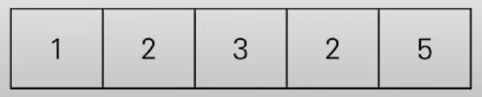

# Two Pointers

## Two Pointers란?

Two Pointers는 1차원 배열에서 두 개의 포인터를 조작하여 원하는 결과를 얻는 알고리즘이다. 1차원 배열에서 이중 for문을 사용하는 것과 비교할 때 두 개의 포인터를 사용하면 실행 시간을 개선할 수 있다는 장점이 있다.

## Two Pointers 동작

다음과 같은 배열 내에서 부분합이 5인 연속 수열의 개수를 구하는 문제를 풀어보자.



Two Pointers는 두 개의 포인터를 조작하는 알고리즘이다. 위 문제에서 left와 right라는 두 개의 포인터를 선언하고, 각 포인터를 부분 배열의 시작과 끝을 가리키도록 한다. 다음과 같은 과정을 통해 문제를 풀 수 있다.

1. left, right 모두 배열의 첫 번째 index를 가리키도록 한다.
2. 만약 부분 배열의 합이 target 부분합인 5보다 작다면, right를 뒤로 한 칸 이동시켜 부분합을 증가시킨다.
3. 만약 부분 배열의 합이 target 부분합인 5보다 크다면, left를 뒤로 한 칸 이동시켜 부분합을 감소시킨다.
4. 만약 부분 배열의 합이 target 부분합인 5와 같다면, 카운트한다.
5. 배열의 끝에 도달할 때까지 2~4를 반복한다.

## Two Pointers Pseudo Code

```C++
int TwoPointers(vector<int>& arr, int target){

    int left = 0, right = 0;
    int sum = 0, count = 0;

    while(right <= arr.size()){
        if(sum < target){
            sum += arr[right++];
        }
        else if(sum > target){
            sum -= arr[left++];
        }
        else{
            count++;
            left++;
        }
    }
    return count;
}
```

## Two Pointers 성능

### Time Complexity

- O(n)

### Space Complexity

- O(1)

## Reference

- https://www.youtube.com/watch?v=rI8NRQsAS_s