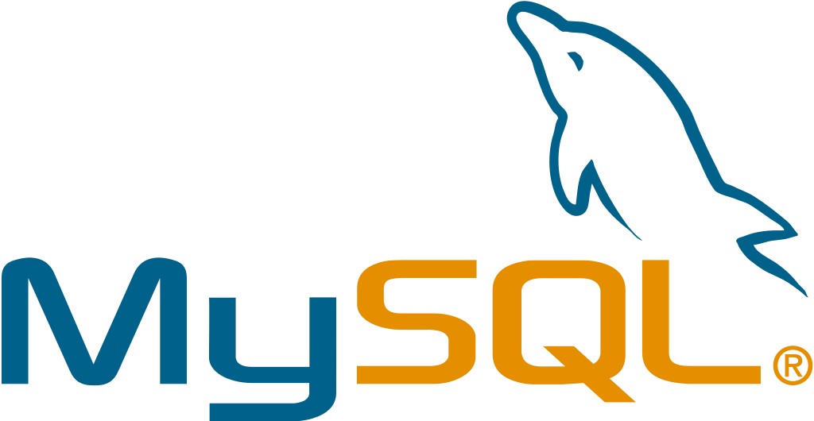

# RDBMS: MySQL 알아보기

## MySQL

MySQL는 가장 있기 있는 오픈소스 RDBMS로, SQLite와 달리 서버/클라이언트 형태의 데이터베이스다. MySQL은 표준 SQL을 완전히 준수하지는 않는다. 대신 속도와 안정성을 높이는 방식으로 디자인 되었다.

## MySQL 장점

- 사용이 편하다.
  + MySQL은 세계에서 가장 인기 있는 데이터베이스 시스템으로, 쉽게 정보를 검색할 수 있다.
- 보안 수준이 높다.
  + MySQL은 암호 보안 수준을 설정할 수 있고, 사용자 관리 기능을 제공하여 사용자 별로 별도의 접근 권한을 부여할 수 있다.
- 속도가 빠르다.
  + MySQL은 SQL을 완벽하게 준수하지 않는 대신 속도를 높이는 방법을 선택했다. 다른 데이터베이스 솔루션 대비 매우 빠른 속도를 자랑한다.
- 복제 기능을 제공한다.
  + MySQL은 안정성과 가용성을 위해 두 개 이상의 호스트에서 데이터를 복제하는 기능을 지원한다. 이는 백업을 설정하거나 공간을 수평적으로 확장할 때 유용하다.

## MySQL 단점

- SQL을 완벽하게 준수하지 않는다.
  + SQL 준수보다는 속도와 편의성을 우선시하므로, 특정 기능을 사용하는 데 제한이 있을 수 있다. 예를 들어, full join 절에 대한 지원이 없다.
- 라이선스에 대한 제약이 있다.
  + MySQL은 무료 버전과 유료 버전이 있으며, 일부 기능 및 플러그인은 유료 버전에서만 사용할 수 있다.

## MySQL은 언제 사용하면 좋을까?

1. 분산 작업이 필요한 경우 → choose MySQL
   - MySQL의 복제 기능 지원은 분산 데이터베이스 설정에 적합하다.

2. 웹 사이트 및 웹 애플리케이션을 구축하는 경우 → choose MySQL
   - MySQL은 사용이 편하고 속도가 빠르며, 확장성이 좋기 때문에 많은 웹 사이트와 애플리케이션에서 사용된다.

3. 향후 제품의 성장이 예상되는 경우 → choose MySQL
   - MySQL의 복제 기능 지원은 수평적 확장에 도움이 된다.

4. SQL 준수가 필요한 경우 → don't choose MySQL
   - MySQL은 SQL을 완전히 준수하지 않는다. 따라서, 완전한 SQL 준수가 필요한 경우, 완벽하게 SQL과 호환되는 DBMS를 사용하는 것이 좋다.

5. 동시성과 대용량이 필요한 경우 → don't choose MySQL
   - MySQL은 일반적으로 읽기가 많은 작업에서 잘 수행되지만 동시에 읽기와 쓰기 작업이 일어나는 경우는 문제가 될 수 있다. 한 번에 많은 사용자가 데이터를 쓰는 경우 PostgreSQL과 같은 다른 RDBMS가 더 나은 선택이 될 수 있다.

## Reference

- [[DBMS] SQLite vs MySQL vs PostgreSql: 관계형 DB 시스템의 비교. - (2) MySQL](https://smoh.tistory.com/369?category=706280)