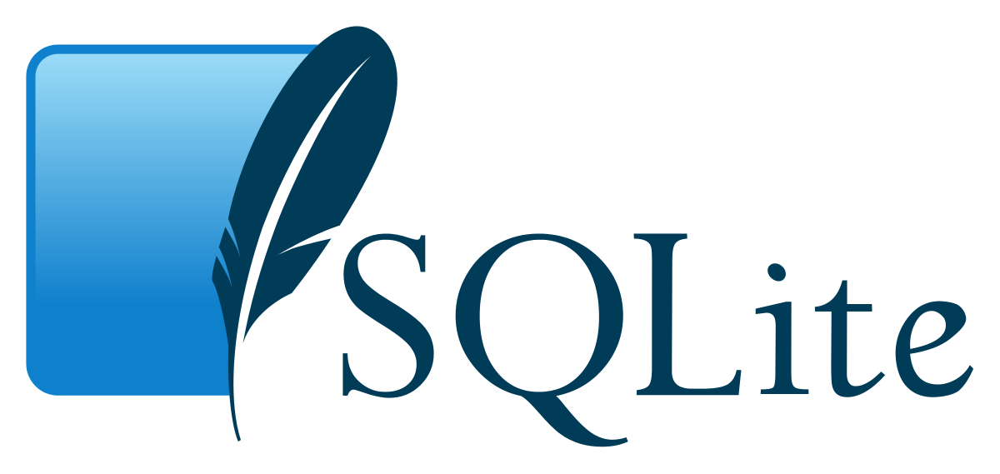

# RDBMS: SQLite 알아보기

## SQLite

SQLite는 SQL 언어 형식을 사용하는 관계형 데이터 베이스 관리 시스템(RDBMS)의 한 종류이다. 

SQLite은 serverless 데이터베이스 엔진이다. 대부분의 RDBMS는 클라이언트/서버 형태로 구현되어 있다. 하지만, SQLite는 서버를 별도로 두지 않고, 모든 프로세스가 데이터베이스에 직접 접근할 수 있다. 데이터를 저장할 디스크만 있다면 간단하게 구현이 가능하다.

SQLite는 무료 오픈소스이며, 사용에 특별한 라이선스가 필요하지 않다. 압축 및 암호화에 도움이 되는 몇 가지 확장 기능은 유료로 제공된다.

## SQLite는 언제 사용하면 좋을까?

SQLite의 공식 사이트는 다음과 같이 SQLite 사용 가이드를 제공한다.

- [Appropriate Uses For SQLite](https://www.sqlite.org/whentouse.html)

이 글의 서문을 번역하면 다음과 같다.

> SQLite는 MySQL, Oracle, PostgreSQL, SQL Server와 같은 클라이언트/서버 SQL 데이터베이스 엔진과는 애초에 해결하고자 하는 문제가 달라서 직접적인 비교가 어렵습니다. 클라이언트/서버 SQL 데이터베이스 엔진은 기업의 데이터의 공용 저장소를 구현하는 데 중점을 두고 있어 확장성, 동시 접근성, 데이터 중앙집권화, 제어(컨트롤) 등을 강조합니다. SQLite는 개별 앱과 기기를 위한 로컬 저장소를 제공하는 데 중점을 두고 있습니다. SQLite는 경제성, 효율성, 확실성, 독립성, 단순함을 강조합니다.

> SQLite는 클라이언트/서버 데이터베이스가 아닌 fopen()과 경쟁합니다.

## SQL checklist

1. 네트워크 통신이 필요한가? → choose client/server
   - 데이터가 응용 프로그램과 별도의 장치에 있는 경우 일반적으로 클라이언트/서버 데이터베이스 엔진을 선택하는 것이 좋다.
2. 동시에 작성되는 경우가 많은가? → choose client/server
   - 많은 스레드 또는 프로세스가 동일한 순간에 데이터베이스를 작성해야 하는 경우 클라이언트/서버 데이터베이스 엔진을 선택하는 것이 좋다.
   - SQLite는 데이터베이스 파일당 한 번에 하나의 작성자만 지원한다.
3. 빅 데이터를 다루는가? → choose client/server
   - SQLite는 281테라바이트 파일을 지원할 디스크 드라이브와 파일 시스템을 찾을 수 있다고 가정할 때, 최대 281테라바이트 크기의 데이터베이스를 지원한다.
   - 그렇더라도 콘텐츠의 크기가 1TB 이상랄면 클라이언트/서버 데이터베이스를 고려하는 것이 좋다.
4. 그 외 → choose SQLite!
   - 쓰기 동시성이 낮고 콘텐츠가 1TB 미만인 장치 로컬 저장소의 경우 SQLite가 거의 항상 더 나은 솔루션이다.
   - SQLite는 빠르고 안정적이며 구성이나 유지 관리가 필요하지 않다.

## SQLite 데이터 타입

- null: NULL값
- integer: 부호가 있는 정수. 값의 크기에 따라 1, 2, 4, 6, 8 바이트로 저장됨.
- real: 실수 또는 8바이트 부동 소수점 숫자로 저장되는 값.
- txt: 데이터베이스 인코딩을 사용하여 저장된 텍스트 문자열. UTF-8, UTF-16BE, UTF-16LE.
- blob: 입력된 그대로 저장된 데이터의 blob.

## SQLite 장점

- 매우 가볍다.
  + 일반적으로 600kb 미만의 공간을 차지하며, 완전히 독립형이므로 SQLite가 작동하기 위해 시스템에 설치해야 하는 외부 종속성이 없다.
- 사용자 친화적인 RDBMS
  + SQLite는 서버 프로세스로 실행되지 않기 때문에 설치에서 애플리케이션과의 통합까지의 과정이 간단하다.
- 뛰어난 이식성
  + SQLite는 단일 파일에 전체 데이터가 저장되며, 이 파일은 디렉터리 계층의 어디에나 위치할 수 있으며 쉽게 공유될 수 있다.

## SQLite 단점

- 동시 사용에 제약
  + 여러 프로세스가 동시에 SQLite 데이터베이스에 접근은 할 수 있지만, 데이터 변경은 한 번에 하나의 프로세스만 가능하다. 클라이언트-서버의 구조를 같은 RDBMS보다는 동시성이 떨어진다.
- 사용자 관리 기능이 없다.
  + SQLite는 일반 디스크 파일을 직접 읽고 쓰기 때문에, 적용 가능한 유일한 액세스 권한은 기본 운영 체제의 일반적인 액세스 권한 뿐입니다. 이로 인해 SQLite는 특별한 액세스 권한이 필요한 응용 프로그램에는 적합하지 않다.
- 보안이 약하다.
  + 애플리케이션의 버그에 취약하고, 정밀한 데이터 접근이 어렵다.

## Reference

- [[DBMS] SQLite vs MySQL vs PostgreSql: 관계형 DB 시스템의 비교. - (1) SQLite](https://smoh.tistory.com/368)
- [SQLite은 언제 사용하면 좋을까?](https://stitchcoding.tistory.com/9)