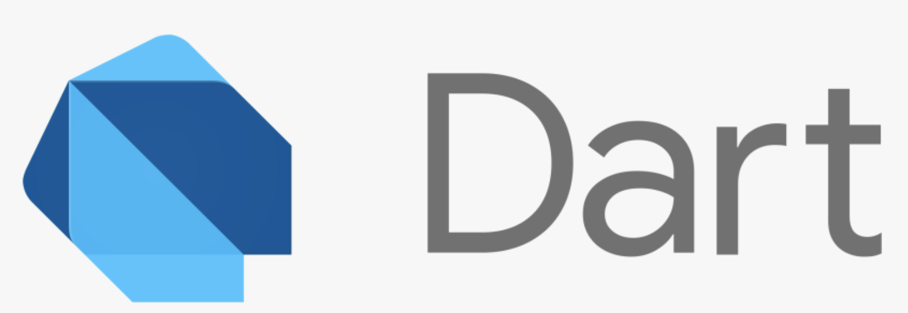

# #1 Flutter Overview

## Flutter란 무엇인가?

Flutter는 Google에서 개발한 크로스 플랫폼 모바일 앱 개발 프레임워크다. Flutter를 사용하면 하나의 플랫폼으로 iOS와 Android에 배포할 수 있는 앱을 동시에 개발할 수 있다.

## Language

Flutter는 Dart 언어를 사용한다. Dart는 Google에서 만든 프로그래밍 언어로, Javascript 보다 더 나은 Server side 및 Front-End 코드 작성 언어를 만들기 위해 등장했다. 

## Flutter 장점

1. IOS와 Android를 동시에 개발할 수 있다.

   - "one code base to maintain, one place to debug, and one place to update"
   - 하나의 코드를 사용하여 다양한 스크린 사이즈를 가진 기기에 앱을 배포할 수 있다.
  
2. 통합 개발 환경 지원

   - Flutter는 다양한 Editor(Android Studio, VS Code 등)를 사용하여 빌드가 가능하다.
   - Android Studio는 Flutter Inspector와 Flutter Outline 이라는 개발 도구를 지원하고, VS code 에서는 간단하게 Flutter Extension 을 사용하여 Flutter를 사용할 수 있다.

3. 성능 문제 해결

   - 기존 React Native 혹은 Hybrid App의 경우 네이티브 브릿지를 통한 통신이 불가피했다. 하지만 Flutter는 직접 컴파일되서 Render를 직접 하기때문에 성능이 빠르다.

4. Material Design와 Cupertino

   - Flutter는 Androd와 iOS의 대표 디자인 가이드를 기본적으로 제공한다. 구글의 Material Design과 iOS의 Cupertino 디자인 시스템을 제공한다.

5. Dart를 사용하지만 Native 코드도 사용
   
   - Futter는 Dart를 사용하지만, 크로스 플랫폼이기에 해당 OS에 최적화된 앱을 만들려면 Native 코드를 사용할 수 밖에 없다. 따라서,Dart만 사용하는것이 아니라 Android면 Kotlin, iOS면 Swift도 사용한다. 이는 기존의 Native 코드를 사용한 개발자라면 장점이 된다.

6. Hot reload

    - Flutter에서 가장 유명한 특징은 빠르고 stateful한 Hot reload 기능이다. 앱이 동작하고 있는 동안에도 Flutter 앱에 변경을 반영할 수 있다.

## Useful Materials

- [Flutter API Docs](https://api.flutter.dev/index.html) 페이지에 클래스에 대한 설명이나 사용 방법이 잘 나와 있다.
- [Material Design](https://material.io/design)에서 다양한 디자인 속성들을 확인하고 사용할 수 있다. 
- [App Icon](https://appicon.co)에서 App Icon을 쉽게 만들 수 있다.