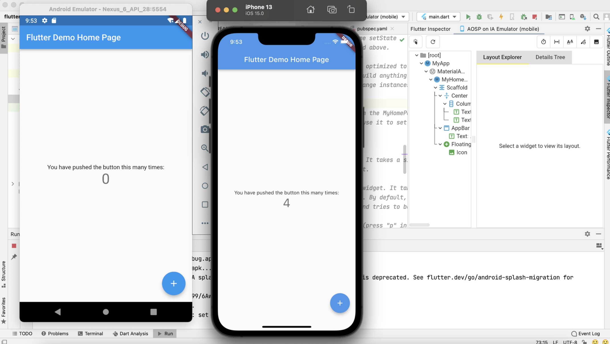

# #2 Flutter 설치

## Prerequisites for Flutter Development

- Android Apps
    - Mac or PC
    - Android Studio
    - Android Emulator or physical device
- iOS Apps
    - Mac
    - Android Studio
    - iOS Simulator or physical device

## Overview of the Process

- **If you have a PC**
    
    Outcome: You will be set up to develop Flutter apps for Android.
    
    **Steps:**
    
    1. Install the Flutter SDK
    2. Install Android Studio
    3. Install the Android Emulator
    
    [https://flutter.dev/docs/get-started/install/windows](https://flutter.dev/docs/get-started/install/windows)
    
- **If you have a Mac**
    
    Outcome: You will be set up to develop Flutter apps for both iOS and Android.
    
    **Steps**
    
    1. Install the Flutter SDK
    2. Install Android Studio
    3. Install the Android Emulator
    4. Install Xcode and command-line tools
    5. Test the iOS Simulator
    
    [https://flutter.dev/docs/get-started/install/macos](https://flutter.dev/docs/get-started/install/macos)
    

## Hello World

- Flutter로 Andriod와 iOS에 각각 기본 앱을 띄워봤다. 매우 편하고 좋다.

    