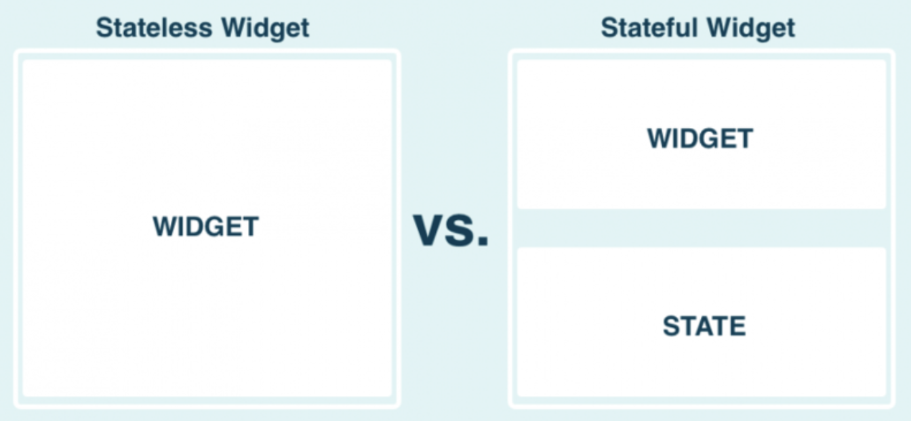
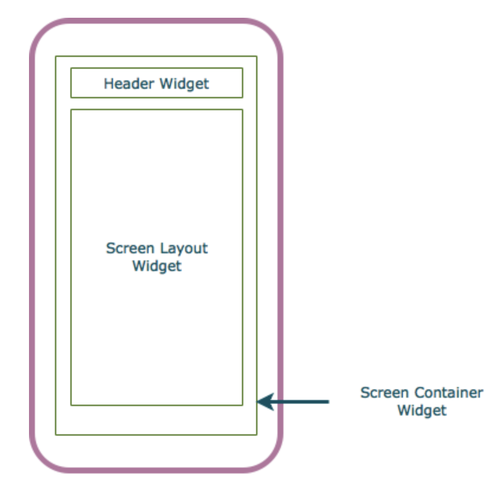
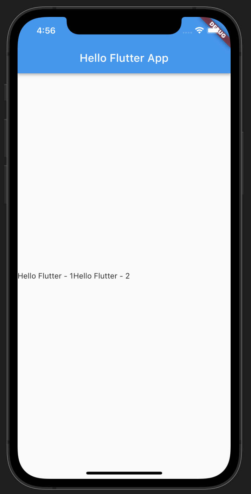
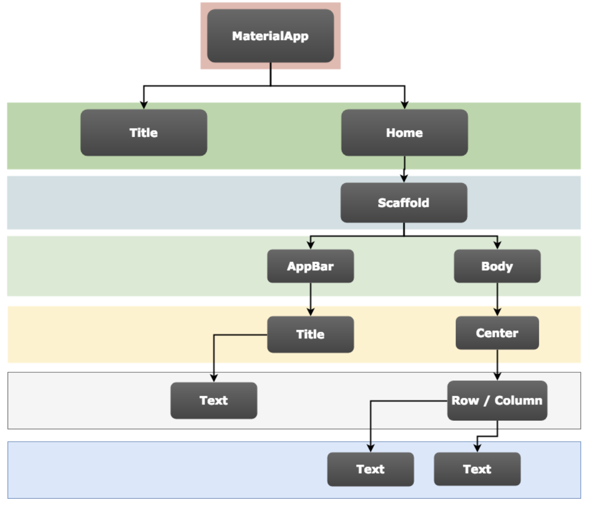

# #3 Flutter 기본 Stateless 화면 구성하기

## Flutter의 main.dart

Flutter project를 처음 생성하면, 다음과 같은 기본 구조를 갖는 main.dart 파일을 확인할 수 있다. 아래 코드를 이해하기 위해 몇 가지 개념을 공부해보자.

```dart
import 'package:flutter/material.dart';

void main() {
  runApp(const MyApp());
}

class MyApp extends StatelessWidget {
  // This widget is the root of your application.
  @override
  Widget build(BuildContext buildContext) {
    return MaterialApp(
      ...
    )
  }
}
```

## Stateless Widget

main 함수는 MyApp을 호출하며, MyApp은 앱이 시작되는 위젯이다. Flutter의 

MyApp class는 다음과 같이 정의된다. MyApp은 StatelessWidget 이라는 클래스를 상속 받는다. Stateless Widget은 무엇일까?

```dart
class MyApp extends StatelessWidget {
  ...
}
```

### Stateless Widget vs. Stateful Widget

Flutter에는 Stateful widget과 Stateless widget이 있다. Stateless 위젯은 위젯이 로드될 때 단 한 번만 화면에 그려진다. 즉, Stateless 위젯은 어떠한 이벤트나 사용자 액션이 발생하더라도 위젯이 다시 그려지지 않는 정적인 위젯이다. 반면, Stateful 위젯은 어떠한 이벤트나 사용자 액션이 발생하면, 그에 맞게 위젯이 다시 그려지는 동적인 위젯이다.



Stateful 위젯은 사용자의 편의 개선에 도움이 되고 다양한 기능을 구현하는 데 도움을 주지만, 시스템 상에는 많은 부담을 준다. 반면, Stateless 위젯은 로딩이 빠르고 시스템 비용이 적은 대신, 사용자와의 인터렉션이 어렵다. 따라서, Stateless 위젯과 Stateful 위젯을 적절히 사용하는 것이 중요하다.

본 페이지에서는 아주 간단한 기본 위젯을 구현할 예정이기 때문에, Stateless Widget을 사용하겠다.

## MaterialApp Class

이제 MyApp 내부를 보자. 모든 Custom 위젯은 Widget 객체를 리턴하는 build함수를 가지고 있다. 아래 코드에서 build 함수는 MaterialApp이라는 위젯을 리턴하고 있다. MaterialApp은 무엇일까?

```dart
class MyApp extends StatelessWidget {
  // This widget is the root of your application.
  @override
  Widget build(BuildContext buildContext) {
    return MaterialApp(
      ...
    )
  }
}
```

### Material Design

MaterialApp을 이해하기 위해서는 먼저 Material Design에 대해 알아야 한다.

실제 우리가 사용하는 앱을 생각해보자. 단순히 하나의 텍스트 위젯으로만 구성된 앱을 본 적이 있는가? 대부분 그렇지 않다. 앱은 어플리케이션 바, Body, 네비게이션 등의 기본 구성을 갖고 있으며, Body 은 다시 여러 위젯들로 구성된다. Material Design은 이러한 화면 구성 요소들을 쉽게 구현하기 위해 도와주는 디자인 시스템이다.



Material Design은 오픈소스 코드로, 개발자들이 가이드라인에 따라 쉽게 기본 화면 디자인을 할 수 있게 만들어 준다. Material Design 시스템을 활용하면 더 쉽고 빠르게 제품을 디자인하고 개발할 수 있으며, 구체적으로는 다음 기능을 제공한다.

- App structure and navigation
- Buttons
- Input and selections
- Dialogs, alerts, and panels
- Information displays
- Layout

### MaterialApp Class

Flutter는 개발자가 Material Design을 사용할 수 있게 지원하는데, Material Design 을 사용하기 위한 클래스가 MaterialApp 클래스다. 우리는 MaterialApp 위젯 하위에 여러 위젯을 추가함으로써 화면을 쉽게 구성할 수 있다.

MaterialApp은 기본 레이아웃을 쉽게 구성할 수 있는 Scaffold라는 위젯을 child로 가진다. 아래 코드처럼, Scaffold 위젯 내부에 AppBar와 Body를 추가하는 방식으로 원하는 디자인을 구현할 수 있다.

```dart
class MyApp extends StatelessWidget {
  // This widget is the root of your application.
  @override
  Widget build(BuildContext buildContext) {
    return MaterialApp(
      title: "Hello World",
      home: new Scaffold(
        appBar: new AppBar(
          title: new Text("Hello Flutter App"),
        ),
        body: new Center(
          child: new Text("Hello Flutter"),
        ),
      ),
    );
  }
}
```

### Material Design 확장하기

위 코드에서 body는 하나의 Text 위젯을 가졌다. 하지만 우리는 일반적으로 body에 더 많은 위젯을 포함하기를 원한다.

여러가지 위젯을 내부에 포함시키기 위해서는, body 내부에 위젯들의 배열을 가질 수 있는 타입의 위젯을 child로 설정하는 것이 필요하다. Flutter에는 '위젯의 배열'을 child로 가질 수 있는 여러가지 위젯들이 존재하며, 그 중 대표적인 것이 Row/Column 위젯이다. 위의 코드에 Row 위젯을 추가해 아래와 같은 계층 구조를 만들 수 있다.

```dart
class MyApp extends StatelessWidget {
  // This widget is the root of your application.
  @override
  Widget build(BuildContext buildContext) {
    return MaterialApp(
      title: "I am poor",
      home: new Scaffold(
        appBar: new AppBar(
          title: new Text("Hello Flutter App"),
        ),
        body: new Center(
          child: new Row(
            children: <Widget>[
              new Text("Hello Flutter - 1"),
              new Text("Hello Flutter - 2"),
            ]
          )
        ),
      ),
    );
  }
}
```

코드를 Build하면 다음과 같은 앱 화면을 얻을 수 있다. 아주 간단한 AppBar와 body 구현된 것을 확인할 수 있다.



위 코드를 구조화하면 다음과 같이 표현할 수 있다.



## Reference

- https://medium.com/@dan_kim/번역-flutter-위젯-사용해보기-1a22231d25c6
- https://ahang.tistory.com/6