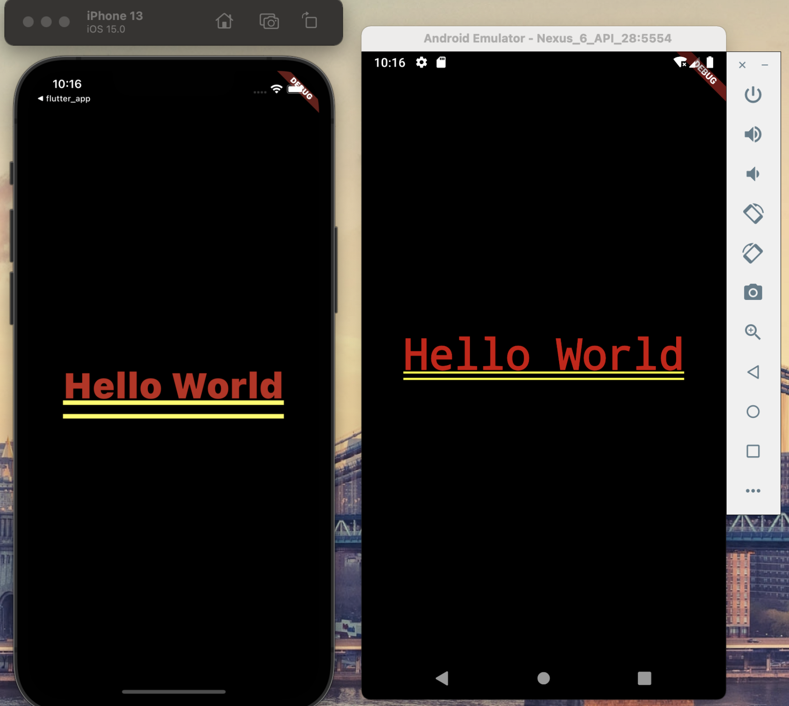
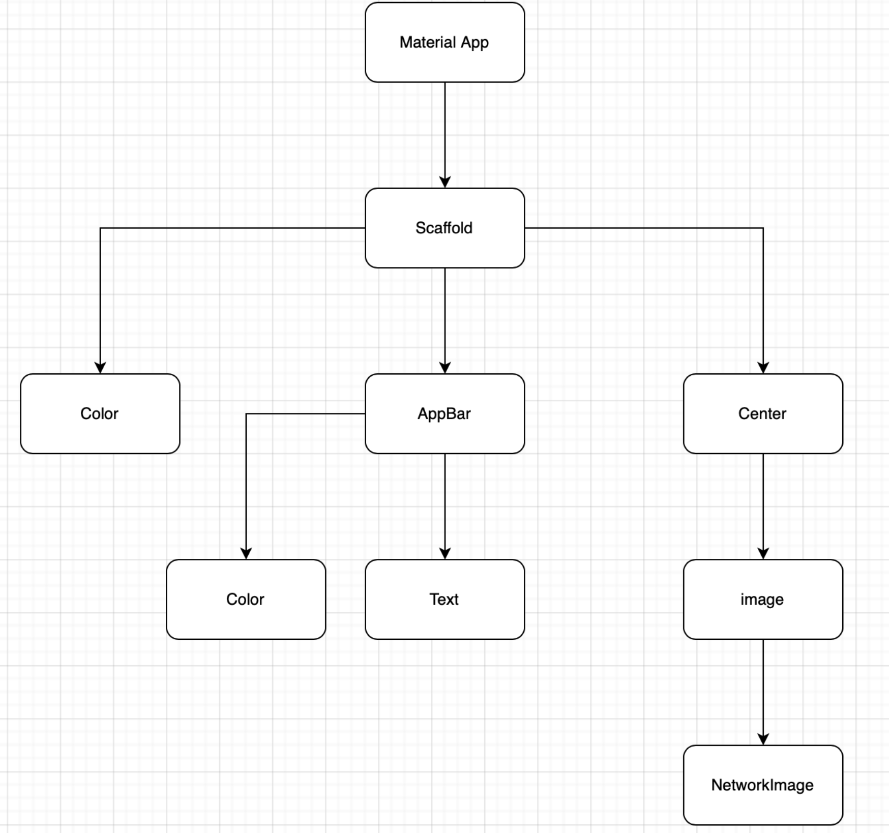
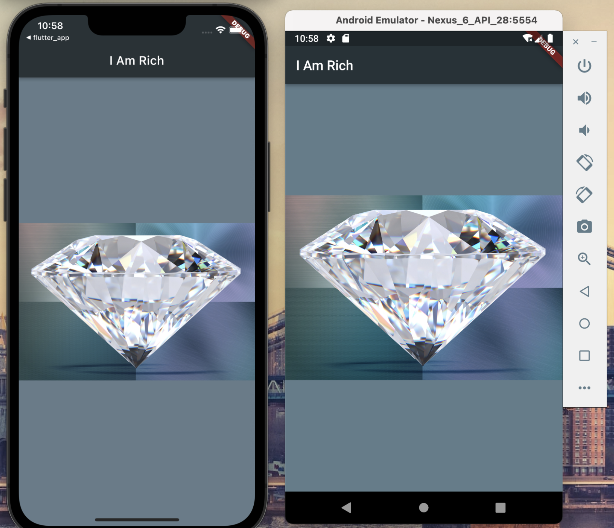

# #3 Flutter 간단한 화면 구성하기

## Useful Materials

- [Flutter API Docs](https://api.flutter.dev/index.html) 페이지에 클래스에 대한 설명이나 사용 방법이 잘 나와 있다.
- [Material Design](https://material.io/design)에서 다양한 디자인 속성들을 확인하고 사용할 수 있다. 
- [App Icon](https://appicon.co)에서 App Icon을 쉽게 만들 수 있다.

## Creating a New Flutter Project from Scratch

- Hello World를 출력해보자.

```dart
import 'package:flutter/material.dart';

// The main function is the starting point for all our Fluttter apps.
void main() {
  runApp(
    MaterialApp(
      home: Center(
        child: Text('Hello World'),
      ),
    ),
  );
}
```
- 결과
  

## Scaffolding a Flutter App

- [Scaffold](https://api.flutter.dev/flutter/material/Scaffold-class.html)는 flutter에서 기본 레이아웃을 구성할 수 있는 클래스다.
- Scaffold를 사용하여 이미지를 포함하는 페이지를 만들었다.

```dart
import 'package:flutter/material.dart';

// The main function is the starting point for all our Fluttter apps.
void main() {
  runApp(
    MaterialApp(
      home: Scaffold(
        backgroundColor: Colors.blueGrey,
        appBar: AppBar(
          title: Text('I Am Rich'),
          backgroundColor: Colors.blueGrey[900],
        ),
        body: Center(
            child: Image(
          image: AssetImage('images/diamond.jpg'),
        )),
      ),
    ),
  );
}
```

- 위 코드를 구조화하면 다음과 같다. Scaffold class를 사용하면 다음과 같이 레이아웃을 구조화할 수 있다.
  
  
  

- 결과
  
  