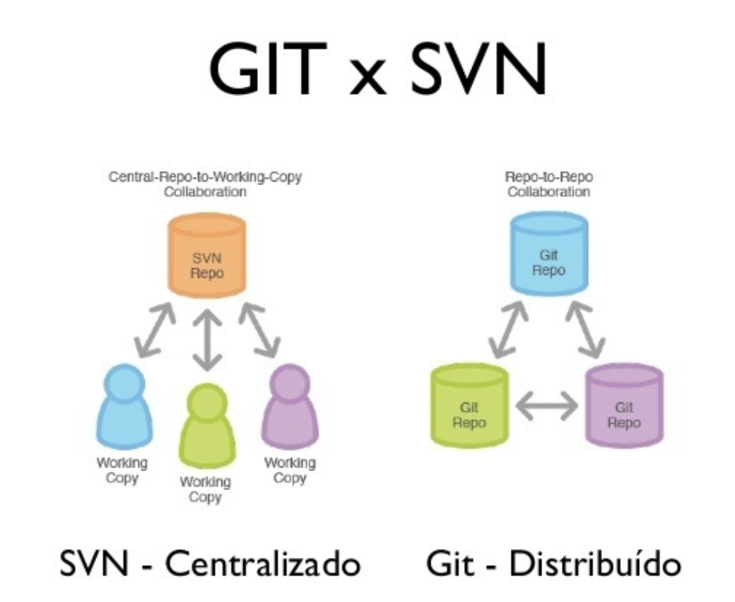

# [Git] Git 시작하기: 개념, 명령어

## Git이란?

Git이란 분산형 버전 관리 시스템(Version Control System) 의 한 종류다.

### 버전 관리 시스템이란?

버전 관리 시스템은 왜 필요할까? 파이썬 과제를 assignments.py 파일에 작성해서 저장을 했다고 생각해보자. 갑자기 새로운 아이디어가 떠올라서 assignments.py 파일을 다른 방식으로 구현하고 저장까지 완료했는데, 변경한 방식에서 예상치 못한 에러가 발생했다면 어떻게 될까? 이미 기존 코드를 덮어서 수정했기 때문에 이전 버전으로 돌아갈 수 없을 것이고, 결국 코드를 새로 작성해야하는 일이 벌어질 것이다. 이런 경우에, assignment.py 파일의 모든 수정 과정을 특정한 버전으로 저장하고 관리한다면, 수정된 내용을 한 눈에 파악할 수 있을 것이다. 또 원한다면 이전 버전으로 쉽게 되돌릴 수도 있을 것이다. 프로그램의 규모가 커지고 요구사항이 많아질수록 버전 관리의 중요성은 높아진다.

특히 개발 프로젝트를 진행하면 여러 사람이 함께 개발을 하는 경우가 많은데, 누가 어떤 부분을 변경했는지 관리하는 데도 용이하다. 각자 개발한 코드 혹은 문서들을 하나의 관리 도구에서 통합적으로 그리고 버전별로 관리하게 되는 것을 형상관리(Configuration Management) 혹은 버전관리(Version Management)라고 부른다.

### 버전 관리 모델

버전 관리에는 크게 두 가지 모델이 있는데, 중앙 집중형 모델과 분산 관리형 모델이 있다.

1. 중앙 집중형 모델 (CVCS; Central Version Control System)

   - 하나의 중앙 서버가 존재하며, 여러 클라이언트들은 중앙 서버에서 원하는 부분을 가져와서 작업하고 다시 중앙으로 통합하는 모델
   - 대표적 시스템으로 SVN(Subversion)이 있다.

2. 분산 관리형 모델 (DVCS; Distributed Version Control System)

   - 하나의 중앙 서버가 존재하며, 여러 클라이언트들은 중앙 서버의 전체 사본을 각자에 컴퓨터로 가져와서 작업하고 변경된 부분을 통합하는 모델
   - 대표적으로 git이 있다.

### SVN vs. Git

1. SVN

   - 중앙 저장소에 모든 소스 코드와 히스토리를 저장하며, 로컬 PC에서 commit을 하면 중앙 서버에 바로 저장된다.
   - commit을 하면 해당 소스를 사용하는 모든 개발자에게 영향을 준다.
   - 여러 사람이 동시에 작업할 경우 충돌이 발생할 수 있다.
   - 개발자는 개인적인 version history를 저장할 수 없다.

2. git

    - 소스 코드를 여러 개발 PC와 저장소에 분산해서 저장한다. 로컬 PC에서 commit하면 로컬 저장소에 반영되고, 로컬 저장소에서 push를 하면 원격 저장소에 반영된다.
    - 개발자는 자신만의 commit history를 가질 수 있고, 개발자와 서버의 저장소를 독립적으로 관리할 수 있다.
    - 중앙 서버에 장애가 발생해도 로컬 저장소에 commit을 할 수 있으며, 로컬 저장소들을 이용하여 중앙 저장소를 복원할 수 있다.
    - 사본을 로컬에서 관리하기 때문에 git이 SVN에 비해 훨씬 빠르다.
    - 같은 파일을 여러 명이 동시에 작업하는 병렬 개발이 가능하다.

## Git vs. GitHub vs. GitLab

Git 방식을 사용한다면, 코드를 저장하고 관리할 서버가 필요하다.

GitHub는 버전 관리 시스템을 지원하는 웹 호스팅 서비스이다. GitHub를 사용하면 push, pull, request와 같은 이벤트를 쉽게 사용할 수 있고, 웹페이지를 통해 각 기능과 결과에 접근할 수 있다. 하지만, 무료 계정으로 GitHub를 사용할 경우 코드를 공개해야 한다는 특징이 있다.

GitLab은 설치형 버전 관리 시스템이다. GitLab을 사용할 경우 무료로, 코드를 공개하지 않고 버전 관리 서비스를 이용할 수 있다. 다만, GitLab을 설치할 서버가 한 대 필요하며, GitHub보다는 다른 버전 관리 시스템과의 호환성이 좋지 않다는 단점이 있다.

## Git 기본 용어

### Repository

Repository는 파일이나 디렉토리를 저장하는 저장소를 의미한다. 저장소를 통해 작업자가 변경한 모든 히스토리를 확인 할 수 있다.

- local repository: 개인 PC에 존재하는 저장소로, 다음 3가지로 이루어져 있다.
  + Working directory: 실제 소스코드 위치
  + Index: stage 역할 (working directory에서 commit하기 전에 commit을 준비하는 위치)
  + head: 최근에 commit한 소스코드

- remote repository: 원격 저장소로, 원격 저장소 전용 서버에서 파일을 관리하고 공유할 수 있다.

### Commit

commit을 한다는 것은 현재 프로젝트의 상태를 스냅샷으로 저장하는 것을 의미한다. commit을 하면 현재 branch의 상태를 나타내는 스냅샷을 생성하고, 헤드(head)에 그 새로운 commit을 저장한다.

### HEAD

현재 branch를 말한다. 

### head

branch의 제일 앞에 있는 commit을 가르키는 레퍼런스를 부르는 이름이다. 헤드는 각 repository의 .git/refs/heads/ 폴더에 저장되어 있다.

### Branch

가지 또는 분기점을 의미한다. 기본적으로 git repository를 생성하면 main이라는 branch가 생성된다. 만약 main branch는 그대로 둔 상태에서 main 코드에 새로운 기능을 추가하고자 한다면, 새로운 branch를 하나 만들어 main에 영향을 주지 않으면서 작업할 수 있다. 작업을 완료한 후에는 merge를 하여 main branch에 변경 사항을 병합할 수도 있다.

### Merge

다른 branch의 내용을 현재 branch로 가져와 합치는 작업

### Pull Request

branch에서 완료된 작업을 프로젝트를 같이하는 사람들끼리 리뷰하고 main으로 합치도록 요청하기 위해 사용된다.

## Git command

### `git init`

git 저장소를 초기화한다. 일반 폴더 안에서 init 명령어를 입력해야 추가적인 git 명령어들을 입력할 수 있다.

### `git help`

help 명령어 입력 시 21개의 가장 많이 사용하는 git 명령어들이 나타난다. 특정 명령어에 대해 자세하게 알고 싶다면, `git help init` 와 같이 특정 git 명령어를 붙여 알아볼 수 있다.

### `git status`

저장소 상태를 체크한다. 어떤 파일이 저장소 안에 있는지, commit이 필요한 변경사항이 있는지, 현재 저장소의 어떤 branch에서 작업하고 있는지 등을 볼 수 있다.

### `git clone`

원격 저장소의 저장소를 내 로컬로 그대로 복사해 가져온다.

### `git add`

git이 특정 파일을 지켜보게 만든다. 파일을 add 하면, git의 저장소 스냅샷에 포함된다. 이 명령이 저장소에 새 파일들을 추가하는 역할을 하지는 않는다.

### `git commit`

git의 의미있는 수정 작업이 끝났을 때 마침을 알리는 작업이다. 보통 `git commit -m “Message”` 형식으로 사용한다. `-m` 은 명령어의 다음 부분을 메세지로 남긴다는 뜻이다.

### `git push`

로컬 PC에서 작업하고 push 명령어를 입력하면, commit한 내용들이 gitHub 웹페이지에도 반영된다.

### `git pull`

로컬 PC에서 작업할 때, 저장소의 변경된 내용을 로컬 저장소에 적용하는 작업이다.

### `git log`

commit 내역을 확인해보고 싶을 때 사용하는 명령어이다.

### `git branch`

여러 협업자와 작업하고 자신만의 변경을 원한다면 이 명령어로 새로운 branch를 만들고, 독립적인 공간을 만든다. 새 branch를 만들고 싶다면, `git branch new_branch`를 입력하면 된다.

### `git checkout`

checkout 명령어로 branch를 이동할 수 있다. `git checkout main`을 입력하면 main branch로 이동하여 내용을 확인하고 작업할 수 있다.

### `git merge`

branch에서 작업을 끝내고, 모든 협업자가 볼 수 있는 master branch로 병합할 수 있다. `git merge new_branch`라고 입력한다면 new_branch branch에서 만든 모든 변경사항을 master에 추가한다.

### `git rebase`

두 branch를 합칠 때 사용하지만, merge와 차이가 있다. rebase는 branch의 변경사항을 commit 순서대로 다른 branch에 적용하면서 병합하고, merge는 두 branch의 최종결과만 병합한다. rebase가 merge보다 깨끗한 히스토리를 만든다.

### `git fetch`

원격 repository의 최신 이력을 확인 및 업데이트 할 수 있다. 원격 repository의 내용만 확인하고 local으로 병합하고 싶지 않은 경우에 사용한다.

### `git reset`

이전 버전 또는 특정 commit 버전으로 돌아갈 때 사용한다. `git reset <option> <돌아가고싶은 commit>` 형태로 사용한다.

