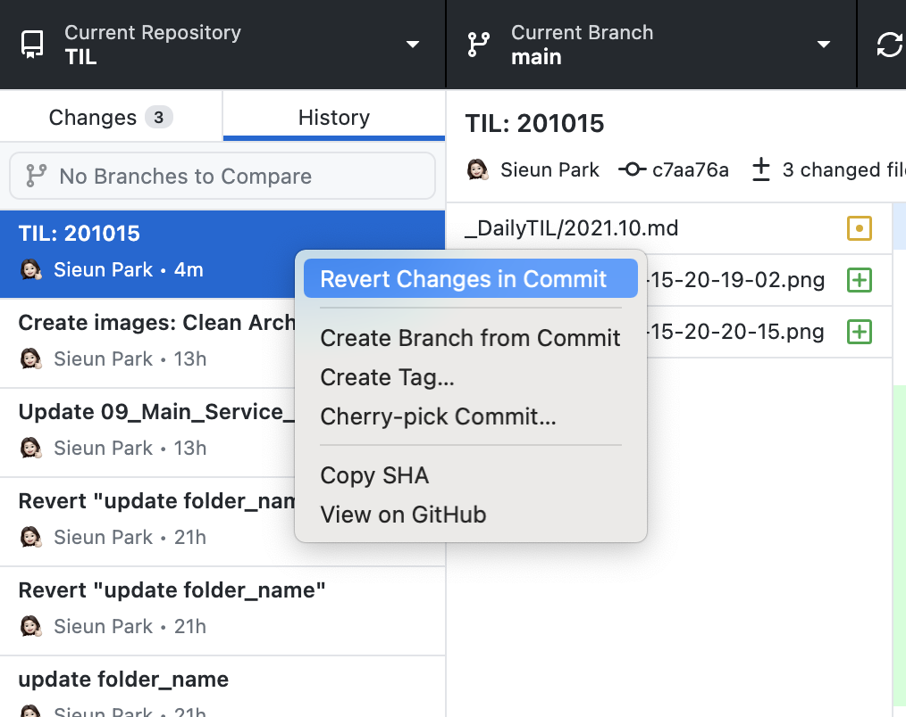

# [Git] git add 취소, git commit 취소, git push 취소

## git add 취소하기

- 특정 파일만 add 취소

  + `git reset HEAD [file]`

- 전체 add 내용 취소

  + `git reset HEAD`

## git commit 취소하기

### commit 목록 확인

- commit했던 목록 확인
  + `git log`

### commit 취소

- commit을 취소하고 해당 파일은 unstaged 상태로 working directory에 보존
  + `git reset HEAD^`
  + `git reset --mixed HEAD^`
  + `git reset HEAD~2` : 마지막 2개의 commit 취소

- commit을 취소하고 해당 파일은 staged 상태로 working directory에 보존
  + `git reset --soft HEAD^`

- commit을 취소하고 해당 파일은 unstaged 상태로 working directory에서 삭제
  + `git reset --hard HEAD^`

- ommit을 취소하고 working directory는 원격 저장소의 마지막 commit 상태로 복구
  + `git reset --hard HEAD`

- reset options
  + `--soft`: index 보존(add 상태), working directory 파일 보존
  + `--mixed` or no option: index 취소(add 전 상태), working directory 파일 보존
  + `--hard`: index 취소(add 전 상태), working directory 파일 삭제

### commit 수정

- commit message 수정

  + `git commit --amend` 입력 후 편집기에서 message 수정

## git push 취소하기

git push 취소는 로컬 저장소의 상태를 원격 저장소에 강제로 덮어쓰기하는 것이므로 매우 주의해야 한다. 되돌아간 commit 이후의 모든 commit 정보는 사라진다.

### STEP 1. commit 취소

- 로컬에서 가장 최근의 commit을 취소
  + `git reset HEAD^`
- 특정 시점의 commit 단계로 이동
  + `git log` 를 통해 원하는 commit_id 확인
  + `git reset [commit_id]`

### STEP 2. 변경된 상태를 다시 commit

원하는 상태로 돌아간 후에 현재의 로컬 저장소 상태롤 원격 저장소에 commit한다.

`git commit -m "Revert commit"`

### STEP 3. 원격 저장소에 강제로 push

`-f` 또는 `+` option은 로컬 저장소의 상태를 원격 저장소로 강제로 push 하는 옵션이다. 

`git push origin branch_name -f`

`git push origin +branch_name`

## 가장 쉬운 방법 (GitHub Desktop)

GitHub Desktop 애플리케이션을 사용하면 아주 쉽게 git을 다룰 수 있는데, commit, push를 취소해야할 때 특히 유용하다.

### GitHub Desktop에서 commit 취소하기

History 탭에서 commit 기록을 볼 수 있다. commit만 하고 아직 push하지 않은 경우 오른쪽에 화살표 모양이 보일 것이다.

원하는 commit을 선택하고 마우스 우클릭을 해보자.

Ammend Commit을 클릭하면 commit 내용을 수정할 수 있고, Undo Commit을 클릭하면 commit을 취소할 수 있다.

### GitHub Desktop에서 push 취소하기

command로 입력하는 것과 마찬가지로, 원하는 commit 이전으로 로컬 저장소 상태롤 되돌린 후에 push하는 방식이다.

push한 commit 중 원하는 것을 클릭하고 마우스 우클릭을 해보자.

Revert Changes in Commit을 클릭하면 commit 이전 상태로 로컬 저장소가 변경된다. 그 상태에서 다시 commit을 생성하고 push를 해주면 로컬 저장소의 상태가 원격 저장소에 반영된다.