# [OS] CPA310 Lec 2. Operating System Overview

> [운영체제 강의(김덕수 교수) - Lec 2.](https://youtu.be/nxl_cUd55Ag)를 보고 정리한 자료입니다.

<!--2021.10.18-20-->

## 운영체제의 역할

운영체제의 역할은 크게 네 가지로 구분할 수 있고, 각각은 다음과 같다.

- User Interface (편리성 증가)
  + CUI(Character UI): 운영체제가 실행 결과를 문자로 보여주는 것
  + GUI(Graphical UI): 운영체제가 실행 결과를 그래픽으로 보여주는 것. 현재 사용하는 방식
  + EUCI(End-User Comfortable Interface): 특별한 목적만을 위해 사용하는 것. 예를 들어 mp3라면 mp3을 위한 UI

- Resource management (효율성 증가)
  + HW resource: 프로세서, 메모리, 입출력 장치 등의 자원 관리
  + SW resource: 파일, 애플리케이션, 메시지, 신호 등의 자원 관리

- Process and Thread management (프로세스 및 스레드 관리)

- System management (시스템 보호)

## 컴퓨터 시스템의 구성

다음 그림은 다중 계층 컴퓨터 시스템의 아키텍처를 표현한 그림이다. 이 구조에서 하드웨어 위에 존재하는 커널과 시스템 콜 인터페이스를 합친 영역을 운영체제라고 한다.

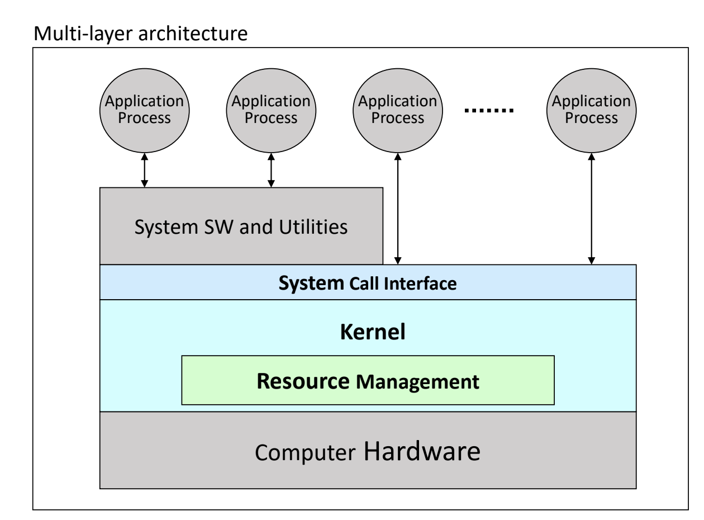

커널은 운영체제 중에서도 핵심적인 기능을 하는 부분을 모아놓은 부분으로, 일반적으로 프로세스는 커널에 바로 접근할 수 없다. 프로세스가 커널의 기능을 사용하기 위해서는 반드시 시스템 콜을 호출해야만 한다. 다시 말해, 커널이 제공하는 기능 중에서 사용자가 사용할 수 있는 기능을 모아놓은 것을 시스템 콜이라고 부른다.

다음 그림과 같이 입출력 시스템, 파일 시스템, 프로세서 스케줄링 등의 커널 기능을 사용하기 위해서는 시스템 콜 인터페이스에 접근해야만 한다.

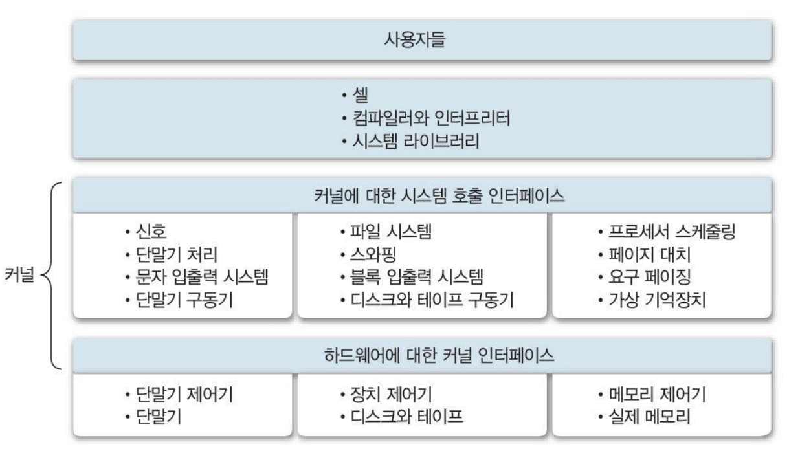

## 운영체제의 구분

우리는 크게 동시 사용자 수, 동시 프로세스 수, 작업 수행 방식이라는 세 가지 기준으로 운영체제를 구분할 수 있다.

- '동시 사용자 수'에 따른 구분
  + Single-user system
  + Multi-user system

- '동시 실행 프로세스 수'에 따른 구분
  + single-tasking system
  + multi-tasking system

- '작업 수행 방식'에 따른 구분
  + batch processing system
  + time-sharing system
  + distributed processing system
  + real-time system

### 동시 사용자 수

운영체제를 혼자서만 사용하는지, 여러 명이서 동시에 사용하는지에 따라 단일 사용자 시스템과 다중 사용자 시스템으로 구분할 수 있다.

#### 단일 사용자 시스템(Single-user system)

단일 사용자 시스템은 한 명의 사용자만 사용하는 운영체제 시스템을 말한다. 한 명의 사용자는 모든 시스템의 자원을 독점하며, 이 경우 자원 관리나 시스템 보호 방식이 간단하다. 일반적으로 Windows 10, android 등의 운영체제를 사용하는 개인용 PC, 모바일 환경이 단일 사용자 시스템에 해당된다.

#### 다중 사용자 시스템(Multi-user system)

다중 사용자 시스템은 여러 사용자들이 동시에 사용할 수 있는 운영체제 시스템이다. 여러 사람이 사용하기 때문에 파일 등 각종 시스템 자원에 대한 소유 권한 관리가 필요하며, 멀티태스킹이 기본적으로 가능해야 한다. 단일 사용자 시스템 대비 운영체제의 기능과 구조가 복잡하다.

다중 사용자 시스템은 주로 Unix, Linux 운영체제에 해당되며, 서버나 클러스터 장비 등에 사용된다.

### 동시 실행 프로세스 수

운영체제에서 동시에 실행할 수 있는 프로세스의 수에 따라 단일 작업 시스템과 다중 작업 시스템으로 구분할 수 있다.

#### 단일 작업 시스템(Single-tasking system)

단일 작업 시스템에서는 한 번에 한 가지 작업(프로세스)만을 실행할 수 있다. 다른 프로그램을 실행하기 위해서는 기존 프로그램의 실행이 끝날 때까지 대기해야 한다. 단일 작업 시스템은 운영체제의 구조가 간단하다는 특징이 있으며, MS-DOS 등이 해당된다.

#### 다중 작업 시스템(Multi-tasking system)

다중 작업 시스템은 멀티태스킹 시스템이라고 부르며, 동시에 여러 개의 프로세스를 수행할 수 있는 시스템이다. 운영체제의 기능과 구조가 복잡하며, Unix, Linux, Windows 등 대부분의 운영체제가 멀티태스킹 기능을 지원한다.

### 작업 수행 방식

운영체제는 작업 수행 방식에 따라 일괄처리 시스템, 시분할 시스템, 분산 처리 시스템, 실시간 처리 시스템 등으로 나뉠 수 있는데, 이를 이해하기 위해서는 컴퓨터 시스템에 대한 역사적으로 접근해 보는 것이 도움이 된다.

#### 1. 순차처리 시스템 (No OS ~ 1940s)

컴퓨터가 처음으로 등장했을 때는 운영체제라는 개념이 존재하지 않았다. 그 시절에는 사용자가 직접 기계어를 사용하여 프로그램을 작성했다. 프로세서에 명령어를 저장하는 것, 계산 대상, 결과를 저장할 위치와 방법, 입출력 방법 등 컴퓨터가 수행하는 모든 작업을 프로그램에 직접 포함시켰다.

이 당시에는 프로그램 실행이 순차적으로 처리되었다. 프로그램을 실행할 수 있는 컴퓨터가 충분하지 않았기 때문에, 사용자는 차례를 기다렸다가 순서대로 본인의 천공 카드를 넣고 작업을 실행하는 순차 처리 방식이 사용되었다.

순차 처리 시스템은 작업의 종류가 달라질 경우 장비를 새로 설정해야 한다는 문제가 있었다. 이해를 돕기 위해 예를 들면, (이 시기에는 다양한 프로그래밍 언어가 없었지만) 같은 컴퓨터 장비를 사용하는 한 사람은 python으로 코드를 작성하고 또 다른 사람은 java로 코드를 작성한다면, 이 장비는 프로그램을 실행시키는 사용자와 사용 언어에 따라 매번 장비 환경 설정을 바꿔야만 하는 것이다.

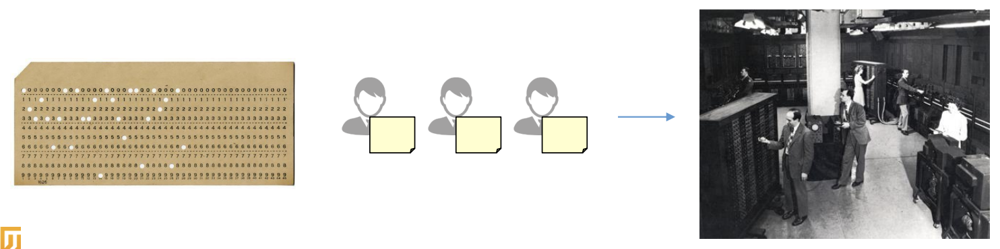

#### 2. 일괄처리 시스템 (Batch systems) (1950s ~ 1960s)

순차처리 시스템의 단점을 보완하기 위해, 동일한 종류의 시스템을 모았다가 중앙에서 한 번에 처리하는 일괄처리 시스템이 등장했다. 일괄 처리 시스템에서는 사용자의 요청 작업을 바로 처리하지 않고, 일정 시간 모아 두었다가 비슷한 작업끼리 묶어 일괄적으로 처리했다. 일괄 처리 시스템을 사용함으로써 작업 종류 변경에 따른 준비 시간을 줄일 수 있었다.

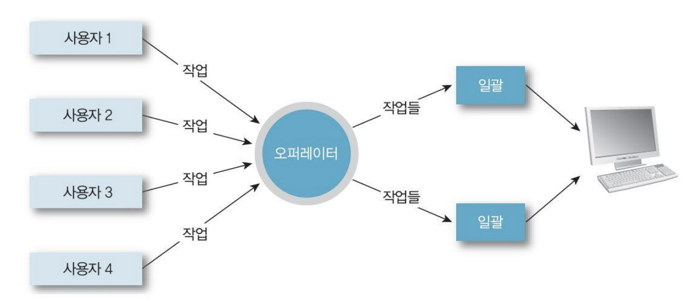

일괄 처리 시스템은 컴퓨터 시스템의 동작 효율을 높이기 위한 방식이라는 점에서 시스템 지향적(system-oriented)이다. 많은 사용자가 시스템 자원을 공유할 수 있고, 같은 작업을 한 번에 처리함으로써 시스템의 처리 효율(throughput)을 향상시킬 수 있었다. 하지만, 같은 유형의 작업들이 모이기를 기다리는 시간이 소요되어 사용자 입장에서는 생산성이 저하되었고, 작업 제출에서 결과 출력까지의 응답 시간이 길다는 단점이 있다. (약 6시간 소요되었다고 한다.)

#### 3. 시분할 시스템 (Time Sharing systems) (1960s~1970s)

사용자의 대기 시간을 줄이기 위한 방법으로 등장한 것은 시분할 시스템이다. 시분할 시스템은 CPU 사용 시간을 분할하여 여러 프로그램에게 배정하는 방식으로 동작한다. 시분할 방식을 사용함으로써 컴퓨터는 여러 작업을 동시에 처리할 수 있게 되었고, 사용자들은 더 이상 오래 대기하지 않아도 되었다.

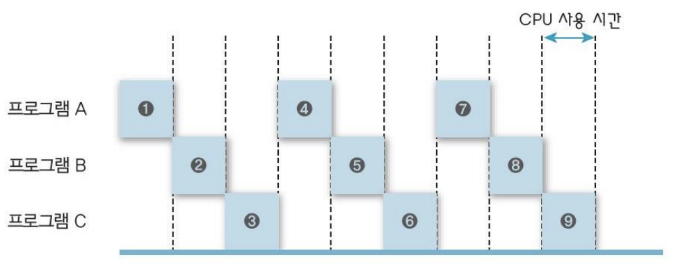

시분할 시스템은 여러 사용자가 동시에 자원을 사용하기 때문에, 그에 따라 운영체제는 파일 시스템 및 가상 메모리를 관리하는 역할을 수행하기 시작했다. 시분할 시스템은 사용자 지향적(user-oriented)이며, 대화형(interactice) 시스템으로 각 사용자들은 CRT Terminal 등의 단말기를 통해 시스템에 접속했다.

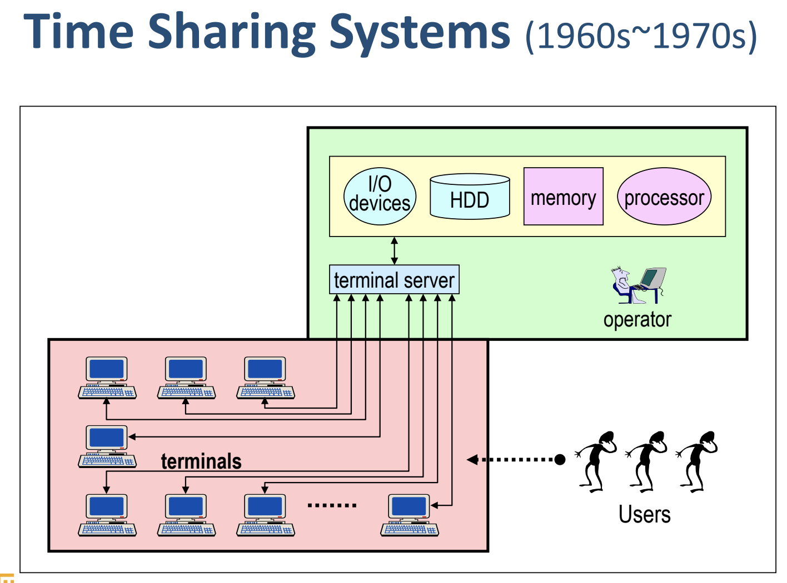

시분할 시스템에서 프로그램의 응답 시간은 약 5분 정도로 크게 단축되었다. 또한 프로세서의 유휴 시간이 감소하며 생산성이 향상되었다. 하지만, 여러 사용자들이 하나의 시스템에 접속함에 따라 통신 비용이 증가했고, 보안 문제가 발생했다. 여러 사람들이 사용하니 시스템에 부하가 증가하여 사용자 관점에서 체감 성능이 저하되는 문제도 있었다.

#### 4. 개인 컴퓨터 (Personal Computing)

하드웨어의 가격이 떨어지면서 사람들은 더 이상 하나의 컴퓨터를 공유하지 않고, 각자 사용할 수 있는 개인 컴퓨터를 갖기 시작했다. 개인 컴퓨터에서는 개인이 시스템을 독점했기 때문에, 자원 활용률은 중요한 고려 대상이 아니었다. 개인 컴퓨터에서 CPU 등의 자원을 최대한 효율적으로 사용하려고 애쓰는 사람은 많지 않을 것이다. 운영체제는 상대적으로 단순해졌고, 대신 사용자 편의를 위한 기능들을 지원하기 시작했다.

#### 5. 병렬처리 시스템 (Parallel Processing system)

병렬처리 시스템이란, 단일 시스템 내에서 둘 이상의 프로세서를 사용하는 시스템을 말한다. 즉, 한 대의 컴퓨터에 여러 개의 CPU를 장착함으로써 동시에 둘 이상의 프로세스를 실행하도록 지원하는 시스템이다. 여러 개의 프로세서들은 메모리, 주변 장치 등의 하드웨어 자원을 공유하며, 이러한 자원들은 동일한 장치 내에서 강하게 결합(tightly-coupled)된다.

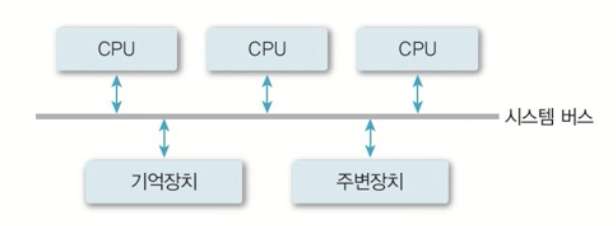

여러 개의 프로세서를 사용할 경우 시스템의 성능이 향상되고, 하나의 프로세서가 고장 나도 전체 시스템은 정상적으로 동작하기 때문에 신뢰성이 향상되는 효과가 있다. 다만, 여러 개의 프로세서 사이의 관계와 역할을 관리할 필요가 생겼다.

병렬처리 시스템은 자원을 무한정으로 확장하기는 어렵다는 한계가 있다. 하나의 컴퓨터에 CPU를 100개를 꽂을 수는 없기 때문이다.

#### 6. 분산처리 시스템 (Distributed Processing Systems)

분산처리 시스템은 네트워크를 기반으로 여러 대의 컴퓨터를 붙여서 만든 병렬처리 시스템이다. 이 자원들은 네트워크 통신 하에서 약하게 결합(loosely-coupled)된다.

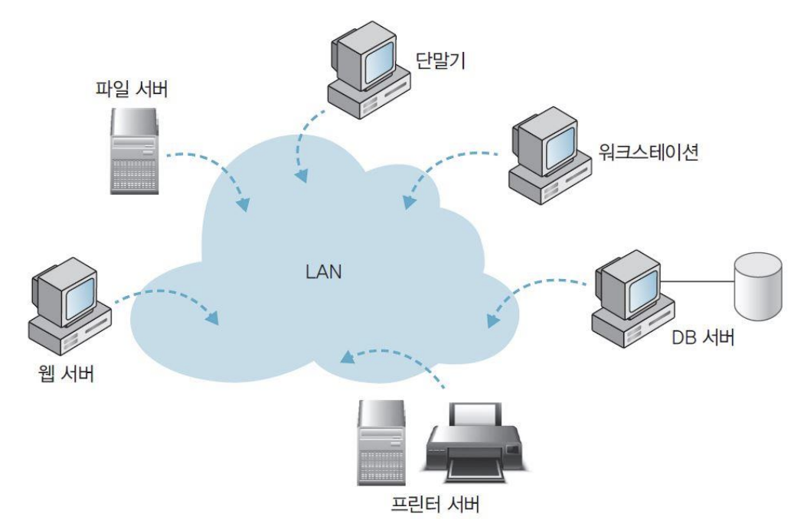

앞서 본 병렬처리 시스템의 확장성 한계는 분산처리 시스템에서 문제가 되지 않는다. 분산처리 시스템에서 각 자원은 물리적으로 분산되어 있으며, 통신망을 통해 상호 연결되어 클러스터 시스템을 구성한다. 사용자는 분산 운영 시스템을 하나의 자원처럼 사용할 수 있다. 분산 환경에서는 자원을 공유함으로써 높은 성능을 구현할 수 있고, 높은 신뢰성과 높은 확장성을 기대할 수 있다. 다만, 클러스터 시스템은 구축과 관리가 어렵다는 단점이 있다.

#### 7. 실시간 시스템 (Real-time systems)

실시간 시스템은 작업 처리에 제한 시간(deadline)을 갖는 시스템이다. 실시간 시스템에서는 제한 시간 내에 서비스를 제공하는 것이 자원을 효율적으로 활용하는 것보다 중요하다.

실시간 시스템에서 다루는 작업에는 경성 실시간 작업(hard real-time task)과 연성 실시간 작업(soft real-time)이 있다. 경성 실시간 작업은 시간 제약을 지키지 못했을 때 시스템에 치명적인 영향을 주는 작업을 말한다. 예를 들어, 발전소 제어, 무기 제어 등의 작업이 경성 실시간 작업에 해당된다. 반면, 연성 시스템 작업은 작업 처리에 제한 시간을 요구하지만, 그것을 지키지 못한다고 해서 치명적인 문제가 발생하지는 않는 작업이다. 예를 들어, 동영상 재생은 1초 동안 특정 이미지 장수를 인식해야 하는 실시간 작업이나, 그것을 인식하지 못한다고 해서 시스템에 장애가 발생한다고 보기는 어렵다.

## 운영체제의 구조

운영체제는 크게 커널과 유틸리티로 구분할 수 있다.

커널(kernel)은 운영체제의 핵심 부분으로, 항상 메모리에 상주하는 영역이다. 프로세서 관리, 메모리 관리, 입출력장치 관리 등 애플리케이션에서 빈번하게 사용되는 기능을 담당한다. 커널은 매우 중요한 작업들을 담당하므로, 운영체제는 애플리케이션이 커널에 직접 접근하는 것을 허용하지 않는다. 따라서, 애플리케이션이 커널에 접근하기 위한 별도의 인터페이스가 필요한데, 그것을 시스템 콜이라고 부른다.

유틸리티는 운영체제에서 커널을 제외한 나머지 부분으로, 메모리에 항상 상주하지 않는다. UI 등의 서비스 프로그램, 자주 사용하지 않는 기능들을 포함한다.

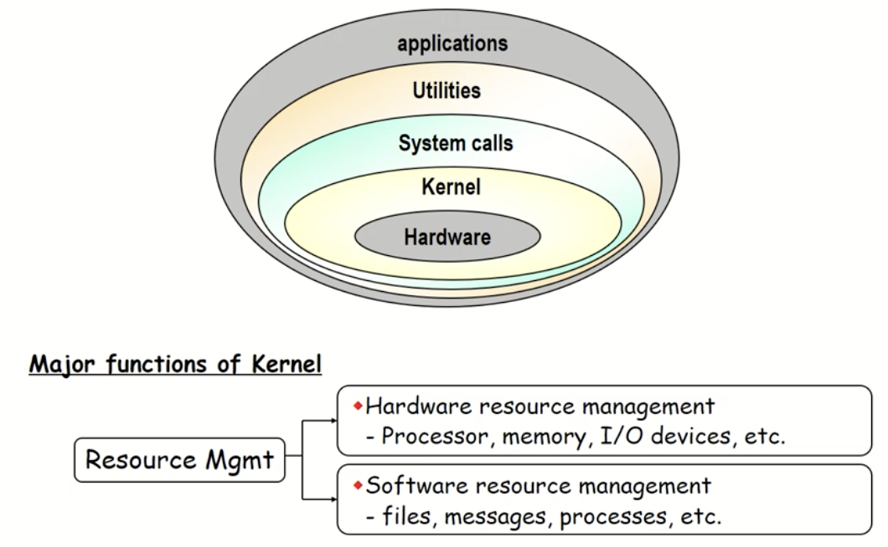

운영체제가 가질 수 있는 여러 구조에 대해 알아보자.

### 단일 구조

운영체제의 모든 기능을 하나의 거대한 커널로 모아 구현한 것을 단일 구조라고 한다.

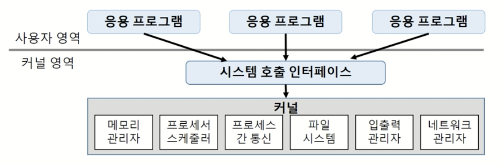

단일 구조는 커널 내의 모든 모듈이 직접 통신하기 때문에, 자원을 효율적으로 관리하고 사용할 수 있다는 장점을 갖는다. 하지만, 커널이 거대화되면서 오류 및 버그 수정, 추가 기능 구현 등의 유지 보수가 어렵다는 단점이 있다. 또한, 같은 메모리 위에 모든 기능이 있기 때문에, 커널 내 한 모듈의 문제가 전체 시스템에 영향을 줄 가능성이 있다.

### 계층 구조

운영체제 내에서 기능별로 계층을 구분한 것이 운영체제의 계층 구조다.

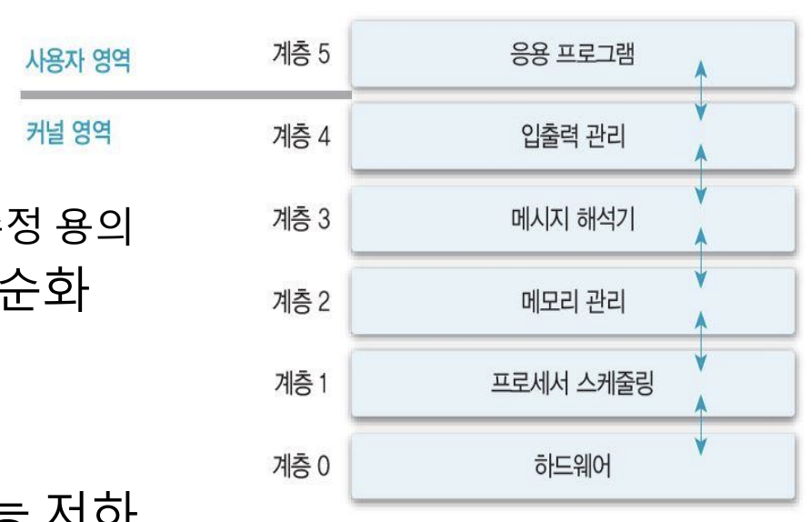

계층 구조는 기능의 모듈화를 통해 계층 간 검증 및 수정이 용이하고, 설계와 구현이 단순하다는 장점이 있다. 하지만, 원하는 기능을 수행하기 위해 여러 단계를 거쳐야 하기 때문에, 단일 구조 대비 성능은 떨어진다.

### 마이크로 커널 구조

커널에는 핵심적인 필수 기능만 수행하고, 나머지는 사용자 영역에서 수행하는 것을 마이크로 커널 구조라고 한다. 말 그대로 '마이크로'한 커널을 갖는 것이다.

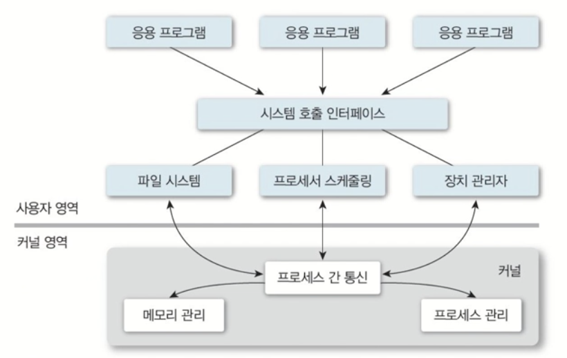

## 운영체제의 기능

운영체제의 기능을 한 마디로 표현하면 하드웨어 관리라고 이야기할 수 있다. 운영체제는 프로세스 관리, 프로세서 관리, 메모리 관리, 파일 관리, 입출력 관리, 보조 기억 장치 및 기타 주변장치 관리 등의 기능을 수행한다. 각 기능에 대해 알아보자.

### 프로세스 관리

프로세스란 커널에 등록되어 실행 단위로, 쉽게 말하면 실행 중인 프로그램을 말한다. 프로세스는 사용자의 요청을 처리하고 기능을 수행하는 수행 주체가 된다.

프로세스는 운영체제가 관리하는 대표적인 자원이다. 운영체제는 프로세스의 상태를 관리하고, 프로세스에 자원을 할당하며, 프로세스 간 통신 및 동기화 지원 등의 기능을 지원한다.

운영체제는 프로세스 제어 블록(PCB, Process Control Block)이라는 데이터 구조를 사용하여 프로세스 상태를 커널에 저장한다.

### 프로세서 관리

프로세서는 CPU라고 생각하면 된다. 운영체제는 시스템 내의 프로세스 처리 순서를 결정하고, 각 프로세스에 대한 프로세서를 할당하는 역할을 한다. 이때, 프로세서는 한 번에 하나의 프로세스만 사용할 수 있다.

### 메모리 관리

메인 메모리(주 기억장치)는 작업을 수행하기 위해 프로그램 및 데이터를 올려놓는 저장 공간이다.

운영체제는 프로세스에 메모리를 할당하고 회수하는 기능을 담당한다. 또한, 메모리의 여유 공간을 관리하고, 각 프로세스에 할당된 메모리 영역을 보호하는 역할을 수행한다.

운영체제가 메모리를 할당하는 방법에는 크게 두 가지가 있다. 먼저, 프로그램 전체를 메모리에 적재하는 방법이다. 전체 적재 방식은 구현이 간단하지만, 공간의 제한이 있다는 한계가 있다.

공간 제한을 극복하기 위해 고안된 방법이 가상 메모리 개념을 사용한 일부 적재 방법이다. 일부 적재는 프로그램과 데이터의 일부만 메인 메모리에 적재하고, 나머지는 보조 기억 장치의 가상 메모리 영역에 둔다. 이 경우 메인 메모리를 효율적으로 사용할 수 있다는 장점이 있지만, 운영체제가 보조 기억 장치에 접근해야 한다.

### 파일 관리

파일은 데이터의 논리적인 저장 단위다. 운영체제는 사용자 및 시스템의 파일을 관리하고, 디렉토리 구조를 지원한다.

### I/O 관리

입출력 관리는 운영체제의 중요한 기능 중 하나다. 프로세스는 반드시 운영체제를 거쳐야만 입출력 처리를 할 수 있으며, 이 과정에서 인터럽트의 개념이 사용된다.

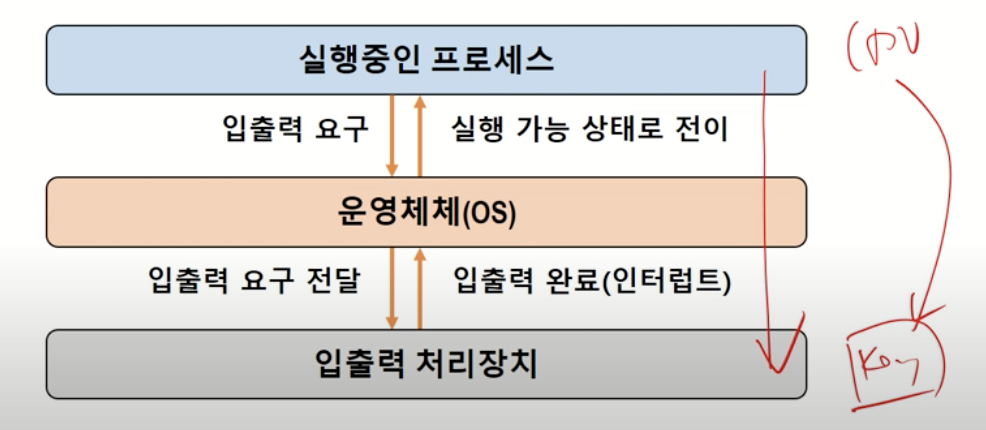

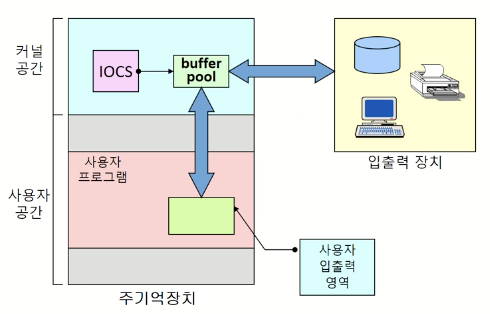

## Reference

- [운영체제 강의(김덕수 교수) - Lec2.](https://youtu.be/nxl_cUd55Ag)