# [OS] CPA310 Lec 3. Process Management

> [운영체제 강의(김덕수 교수) - Lec 3.](https://youtu.be/jZuTw2tRT7w)를 보고 정리한 자료입니다.

<!--2021.10.24-->

## 프로세스(Process)

### 프로그램(Program) vs. 프로세스(Process)

프로그램과 프로세스는 어떻게 다를까?

프로그램은 작업(Job)이라고도 불리며, 실행할 코드와 데이터의 집합을 말한다. 프로그램은 컴퓨터 시스템에 실행을 요청하기 전의 상태로, 디스크에 보관되어 있다.

반면, 프로세스는 프로그램이 실행을 위해 시스템(커널)에 등록된 상태를 말한다. 프로세스 관리는 시스템의 성능 측면에서 매우 중요한 요소로, 커널에 의해 관리된다.

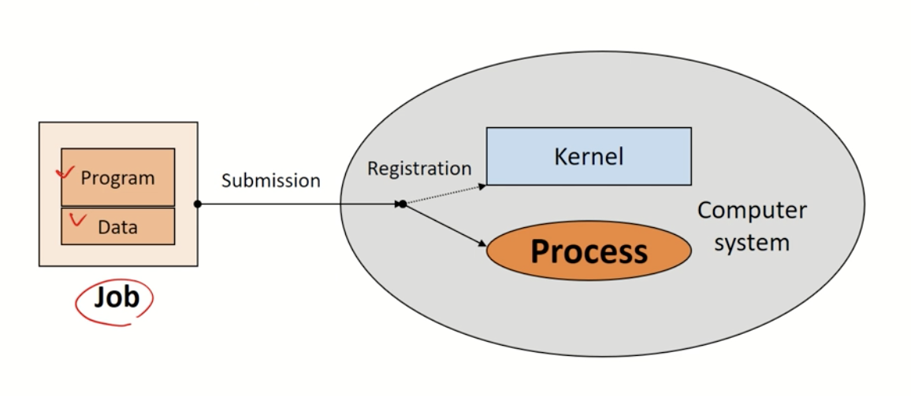

정리하면, 프로그램은 코드와 데이터를 묶어서 디스크에 저장된 상태를 의미하고, 프로그램을 실행시켜 커널이 해당 작업을 메모리에 등록하면 이를 프로세스라고 부른다.

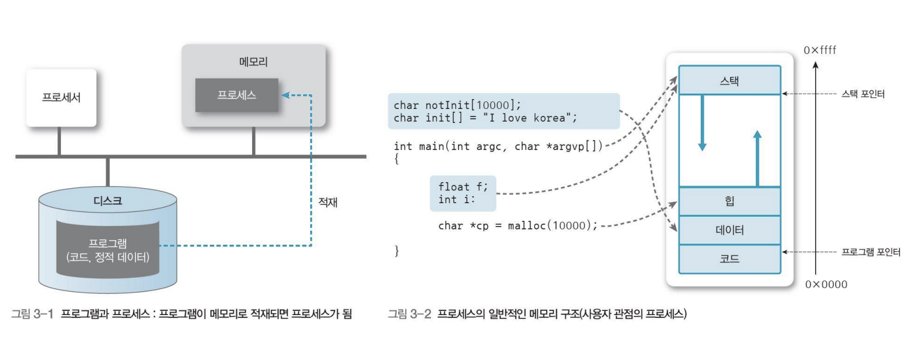

### 프로세스의 정의

프로세스를 간단히 정의하면 '실행 중인 프로그램'이다. 조금 더 구체적으로는 다음과 같이 정의할 수 있다.

- 커널에 등록되어 커널의 관리하에 있는 작업
- 각종 자원들을 요청하고 할당받을 수 있는 개체
- 프로세스 관리 블록(PCB)를 할당 받은 개체
- 능동적인 개체(active entity)
  + 실행 중에 각종 자원을 요구, 할당, 반납하며 진행

### 프로세스의 종류

프로세스는 역할과 병렬 수행 방법에 따라 다음과 같이 구분된다.

- 역할에 따른 구분
  + 시스템(커널) 프로세스
  + 사용자 프로세스

시스템(커널) 프로세스는 모든 시스템 메모리와 프로세서의 명령에 접근할 수 있는 프로세스다. 시스템(커널) 프로세스는 프로세스의 실행 순서를 제어하고, 프로세스가 다른 사용자 및 커널 영역을 침범하지 못하게 감시하고, 사용자 프로세스를 생성하는 등의 기능을 한다. 사용자 프로세스는 사용자 코드를 수행하는 프로세스를 말한다.

- 병행 수행 방법에 따른 구분
  + 독립 프로세스
  + 협력 프로세스

하나의 프로세서는 한 번에 하나의 프로세스만 실행할 수 있다. 하지만 운영체제는 프로세서의 시간을 작은 단위로 쪼개고, 여러 개의 프로세스를 빠르게 전환함으로써 마치 프로세스 여러 개를 동시에 실행하는 것처럼 보이게 하는데, 이를 병행 프로세스라고 부른다. 프로세스는 병행 프로세스를 수행하는 방법에 따라 독립 프로세스와 협력 프로세스로 구분할 수 있다.

독립 프로세스는 다른 프로세스에 영향을 주지 않거나 다른 프로세스의 영향을 받지 않는 병행 프로세스다. 반면, 협력 프로세스는 다른 프로세스에 영향을 주거나 다른 프로세서로부터 영향을 받는 병행 프로세스를 말한다.

### 자원(Resource)의 개념

프로세서 관점에서 컴퓨터 자원을 정읳면 다음과 같다.

> 커널의 관리하에 프로세스에 할당/반납되는 수동적 개체(passive entity)

자원은 HW 자원과 SW 자원으로 분류할 수 있다. HW 자원은 프로세서, 메모리, 디스크, 모니터, 키보드 등 물리적으로 실재하는 자원이며, SW 자원은 메시지, 신호, 파일, 프로그램 등 논리적으로 존재하는 자원이다. 

## Process Control Block (PCB)

프로세스 관리 블록(PCB)이란 운영체제가 프로세스를 관리하기 위해 필요한 정보를 저장하는 공간을 말한다. 어떤 프로세스가 실행되면 메모리의 커널 영역에는 각 프로세스의 상태를 저장하는 PCB가 생성된다. 

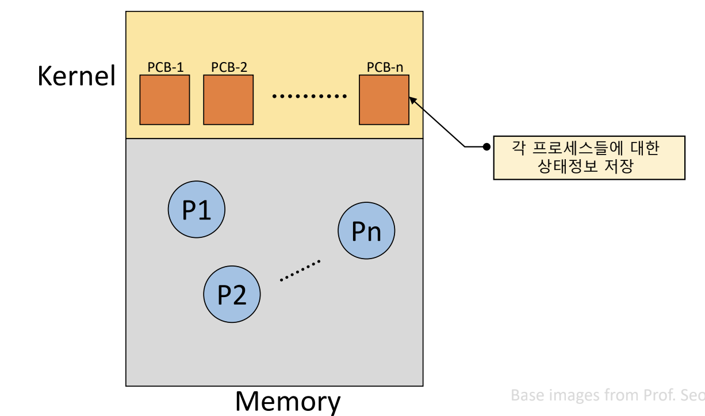

### PCB가 관리하는 정보

PCB는 다음과 같은 프로세스 정보를 저장한다.

- PID(Process Identification Number): 프로세스 고유 식별 번호
- 스케줄링 정보
- 프로세스 상태
- 메모리 관리 정보
- 입출력 상태 정보
- 문맥 저장 영역
- 계정 정보

PCB는 운영체제가 프로세스를 관리하는 도구로, PCB의 형태는 운영체제마다 서로 다르다. PCB의 참조 및 갱신 속도는 운영체제의 성능을 결정짓는 중요한 요소 중 하나다.

## 프로세스의 상태 변화

### 프로세스의 상태(Process States)

프로세스의 시작부터 종료까지, 프로세스는 여러 상태를 거치며 실행된다. 프로세스의 상태는 프로세스와 자원 간의 상호작용에 의해 결정된다.

### Process State Transititon Diagram

프로세스의 상태 변화는 다음과 같은 다이어그램으로 표현할 수 있다. 처음에는 복잡해 보이나, 각 상태에 대해 차근차근 알아보고 나면 쉽게 이해할 수 있으니 걱정하지 말자.

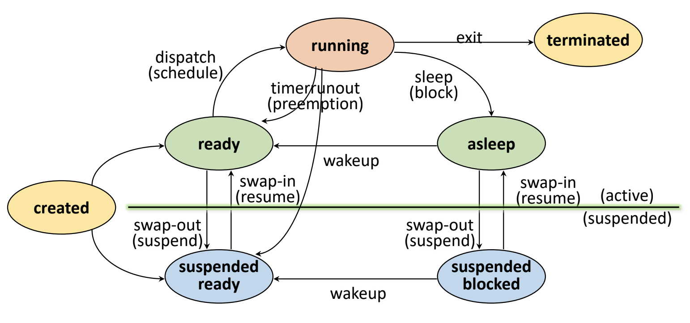

### Created State

프로그램을 실행하면 작업이 커널에 등록되어 프로세스를 생성하는데, 이 상태를 `Created State`라고 한다. `Created State`에서 커널은 메모리의 커널 영역에 PCB를 할당하고 프로세스를 생성한다. 이 상태는 아직 메모리나 CPU 자원을 할당받은 상태는 아니다.

프로세스 생성이 완료되면 프로세스는 `Ready State`와 `Suspended State` 중 하나의 상태로 이동하게 되는데, 이것은 메모리 여유 공간에 의해 결정된다. 커널은 현재 사용할 수 있는 메모리 공간이 있는지를 체크하여 프로세스 상태를 전이한다.

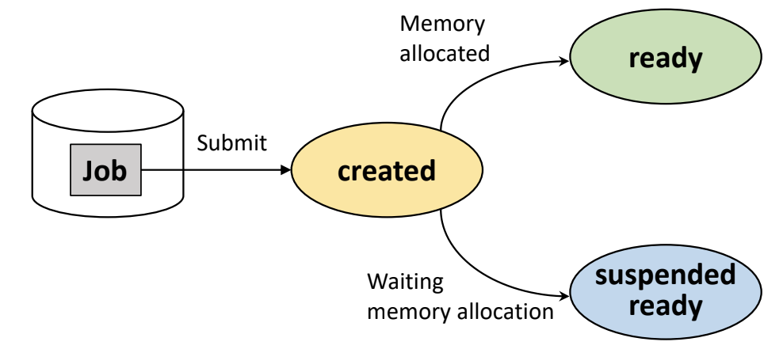

### Ready State

메모리에 가용 공간이 있다면, 프로세스는 바로 메모리를 할당받아 `Ready State`로 이동한다. `Ready State`는 프로세서 외의 다른 모든 자원을 할당받은 상태로, CPU만 할당되면 즉시 실행될 수 있는 상태를 말한다.

`Ready State`에서 CPU를 할당받으면 프로세스를 실행할 수 있는 `Running State`로 이동하게 되고, 이것을 dispatch 또는 schedule 되었다고 말한다.

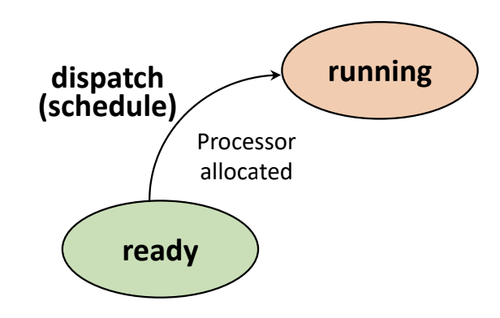

### Running State

`Ready State`에서 CPU를 할당받아 열심히 작업을 수행하는 상태를 `Running State`라고 한다.

프로세서는 매우 바쁘기 때문에, 어떤 프로세스가 프로세서를 할당받아 `Running State`에 있더라도 프로세서 스케줄링에 따라 프로세서를 빼앗기는 경우가 생길 수 있다. 해당 프로세스에 할당된 타임 슬라이스가 소진되었거나, 인터럽트 등 더 높은 우선순위의 프로세스가 발생했을 때, 현재 실행 중인 프로세스로부터 강제로 CPU를 회수하는 것을 preemption 되었다고 말한다. Preemption이 발생하면, 해당 프로세스는 다시 `Ready State`로 돌아가서 프로세서 할당을 기다리게 된다.

또한, 프로세스 실행 중 I/O 동작을 요청한 경우 I/O가 끝날 때까지 잠시 작업을 대기시키는데, 이 과정을 block 또는 sleep 되었다고 표현한다. `Running State`의 프로세스가 block되면 `Asleep State`로 이동해서 원하는 데이터를 얻을 때까지 대기한다.

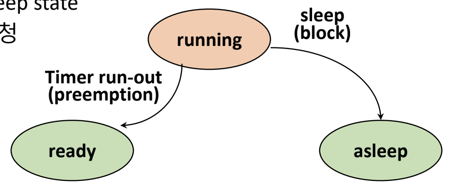

### Blocked/Asleep State

프로세스가 I/O 등 프로세서 외에 다른 자원을 기다리는 상태를 `Blocked State` 또는 `Asleep State`라고 한다.

만약 `Blocked State`의 프로세스가 원하는 자원을 얻었다면, 해당 프로세스는 다시 `Running State`로 이동할 수 있을까? 안타깝게도 그렇지 않다. I/O 처리가 끝나 모든 데이터가 준비된 프로세스는 다시 `Ready State`로 이동해서 CPU 할당을 기다려야 한다. 이렇게 `Blocked State`의 프로세스가 원하는 자원을 할당받아 `Ready State`로 이동하는 과정을 wakeup 되었다고 표현하다.

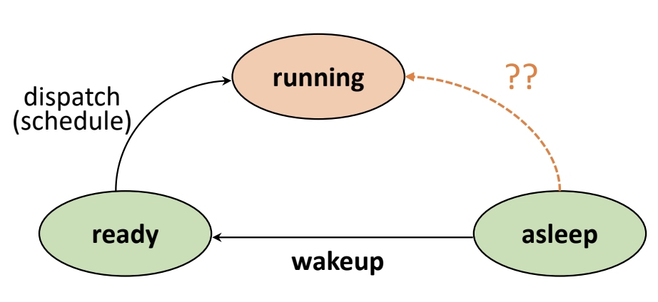

### Suspended State

다시 `Created State`로 돌아와보자. 앞서 Create State에서 메모리 공간이 충분하면 `Ready State`로, 그렇지 않으면 `Suspended State`로 이동한다고 언급했다.

`Suspended State`는 현재 사용할 수 있는 메모리가 없어, 메모리를 할당받지 못한 채로 대기하는 상태를 말한다. `Created State`에서뿐 아니라, `Running State` 및 `Blocked State`에서도 메모리가 부족해질 경우 `Suspended State`로 이동할 수 있다. 예를 들어, I/O 대기를 위해 `Blocked State`가 되었는데, 메모리 공간까지 빼앗기면 `Suspended Blocked State`가 되는 것이다.

이렇게 메모리를 할당받은 active 상태에서 메모리를 빼앗겨 suspended 상태가 되는 것을 swap-out 되었다고 표현하며, 반대로 메모리를 할당받아 active 상태가 되는 것을 swap-in 되었다고 말한다.

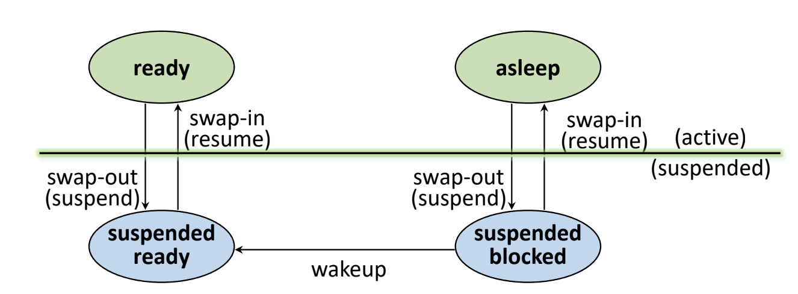

만약 active 상태에 있던 어떤 프로세스가 메모리를 빼앗겨 swap-out 되었다고 생각해 보자. 그렇다면 이 프로세스는 다시 swap-in 되었을 때 처음부터 프로세스를 새로 시작해야 하는 것일까? 그렇다면 시스템은 너무나 비효율적일 것이다.

운영체제는 프로세스가 swap-out되어 메모리를 빼앗기기 전, 해당 프로세스의 메모리 상태를 메모리 이미지로 저장해둔다. 메모리 이미지는 swap device에 저장되며, swap device는 프로그램 정보 저장을 위한 특별한 파일 시스템이다. 그리고 해당 프로세스가 다시 메모리 자원을 할당받아 swap-in 되면, 저장했던 메모리 이미지를 복구하여 사용한다.

### Terminated/Zombie State

프로세스 수행이 모두 끝나면 프로세스는 마지막으로 `Terminated State` 또는 `Zombie State`로 이동한다. 이때 프로세스는 모든 자원을 반납하고 PCB 정보만 남겨둔 상태로, `Terminated State`에서 커널이 모든 PCB 정보를 수집하고 나면 최종적으로 프로세스가 삭제된다.

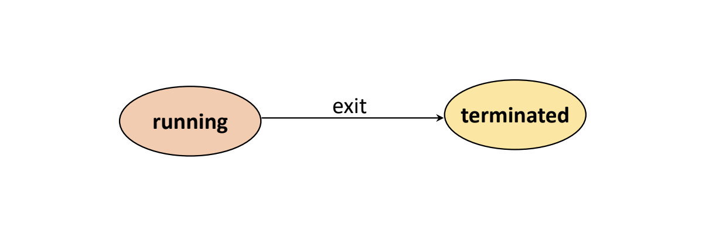

### 프로세스 상태 특성

위에서 본 프로세스 상태를 표로 정리하면 다음과 같다.

- 메모리 할당 여부: Active와 Suspended 상태로 구분
- 프로세서 할당 여부: Running과 Ready 상태로 구분
- 기타 자원 충족 여부: Ready와 Asleep 상태로 구분

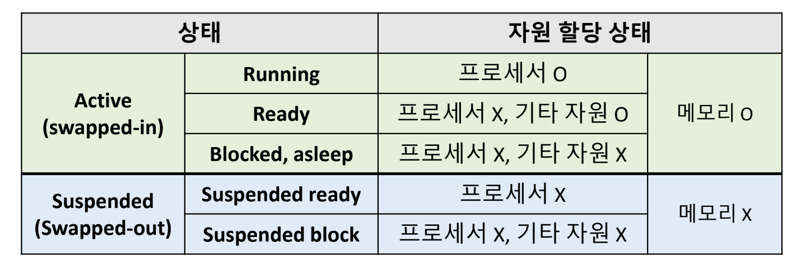

## 프로세스 관리를 위한 자료구조

프로세스 관리를 위한 몇 가지 자료 구조를 살펴보자.

먼저, `Ready State`에는 CPU를 할당받기 위해 대기하는 프로세스들이 줄을 서 있을 것이다. 따라서, 이 상태에는 대기하는 프로세스들이 list (queue) 형태로 저장되어 있다.

`Asleep State`는 프로세서 외에 다른 자원들을 요청하고 대기하는 상태로, 필요로 하는 자원 별로 별도의 queue를 둔다. Device, I/O 등 대가하는 자원의 종류에 따라 여러 개의 queue를 가질 것이다.

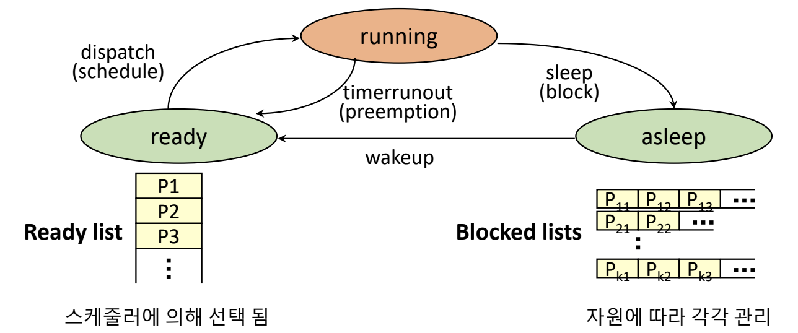

## 인터럽트(Interrupt)

인터럽트란 예상치 못한, 외부에서 발생한 이벤트 (unexpected, external events)를 말한다.

### 인터럽트의 종류

인터럽트에는 다음과 같은 종류들이 있다.

+ I/O interrupt
  - 프로세서가 사용자의 I/O 요청을 예측하고 대기하는 것은 사실상 불가능하다. 따라서 I/O에 의해 이벤트가 발생하면 이를 프로세서에 직접 전달하는 방식을 사용하는데, 이를 I/O 인터럽트라고 한다.
+ Clock interrupt
  - CPU clock에 의해 발생한 인터럽트
+ Console interrupt
  - 콘솔 창에서 발생한 인터럽트
+ Program check interrupt
  - 프로그램에 문제가 생겼을 때 발생한 인터럽트
+ Machine check interrupt
  - 하드웨어에 문제가 있을 때 발생한 인터럽트
+ Inter-process interrupt
  - 다른 프로세스에 의해 발생한 인터럽트
+ System call interrupt
  - 시스템 콜에 의해 발생한 인터럽트

### 인터럽트 처리 과정

인터럽트가 발생하면, 커널이 개입해서 프로세서가 실행하던 프로세스를 중단하고 발생한 인터럽트를 처리해 준다. 인터럽트를 처리하는 과정은 크게 인터럽트 처리(interrupt handling)와 인터럽트 서비스(interrupt service)로 나뉜다.

인터럽트 처리(interrupt handling)에서는 인터럽트가 어디서 발생했는지, 왜 발생했는지를 파악하고, 인터럽트를 처리할 것인지 또는 무시할 것인지를 결정한다. 인터럽트를 처리하겠다고 결정했다면, 인터럽트 서비스(interrupt service)에서 해당 인터럽트를 처리할 수 있는 인터럽트 서비스 루틴(interrupt service routine)을 호출한다.

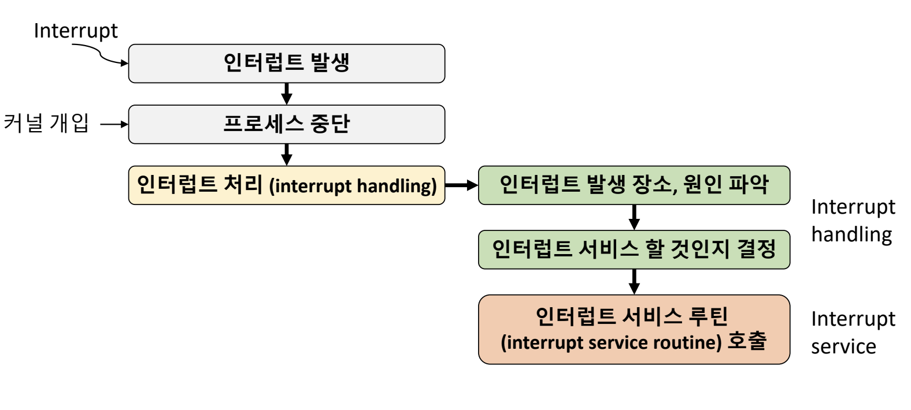

인터럽트 처리 과정을 보다 자세히 살펴보자.

현재 프로세서에 Pi라는 프로세스가 수행되고 있다고 하자. 이때 시스템에 인터럽트가 발생되면, 커널이 개입해서 Pi 프로세스를 잠시 중단시킨다. 프로세스가 중단되면 커널은 먼저 Pi 프로세스의 상태를 PCB에 저장하는 문맥 저장(context saving) 과정을 수행한다. 이는 프로세스가 어디까지 실행되었는지 흐름을 저장하는 행위로, 마치 책갈피를 꽂아두는 것과 같다.

커널은 IH(interrupt handler)를 호출하여 인터럽트가 어디에서, 왜 발생했는지 원인을 파악한다. 인터럽트를 처리하기로 결정했다면, IS(interrupt service)를 통해 해당 인터럽트를 처리하는 프로세스가 실행되고 인터럽트가 처리된다.

서비스가 끝나면, 프로세서는 Ready State에서 대기하는 프로세스 중 하나에 다시 할당된다. 이때, 프로세서는 이전에 실행하던 Pi 프로세스에 우선으로 할당되는 것은 아니다. Ready State의 어떤 프로세스 Pj가 프로세서에 올라오게 되며, Pj는 PCB로부터 자신이 이전에 저장해둔 문맥을 복구(context restoring)하고, 자신의 일을 재개하게 된다.

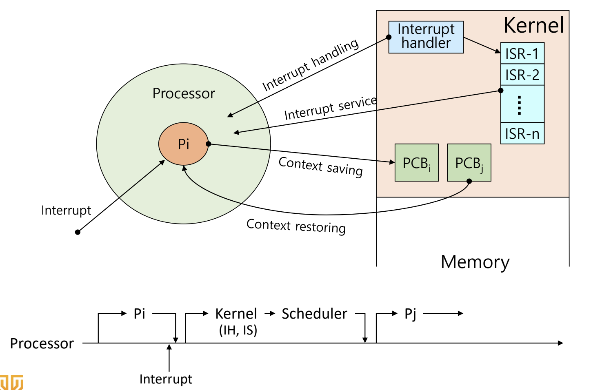

## 문맥 교환(Context Switching)

### 문맥(Context)

앞서 보았듯이, 인터럽트 또는 프로세서 스케줄링 등에 의해 기존에 실행 중이던 프로세스가 CPU를 빼앗기고 실행이 중단되는 경우가 빈번하게 발생한다. 이 경우 나중에 프로세스를 다시 실행하기 위해 프로세스의 현재 데이터를 어딘가에 저장해두는 과정이 필요하다. 이때 CPU 레지스터에 저장된 프로세스의 데이터 값을 문맥(context)라고 하며, 문맥은 PCB에 저장된다.

현재 프로세스의 레지스터 값을 PCB에 저장하는 것을 문맥 저장(context saving)이라고 하며, PCB에서 레지스터 값을 복구하는 작업을 문맥 복구(context restoring)이라고 한다. 그리고 실행할 프로세스가 바뀌어 현재 실행중인 프로세스의 문맥을 저장하고, 앞으로 실행할 프로세스의 문맥을 복구하는 일련의 과정을 문맥 교환(context switching)이라고 부른다. 문맥 교환은 커널의 개입으로 이루어진다.

### Context Switch overhead

시스템에는 매우 많은 프로세스가 있기 때문에, 문맥 교환은 아주 빈번하게 일어날 수밖에 없다. 따라서 문맥 교환은 운영체제의 성능에 큰 영향을 주며, 운영체제의 성능을 높이기 위해서는 불필요한 문맥 교환을 최대한 줄이는 것이 중요하다. 문맥 교환을 줄이는 대표적인 방법에는 스레드(thread)를 사용하는 방법이 있는데, 스레드와 관련된 내용은 다음에 알아보도록 하자.

## Reference

- [김덕수 교수 운영체제 강의 - Lec 3.](https://youtu.be/jZuTw2tRT7w)
