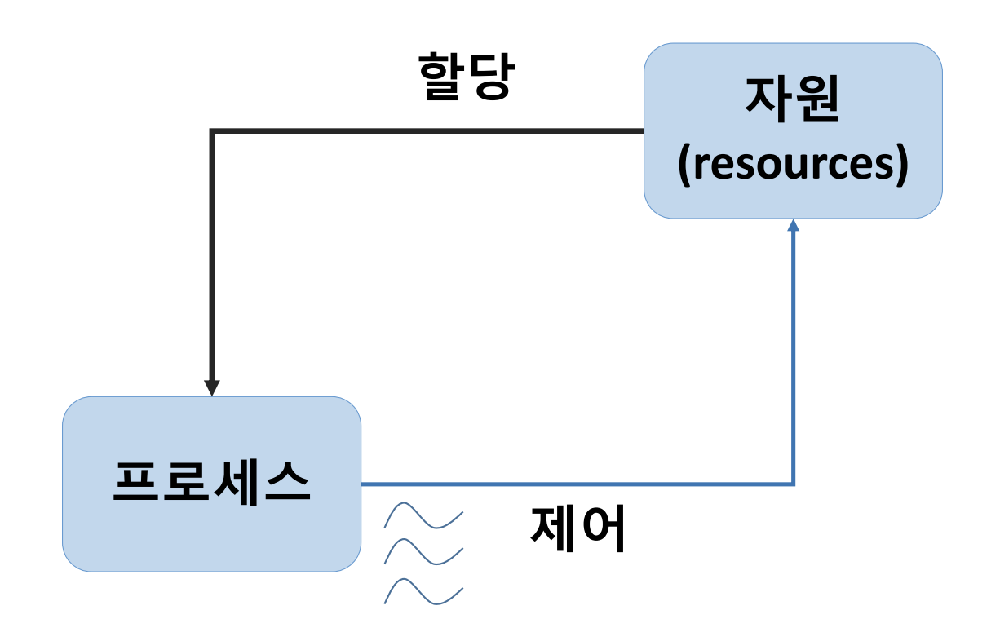
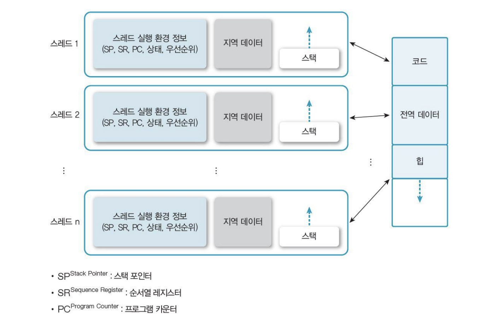
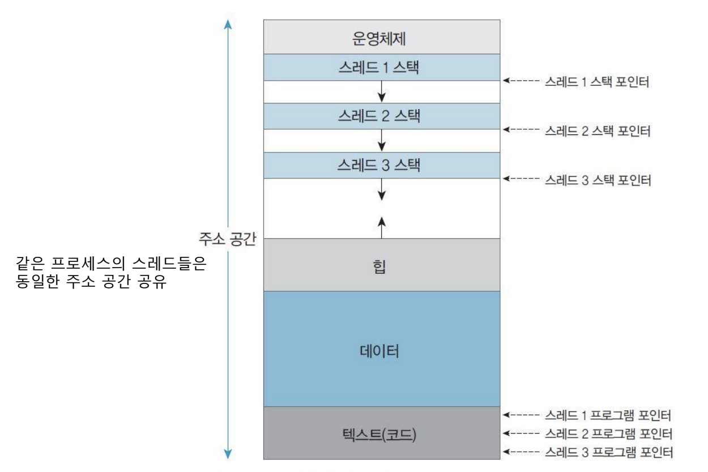
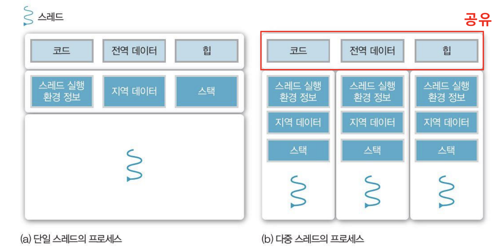
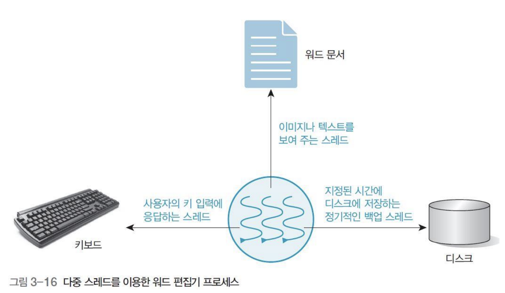
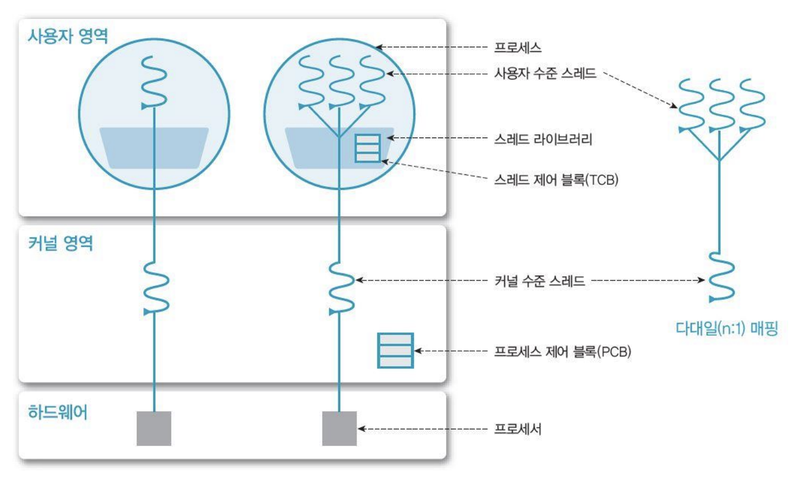
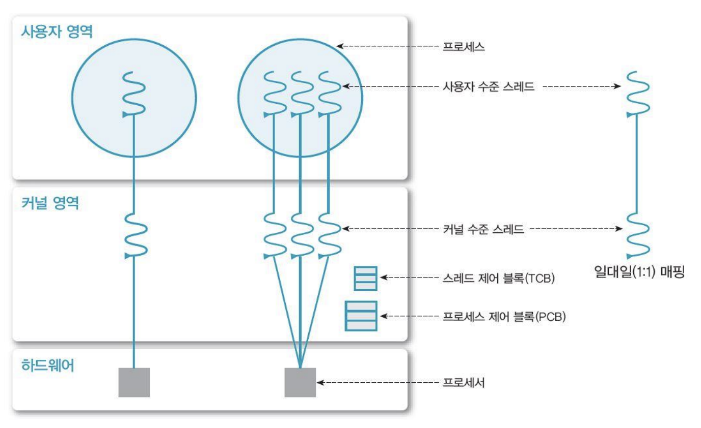
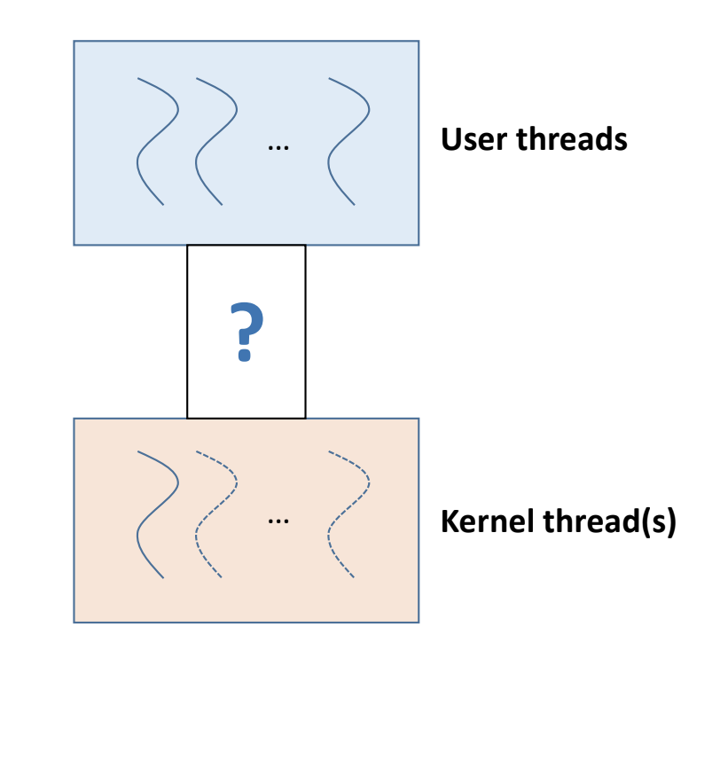
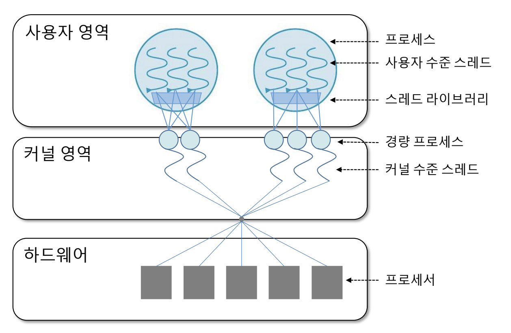

# [OS] CPA310 Lec 4. Thread Management

> [운영체제 강의(김덕수 교수) - Lec 4.](https://youtu.be/YlnvCIZQDkw)를 보고 정리한 자료입니다.

[지난 포스트](03_process-management.md)에서 프로세스의 문맥 교환에 대해 학습했다. 문맥 교환은 비용이 많이 들기 때문에, 운영체제의 성능을 높이기 위해서는 불필요한 문맥 교환을 최대한 줄이는 것이 중요하다. 문맥 교환을 줄이는 대표적인 방법이 스레드(thread)를 사용하는 것이라고 했는데, 본격적으로 스레드에 대해 알아보자.

## 프로세스(Process)와 스레드(Thread)

프로세스와 스레드의 차이는 무엇일까?

먼저, 프로세스가 하는 일을 생각해 보자. 프로세스는 시스템으로부터 자원을 할당받고, 그 자원을 제어함으로써 원하는 목적을 달성한다. 따라서, 우리는 프로세스를 크게 '자원'의 영역과 '제어'의 영역으로 나누어 생각해 볼 수 있다.

이때 프로세스의 제어 부분을 따로 떼어낸 것을 스레드라고 부른다. 스레드는 프로세스 내의 작업 단위다. 스레드는 '실'이라는 뜻으로, 흔히 실 모양(~)으로 표현한다.

하나의 프로세스에는 여러 개의 스레드가 있을 수 있다. 프로세스에는 여러 종류의 자원이 있기 때문에, 프로세스 내에는 여러 개의 스레드가 존재하며 각 자원을 제어한다. 프로세스가 몸통이라면 스레드는 자원을 제어하는 팔과 같은 역할을 한다.

## 스레드(Thread)

프로세스를 자원과 제어로 구역을 나누어 자세히 살펴보자.

먼저 우측의 자원 영역을 보자. 자원에는 대표적으로 프로그램 코드가 있다. 프로세스 레지스터인 PC(Program Counter)는 실행할 코드의 위치를 가리킴으로써 프로세스에 접근한다. 또한 자원에는 입출력 정보 등의 전역 데이터가 있고, 프로세스가 사용하는 힙 메모리 공간 등이 있다.

좌측은 제어 영역으로, 여러 개의 스레드로 구성되어 있다. 프로세스 내의 스레드들은 자원을 서로 공유하며, 각 스레드는 역할에 따라 각자의 제어 정보를 갖는다. 먼저, 스레드는 SP(Stack Pointer), SR(Sequence Register) 등 프로세스 실행 환경에 대한 정보를 가진다. 또한, 스레드를 실행할 때 사용되는 지역 데이터를 가진다. 예를 들어, for문 안에서만 유효한 지역 변수 등이 지역 데이터에 해당된다. 이러한 환경 정보 및 지역 데이터는 각 스레드의 스택 영역에 저장된다.

위 이미지는 메모리 입장에서 프로세스를 다시 정리한 것이다. 메모리 공간의 하단을 보면 코드, 데이터, 힙 등 자원 영역이 존재하고, 상단에는 여러 스레드 스택이 존재하는 것을 확인할 수 있다.

같은 프로세스 내의 스레드들은 동일한 주소 공간을 공유하고, 자원 또한 공유한다. 각 스레드는 주소 공간에서 자신만의 작업 영역(스택)을 할당받아 해당 공간에 지역 데이터를 생성하고 작업을 실행한다. 각 스레드는 PC를 사용하여 자원의 코드 내에서 원하는 작업 위치에 접근할 수 있다.

### 스레드의 특징

스레드는 경량 프로세스(Light Weight Process, LWP)이다. 스레드는 프로세스 중 제어 영역만 떼어낸 것이기 때문에, 자원과 제어를 모두 가진 일반 프로세스보다 훨씬 가볍다.

스레드는 프로세서(CPU) 활용의 기본 단위다. 프로세스에 여러 개의 스레드가 있다면, 각 스레드는 서로 다른 프로세서를 활용한다. 따라서, 스레드가 여러 개 존재할 경우 동시에 여러 개의 CPU를 사용할 수 있다.

### 스레드의 구성 요소

- thread ID: 각 스레들를 구분하는 ID
- register set (PC, SP 등): 제어를 위해 필요한 스레드 실행 정보
- stack (로컬 데이터 등): 스레드의 작업 공간

### 단일 스레드(Single-thread) vs. 다중 스레드(Multi-thread)

스레드를 고려하지 않았던 전통적인 프로세스들은 단일 스레드 프로세스였다. 단일 스레드 프로세스란, 오직 하나의 스레드만 가지는 프로세스를 말한다. 반면, 멀티 스레드 프로세스는 여러 개의 스레드를 가진 프로세스다. 멀티 스레드 프로세스에서 각 스레드는 코드, 데이터 등의 자원을 프로세스 내의 다른 스레드들과 공유한다.

### 스레드의 장점

#### 사용자 응답성(responsiveness)

멀티 스레드의 경우, 여러 개의 스레드가 동시에 자원을 관리하기 때문에 일부 스레드의 처리가 지연되어도 다른 스레드는 작업을 계속 처리할 수 있다.

#### 자원 공유(resource sharing)
  
프로세스 내의 스레드는 자원을 공유하기 때문에, 스레드가 변경될 때 커널의 개입이 없어 시스템의 효율이 증가한다.

프로세스의 경우 다른 프로세스와 자원을 공유하지 않기 때문에, 프로세스가 번갈아가며 자원을 사용해야 한다. 이렇게 CPU를 점유하는 프로세스가 변경되는 것을 문맥 교환이라고 하며, 문맥 교환은 매우 비싼 연산이므로 가급적 피하는 것이 좋다.

반면, 멀티 스레드에서는 이미 자원을 공유하기 때문에 자원 사용을 위해 문맥 교환이 필요하지 않다. 따라서, 멀티 스레드를 사용할 경우 자원을 보다 효율적으로 이용할 수 있다.

#### 경제성(economy)

스레드는 프로세스 관리 또는 문맥 교환에 비해 효율적이고 비용이 저렴하다.

#### 멀티 프로세서(multi-processor) 활용

스레드가 여러 개 존재할 경우 여러 개의 CPU 코어를 사용할 수 있다. 이렇게 프로세스를 병렬로 처리함으로써 성능을 향상시킬 수 있다.

### 스레드 사용 예시

단일 스레드로 구성된 워드 편집기 프로세스가 있다고 생각해 보자. 이 경우 프로세스에 자원을 제어하는 스레드가 하나만 존재하기 때문에, 하나의 스레드가 키보드 입력, 문서 읽기, 데이터 백업 등 모든 기능을 담당한다. 만약 게임을 하다가 키보드 입력이 발생한다면, 실행 중이던 프로세스는 block 되고, 키보드 입력을 다 받을 때까지 대기했다가, CPU 할당 순서가 되면 다시 실행될 것이다. 단일 스레드에서는 키보드 처리를 위해 프로세스가 block 되는 동안, 문서 읽기, 데이터 백업 등의 다른 기능도 함께 지연되는 현상을 피할 수 없다.

이 시스템을 세 개의 스레드로 구현한다면 어떻게 될까? 각 스레드는 각각 키보드 입력, 파일 읽기, 데이터 백업의 작업만을 담당할 것이고, 세 스레드는 자원을 공유할 것이다. 이 경우 하나의 스레드가 지연되거나 멈추더라도 나머지 스레드는 계속 작업을 할 수 있다. 하나의 스레드는 하나의 프로세서를 갖기 때문에, 한 스레드가 block 상태가 되더라도 다른 스레드의 작업에 영향을 주지 않는다. 이렇게 멀티 스레드는 사용자 응답성을 높여준다.

## 스레드의 구현

스레드는 사용자 수준 스레드(User Thread)와 커널 수준 스레드(Kernel Thread)로 나눌 수 있다.

### 사용자 수준 스레드 (User Thread)

사용자 수준 스레드는 사용자 영역에서 구현되는 스레드이다. 이 스레드는 사용자 모드에서 스레드를 관리하는 라이브러리에 의해 생성 및 관리된다. 사용자 수준 스레드는 커널의 통제권 밖에 있으며, 커널은 사용자 수준 스레드에 대해 알지 못한다. 한 마디로 커널 레벨 밖에 있는 스레드이다 POSIX, Win32, Java Thread 등이 사용자 모드 스레드에 해당된다.

아래 그림과 같이 커널 영역에서는 스레드가 하나지만, 사용자 수준에서는 여러 스레드 라이브러리를 사용하여 여러 스레드를 생성할 수 있다. 이 경우, 사용자 영역의 스레드와 커널 수준의 스레드는 N:1로 매핑된다.

커널이 스레드의 존재를 모른다는 것은 장점과 단점을 갖는다. 장점으로는, 커널의 관리를 받지 않기 때문에 스레드 생성 및 관리에 부하가 적고 유연한 관리가 가능하다는 점이 있다. 하지만, 사용자 수준 스레드에서는 하나의 스레드가 block 되면 프로세스 전체가 block 상태가 된다. 이 경우 모든 스레드가 대기해야 하는 단점이 있다.

### 커널 수준 스레드 (Kernel Thread)

커널 수준 스레드는 커널 레벨에서 생성되는 스레드이다. 운영체제 내에서 생성되고 동작하는 스레드로, 커널이 직접 관리한다.

커널 수준 스레드에서는 사용자 수준에서 스레드가 생성되면 커널 영역에서도 같은 개수만큼 스레드를 생성한다. 사용자 영역의 스레드와 커널 영역의 스레드는 1:1로 매칭된다. 

커널 수준 스레드는 사용자 영역의 스레드와 커널 영역 스레드를 1:1으로 매칭하므로, 커널은 각 스레드를 개별적으로 관리할 수 있다. 따라서, 프로세스 내의 각 스레드들은 병렬적으로 실행될 수 있고, 하나의 스레드가 block이 되어도 다른 스레드는 계속 작업을 수행할 수 있다.

하지만, 커널 내에 스레드가 여러 개 생기며 문맥 교환이 자주 발생하는 등 오버헤드가 크다는 단점이 있다.

### Multi-Threading Model

사용자 수준 스레드 모델과 커널 수준 스레드 모델을 혼합한 것이 Multi-Threading 모델이다. Multi-threading 모델은 사용자 수준 스레드 여러 개와 커널 수준 스레드 여러 개를 사용한다. (N:M)

### 혼합형(N:M) 스레드

혼합형 스레드는 Multi-Threading 모델의 일종으로, N 개의 사용자 수준 스레드와 M 개의 커널 수준 스레드를 사용하는 모델이다. 커널 수준 스레드는 사용자 수준 스레드보다 적다.

혼합형 스레드에서 사용자는 원하는 만큼 스레드를 만들어 사용한다. 커널은 사용자 수준 스레드보다는 적지만 여러 개의 커널 수준 스레드를 생성하고, 사용자 수준 스레드와 커널 수준 스레드를 다대 다로 매칭 시킨다. 그리고 매칭을 동적으로 관리함으로써, 하나의 스레드가 block 되더라도 다른 스레드가 동작할 수 있게 기능한다.

이는 사용자 수준 스레드 모델과 커널 수준 스레드 모델의 장점을 혼합한 형태로, 효율적이면서도 유연한 구조를 갖는다.

## Reference

- [운영체제 강의(김덕수 교수) - Lec 4.](https://youtu.be/YlnvCIZQDkw)