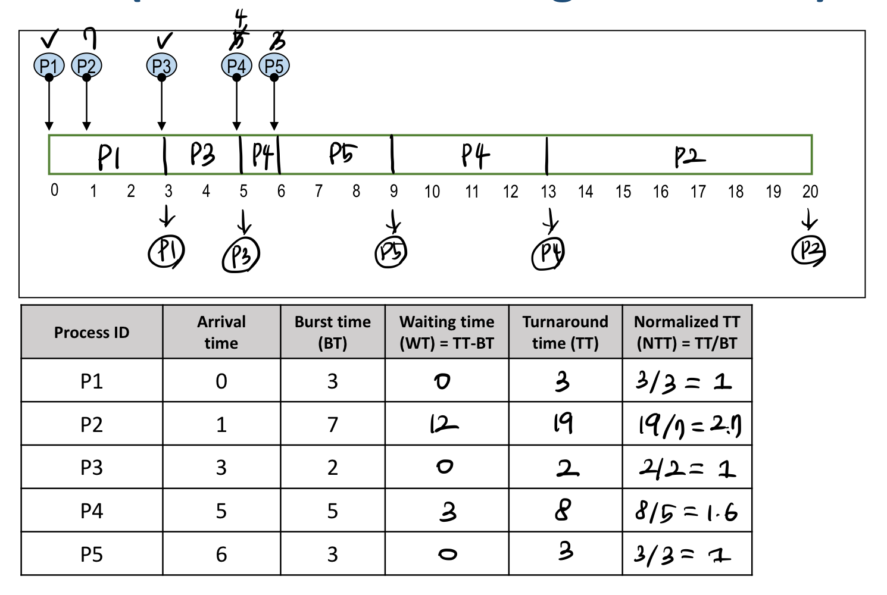
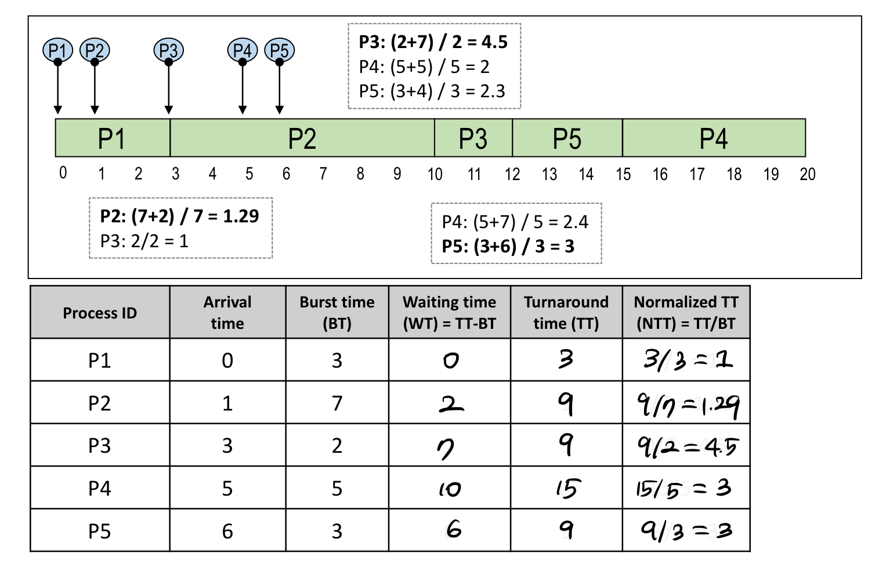

# [OS] CPA310 Lec 5. Process Scheduling

> [운영체제 강의(김덕수 교수) - Lec 5.](https://youtu.be/_gNeoGQx-Tc)를 보고 정리한 자료입니다.

## 프로세스 스케줄링

### 다중 프로그래밍(Multi-programming)

다중 프로그래밍이란 시스템 내에 여러 개의 프로세스가 존재하며, 여러 프로세스가 자원을 나누어 사용하는 것을 말한다. 자원을 나누어 사용하기 위해서는 매 순간 어떤 프로세스에 자원을 할당할지 선택하는 과정이 필요하다. 우리는 이것을 프로세스 스케줄링이라고 한다.

자원을 나누고 관리하는 방법은 방법은 크게 시간 분할(time sharing) 관리와 공간 분할(space sharing) 관리로 나뉜다.

시간 분할(time sharing) 관리는 프로세서(CPU)처럼 하나의 자원을 여러 스레드들이 번갈아가며 사용하는 것을 말한다. 프로세서는 동시에 여러 프로세스에 의해 점유될 수 없다. 따라서 하나의 프로세서를 여러 프로세스가 사용하기 위해서는 순서와 시간을 정해서 번갈아가며 사용해야만 한다. 이렇게 프로세서 사용 시간을 프로세스에게 분배하는 것을 프로세스 스케줄링(process scheduling)이라고 한다.

반면, 공간 분할(space sharing) 관리는 하나의 자원을 분할하여 여러 프로세스가 동시에 사용하는 것을 말한다. 메모리는 공간 분할 방식으로 관리되는 대표적인 자원이다.

### 스케줄링의 목적

스케줄링의 목적은 시스템의 성능(performance)을 높이는 것이다. 시스템의 성능은 다양한 방식으로 평가할 수 있지만, 성능을 평가하는 대표적인 지표에는 응답시간, 작업 처리량, 자원 활용도 등이 있다.

응답 시간(response time)이란, 작업 요청(submission)으로부터 응답을 받을 때까지의 시간이다. 즉, 우리가 작업을 보냈을 때 얼마나 빨리 답이 돌아오는지를 측정하는 지표다. 주로 대화형 시스템(interactive system), 실시간 시스템(real-time system) 등에서 중요한 성능의 지표가 된다.

다음으로 작업 처리량(throughput)이란, 단위 시간 동안 완료된 작업의 수를 말한다. 단위 시간 동안 최대한 많은 일을 해야 성능을 높이 평가하는 것으로, batch-system에서 요구하는 성능 지표다.

마지막으로, 자원 활용도(resource utilization)이란, 주어진 시간 동안 자원이 활용된 시간을 말한다. 만약 우리가 아주 비싼 자원을 갖고 있다면, 그 자원을 최대한 끊임없이 사용함으로써 자원 활용도를 높이는 것이 효율적인 시스템을 만드는 방법일 것이다.

그 외에도 공평성(fairness), 실행 대기 방지, 예측 가능성(predictability) 등이 시스템 성능의 지표가 될 수 있다. 우리가 구현하고자 하는 시스템의 목적에 맞는 지표를 고려하여 스케줄링 기법을 선택하는 것이 중요하다.

### 대기시간, 응답시간, 반환시간

프로세스 스케줄링에서 시간과 관련된 용어들을 정리해 보자.

- 대기 시간(waiting time): 프로세스가 도착해서 실행을 시작하기까지의 시간
- 응답 시간(response time): 프로세스가 도착해서 첫 번째 응답이 발생한 시간
- 실행 시간(burst time): 프로세스가 실제로 실행된 시간: 실행 시간
- 반환 시간(turn-around time): 도착부터 원하는 일이 끝날 때까지 시간

## 스케줄링 기준

### 스케줄링 기준(Criteria)

스케줄링 기준이란, 프로세서가 어떤 프로세스에 할당할지 결정할 때 지표가 되는 기준을 말한다. 스케줄링 기법이 고려하는 항목에는 다음과 같은 것들이 있다.

- 프로세스(process)의 특성
  + 프로세스가 I/O bounded 인지, computer-bounded 인지를 고려하며 스케줄링한다.
- 시스템 특성
  + 시스템이 batch system 인지, interactive system 인지를 고려하며 시스템의 목적에 적합한 스케줄링을 한다.
- 긴급성(urgency)
  + 시스템이 real time system 인지, non-real time system 인지에 따라 프로세스의 긴급성이 달라진다.
- 프로세스 우선순위(priority)
- 프로세스 총 실행 시간(total service time)

### CPU burst vs. I/O burst

I/O bounded 프로세스와 computer-bounded 프로세스에 대해 알아보자.

프로세스의 수행 과정은 결국 CPU를 사용하는 시간과 I/O 결과를 기다리는 시간의 반복이다. 연산 처리를 주로 수행하는 프로세스라면 CPU를 쓰는 시간이 더 많을 것이고, 사용자 입력이 잦은 프로그램은 I/O를 쓰는 시간이 더 많을 것이다. 이때, 프로세스 실행 시간 중 CPU를 사용하는 시간을 CPU burst라고 하고, I/O 처리를 기다리는 시간을 I/O burst라고 한다.

CPU와 I/O 수행 비율에 따라 프로세스를 compute-bounded 프로세스와 I/O-bounded 프로세스로 구분할 수 있다.

compute-bounded 프로세스는 CPU를 더 많이 쓰는 프로세스를 말한다. 이 경우 CPU 성능이 전체 프로세스의 성능을 결정할 것이다. 반면, I/O를 더 많이 쓰는 프로세스를 I/O bounded 프로세스라고 부른다. I/O-bounded는 I/O의 성능이 전체 프로세스의 성능을 결정한다.

프로세서의 할당을 기다리는 각 프로세스가 compute-bounded 인지, I/O-bounded 인지는 스케줄링에서 중요한 기준 중 하나다.

## 스케줄링의 단계(Level)

스케줄링이 필요한 빈도와 스케줄링에서 할당하는 자원에 따라 스케줄링 단계를 구분할 수 있다. 각 단계는 간단히 아래와 같이 구분된다.

- 장기 스케줄링(long-term scheduling)
  + Job scheduling
- 중기 스케줄링(mid-term scheduling)
  + Memory allocation
- 단기 스케줄링(short-term scheduling)
  + Process scheduling

### 장기 스케줄링(Long-term scheduling)

장기 스케줄링은 비교적 빈도가 적은 스케줄링으로, 작업 스케줄링(job scheduling)이 여기에 해당된다. 작업 스케줄링은 시스템 커널에 어떤 작업(프로그램)을 등록할지 결정한다.

작업 스케줄링은 다중 프로그래밍의 정도(degree)를 조절하는데, 다중 프로그래밍의 정도란 시스템 내에서 동작하는 프로세스의 수를 말한다.

작업을 선택할 때는 I/O-bounded 프로세스와 compute-bounded 프로세스를 잘 섞어서 선택하는 것이 좋다. 만약 compute-bounded 프로세스만 연속해서 실행된다면 그동안 I/O 장치 자원들이 놀 것이고, I/O-bounded 프로세스만 연속해서 실행된다면 그사이 CPU 자원이 놀 것이다. 이렇게 한쪽 자원이 계속해서 쉬는 것은 매우 비효율적이므로, 시스템의 효율을 높이기 위해서는 I/O-bounded와 compute-bounded를 번갈아가며 사용하는 것이 좋다.

장기 스케줄링은 시분할 시스템에서는 상대적으로 덜 중요하다. 시분할 시스템은 많은 작업들이 프로세서의 시간을 나누어서 쓰는 시스템으로, 모든 작업을 커널에 등록해서 사용하기 때문에 작업을 등록하는 스케줄링 과정은 많이 발생하지 않기 때문이다.

### 중기 스케줄링(Mid-term scheduling)

중기 스케줄링은 메모리 할당과 관련이 있는 스케줄링이다. 프로세스가 실행된 후에 전체 시스템의 메모리 공간이 부족해지면, 일부 프로세스는 suspended 상태에서 대기하며 메모리 할당을 기다린다. 메모리에 여유가 생길 경우, 시스템은 suspended 상태에 있는 여러 프로세스 중 어떤 프로세스에 메모리를 할당해 줄지 결정해야 하는데, 이것이 메모리 할당에서 필요한 스케줄링이다. 메모리 할당은 작업 스케줄링보다는 자주 발생하기 때문에 중기 스케줄링에 해당한다.

### 단기 스케줄링(Short-term scheduling)

단기 스케줄링은 가장 빈번하게 발생하는 스케줄링으로, 프로세스 스케줄링을 말한다. 프로세스 스케줄링이란 ready 상태에 있는 여러 프로세스 중 어떤 프로세스에 프로세서를 할당할지 결정하는 것이다.

프로세스 스케줄링은 가장 빈번하게 발생한다. 따라서, 프로세스 스케줄링이 느리면 시스템 전체가 느려지므로 매우 빠른 속도가 요구된다. 만약 어떤 프로세스가 실행될 때 CPU를 사용하는 시간이 100ms라고 해보자. 이때 프로세스를 스케줄링하는 데 사용되는 시간이 10ms라면, 이 프로세스는 10/(100+10)으로 약 9%의 오버헤드를 갖는다고 말할 수 있다.

### 스케줄링의 단계와 프로세스 상태 다이어그램

스케줄링 단계를 프로세스 상태 다이어그램과 연결 지어 알아두면 좋다.

## 스케줄링 정책

스케줄링 정책은 스케줄링 동작을 구현할 때 어떤 프로세스를 어떤 방식으로 선택할지 결정하는 요소다. 스케줄링은 다음 요소들을 고려하며 동작한다.

- 선점(Preemptive) vs. 비선점(Non-preemptive)
- 우선순위(Priority)

### 선점(Preemptive) vs. 비선점(Non-preemptive) 스케줄링

선점 스케줄링은 특정 프로세스가 이미 사용하고 있는 자원을 다른 프로세스가 빼앗을 수 있는 정책을 말한다. 어떤 프로세스가 실행 중이더라도, 프로세스에 할당된 시간이 종료되거나 우선순위가 높은 프로세스가 등장할 경우 다른 프로세스에 의해 자원을 빼앗길 수 있다. 이 정책은 응답 시간이 빨라 시분할 시스템과 real-time 시스템 등에 적합하다. 하지만, 프로세서를 점유하는 프로세스가 자주 변경되기 때문에 문맥 교환 오버헤드가 크다는 단점이 있다.

반면, 비선점 스케줄링은 내가 사용 중인 자원을 다른 프로세스가 빼앗을 수 없는 정책을 말한다. 이 경우 어떤 프로세스가 자원을 한 번 할당받으면 스스로 반납할 때까지 자원을 사용한다. 자원을 점유하는 프로세스가 자주 바뀌지 않으므로 문맥 교환 오버헤드가 적다는 장점을 갖는다. 하지만, 어떤 프로세스가 실행되는 동안 다른 프로세스는 무조건 대기해야 하기 때문에 평균 응답 시간이 길고, 우선순위가 높은 일이 발생하더라도 먼저 처리될 수 없는 우선순위 역전 현상이 발생한다.

### 우선순위(Priority)

각 프로세스의 우선순위는 프로세스 스케줄링에서 중요한 요소다. 프로세스의 우선순위와 관련된 스케줄링 정책에는 정적 우선순위 정책과 동적 우선순위 정책이 있다.

정적 우선순위는 한 번 우선순위가 결정되면 바뀌지 않는 정책을 말한다. 구현이 쉽고 오버헤드가 적다는 장점이 있지만, 시스템 환경 변화에 대한 대응이 어렵다.

동적 우선순위는 프로세스의 상태 변화에 따라 우선순위가 변경되는 정책이다. 구현이 복잡하고 매번 우선순위를 다시 계산하며 발생하는 오버헤드가 크다는 단점이 있지만, 시스템 환경 변화에 대한 유연한 대응이 가능하다.

## 기본 스케줄링 알고리즘

### FCFS(First-Come-First-Service)

FCFS는 가장 쉽게 생각할 수 있는 알고리즘으로, 선착순 알고리즘이라고 보면 된다. FCFS는 먼저 오는 프로세스에게 먼저 프로세서를 할당해 준다.

FCFS는 비선점 스케줄링 정책을 사용하는데, 어떤 프로세스가 코어를 할당받으면 작업이 모두 끝날 때까지 자원을 점유한다. 스케줄링 기준은 도착 시간으로, ready queue에 먼저 도착한 프로세스를 먼저 처리한다.

FCFS 알고리즘을 사용하면 자원을 효율적으로 사용할 수 있다. 알고리즘이 간단해서 스케줄링에 대한 오버헤드가 적고, 프로세서는 ready queue에 있는 순서대로 중단 없이 작업을 처리하므로 자원 활용도가 높다.

하지만, 전체적인 대기 시간은 증가한다는 단점이 있다. 예를 들어, 매우 간단해서 2초면 실행이 완료되는 프로세스가 있다고 해보자. 만약 이 프로세스보다 먼저 도착한 작업의 수행 시간이 100초라면, 이 프로세스는 2초 실행을 위해 100초를 대기해야 하는 비효율을 갖는다. 이렇게 수행 시간이 긴 프로세스에 의해 다른 프로세스들이 긴 대기시간을 갖게 되는 현상을 convoy effect라고 한다.

FCFS는 한 번에 많은 양의 작업을 처리하는 batch-system에 적합하다. 반면, I/O burst time이 긴 대화형 시스템에는 적합하지 않다.

다음 그림은 FCFS 알고리즘을 적용한 예시이다. Normalizaed TT는 실행 시간(burst time)을 기준으로 반환 시간(turn-around time)을 표준화한 것으로, 1이면 이상적이다. Normalized TT의 숫자가 클수록 프로세스의 체감 대기 시간이 길다는 뜻인데, 이는 프로세스의 입장에서 불공평한(unfair) 상황이라고 표현한다. 다음 예시에서는 P2의 실행 시간이 길기 때문에 P3, P4, P5 프로세스들의 대기 시간이 길어지게 되었는데, 이것을 convoy effect라고 한다.

### RR(Round-Robin)

RR 알고리즘은 FCFS와 마찬가지로 프로세스의 도착 시간을 기준으로 스케줄링 하지만, 선점 스케줄링 정책을 사용한다는 차이가 있다. 즉, 여러 프로세스가 돌아가면서 프로세서를 사용하는 스케줄링 방식이다. 각 프로세스는 제한된 시간(time quantum) 동안만 자원을 사용할 수 있으며, 할당된 시간이 지나면(time-runout) 자원을 반납하고 ready queue의 마지막 자리로 이동한다.

RR을 사용하면 특정 프로세스가 자원을 독점하는 것을 방지할 수 있다. 하지만, time-runout에 따라 문맥 교환이 빈번하게 발생하므로, 문맥 교환 오버헤드가 크다는 단점이 있다. 이는 대화형 시스템 또는 시분할 시스템에 적합하다.

RR 기법에서는 제한 시간 값이 시스템의 성능을 결정한다. 제한 시간은 시스템에서 결정할 수 있는 인자이다. 만약 제한 시간이 무한대로 크다면 시간제한이 없는 것과 같으므로 FCFS와 동일한 개념이 된다. 반대로 제한 시간이 매우 작다면 사용자는 여러 프로세스가 프로세서를 동시에 쓰는 것처럼 느낄 것이다. 이 경우, 각 프로세스의 체감 성능은 실제 프로세서 성능의 1/n에 불과하며, 매우 큰 문맥 교환 오버헤드가 발생한다는 문제가 있다.

FCFS에서 봤던 예시와 동일한 시나리오를 RR 기법으로 스케줄링 한다고 생각해 보자. time qunatum을 2초라고 할 때 결과는 다음과 같다. 각 작업의 Normalized TT가 FCFS보다 균등해 보인다.

다음은 각각 time qunatum이 3초일 때, 그리고 4초일 때의 결과이다. 여기서 중요한 것은 time qunatum 값이 변하면 전체 응답시간이 변하고, 시스템의 성능 차이가 발생한다는 것이다.

### SPN(Shortest-Process-Next)

FCFS와 RR 기법의 한계는 convoy effect였다. 어떤 프로세스는 아주 짧은 시간만 자원이 필요함에도, 늦게 도착했다는 이유로 긴 시간 동안 대기해야 했다. 따라서, 도착 시간이 아닌 실행 시간을 기준으로 스케줄링하는 기법이 고안되었다. SPN은 실행 시간이 가장 작은 프로세스를 먼저 처리하는 알고리즘이다.

SPN은 실행 시간이 짧은 프로세스를 빨리 처리함으로써 시스템 내의 프로세스 수를 줄일 수 있다. 프로세스 수가 적어지면 스케줄링에 대한 부하가 감소하고, 메모리도 절약이 되어 시스템 효율이 높아진다. 또한, 프로세스들의 평균 대기 시간이 짧아져 빠른 응답을 제공할 수 있다.

하지만, SPN 기법은 실행 시간이 긴 프로세스의 입장에서는 좋지 않다. 실행 시간이 긴 프로세스가 있다면, 그 프로세스는 ready queue에 일찍 도착하더라도 기약 없이 대기해야 한다. 어쩌면 자원을 계속해서 할당받지 못할 수 있는데, 이를 starvation(무한 대기) 현상이라고 이야기한다. 또한, SPN 기법을 적용하기 위해서는 각 프로세스의 정확한 실행 시간을 알아야 하기 때문에, 실행 시간을 예측할 수 있는 기법이 필요하다.

동일한 예시를 SPN으로 풀어보자. 실행 시간이 짧은 P1, P3, P4는 대기 시간 없이 바로 실행되었다. 하지만 실행 시간이 긴 P2의 경우 빨리 들어왔음에도 가장 늦게 프로세스가 처리되었다.

### SRTN(Shortest Remaining Time Next)

SRTN은 SPN을 변형한 기법으로, 남은 실행 시간을 기준으로 스케줄링하는 기법이다. 선점 스케줄링 정책을 사용하며, 잔여 실행 시간이 더 적은 프로세스가 등장하는 순간 프로세서를 뺏기는 시스템이다.

SRTN은 프로세스의 수를 줄여주는 SPN의 장점을 극대화해준다는 장점이 있다. 단점은 여전히 실행 시간 예측이 어렵고, 잔여 실행 시간을 계속 추적해야 하는 오버헤드가 발생하며, 선점 스케줄링이므로 문맥 교환 오버헤드도 크다. 따라서, 현실적으로는 구현 및 사용이 어려운 기법이다.

같은 예제에 SRTN 기법을 적용하면 다음과 같다.

### HRRN(High-Response-Ratio-Next)

SPN에서 aging이라는 개념을 적용하여 starvation(무한 대기)를 개선한 기법이 HRRN이다.

Aging은 프로세스의 나이, 즉 프로세스의 대기한 시간을 고려해서 기회를 제공하겠다는 것이다. 각 프로세스에서 필요로 하는 실행 시간 대비 대기 시간이 얼마나 되었는지를 기준으로 응답률(response ratio)를 계산하고, 응답률이 높은 프로세스를 우선으로 처리한다.

- 응답률 = (대기시간 + 실행시간) / 실행시간

HRRN은 SPN의 장점을 취하면서도 starvation 문제를 해결할 수 있다는 장점이 있지만, 여전히 실행 시간 예측이라는 오버헤드 문제를 가진다.

### 기본 알고리즘 정리

지금까지 FCFS, RR, SPN, SRTN, HRRN 다섯 가지의 스케줄링 기법을 알아보았다. 이 알고리즘을 구분하면 다음과 같다.

- 공평성(fairness) 중시: ready queue에 먼저 온 작업을 먼저 처리한다.
  + 비선점 정책: FCFS
  + 선점 정책: RR
- 효율성(efficiency), 성능(performance) 중시: 실행 시간이 짧은 프로세스를 먼저 처리한다.
  + 실행 시간 낮은 프로세스부터 처리: SPN
  + 남은 시간이 낮은 프로세스부터 처리: SRTN
  + 응답률이 높은 프로세스부터 처리: HRRN

효율성과 성능을 중요시하는 SPN, SRTN, HRRN은 모두 응답 시간 예측에 대한 부하 문제를 갖고 있다. 이 문제를 개선하기 위한 기법이 이어질 MLQ과 MFQ이다.

### MLQ(Multi-level Queue)

MLQ는 이름 그대로 여러 개의 레벨을 가지는 queue이다. 기존의 스케줄링 알고리즘은 하나의 ready queue를 가졌는데, MLQ는 작업별로 별도의 ready queue를 가진다.

각 프로세스는 최초에 배정된 queue를 벗어날 수 없고, 각 queue는 목적에 맞게 신만의 스케줄링 기법을 사용한다. 각 queue들은 우선순위를 기반으로 스케줄링 된다.

아래 그림을 보면, 시스템 프로세스 queue는 가장 높은 우선순위를 가지며, 학생 프로세스 queue는 가장 낮은 우선순위를 가진다.

흔히 MLQ의 장점으로 빠른 응답 시간을 언급하나, 모든 프로세스가 빠른 응답을 하는 것은 아니다. 우선순위가 높은 프로세스는 MLQ 기법에서 빨리 처리되나, 우선순위가 낮을 경우 오래 대기한다.

MLQ는 queue를 여러 개 관리하기 때문에 스케줄링에 대한 오버헤드가 크며, 우선순위가 낮은 프로세스의 경우 자원 할당을 계속 기다려야 하는 starvation 문제가 있다. 또한, MLQ는 최초의 queue를 벗어날 수 없어 시스템 변화에 적응할 수 없다.

### MFQ(Multi-level Feedback Queue)

MLQ를 개선하여 프로세스의 queue 간 이동을 허용한 알고리즘이 MFQ 기법이다. MFQ는 현재까지 프로세서가 사용된 정보를 활용하여 피드백을 통해 우선순위를 조정한다. MFQ는 선점 정책을 적용하며, 우선순위를 조정할 수 있다는 측면에서 동적 우선순위 정책을 사용한다.

MFQ의 경우 프로세스에 대한 사전 정보가 없더라도 SPN, SRTN, HRRN과 비슷한 성능을 낼 수 있다. 하지만, 설계 및 구현이 복잡하고 스케줄링 오버헤드가 크다는 문제가 있다. 우선순위가 낮은 프로세스들은 여전히 starvation 이슈가 있다.

MFQ는 다음과 같이 변형되어 사용될 수도 있다.

첫 번째로는, 각 준비 queue마다 시간 할당량을 다르게 배정하는 것이다. 이 경우 프로세스의 특성에 맞는 형태로 시스템을 운영할 수 있다.

두 번째로, 입출력 위주의 I/O-bounded 프로세스를 상위 단계의 queue로 이동시켜 우선순위를 높이는 기법이다. I/O-bounded 프로세스는 프로세서를 짧은 시간만 쓰고 대기하는 시간이 길기 때문에, 우선순위를 높이면 좀 더 많은 프로세스를 서비스할 수 있다. 반면, compute-bounded는 프로세서 사용을 많이 해야 하기 때문에 우선순위를 아래로 내려주는 것이 좋다.

또한, 대기 시간이 특정 시간을 초과하면 해당 프로세스를 상위 queue로 이동시키는 방법도 사용될 수 있다. 이 경우 aging을 고려함으로써 starvation을 방지할 수 있다.

## Reference

- [운영체제 강의(김덕수 교수) - Lec 5.](https://youtu.be/_gNeoGQx-Tc)