# [OS] CPA310 Lec 6. Process Synchronization and Mutual Exclusion - Part 1.

> [운영체제 강의(김덕수 교수) - Lec 6.](https://youtu.be/wdaf2gy83uU)를 보고 정리한 자료입니다.

## Process Synchronization (동기화)

### 다중 프로그래밍 시스템

우리가 사용하는 시스템에는 여러 개의 프로세스들이 존재한다. 우리는 이를 다중 프로그래밍 시스템이라고 부른다. 또한, 여러 프로세스들이 시스템에서 동시에 수행되는 것을 프로세스의 병행 수행이라고 부른다. 다중 프로그래밍 시스템에서는 프로세스들이 자원을 공유하며 독립적으로 병행 수행된다.

### 프로세스 동기화

어떤 다중 프로그래밍 시스템에서 프로세스 A와 B가 실행되고 있다고 가정해 보자. 만약 두 프로세스가 같은 자원을 동시에 사용하려고 한다면 어떻게 될까? 상황에 따라 문제가 발생하지 않을 수도 있지만, 공유 자원을 동시에 사용하는 것은 충분히 문제를 야기할 여지가 있다.

따라서, 시스템 내의 프로세스들은 어떤 형태의 대화를 통해 자원이 동시에 사용되는 것을 방지한다. 이렇게 프로세스들이 서로 동작을 맞추고 정보를 공유하는 것을 프로세스 동기화(process synchronization)라고 한다.

반면, 프로세스 동기화가 일어나지 않을 경우 프로세스들은 서로에 대해 정보를 알 수 없으며, 이는 비동기적 프로세스라고 불린다. 요약하면, 병행 수행 중인 비동기적 프로세스들이 공유 자원에 동시에 접근하면 문제가 발생할 수 있으므로, 프로세스 동기화 과정이 필요한 것이다.

### 용어 정리

앞으로 자주 사용될 몇 가지 용어를 정리해 보자.

- Shared data(공유 데이터) or Critical data
  + 여러 프로세스들이 공유하는 데이터

- Critical section(임계 영역)
  + 공유 데이터에 접근하는 코드 영역(code segment)

- Mutual Exclusion(상호 배제)
  + 둘 이상의 프로세스가 동시에 critical section에 진입하는 것을 막는 것

### Critical Section 충돌 예시

두 프로세스가 하나의 자원에 동시에 접근하는 간단한 예시를 살펴보자. 다음 그림에서는 하나의 sdata(shared data)에 프로세스 i와 프로세스 j가 동시에 접근하고 있다. 각 프로세스는 sdata의 값을 볼러와 1을 더하고, 데이터를 다시 sdata에 저장하는 동작을 수행한다. 두 동작이 동시에 실행된다면 sdata에는 어떤 결과값이 저장될까?

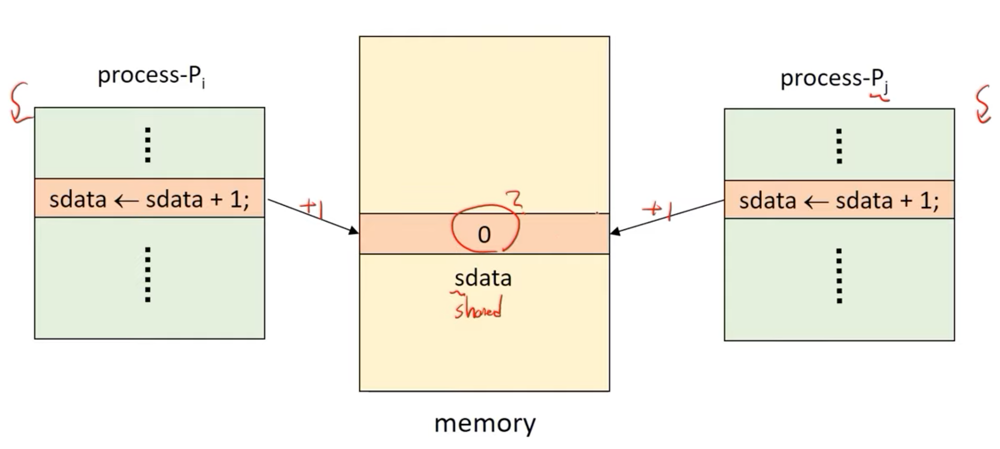

결과를 예측하기 위해서는 먼저 기계어 명령(machine instruction)을 이해해야 한다. 우리가 프로그래밍 언어로 코드를 작성하면 컴파일러는 코드를 하드웨어가 인식할 수 있는 기계어로 번역한다. 코드의 동작은 컴파일러에 의해 여러 개의 기계어 명령으로 구분된다. 예를 들어, `sdata <- sdata + 1`이라는 코드는 다음과 같은 기계어로 분리될 것이다.

1. sdata의 값을 레지스터에 로드한다.
2. 레지스터 값에 1을 더한다.
3. 레지스터의 데이터를 sdata에 저장한다.

기계어 명령의 각 단위는 수행 중간에 끊기지 않지만, 각 명령 사이에는 다른 프로세스 명령의 preemption(선점)이 발생할 수 있다.

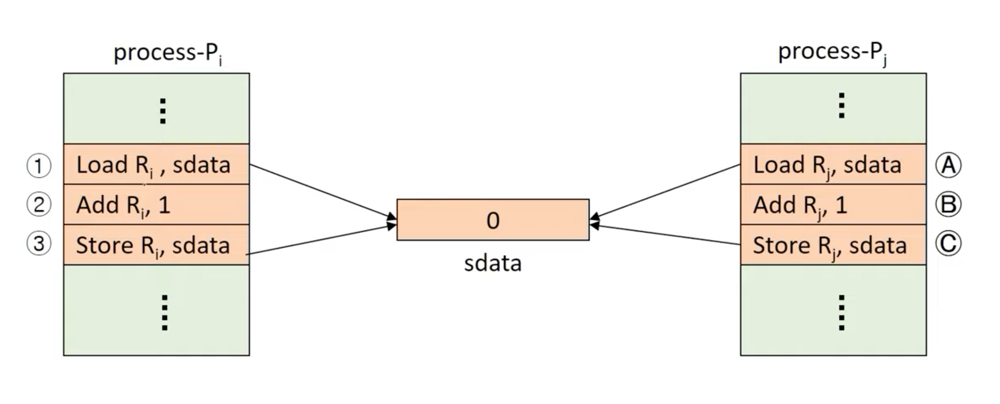

이 경우, 명령 수행 과정과 preemption 발생 위치에 따라 sdata의 결과값이 바뀐다. i 프로세스(Pi)가 모두 수행된 후에 j 프로세스(Pj)가 수행된다면 sdata는 2라는 값을 갖지만, Pi가 수행되던 중에 Pj의 선점이 발생한다면 sdata는 1의 값을 갖는다. 이렇게 명령 수행의 순서에 따라 결과값이 달라지는 것을 race condition 이라고 한다.

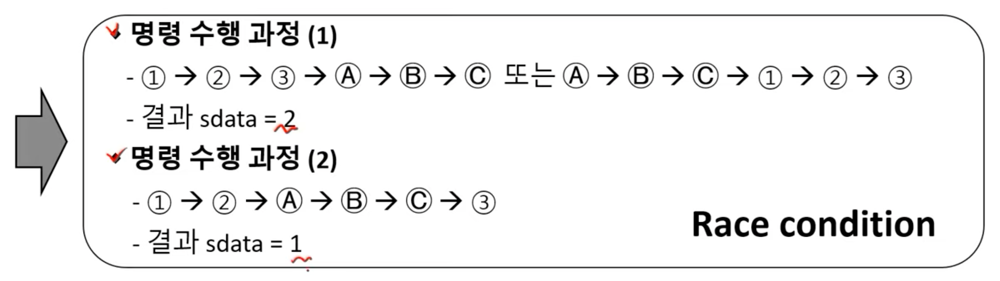

이렇게 명령의 순서에 따라 결괏값이 바뀌는 것은 컴퓨터가 원하는 것이 아니다. 따라서, 두 프로세서가 동시에 Critical Section(CS)에 접근하는 것은 바람직하지 않다.

## Mutual Exclusion (상호 배제)

Race condition을 방지하기 위해 상호 배제(mutual exclusion)라는 개념이 등장한다. 상호 배제란, 어떤 프로세스가 CS를 사용하는 동안 다른 프로세스가 CS에 진입하는 것을 막아주는 것이다.

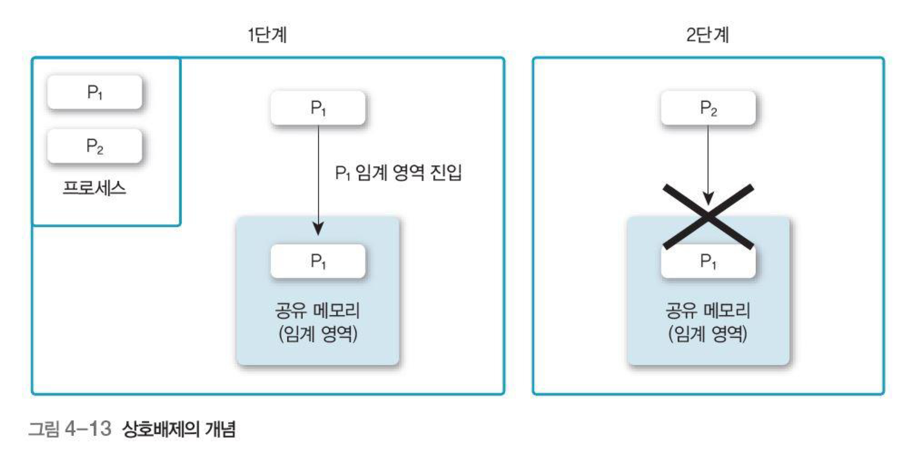

### Mutual Exclusion Methods

한 번에 한 개의 프로세스만 CS에 접근하기 위해서는 어떻게 해야 할까? 어떤 프로세스가 CS(critical section)에 접근하기 전에 CS에 다른 프로세스가 있는지 체크하고, CS를 다 썼을 때 시스템에 알려주는 간단한 컨셉을 떠올릴 수 있을 것이다.

따라서, 상호 배제의 기본 연산(primitives)은 enterCS() 연산과 exitCS() 연산으로 구성된다. enterCS()은 CS에 진입하기 전에 다른 프로세스가 CS 내에 있는지 검사하는 연산이며, exitCS()는 critical section을 벗어날 때 이를 시스템에 알려주는 연산이다.

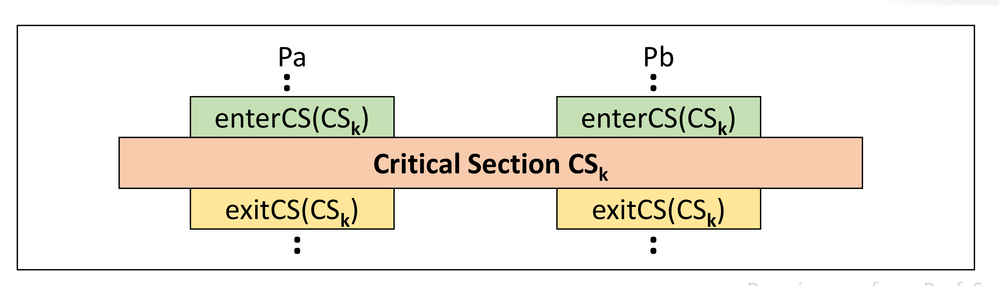

### Requirements for ME primitives

상호 배제(ME, Mutual exclusion)의 기본 연산은 다음과 같은 세 가지 조건을 만족해야만 한다.

1. Mutual exclusion(상호 배제)
  + 먼저, 각 프로세스가 상호 배제되는 것을 만족해야 한다. 즉, CS에 이미 어떤 프로세스가 있으면, 다른 프로세스의 진입을 금지해야 한다.
2. Progress(진행)
  + CS 안에 있는 프로세스 외에는, 다른 프로세스의 CS 진입을 방해해서는 안 된다. 즉, CS 안에 실행되는 프로세스가 없음에도 CS 진입을 못하는 경우가 있어서는 안 된다.
3. Bounded waiting(한정 대기)
  + 프로세스의 CS 진입은 유한 시간 내에 허용되어야 한다. 어떤 프로세스가 CS에 진입하지 못하고 무한정 기다리는 일이 있어서는 안 된다.

## Two Process Mutual Exclusion Idea

두 프로세스가 병렬 수행되는 다중 프로그래밍 시스템을 가정해 보자. 이 시스템에서 상호 배제를 구현하기 위해서는 어떤 알고리즘을 사용해야 할까?

### ME Primitives version 1

첫 번째 아이디어는 'turn'이라는 개념을 도입하는 것이다. 만약 turn이 0 값을 가지면 프로세스 0이 CS에 진입하고, turn이 1의 값을 가지면 프로세스 1이 CS에 진입한다. 각 프로세스는 CS에서 벗어날 때 상대에게 turn을 넘겨줌으로써 자신이 CS에서 벗어났음을 알린다.

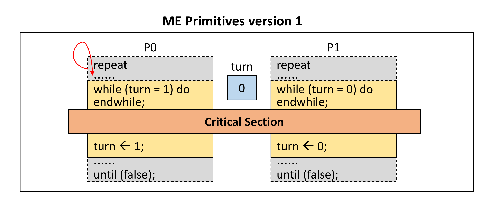

이 알고리즘은 앞서 보았던 상호 배제의 세 가지 조건을 모두 만족할까? 안타깝게도 이 아이디어는 Progress 조건을 위배한다.

먼저, 이 알고리즘은 한 프로세스가 CS에 진입하지 않는 경우 문제가 발생한다. 만약, 0번 프로세스가 CS에 진입하기 전에 어떤 이유로 종료되었다고 가정해 보자. 이 경우, 0번 프로세스가 CS에 진입하고 나오는 과정이 사라지면서 아무도 1번 프로세스에게 turn을 넘겨줄 수 없게 된다. 따라서, 1번 프로세스는 영영 CS 안으로 들어가 실행될 수 없다.

또한, 이 경우 하나의 프로세스가 두 번 연속 CS에 진입할 수 없다. 0번 프로세스가 작업을 마치고 1번 프로세스에게 turn을 넘겨줬는데, 1번 프로세스가 실행할 준비가 되지 않았다면 어떻게 될까? CS는 비었지만 0번 프로세스는 turn을 넘겨받지 못했기 때문에 계속 대기해야 하는 수밖에 없다.

이렇게 CS가 비었음에도 turn을 넘겨줄 장치가 없어서 프로세스가 CS에 진입하지 못하는 상황이 발생할 수 있으며, 이는 Progress 조건을 위배한다.

### ME Primitives version 2

두 번째 아이디어는 하나의 turn을 사용하는 대신 각 프로세스에 대한 flag를 도입하는 것이다. 각 프로세스는 CS에 진입할 때 자신의 깃발을 들고, CS에서 나갈 때 깃발을 내린다.

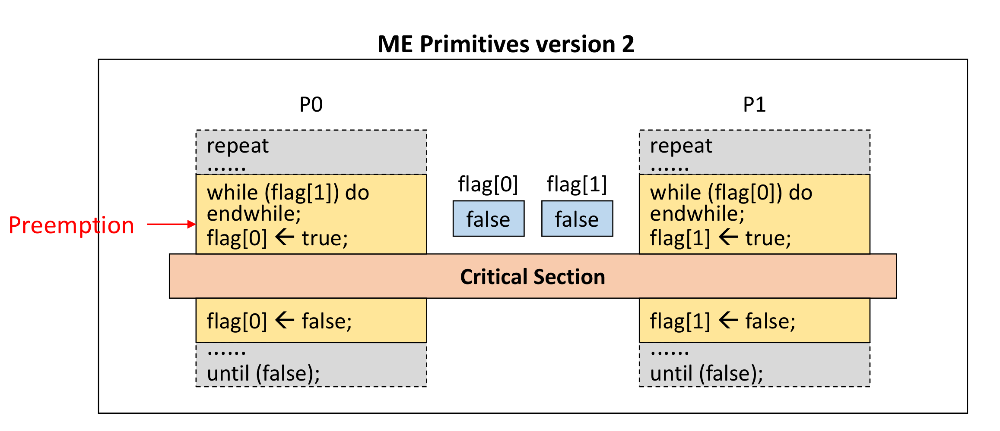

하지만, 이 경우는 Mutual exclusion 조건을 위배한다.

위 그림을 사용하여 예를 들어 보자. 0번 프로세스는 CS에 들어가기 위해 1번 프로세스의 flag를 체크했다. 1번 프로세스의 flag가 false인 것을 확인하고 CS에 진입하기로 결정했는데, 그 순간 다른 preemption이 발생해서 잠시 동작을 멈추었다고 가정 해보자.

그리고 그 사이에 1번 프로세스가 등장해서 0번 프로세스의 flag를 체크한다. 0번 프로세스는 아직 flag를 올리지는 않았으므로, 1번 프로세스는 CS에 진입할 것이다. preemption이 종료되어 다시 돌아온 0번 프로세스는 중단점부터 코드를 다시 실행하기 시작할 것이고, 하려고 했던 대로 flag를 1로 올리고 CS에 진입할 것이다. 이렇게, 0번 프로세스와 1번 프로세스 모두 CS에 진입하는 일이 발생할 수 있다.

따라서, 이 알고리즘은 preemption에 의해 상호 배제 조건을 위반하는 경우가 발생하여 적합하지 않다.

### ME Primitives version 3

그렇다면, 들어가려고 결정하자마자 flag부터 올리면 해결이 되는 건 아닐까? 다음 예시를 보자.

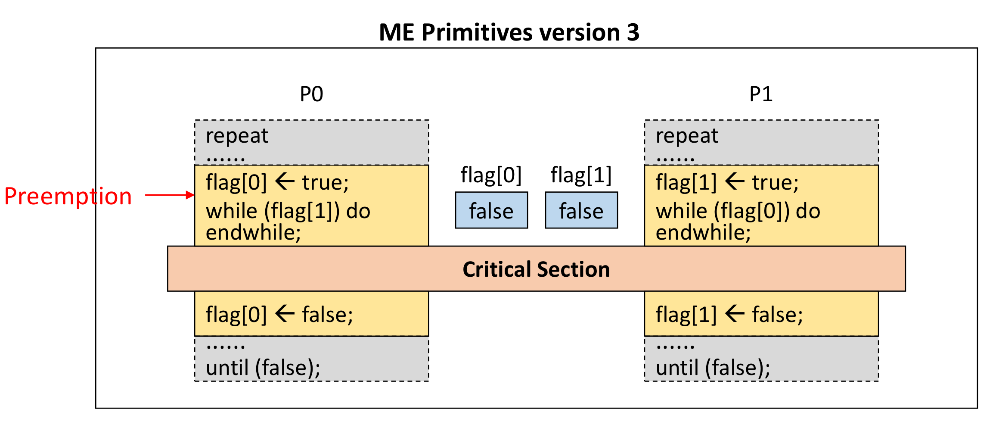

0번 프로세스가 CS에 진입하기 위해 깃발부터 들었는데, 깃발을 든 직후에 갑자기 preemption이 발생하면 어떻게 될까? 0번 프로세스는 계속 깃발을 들고 있는 상태이므로 다른 프로세스들이 CS에 진입하지 못한다. 더 안좋은 것은, 0번 프로세스가 다시 올아오더라도 다른 프로세스들 역시 깃발을 들고 대기하고 있어 0번 프로세스가 CS에 진입할 수가 없다는 것이다. 따라서, CS가 비었지만 어떠한 프로세스도 CS에 진입할 수 없는 최악의 상황이 발생한다.

이 경우는 Mutual exclusion은 해결할 수 있지만, Progress와 Bounded waiting 두 조건을 위배한다.

## Mutual Exclusive Solutions - SW

엔지니어들은 상호 배제 문제를 SW, HW, OS 등 여러 방법으로 해결했다. 먼저 SW 알고리즘을 통해 해결한 케이스를 살펴보자.

### Dekker's Algorithm

Dekker 알고리즘은 두 개의 프로세스의 상호 배제를 보장하는 최초의 알고리즘이다. 이 알고리즘은 2개의 flag와 1개의 turn을 사용하여 상호 배제를 구현했다. 프로세스는 flag를 들어 CS에 진입할 의사를 표현하고, turn은 프로세스의 차례가 왔음을 알림으로써, 상호 배제의 3가지 조건을 모두 만족한 알고리즘이다.

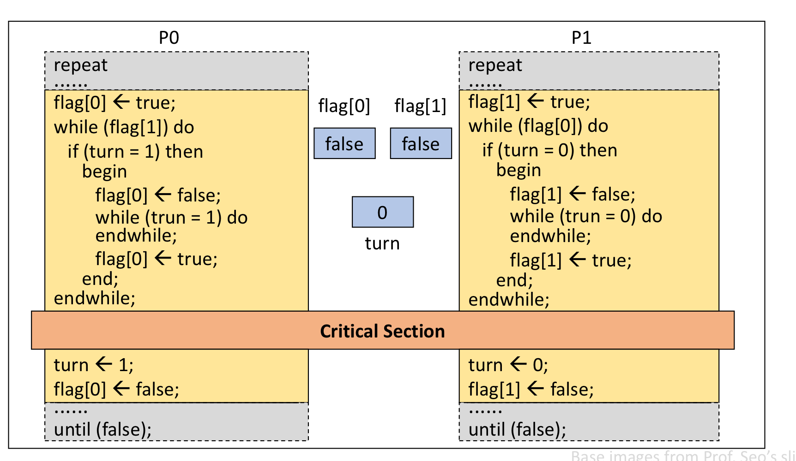

### Peterson's Algorithm

Peterson 알고리즘은 Dekker 알고리즘보다 더 간단한 알고리즘이다. flag를 드는 것은 동일하지만, turn을 기다리는 대신 서로에게 turn을 양보하는 방식을 사용한다.

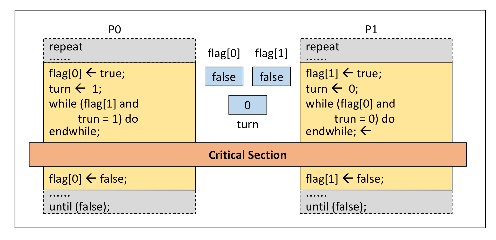

### Dijkstra Algorithm (N-Process ME)

Dijkstra 알고리즘은 N개 프로세스에서 상호 배제 문제를 해결한 최초의 알고리즘이다.

Dijkstra 알고리즘도 flag 변수를 사용하는데, 기존 알고리즘과 달리 flag는 다음과 같은 세 개의 state를 가질 수 있다.

- idle: 프로세스가 CS에 진입할 생각이 없음
- want-in: CS에 진입 1단계 (들어가고 싶다는 의사 표현)
- in-CS: CS 진입 2단계 (들어가기 직전 또는 CS 내에 있을 때)

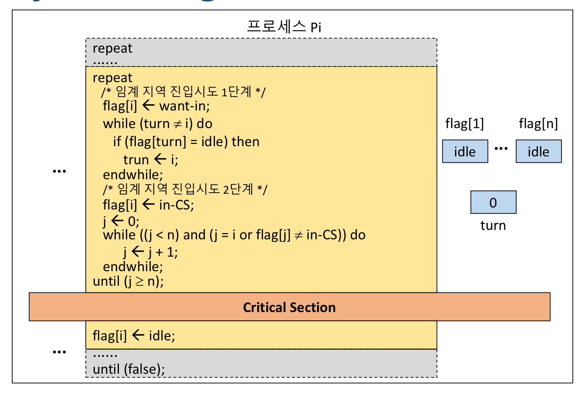

Dijkstra 알고리즘에서 프로세스는 CS에 진입하기 위해 두 개의 단계를 거친다. 1단계는 먼저 flag를 want-in 상태로 바꾸고, turn이 빌 때까지 기다리는 것이다. turn이 비었을 경우 프로세스는 진입 시도 2단계에 들어갈 수 있다.

이때 동시에 여러 프로세스가 2단계에 진입하는 일이 발생할 수 있다. 따라서, 2단계에 진입한 프로세스는 2단계에 진입한 또 다른 프로세스가 있는지 체크한다. 만약 2단계에 다른 프로세스가 존재한다면, 모든 프로세스는 1단계로 돌아가 처음부터 다시 진입을 시도한다. 만약 2단계에 단 한 개의 프로세스만 존재한다면, 해당 프로세스가 CS에 진입할 수 있다.

### SW 솔루션의 문제점

상호 배제 문제를 SW로 해결한 경우, 속도가 느리고 구현이 복잡하다는 단점이 있다. 또, 상호 배제 기본 기능을 수행하는 중에 preemption이 발생된다는 문제가 있다. 위에서 보았듯이 SW 솔루션들은 코드가 복잡한데, 복잡한 코드의 대부분은 기다림을 위한 것이다. 이렇게, 코드의 수행이 아닌, 차례를 기다리느라 바쁜 것을 busy waiting이라고 부른다.

## Mutual Exclusive Solutions - HW

다음으로는 상호 배제 문제를 HW로 해결한 솔루션을 보자. HW 측면에서는 TAS 명령어를 사용하여 상호 배제를 구현할 수 있다.

### TAS(TestAndSet) 기계어

TAS(TestAndSet)은 Test와 Set을 한 번에 수행하는 기계어다. TAS 명령어는 실행 중에 interrupt를 받지 않아 preemption이 되지 않는다는 특징을 갖는다.

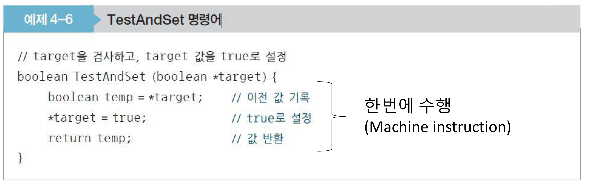

ME 문제를 해결하기 위해 사용할 TAS 함수 내부를 살펴보자. TAS 함수는 target 값을 받아 true로 설정하고, 기존에 target이 갖고 있던 값을 반환한다. 이때, 기록 및 설정 등에 필요한 모든 연산을 한 번에 수행하는 게 포인트다.

### ME with TAS instruction

TAS 명령어는 어떻게 상호 배제를 구현할 수 있을까?

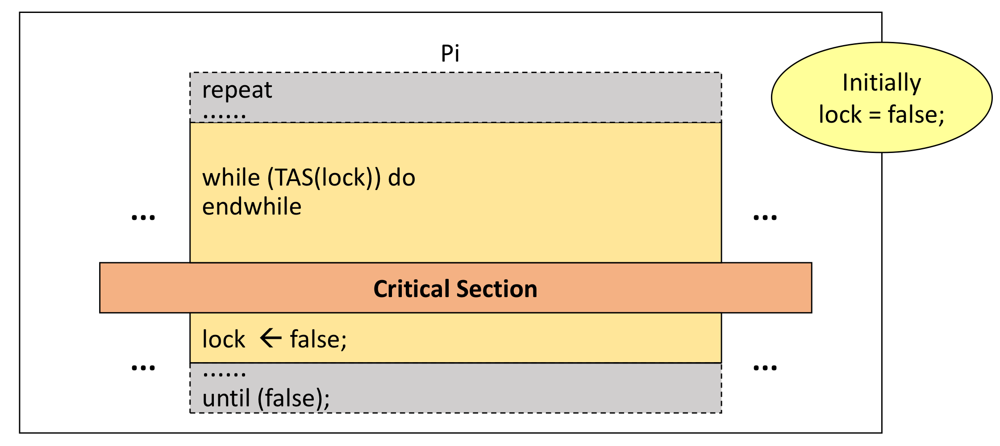

이 시스템에는 lock이라는 변수가 있는데, lock이 true일 경우 CS가 막혀 있다는 뜻이다. 따라서, lock이 false인 경우에는 프로세스가 CS에 진입할 수 있고, lock이 true인 경우 프로세스는 계속 대기하게 된다. TAS는 모든 명령어가 동시에 수행되기 때문에 preemption의 발생을 염려할 필요가 없다. TAS라는 기계어를 만듦으로써 문제가 간단히 해결되었다.

### N-Process mutual exclusion

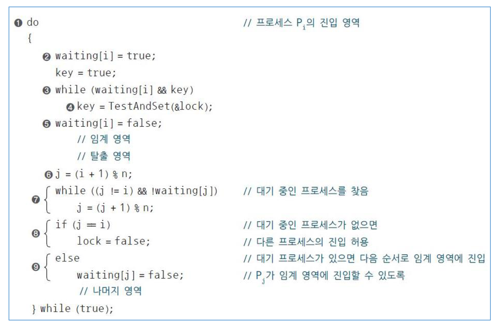

N개의 프로세스에서도 유사하게 동작한다. 먼저, 프로세스가 CS에 진입하기 위해서는 waiting 상태로 true로 바꿔 대기 중임을 알리고 lock이 풀리기를 기다린다. lock이 풀리면 waiting 상태를 풀고 CS에 진입한다.

CS에서 나올 때에는 다른 프로세스 중 대기 중인 프로세스가 있는지 확인한다. 만약 대기 중인 프로세스가 있다면 해당 프로세스의 waiting을 풀어줌으로써 임계 영역에 진입할 수 있도록 만들고, 대기 중인 프로세스가 없다면 lock을 해제하고 나온다.

### HW 솔루션의 장단점

HW 솔루션의 경우 TAS라는 기계어를 통해 문제를 간단하게 해결할 수 있다는 장점이 있다. 다만, 여전히 기다리는 데 바쁜 busy waiting 문제가 남아 있다. busy waiting 문제를 해결하기 위해 OS의 도움을 받기 시작하는데, 이것에 대해서는 다음 강의에서 계속 다뤄보자.

## Reference

- [운영체제 강의(김덕수 교수) - Lec 6.](https://youtu.be/wdaf2gy83uU)