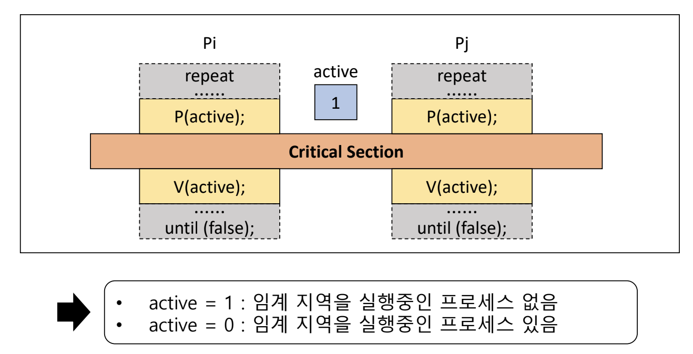

# [OS] CPA310 Lec 6. Process Synchronization and Mutual Exclusion - Part 2.

> [운영체제 강의(김덕수 교수) - Lec 6.](https://youtu.be/33OqgesF-mM)를 보고 정리한 자료입니다.

## Mutual Exclusive Solutions - OS supported SW

[지난 게시물](06_process-synchronization.md)에서 프로세스 동기화와 상호 배제 문제를 SW와 HW로 해결하는 방법에 대해 공부했다. 상호 배제 문제를 SW로 해결할 경우 preemption을 처리하기 위한 구현이 복잡하고, busy waiting 문제가 있었다. 상호 배제를 HW로 해결할 경우 구현은 간단해졌지만, 여전히 busy waiting 문제가 남았다.

busy waiting 문제를 해결하기 위해, OS가 지원하는 상호배제 솔루션이 등장하기 시작했다. OS 지원 솔루션에는 대표적으로 다음과 같은 것들이 있다. 각각에 대해 정리해 보자.

- Spinlock
- Semaphore
- Eventcount/sequencer

## Spinlock

Spinlock은 프로세스가 CS 영역에 진입할 수 있는지를 나타내는 정수형 변수다. Spinlock이 0보다 클 경우 프로세스는 CS에 진입할 수 있고, spinlock이 0일 경우 다른 프로세스가 이미 CS에 진입해 있으므로 자원을 이용할 수 없음을 뜻한다. 이 경우, 프로세스는 lock이 반환될 때까지 계속 확인하며 기다린다. 프로세스는 spinlock 변수에 직접 접근할 수는 없으며, 초기화, P(), V() 연산을 통해서만 접근할 수 있다.

Spinlock을 쉽게 이해하기 위해 열쇠에 빗대어 보자. 프로세스가 CS에 진입하기 위해서는 열쇠가 필요하며, 열쇠는 한정된 개수만큼만 존재한다. Spinlock을 나타내는 변수 S는 열쇠의 개수를 뜻한다. P() 연산은 프로세스가 열쇠를 꺼내는 행동을 의미한다. 만약 열쇠가 없다면 프로세스는 그 자리에서 열쇠가 생길 때까지 대기하고, 열쇠가 생겼을 경우 열쇠를 꺼내 CS에 진입한다. V() 연산은 열쇠를 다시 반납하는 행동을 의미한다. CS에서 작업을 끝낸 프로세스는 다시 열쇠를 반납함으로써 자신이 CS를 벗어났음을 알린다.

Spinlock의 초기화, P(), V() 연산들은 indivisible (or atomic) 연산으로, 해당 연산이 수행되는 동안 preemption가 발생하지 않음을 OS가 보장해 준다.

Spinlock을 사용하면 상호 배제 문제가 간단하게 해결된다. 프로세스는 CS에 진입할 때 Spinlock을 가져감으로써 문을 잠그고, CS에서 나올 때 Spinlock을 반납함으로써 문을 열어 둔다. OS가 도와주니 상호배제 문제가 훨씬 쉽게 해결된다.

### Spinlock 단점

Spinlock은 멀티 프로세서 시스템에서만 사용할 수 있다. 그 이유는 무엇일까?

프로세서가 한 개일 때, 프로세스 i와 프로세스 j가 있다고 가정해 보자. 프로세스 i가 먼저 CS에 진입하여 작업을 시작했는데, 작업 중에 프로세스가 중단되어 sleep 상태가 되면 어떻게 될까? 프로세스 j가 프로세서를 사용하기 시작할 것이다. 하지만 프로세스 i는 아직 열쇠(spinlock)를 반납하지 않았기 때문에, 프로세스 j는 CS 밖의 P() 함수를 실행하며 spinlock 값이 생기길 기다릴 것이다. 

그런데, Spinlock의 연산들은 preemption이 발생하지 않고 실행이 중단되지 않는다고 이야기했다. 즉, 프로세스 j가 수행하는 P() 연산은 누구에게도 방해받지 않는다. 따라서 프로세스 j가 프로세서를 계속해서 점유하게 되고, 그 사이 프로세스 i가 wake 상태가 되더라도 프로세스 i가 프로세서를 되찾아 올 방법이 없다. 따라서, 프로세스 i와 j가 각각 다른 프로세서를 동시에 점유할 수 있어야만 본 Spinlock 방법도 사용될 수 있는 것이다.

또한, Spinlock의 P() 연산에서도 알 수 있듯이, Spinlock을 사용하더라도 여전히 busy waiting 문제가 남아 있다.

## Semaphore

Semaphore는 1965년 Dijkkstra가 제안한 것으로, Semaphore를 사용하면 busy waiting 문제를 해결할 수 있다.

Semaphore는 음이 아닌 정수형 변수(S)로, 초기화 연산, P(), V() 연산으로만 접근할 수 있다. P() 연산은 열쇠를 가지고 CS에 들어가는 연산, V()는 CS에서 나와 열쇠를 반납하는 연산을 말한다. 여기까지는 spinlock와 완전히 똑같다.

Semaphore의 가장 차별화된 특징은, 임의의 S 변수 하나에 ready queue 하나가 할당된다는 점이다. 프로세스가 CS에 진입하기 위해 P() 연산을 호출하면, P() 연산은 열쇠가 남아 있는지 확인한다. 만약 열쇠가 있다면 열쇠를 꺼내 CS에 진입하겠지만, 열쇠가 없다면 프로세스는 열쇠를 기다려야 한다.

열쇠를 기다리는 과정에서 Spinlock은 while 문을 통해 열쇠의 개수를 계속 확인하며 대기했지만, Semaphore는 보다 효율적인 방식으로 대기한다. Semaphore는 while 문을 도는 대신, 일종의 대기실과 같은 ready queue에 진입하여 sleep 상태로 기다린다. CS에 있던 프로세스가 작업을 종료하고 CS 밖으로 나갈 때는 V() 연산을 거치는데, V()는 ready queue에서 기다리는 프로세스가 있는지 체크하고, 만약 있다면 해당 프로세스를 깨워 열쇠를 넘겨준다. Spinlock과 달리 Semaphore는 sleep 상태로 편하게 대기할 수 있어 busy waiting 문제가 쉽게 해결된다.

Semaphore의 모든 연산은 indivisible 연산으로, preemption이 발생하지 않고 전체가 한 명령 단위로 수행됨을 OS가 보장해 준다.

Semaphore은 그 값에 따라 Binary semaphore와 Counting semaphore로 구분된다. Binary semaphore에서 S는 0 또는 1의 값을 가지며, 상호배제 문제나 프로세스 동기화 등의 목적으로 사용된다. 반면, Counting semaphore에서는 S가 0 이상의 정수 값을 갖는다. counitng semaphore는 producer-consumer 문제 등을 해결할 수 있다.

### Semaphore로 해결 가능한 문제들

Semaphore 방법을 사용하면 상호배제 문제 외에도 다음과 같은 동기화 문제들을 해결할 수 있다.

- 프로세스 동기화 문제(Process synchronization problem)
- 생산자-소비자 문제(Producer-consumer problem)
- reader-writer 문제
- etc.

### Process Synchronization Problem

Semaphore를 사용하면 프로세스 사이의 실행 순서를 맞출 수 있다. Sync라는 변수를 사용하여 병행적이고 비동기적으로 수행되는 두 프로세스 사이의 실행 순서를 결정한다.

예를 들어, 프로세스 i는 반드시 프로세스 j가 특정 지점을 지난 후에 실행되어야 한다고 가정해 보자. Semaphore를 사용하면, 프로세스 i는 sync에 값이 있을 때만 실행되고, 그렇지 않을 경우 ready queue에서 대기하도록 만들 수 있다. 프로세스 j가 원하는 지점을 통과하면, sync에 값을 입력해 주고 ready queue에 있는 프로세스 i를 호출함으로써 프로세스의 순서를 정한다.

### Producer-Consumer Problem

생산자-소비자 문제는 데이터를 생성하는 프로세스와 데이터를 전달받는 프로세스 사이의 순서를 결정하는 문제이다. Producer(생산자)는 메시지를 생성하는 프로세스 그룹을 의미하고, Consumer(소비자)는 메시지를 전달받는 프로세스 그룹을 의미한다. 생산자와 소비자 사이에는 buffer가 존재하는데, buffer는 일종의 CS로 생산자와 소비자가 사이에서 메시지를 임시 보관하는 역할을 한다.

#### Reader-Writer problem

Reader-Writer 문제는 읽는 연산과 쓰는 연산 사이의 순서를 결정하는 역할을 한다. Reader는 읽기 연산만 수행하는 프로세스, Writer는 데이터를 갱신하는 연산을 수행하는 프로세스다.

Reader는 읽기만 하기 때문에 여러 reader 프로세스가 동시에 데이터에 접근할 수 있다. 하지만, writer는 서로 동시에 데이터에 접근할 수 없으며, reader가 읽고 있을 때 writer가 접근하는 것도 금지된다. reader들은 데이터에 동시에 접근할 수 있으나, writer와 writer, 그리고 reader와 writer 사이에는 상호배제가 필요하다.

reader와 writer 중 누구에게 우선권을 부여할 것인지에 따라 문제 해결 방법이 달라진다. 그중 reader-preference solution은 reader가 읽는 것을 우선으로 생각하는 해결 방법이다.

### Semaphore의 특징

Semaphore의 가장 큰 특징은 busy waiting 문제가 없다는 것이다. Semaphore은 ready queue라는 일종의 대기실을 갖기 때문에, while 문을 실행하며 기다릴 필요가 없다. 프로세스는 sleep 상태로 대기할 수 있다.

하지만, semaphore의 ready queue에 대한 wake-up 순서는 비결정적이다. V() 연산은 ready queue에 있는 임의의 연산을 깨우게 되며, 운이 없는 프로세스는 계속 실행되지 않을 수도 있다. 즉, starvation 현상이 발생할 수 있다.

ready queue에 들어온 순서대로 작업을 처리해 주면 starvation 현상을 해결할 수 있는데, 그것이 eventcount/sequencer 방법론이다.

## Eventcount / Sequencer

Eventcount/sequencer는 은행의 번호표와 비슷한 개념이다. 

Sequencer는 번호표를 뽑는 기계와 같다. 처음에는 0으로 초기화되어 있고, 작업이 수행될수록 번호가 증가하며, 한 번 증가한 숫자는 다시 감소하지는 않는다. Sequencer 값은 ticket()이라는 연산으로만 접근할 수 있는데, ticket은 번호표를 뽑는 연산이라고 이해할 수 있다. 즉, ticker(S)는 현재까지 ticket() 연산이 호출된 횟수를 반환한다.

Eventcount는 몇 명이나 호출했는지를 나타내는 값으로, 은행에서 순서가 되었음을 알려주는 숫자판과 같다. 특정 사건의 발생 횟수를 기록하는 값이며, 이 값도 줄어들지 않고 계속 증가한다. Eventcount는 read(E), advanced(E), await(E, V) 연산으로만 접근할 수 있다.

- read(E): 현재 eventcount값을 반환한다.
- advanced(E): Eventcount 번호를 증가시키는 연산이다. E 번호가 증가되면, 증가된 번호를 기다리고 있는 프로세스를 깨운다.
- await(E, v): V는 정수형 변수로, 내가 발급받은 번호표라고 생각하면 된다. await 연산은 E < v 일 경우 대기하게 만드는 연산이다. 쉽게 말해, Eventcount(전광판) 번호가 아직 v(내 번호표)에 도달하지 않은 경우, E에 연결된 Qe(대기실)에 프로세스를 전달하여 대기시키는 것이다.

### Mutual Exclusion

Eventcount/Sequencer 방법으로 상호 배제 문제를 풀어보자. 프로세스가 실행되면 먼저 ticket을 발급받고, await 연산을 통해 대기하거나 CS에 진입한다. CS에서 나올 때는 Eventcount를 한 칸 증가시키고 다음 대기자를 호출한다. 프로세스는 대기실에 입장한 순서대로 호출되기 때문에, starvation 문제를 해결할 수 있다.

### Eventcount / Sequencer 특징

Eventcount/Sequencer 솔루션은 busy waiting 문제가 없고, FIFO 구조를 가지므로 starvation 문제도 없다. 또한, 프로세스 실행 순서를 컨트롤할 수 있게 되면서 semaphore보다 더 low-level control이 가능해졌다.

## Reference

- [운영체제 강의(김덕수 교수) - Lec 6.](https://youtu.be/33OqgesF-mM)