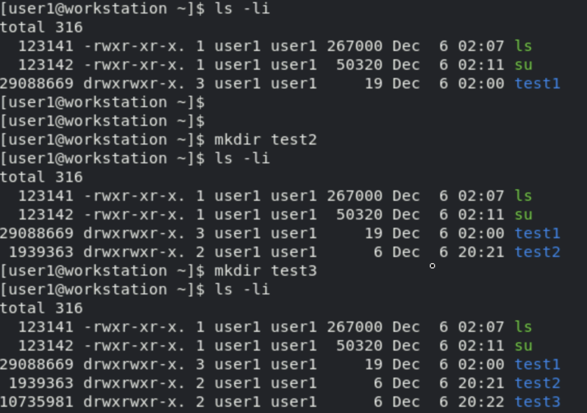
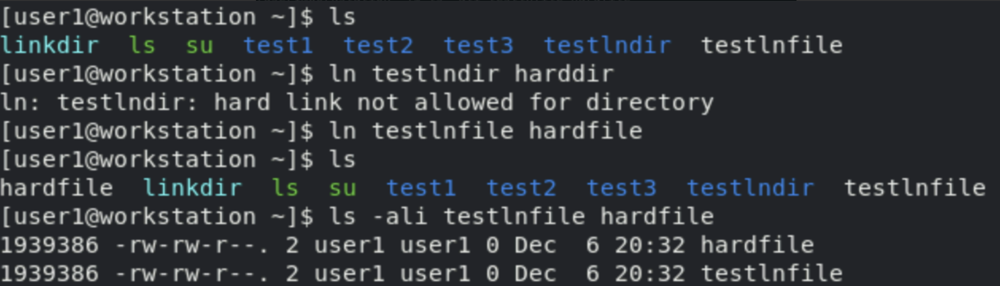
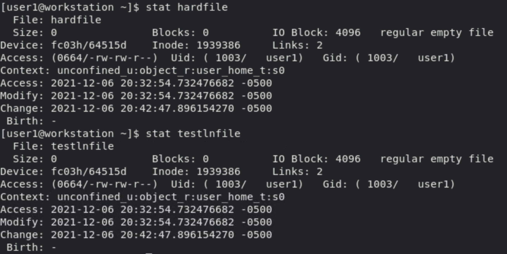
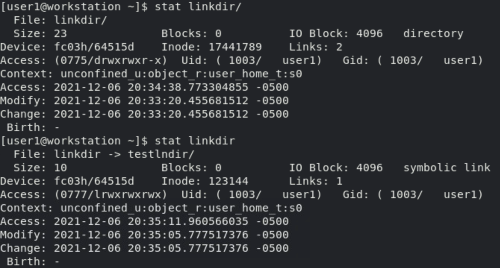

# #2 Linux File System

## 파일 시스템 계층 구조

- Linux 시스템의 모든 파일은 Tree 계층 구조의 파일 시스템 내에 저장된다. 


- RHEL에서 주요 디렉터리는 다음과 같은 표로 정리된다.


- RHEL 7 이후 버전에서 다음 4개의 디렉터리는 /usr 내에 있는 상응하는 디렉터리와 동일한 내용이 포함된다.

    + /bin 과 /usr/bin
    + /sbin 과 /usr/sbin
    + /lib 과 /usr/lib
    + /lib64 와 /usr/lib64

- 데이터를 백업한다면 /usr, /etc, /var 정도만 백업하면 된다. 다른 폴더들은 이미 /usr 내에 존재하거나 혹은 OS 재설치하면 복구가 되는 부분이라 굳이 백업하지 않아도 된다.

## Command Line 도구를 사용한 파일 관리

- 파일을 관리하기 위한 주요 명령어에 대해 알아보자.

### mkdir

- directory를 생성하는 명령어

    ```bash
    mkdir <dir>      # dir 생성
    mkdir -p <dir>   # 상위 dir가 없으면 상위 dir까지 생성
    ```

### cp

- 파일을 복사하는 명령어
- 이미 동일한 이름의 파일이 존재한다면, cp 명령어는 해당 파일을 덮어쓴다.

    ```bash
    cp <file> <dir>         # file을 dir으로 복사
    cp <file1> <file2>      # file1의 파일명을 file2로 수정
    cp -a <file> <dir>      # permission, filetime 및 data 그대로 복사
                            # -a 옵션은 오래 걸리므로 가급적 사용하지 말자.
    cp -r/-R <file> <dir>   # 하위 dir까지 재귀적으로 복사
                            # 메모리 사용률이 높거나 live 중에는 가급적 사용하지 말자.
    cp -p <file> <dir>      # 소유권 및 접근 권한 그대로 복사
    cp -v <file> <dir>      # 복사시 표준 입출력 및 오류 출력
    ```

- 한 가지를 습관적으로 사용한다면 -a 대신 -rp 옵션을 사용하라.

### rm

- 파일 혹은 디렉터리를 제거하는 명령어

    ```bash
    rm <file>       # file 제거
    rm <dir>        # dir 제거
    rm -r <dir>     # 하위 dir까지 재귀적으로 제거
    rm -f <dir>     # 강제로 삭제
    ```

### rmdir

- rmdir는 디렉터리를 제거하는 명령어지만, 빈 디렉터리만 제거할 수 있다. 
- 디렉터리가 비어있지 않을 경우 rm으로 제거할 수 있으나, rmdir는 폴더 삭제 시 점검용으로 사용하면 좋다.

### mv

- 파일 및 디렉터리를 이동시키는 명령어

    ```bash
    mv <file> <dir>  # file을 dir로 이동
    ```

### cd

- 현재 위치한 디렉터리를 이동하는 명령어
  
    ```bash
    cd          # 여백인 경우 home dir으로 이동
    cd ..       # 상위 dir로 이동
    cd ~        # home dir로 이동
    cd -        # 앞뒤로 이동
    cd .<NAME>  # 숨겨진 dir로 이동
    ```

### touch

- 비어있는 파일을 생성하는 명령어

```bash
touch testfile.md
```

### ln

- 링크를 생성하는 명령어

    ```bash
    ln    # 하드 링크 (inode 비소모, 같은 디스크에서만 사용 가능)
    ln -s # 심볼릭 링크 (inode 소모)
    ```

### file

- 파일의 정보를 확인하는 명령어

    ```bash
    file <file>  # 파일 정보 확인
    ```

### date

- 현재 시각을 출력하는 명령어

### time

- 특정 명령어의 수행 시간을 측정하는 명령어

    ```bash
    time ls : ls를 실행하는 데 걸리는 시간
    ```

- time 명령어의 결과는 real, user, sys 세 가지 버전으로 출력되며, 각 항목은 다음과 같다.
    + real: 명령어가 시작할 때부터 끝날 때까지의 시간
    + user: CPU가 커널 밖 코드 영역에 머물렀던 시간
    + sys: CPU가 커널에 머물렀던 시간

### stat

- 리눅스 시스템에서는 파일의 상태를 구조체 stat으로 정의한다.

- 구조체 stat에는 파일의 타입과 퍼미션, inode 번호와 장치 번호, 사용자 정보 및 파일 접근 시각과 블록 정보를 갖고 있다. 이러한 정보를 확인하고자 할 때 사용하는 시스템 호출에는 stat, fstat, lstat 등이 있습니다.

- `stat` 명령어로 알 수 있는 대략적인 정보는 다음과 같다.

  + **Inode :** inode(아이노드) 번호
  + **Uid, Gid :** 소유자 및 그룹의 이름과 UID 및 GID
  + **Links :** 링크된 파일의 수
  + **Context :** 보안 정책(SELinux Policy) 정보
  + **Access(상단) :** 권한 정보
  + **Access(하단) :** 접근 시각(atime) 정보
  + **Modify :** 수정 시각(mtime) 정보
  + **Change :** 변경 시각(ctime) 정보

## 파일 사이에 링크 만들기

### 파일 시스템 구조

링크를 이해하기 위해 먼저 inode 방식의 파일 시스템 구조에 대해 알아보자. 파일 시스템의 기본 구조는 Super block, Data block, 그리고 inode block으로 구성된다.

- Super block(S/B)는 system block이라고도 불리며, 파일 시스템 정보가 저장되는 블록이다. 디렉토리, permission 정보 등 중요한 메타 데이터들이 Super block에 저장되며, 전체 파일 시스템의 약 3~5% 를 차지한다.

- Data block은 실제 데이터가 저장되는 공간이다. 파일을 생성하거나 복사하면 데이터는 Data block에 저장된다.

- Inode block은 파일의 위치 및 상세 정보를 저장하는 공간이다. 데이터가 block 내 어느 위치에 저장되어 있는지 알고 있으며, Super block의 메타 데이터는 이 inode 정보를 가리킴으로써 실제 데이터에 접근할 수 있다.

    + stat 또는 ls -i 명령어를 사용하면 파일의 inode 정보를 확인할 수 있다.

        ```bash
        ls -li
        ```

    + 새로운 파일 또는 디렉터리를 생성할 경우, inode를 랜덤하게 할당 받는다. inode를 순차적으로 할당하는 것은 아니다.
    
        

- Journal은 파일 시스템에서 사용하는 일종의 바이러니 데이터베이스다. ls 등의 명령어를 사용하면 시스템은 파일 시스템 전체가 아닌 이 journal 데이터베이스의 정보를 읽어온다. 따라서, journal이 깨지면 다른 파일에 접근이 불가능하다.

### 파일 사이의 링크 관리

- 파일 시스템에서 동일한 파일을 가리키는 여러 이름을 만들 수 있으며, 이를 링크를 만든다고 이야기한다. 링크는 파일을 복사하는 것과는 다르다. 파일 복사는 동일한 파일을 data block에 하나 더 생성하는 것이지만, 파일 링크는 기존에 data block에 이미 존재하는 파일에 메타 데이터를 하나 더 연결하는 것 뿐이다. Windows에 있는 '파일 바로가기'를 생각하면 된다.

- 파일 링크에는 두 가지 종류가 있으며, 각각은 하드 링크와 소프트 링크(또는 심볼릭 링크)다. 

- 링크는 ln 이라는 명령어를 사용하여 생성할 수 있다.

    ```bash
    ln    # 하드 링크를 만드는 명령어
    ln -s # 심볼릭(소프트) 링크를 만드는 명령어
    ```

### 하드 링크 관리

- 모든 파일은 단일 하드 링크로 시작한다.

- 하드 링크는 inode를 새로 생성하지 않고, 기존 파일의 inode에 새로운 메타 데이터만 추가로 연결하는 링크 방식이다. 즉, 하드 링크로 생성한 파일은 원본 파일과 동일한 inode를 갖는다.

```bash
    S/B[
	# Meta1: Original, Meta2: Hard Link
	Meta1  ------.
	              > ---> inode ---> DATA
	Meta2  ------'
    ]
```

- 동일한 파일을 참조하는 모든 하드 링크는 링크 수, 엑세스 권한, 사용자 및 그룹 소유권, 타임스탬프 등의 파일 내용을 동일하게 갖는다. 한 하드 링크를 사용하여 데이터의 정보를 변경하면, 동일한 파일을 가리키는 나머지 모든 하드 링크도 역시 새로운 정보를 표시하게 된다. 이는 각 하드 링크가 같은 데이터를 가리키고 있기 때문이다.

- 하드 링크에서는 원본 파일이 삭제되더라도, 다른 하드 링크가 존재하는 하나 그 파일의 내용을 보 수 있다. 마지막 하드 링크가 삭제되는 경우에만 스토리지에서 데이터가 삭제된다.

- 다만, 하드 링크는 링크된 파일 사이에 메타 데이터가 공유되어야 한다는 특징 때문에, 같은 디스크 파티션 영역에서만 사용이 가능하다.

- 하드 링크는 일반 파일에만 사용이 가능하다. 디렉터리나 특수 파일은 하드 링크를 사용할 수 없다.

- ln 명령어를 사용하여 하드 링크를 만들어보자.

    + 하드 링크를 만들면 다음과 같이 inode가 동일하게 생성되는 것을 확인할 수 있다.

        

    + 링크된 파일의 stat을 찍어보면 다음과 같은 결과를 얻을 수 있다.
      * link 의 의미는 superblock에 있는 Meta - link 연결 개수
      * link 걸려 있는 파일이 어디에 있는지는 알 수가 없다.
  
        
    
### 소프트(심볼릭) 링크 관리

- 소프트 링크는 inode를 하나 더 소모하면서 파일에 링크하는 방식이다. 특정 파일 또는 디렉터리에 소프트 링크를 생성하면 새로운 메타 데이터에 새로운 inode가 연결되고, 해당 inode가 DATA를 가리킨다.

```bash
    S/B[
	# Meta1: Original, Meta2: Soft Link
	Meta1 ---> inode1 ---.
	                      >---> DATA
	Meta2 ---> inode2 ---'
    ]
```

- 소프트 링크는 서로 다른 파일 시스템에 이는 두 개의 파일을 연결할 수 있으며, 일반 파일이 아닌 특수 파일이나 디렉터리를 연결하는 것도 가능하다.

- 새롭게 생긴 soft link의 inode는 원본 데이터를 참조하는 것일 뿐, 완벽하게 복제가 되는 것은 아니다. 따라서, 원본이 사라지면 복제본도 올바르게 수행이 되지 않는다.

- 하지만 주의해야할 점이 하나 있는데, 만약 원본을 삭제한 후에 원본과 동일한 이름으로 나중에 새 파일을 만드는 경우, 소프트 링크는 새 파일을 가리키게 된다. (하드 링크는 이렇게 작동하지 않는다.)

- ln -s 명령어를 사용하여 소프트 링크를 만들어보자.

    + testlindir에 소프트 링크가 연결 된 linkdir 를 만들어 보자.

        ```bash
        ln -s testlindir linkdir
        ```

    + linkdir 의 상태를 확인해보면 testlindir의 soft(symbolic) link로 나오는 것을 볼 수 있다.

        

    - 주의: linkdir 뒤에  /가 붙어있으면 linux는 기본적으로 그것을 dir라고  인식한다. 위의 예시에서 linkdir/ 의 stat이 soft link가 아닌 directory로 나오는 이유가 그것이다.

