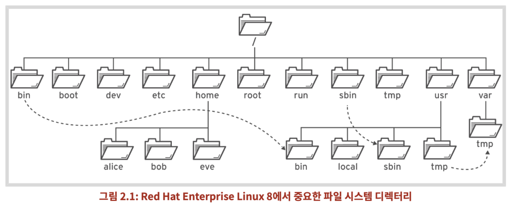
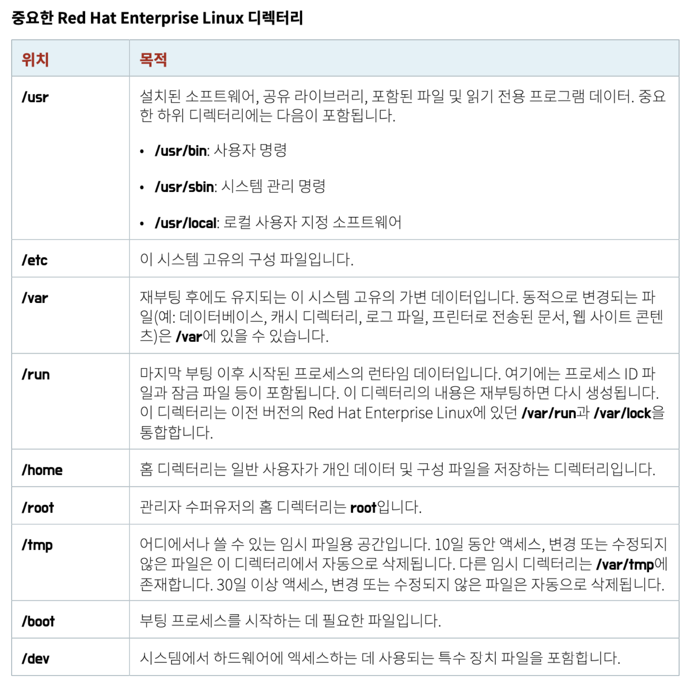

# #2 Linux File System

## 파일 시스템 계층 구조

- Linux 시스템의 모든 파일은 Tree 계층 구조의 파일 시스템 내에 저장된다. 



- RHEL에서 주요 디렉터리는 다음과 같은 표로 정리된다.



- RHEL 7 이후 버전에서 다음 4개의 디렉터리는 /usr 내에 있는 상응하는 디렉터리와 동일한 내용이 포함된다.

    + /bin 과 /usr/bin
    + /sbin 과 /usr/sbin
    + /lib 과 /usr/lib
    + /lib64 와 /usr/lib64

- 데이터를 백업한다면 /usr, /etc, /var 정도만 백업하면 된다. 다른 폴더들은 이미 /usr 내에 존재하거나 혹은 OS 재설치하면 복구가 되는 부분이라 굳이 백업하지 않아도 된다.

## Command Line 도구를 사용한 파일 관리

- 파일을 관리하기 위한 주요 명령어에 대해 알아보자.

### mkdir

- directory를 생성하는 명령어

    ```bash
    mkdir <dir>      # dir 생성
    mkdir -p <dir>   # 상위 dir가 없으면 상위 dir까지 생성
    ```

### cp

- 파일을 복사하는 명령어
- 이미 동일한 이름의 파일이 존재한다면, cp 명령어는 해당 파일을 덮어쓴다.

    ```bash
    cp <file> <dir>         # file을 dir으로 복사
    cp <file1> <file2>      # file1의 파일명을 file2로 수정
    cp -a <file> <dir>      # permission, filetime 및 data 그대로 복사
                            # -a 옵션은 오래 걸리므로 가급적 사용하지 말자.
    cp -r/-R <file> <dir>   # 하위 dir까지 재귀적으로 복사
                            # 메모리 사용률이 높거나 live 중에는 가급적 사용하지 말자.
    cp -p <file> <dir>      # 소유권 및 접근 권한 그대로 복사
    cp -v <file> <dir>      # 복사시 표준 입출력 및 오류 출력
    ```

- 한 가지를 습관적으로 사용한다면 -a 대신 -rp 옵션을 사용하라.

### rm

- 파일 혹은 디렉토리를 제거하는 명령어

    ```bash
    rm <file>       # file 제거
    rm <dir>        # dir 제거
    rm -r <dir>     # 하위 dir까지 재귀적으로 제거
    rm -f <dir>     # 강제로 삭제
    ```

### rmdir

- rmdir는 디렉토리를 제거하는 명령어지만, 빈 디렉토리만 제거할 수 있다. 
- 디렉토리가 비어있지 않을 경우 rm으로 제거할 수 있으나, rmdir는 폴더 삭제 시 점검용으로 사용하면 좋다.

### mv

- 파일 및 디렉터리를 이동시키는 명령어

    ```bash
    mv <file> <dir>  # file을 dir로 이동
    ```

### cd

- 현재 위치한 디렉토리를 이동하는 명령어
  
    ```bash
    cd          # 여백인 경우 home dir으로 이동
    cd ..       # 상위 dir로 이동
    cd ~        # home dir로 이동
    cd -        # 앞뒤로 이동
    cd .<NAME>  # 숨겨진 dir로 이동
    ```

### touch

- 비어있는 파일을 생성하는 명령어

```bash
touch testfile.md
```

### ln

- 링크를 생성하는 명령어

    ```bash
    ln    # 하드 링크 (inode 비소모, 같은 디스크에서만 사용 가능)
    ln -s # 심볼릭 링크 (inode 소모)
    ```

### file

- 파일의 정보를 확인하는 명령어

    ```bash
    file <file>  # 파일 정보 확인
    ```

### date

- 현재 시각을 출력하는 명령어

### time

- 특정 명령어의 수행 시간을 측정하는 명령어

    ```bash
    time ls : ls를 실행하는 데 걸리는 시간
    ```

- time 명령어의 결과는 real, user, sys 세 가지 버전으로 출력되며, 각 항목은 다음과 같다.
    + real: 명령어가 시작할 때부터 끝날 때까지의 시간
    + user: CPU가 커널 밖 코드 영역에 머물렀더 시간
    + sys: CPU가 커널에 머물렀던 시간
