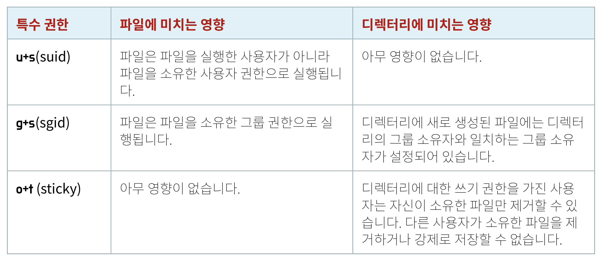

# #4 File System Permission

## 파일 및 디렉터리 권한 변경

### 심볼릭 방법을 사용하여 권한 변경

- chmod: 명령 중에서 권한을 변경하는 데 사용하는 명령 (change mode)

    ```bash
    chmod WhoWhatWhich file|directory
    ```
    
    + Who: u (user), g(group), o(others), a(all)
    + What: +(추가), -(제거), =(정확히 설정)
    + Which: r(읽기), w(쓰기), x(실행)

    ```bash
    $ chmod go-rw file1     # 그룹 및 기타에서 일기, 쓰기 권한 제거 
    $ chmod a+x file2       # 모든 사람이 사용할 수 있는 실행 권한 추가
    ```

### 숫자 방법을 사용하여 권한 변경

- 추가하려는 각 권한에 대해 숫자를 사용하여 계산할 수 있다. 4는 읽기, 2는 쓰기, 1은 읽기 권한을 의미한다. 따라서, 각 권한을 0-7 사이의 단일 값으로 표현될 수 있다.

- 예를 들어, -rwxr-x---를 예로 들면, 사용자는 rwx = 7, 그룹은 r-x = 5, 다른 사용자는 --- = 0으로, 이 권한은 750으로 표현될 수 있다.

    ```bash
    $ chmod 750 sampledir     # u=rwx,g=rx,o= 과 동일한 표현
    ```

## 사용자 또는 그룹 소유권 변경

- 파일을 새로 생성하면, 기본적으로 새 파일의 소유권은 생성하는 사용자가, 그리고 그룹 소유권은 사용자의 기본 그룹으로 설정된다. RHEL에서 사용자의 기본그룹은 일반적으로 멤버가 해당 사용자뿐인 개인 그룹이다.

- 파일의 소유권은 root만 변경할 수 있으며, 그룹 소유권은 root 또는 파일 소유자가 설정할 수 있다.

- chown: 파일 소유권을 변경하는 명령어 (change owner)

    ```bash
    # root 계정
    chown user:group <filename>
    chown user
    chown :group 
    chown user.          # user+group 둘 다 변경됨, BSD에서는 사용이 불가능
    chown .group         # BSD에서는 사용이 불가능
    ```

    + chown -R 옵션을 사용할 경우 전체 티렉터리 트리의 소유권을 순환적으로 변경할 수 있다.

        ```bash
        # root 계정
        chown -R student test_dir
        ```

- chgrp: 파일의 그룹 소유권을 변경하는 명령어 (change group)
  
## 기본 권한 및 파일 액세스 관리

### 특수 권한

- 기본적인 rwx 권한 외에 u+s, g+s, o+t 등의 특수 권한을 나타내는 표현들이 있다. 이러한 권한은 기본 권한에서 허용하는 기능 외에 추가 엑세스 기능을 제공한다.

    

- ```u+s```는 user 그룹에 setuid 권한을 주는 것으로, 파일을 실행할 때 파일 소유자의 권한으로 실행할 수 있는 특수 권한이다. setuid 권한이 있는지 확인하기 위해서는 사용자 권한의 x 위치에 s가 있는지 확인하면 된다.

    ```bash
    $ ls -l /usr/bin/paswd
    -rwsr-xr-x. 1 root root 35504 Jul 16 2010 /usr/bin/passwd
    ```

- ```g+s```는 group에 setgid 권한을 주는 것이다. 디렉터리에 setgid 권한을 부여하면, 디렉터리 내부에 생성되는 파일의 그룹 소유자는 디렉터리의 그룹 소유자와 일치한다. setgid 권한이 있는지 확인하기 위해서는 그룹 권한의 x 위치에 s가 있는지 확인하면 된다.

    ```bash
    $ ls -ld /run/log/journal
    drwsr-sr-x. 3 root systemd-journal 60 May 18 09:15 /run/log/journal
    ```

    + 또한, setgid는 setuid와 유사하게 파일을 소유한 그룹의 권한으로 파일을 실행한다.

- ```o+t``는 파일 삭제에 특별한 제한을 설정하는 것이다. sticky 권한을 가질 경우 파일 소유자 및 root 계정만 디렉터리 내의 파일을 삭제할 수 있다. sticky 권한이 있는지 확인하기 위해서는 기타 사용자 권한의 x 위치에 t가 있는지 확인하면 된다.

- 특수 권한은 다음과 같이 심볼릭 또는 숫자로도 나타낼 수 있다.

    + setuid: u+s 또는 4
    + setgid: g+s 또는 2
    + sticky: o+t 또는 1

    ```bash
    # root 계정
    chmod g+s directory      # directory에 setgid
    chmod 2770 directory     # directory에 setgid & 일반 mode=770
    ```
  
### 기본 파일 권한

- 기본적으로 linux에서는 새로운 디렉터리를 만들면 0777 (drwxrwxrwx) 권한이 할당 되고, 새로운 파일을 만나면 0666 (-rw-rw-rw-) 권한이 할당 된다.

- 만약 초기에 설정된 기본 사용 권한을 추가로 제한하고 싶다면, umask를 설정하면 된다. 이는 프로세스에서 새 파일과 디렉터리의 권한을 제거하는 데 사용하는 8bit 마스크다. umask에 특정 bit가 설정된 경우, 새 파일이나 디렉터리는 해당 권한을 제거한다.

    + 예를 들어, umask = 0002는 기타 사용자의 쓰기 비트를 지운다.
    + umask = 0077은 새로 생성된 파일의 모든 그룹 및 기타 권한을 제거한다.

- shell에 umask 명령어를 입력할 경우 현재 shell의 umask 값이 표시된다.

    ```bash
    $ umask
    0002          # 현재 shell의 umask = 0002
    ```

- 사용자 shell의 umask 값을 바꾸고자 할 경우 다음 방법을 사용할 수 있다.

    + shell에서 umask 명령어를 사용하는 경우

        ```bash
        $ umask 007     # shell의 기본 umask 값을 007으로 설정
        ```

    + shell의 기본 umask 값은 /etc/profile 및 /etc/bashrc 파일에 정의되어 있다. 사용자는 home 디렉터리에 있는 .bash_profile 또는 .bashrc 파일을 수정하여 기본 umask 값을 정의할 수 있다.

        ```bash
        $ echo "umask 007" > /.bashrc
        ```

- 만약 모든 사용자의 umask 값을 변경하고 싶다면, root 계정으로 /etc/profile.d/local-umask.sh 라는 쉘 시작 스크립트를 추가하여 umask를 설정할 수 있다.

    ```bash
    [root@host ~]# cat /etc/profile.d/local-umask.sh
    # Overrides default umask configuration
    if [ $UID -gt 199 ] && [ "`id -gn`" = "`id -un`" ]; then
        umask 007
    else
        umask 022
    fi
    ```
