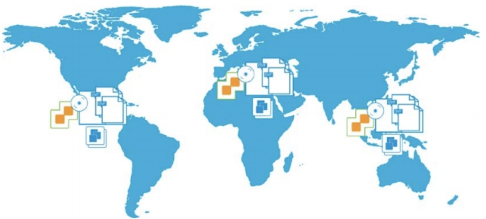
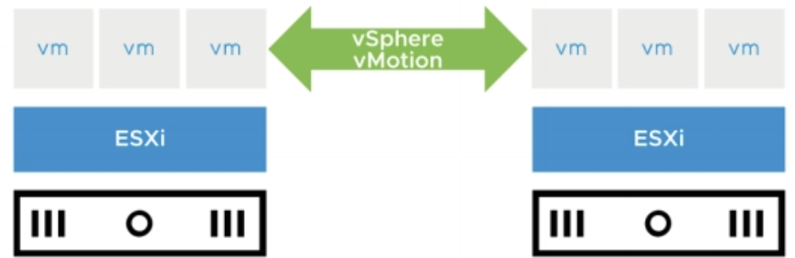
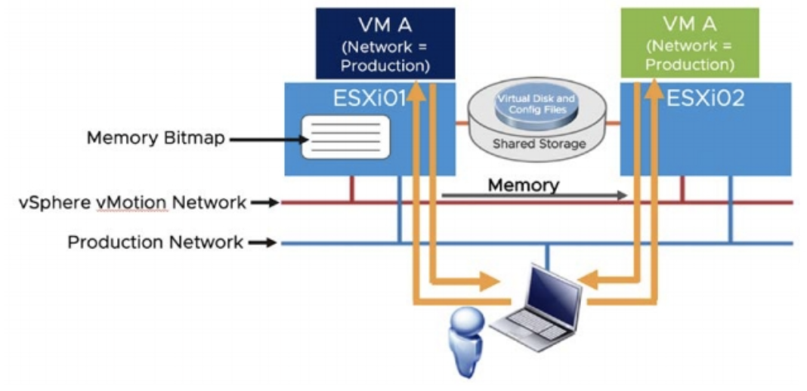
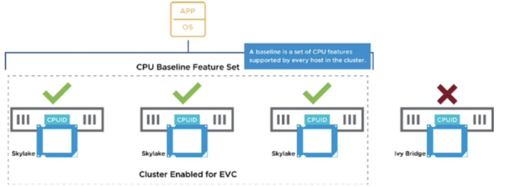
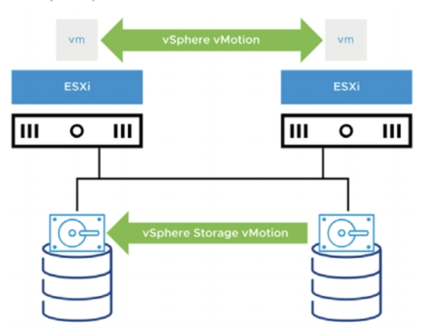

# 7-1. Managing Virtual Machines

> vSphere Install, Configure, Manage [V7] Lecture Note  
> Module 7. Managing Virtual Machines

## VM Template

VM 템플릿이란 VM의 복사본이다. 새로운 VM을 생성하거나 프로비저닝할 때 템플릿을 사용하면 훨씬 빠르게 작업할 수 있다.

템플릿은 다음과 같은 요소들을 포함한다.
- guest OS
- 하나 이상의 애플리케이션
- 특정한 VM 구성
- VMware Tools

템플릿은 다음과 같은 방법으로 생성할 수 있다.
- 기존의 VM을 템플릿으로 복제: VM 전원 on/off 여부와는 관계 없다.
- 기존 VM을 템플리승로 변경: VM이 반드시 꺼져있어야 한다.
- 기존 템플릿을 복제

## Content Libraries

컨텐츠 라이브러리는 VM 및 vApp 템플릿과 ISO 이미지, 텍스트 파일 등의 파일에 대한 컨테이너 오브젝트다. 컨텐츠 라이브러리의 템플릿을 사용하여 vSphere 인벤토리에 VM 및 vApp을 배포할 수 있다. 컨텐츠 라이브러리를 사용하면 다른 위치에 있는 vCenter Server 인스턴스 간에 컨텐츠를 공유하는 것도 가능하다. 템플릿과 파일을 공유하면 워크로드를 대규모로 배포할 때 일관적이고 효율적인 배포가 가능해진다.

## VM Migration

VM migration이란 VM을 기존 호스트, 데이터스토어, vCenter Server 인스턴스로부터 다른 호스트, 데이터스토어, vCenter Server로 이동시키는 것을 말한다.

VM migration은 이동 대상 VM의 전원 on/off 상태에 따라 두 종류로 구분된다.

- cold migration: 전원이 꺼져 있거나 대기중인 VM의 호스트 이동
- hot migration: 전원이 켜진 VM의 호스트 이동

## vMotion

vSphere vMotion 기능은 전원이 켜져 있는 VM을 다른 호스트로 이동하는 기능이다. VM이 이동되는 동안에도 전원이 꺼지거나 시스템이 중단되지 않고 VM은 정상적으로 동작한다. 호스트간 리소스 사용률을 적절히 분배해야하는 DRS에서 필수적인 기능이다.

vSphere vMotion은 호스트 간 이동에서만 가능하며, 스토리지 이동은 일어나지 않는다.

### vMotion Migration Workflow

VM A가 ESXi01 호스트에서 ESXi02 호스트로 이동된다고 가정해보자. vMotion은 아래 workflow를 거쳐 VM의 호스트를 변경한다.

1. ESXi02 호스트에 VM A의 그림자 버전이 생성된다.
2. vMotion 네트워크를 통해 ESXi01 호스트에 있는 VM A의 메모리 상태가 ESXi02에 모두 복제된다. 사용자가 VM을 사용하면서 추가로 발생하는 메모리 정보도 계속해서 업데이터되어 전송된다.
3. 메모리 복제가 끝나면 vMotion은 ESXi01의 VM 디바이스 상태와 메모리 비트맵을 ESXi02로 전달한다.
4. 위 작업이 끝나면 ESXi02의 VM도 정상적으로 동작하기 시작한다. 가상 스위치에 연결된 포트 정보도 변경된다.
5. 사용자의 접근을 ESXi02로 변경하고, 기존 ESXi01의 VM 메모리를 해제한다.

## Enhanced vMotion Compatibility (EVC)

Enhanced vMotion Compatibility란 서로 다른 CPU 종류를 가진 서버간 vMotion을 가능하게 하는 기능이다.

기본적으로 서로 다른 호스트 서버의 CPU 종류가 호환되지 않을 경우, vMotion은 가능하지 않다. 하지만 EVC 기능을 켜면 클러스터 내에 있는 모든 호스트들이 서로 다른 CPU를 갖더라도 같은 CPU를 가진 것처럼 동작한다. EVC를 사용하면 CPU 호환 이슈로 vMotion이 실패하는 것을 막을 수 있다.

## vSphere Storage vMotion

vSphere Storage vMotion을 사용하면 전원이 켜진 VM을 다른 데이터스토어로 이동시킬 수 있다.

## VM Snapshot

VM 스냅샷은 특정 시각의 VM의 상태를 저장한 파일로, 스냅샷을 사용하면 언제든 그 때의 VM과 동일한 상태로 복구할 수 있다.

만약 패치나 업그레이드 작업을 하다가 문제가 발생한 경우, 우리는 작업 전의 스냅샷 파일을 이용하여 시스템을 복구할 수 있다.

스냅샷 파일은 다음과 같은 요소를 포함한다.
- VM 환경설정
- VM 메모리 상태 (optional)
- 가상 디스크