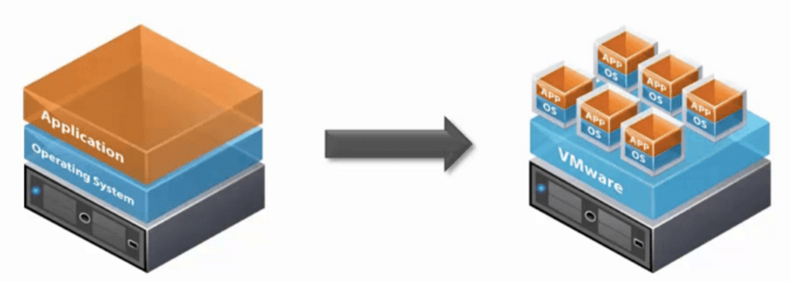
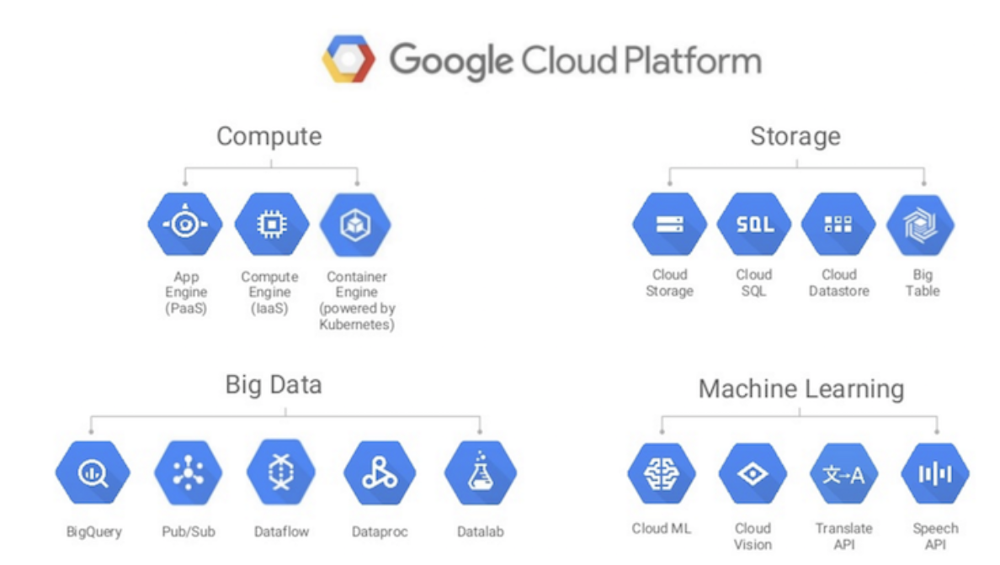

# Virtualization(가상화) 개념 쉽게 이해하기

> tistory 게시글 이전

## 가상화란 무엇일까요?

> 가상화(假像化, virtualization)는 컴퓨터에서 컴퓨터 리소스의 추상화를 일컫는 광범위한 용어이다. (...) 이것은 다중 논리 리소스로서의 기능을 하는 것처럼 보이는 서버, 운영 체제, 응용 프로그램, 또는 저장 장치와 같은 하나의 단일 물리 리소스를 만들어 낸다. 아니면 단일 논리 리소스처럼 보이는 저장 장치나 서버와 같은 여러 개의 물리적 리소스를 만들어 낼 수 있다. / Wikipedia
 
위키백과에서는 가상화를 위와 같이 정의하고 있습니다. 추상화, 논리 리소스, 물리 리소스.. 한 번에 이해하기에는 조금 어렵죠.
 
쉽게 말해, 가상화는 하나의 실물 컴퓨팅 자원을 마치 여러 개인 것처럼 가상으로 쪼개서 사용하거나, 여러 개의 실물 컴퓨팅 자원들을 묶어서 하나의 자원인 것처럼 사용하겠다는 것입니다. 이때 컴퓨팅 자원(리소스)이란, CPU, 메모리, 스토리지, 네트워크 등 컴퓨터를 구성하는 요소들을 말합니다.
 
## 쉬운 예를 들어볼까요?

여러분의 집에 1000GB 짜리 스토리지가 생겼습니다. 하지만, 여러분이 아무리 데이터를 저장해도 200GB 이상 쓸 일이 없을 것만 같아요. 800GB나 남는 것이 너무 아까워서, 남는 용량을 친구 4명에게 나누어주려고 합니다. 하지만 스토리지는 집에 한 개 밖에 없는 건데.. 이걸 나누어 주는 게 가능할까요? '가상화' 기술을 사용하면 가능합니다! 실제로 물리적인 스토리지는 1개뿐이지만, 이 1000GB의 컴퓨팅 자원을 '개념적으로' 200GB씩 쪼개서 마치 별개의 5개의 스토리지인 것처럼 사용할 수 있는 것이죠.
 
어라, 남은 800GB를 이미 친구들에게 모두 나누어줬는데, 갑자기 300GB의 용량이 추가로 필요해졌습니다. 친구들에게 준 것을 다시 뺏을 수도 없고, 결국 여러분은 300GB 스토리지를 새로 사려고 합니다. 그렇다면 다른 컴퓨팅 자원들도 하나씩 더 사서 서브 컴퓨터를 구성해야 하는 걸까요? 아닙니다! 가상화 기술은 두 개의 스토리지 자원을 묶어서 마치 하나의 1300GB 스토리지인 것처럼 동작하게 만들 수도 있습니다.
 
이렇게 1개의 자원을 여러 개로 나눌 수 있는 것처럼 여기거나, 여러 개의 자원을 하나인 것처럼 생각하는 과정들을 자원을 '추상화'한다고 이야기합니다. 컴퓨팅 자원들을 실물의 영역이 아니라, 개념적이고 논리적인 영역으로 관점을 바꿔 '추상적으로' 생각하는 거죠.

## 다시, 가상화란?

> 가상화(假像化, virtualization)는 컴퓨터에서 컴퓨터 리소스의 추상화를 일컫는 광범위한 용어이다. (...) 이것은 다중 논리 리소스로서의 기능을 하는 것처럼 보이는 서버, 운영 체제, 응용 프로그램, 또는 저장 장치와 같은 하나의 단일 물리 리소스를 만들어 낸다. 아니면 단일 논리 리소스처럼 보이는 저장 장치나 서버와 같은 여러 개의 물리적 리소스를 만들어 낼 수 있다. / Wikipedia
 
이제 위키피디아 정의를 다시 봅시다. 위 정의를 다시 적어보면, 가상화란 (1) 컴퓨팅 리소스를 '추상화'시켜서 (2) 하나의 물리 리소스를 여러 개의 논리 리소스처럼 기능 시키거나 (3) 여러 개의 물리 리소스를 하나의 논리 리소스처럼 기능하게 하는 것입니다. 가상화의 대상은 CPU, OS, 스토리지, 네트워크 등으로, 오늘 날에는 대부분의 컴퓨팅 자원들이 가상화되어 사용되고 있습니다. 어렵지 않죠?
 
## GCP(Google Cloud Platform)로 보는 가상화의 장점

사실 우리는 이미 일상에서 가상화를 수 없이 접해오고 있습니다. 대표적인 것이 구글 클라우드, 네이버 클라우드 등 클라우드 서비스죠. 구글은 자신들의 데이터 센터에 있는 컴퓨팅 자원들을 가상화하여, 클라우드 서비스에 가입한 사용자들에게 나누어줍니다. 그러면 사용자는 할당받은 가상 CPU를 사용하여 애플리케이션을 실행하기도 하고, 가상 스토리지에 데이터를 저장할 수도 있죠. 어차피 실물을 제공받은 것이 아니기 때문에, 장소에 제약 없이 내 클라우드 공간에 자유롭게 접근할 수 있어요. 성능이 부족하다면 아주 쉽게 컴퓨팅 자원을 더 할당받아 성능을 높일 수도 있습니다.
 
클라우드 서비스를 제공하는 구글의 입장에서도 참 편리합니다. 실물을 배송해주는 것이 아니라 구글의 자원을 가상으로 나누어 주는 것이기 때문에, 자원을 제공하고 회수하는 것이 빠르고 간편합니다. 비용 절약과 관리도 측면에서도 장점이 많죠. 어떤 사용자가 사용하는 가상 서버에 과부하가 발생해 문제가 생기더라도 괜찮습니다. 가상 환경들은 모두 논리적으로 격리되어 있기 때문에, 각 가상 시스템의 문제는 전체 시스템에 영향을 주지 않거든요. 알면 알수록 편리하지 않나요?
 
이러한 유용성과 편리성을 바탕으로, 가상화 개념은 VM(Virtual Machine), 컨테이너, 클라우드, SDDC 등의 다양한 시스템들의 기본이 되고 있습니다.

## Reference

- [가상화란 무엇일까요?](https://www.redhat.com/ko/topics/virtualization/what-is-virtualization)
