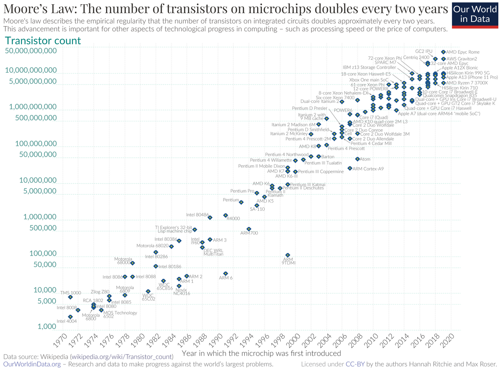
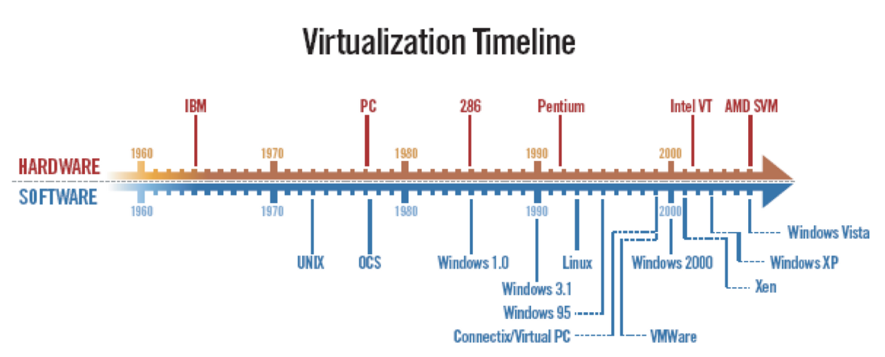
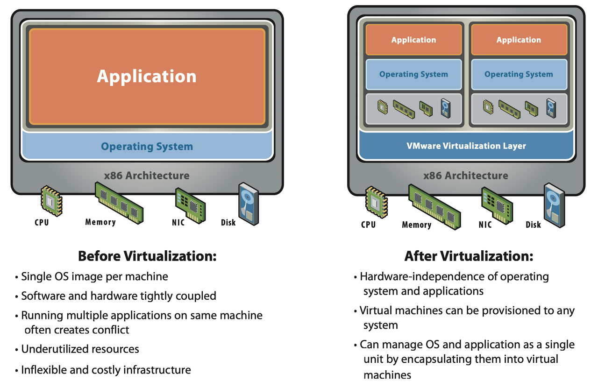
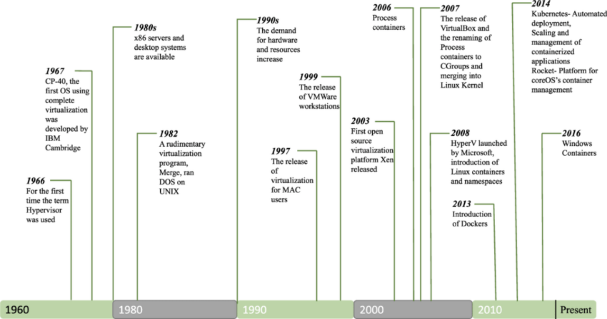

# Virtualization(가상화)의 등장 배경과 발전

> tistory 게시글 이전
 
## 무어의 법칙과 가상화의 필요성

무어의 법칙이란 반도체 칩의 성능 즉, 메모리의 용량이나 CPU의 속도가 약 24개월마다 2배로 증가하고, 가격은 2배씩 낮아진다는 법칙입니다. 인텔의 공동 창업자인 골든 무어가 1965년에 발표한 내용이기 때문에 무어의 법칙이라고 불립니다. 위 그래프를 보면, 실제로 2년마다 단일 칩을 구성하는 트랜지스터 개수가 지수적으로 증가하는 것을 알 수 있죠. 그런데, 무어의 법칙과 가상화가 대체 어떤 관계가 있는 걸까요?

가상화가 처음 등장했던 1960~70년대 상황을 살펴봅시다. 무어의 법칙에 의해 하드웨어의 성능은 빠르게 증가하는 가운데, 그 당시 소프트웨어의 발전 속도는 하드웨어의 발전 속도를 따라가지 못했습니다. 위의 타임라인을 보면 소프트웨어는 1990년대 이후 급격히 발전한 것을 볼 수 있죠.
 
소프트웨어가 요구하는 서버 사양에 비해 소프트웨어를 실행 중인 서버의 성능이 훨씬 좋다 보니, 서버의 성능을 10% 수준밖에 활용하지 못하는 엄청난 비효율이 발생했습니다. 심지어 그 당시 컴퓨팅 자원들은 지금보다 훨씬 비쌌습니다. 그 비싼 서버를 여러 대 구입해서 성능의 10%만 사용해야 한다니, 이것은 꽤 심각한 문제였을 것입니다.
 

이러한 비효율 문제를 해결하기 위해 고안된 것이 바로 가상화 개념입니다. 한 대의 서버를 마치 여러 대의 서버처럼 사용할 수 있다면? 즉, 한 대의 서버 위에 동시에 여러 개의 OS를 설치하고 여러 애플리케이션을 실행시킬 수 있다면, 자원 비효율 문제를 해결할 수 있었던 것이죠. 실제로 가상화 적용 이후 5~15%에 그치던 자원 사용률은 60~80% 수준까지 향상되었다고 합니다.
 
## 서버를 가상화할 수 있다면?

서버를 가상화하는 것이 어떻게 자원 비효율 문제를 해결할 수 있다는 것일까요? 간단한 예시를 들어봅시다. 

여러분은 3대의 서버가 필요합니다. 한 대의 서버는 메일용, 한 대의 서버는 WEB용, 다른 한 대는 APP 구동용으로 구분해서 사용하려고 해요. 하지만 각 서버에서 실행할 애플리케이션은 기껏해야 서버 성능의 30%만 사용하면 충분합니다. 이때, 위와 같이 3대의 물리 서버를 각각 구성하고 각 서버의 30%씩만 사용한다면, 남는 자원들이 너무 아깝다는 생각이 들지 않나요? 이것이 가상화 이전에 자원을 활용하던 방식이었습니다.

하지만, 만약 한 대의 서버를 가상화하여 두 대의 서버처럼 사용할 수 있다면 어떨까요? 두 대의 실물 서버만으로 3대의 서버를 가진 것과 같은 효과를 얻을 수 있을 것입니다. 서버 사용률 또한 30%에서 60%로 증가하겠죠. 원한다면 한 대의 서버를 3대의 서버처럼 동작시키는 것도 가능합니다. 그 경우에는 한 대의 서버를 무려 90% 효율로 사용할 수 있겠죠? 이렇게 하드웨어와 소프트웨어 간의 성능 차이로 인한 컴퓨팅 자원 활용의 비효율 문제를 해결하기 위해 등장한 것이 가상화입니다.
 
## 가상화의 발전 과정

최초의 가상화 기술은 1960년대 후반 IBM의 서버 컴퓨터인 메인프레임에서 처음 적용되었습니다. IBM에서 완전한 가상화를 구현한 최초의 하이퍼바이저인 CP-40을 개발한 것입니다. 하이퍼바이저는 간단히 가상화를 구현시켜주는 OS 정도로 이해하면 될 것 같습니다. (다음 포스트에서 다룰 예정입니다.)
 
2000년대에 들어서며 VM(Virtual Machine)을 생성하고 배포할 수 있는 다양한 서버 가상화 솔루션이 등장하기 시작합니다. 이때, VM이란 하드웨어 가상화에 의해 독립적인 OS를 갖는 가상 컴퓨팅 환경입니다. 2001년에 첫 가상화 상용 솔루션인 VMware의 Workstation이 출시되었으며, 2003년에는 Citrix의 Xen(젠)이라는 오픈 소스 솔루션이 출시됩니다. 이후 여러 회사에서 서버 가상화 플랫폼을 개발했고, VM의 배포 및 관리를 도와주는 다양한 자동화 및 오케스트레이션 툴이 개발되었습니다.
 
2010년대 이후 가상화의 화두는 단연 컨테이너일 것입니다. 컨테이너는 애플리케이션 가상화로, VM과 달리 OS를 포함하지 않습니다. 즉, 하드웨어와 호스트 OS 는 그대로 둔 채 애플리케이션 영역만 캡슐화하여 격리하는 방식입니다. VM에 비해 가볍고, 배포가 빠르며, 자원을 효율적으로 사용할 수 있다는 장점이 있어 최근에 많이 활용되고 있습니다. 2013-14년에 차례로 등장한 Docker와 Kubernetes가 대표적인 컨테이너 배포 플랫폼입니다.

## Reference

- [Virtualization Technology - A Manifold Arms Race @IBM](https://www.first.org/resources/papers/conference2008/warfield-michael-slides.pdf)
- [Introducing the new paradigm of Social Dispersed Computing: Applications, Technologies and Challenges](https://www.researchgate.net/publication/325536281_Introducing_the_new_paradigm_of_Social_Dispersed_Computing_Applications_Technologies_and_Challenges)