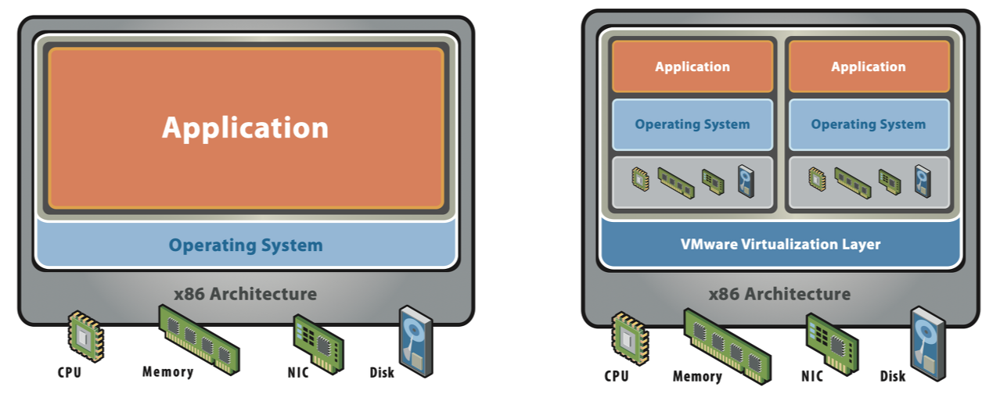
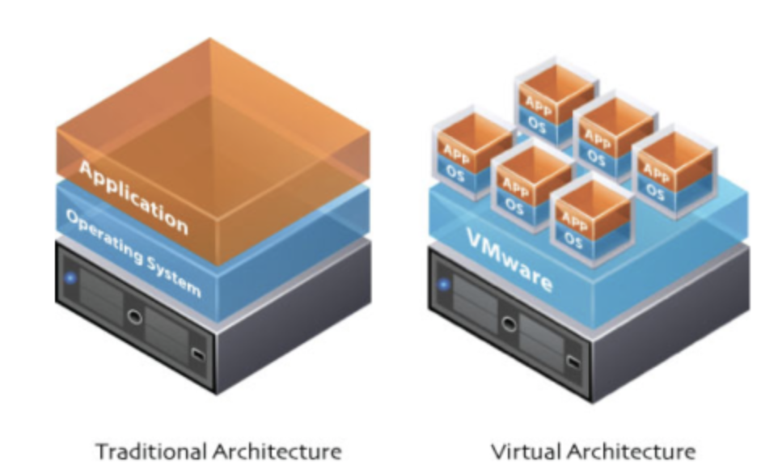
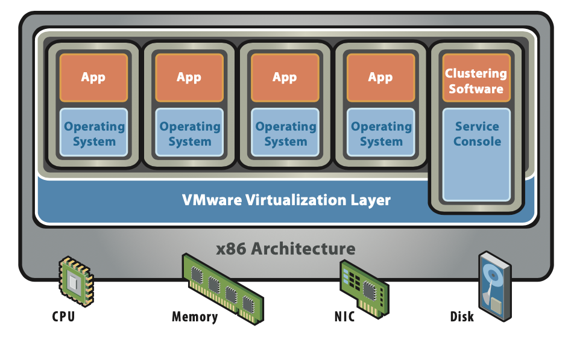
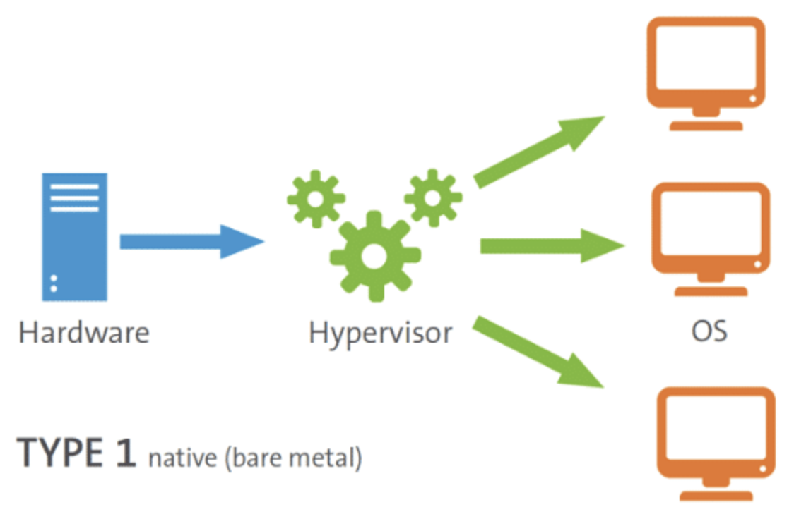
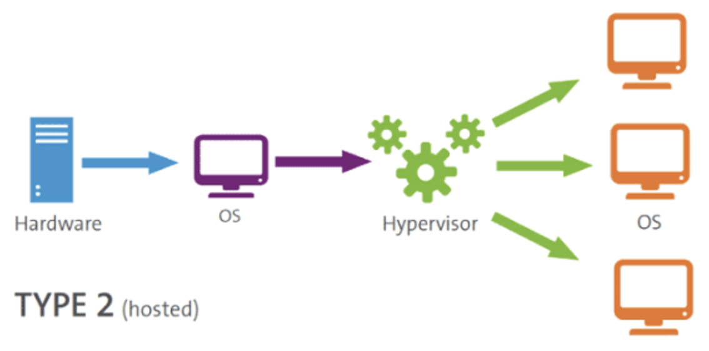

# 가상 머신(VM)과 하이퍼바이저 쉽게 이해하기

> tistory 게시글 이전

## 가상 머신(Virtual Machine, VM)이란?

RedHat 홈페이지에서는 가상 머신을 아래와 같이 정의하고 있습니다.

> 가상 머신(Virtual Machine, VM)은 물리적 하드웨어 시스템에 구축되어 자체 CPU, 메모리, 네트워크 인터페이스 및 스토리지를 갖추고 가상 컴퓨터 시스템으로 작동하는 가상 환경입니다. / RedHat

가상화 기술 등장 이후, 우리는 한 개의 물리 서버를 두 개 이상의 가상 서버로 동작시킬 수 있게 되었습니다. 덕분에 더 이상 서버 리소스를 낭비하지 않고 효율적으로 사용할 수 있었죠. 그렇다면, 물리 서버에 여러 개의 가상 서버를 만들기 위해서는 어떤 과정이 필요할까요?
 

먼저, 가상 서버를 만들어달라는 요청을 '하이퍼바이저'라는 소프트웨어에 전달합니다. 요청을 받은 하이퍼바이저는 새로운 가상 서버를 생성하고, 물리 서버가 가진 컴퓨팅 리소스를 각 가상 서버에 할당해줍니다. 컴퓨팅 리소스에는 CPU, 메모리, 스토리지, 네트워크 등이 포함되죠. 리소스 할당 후에는 각 서버에 필요한 운영체제(OS)도 설치해줍니다. 여기까지 완료된다면, 애플리케이션을 실행할 수 있는 서로 다른 가상 컴퓨팅 환경이 만들어진 것입니다. 생각보다 정말 간단하죠?
 
이렇게 자체 컴퓨팅 자원과 OS를 갖춘 가상 컴퓨팅 환경을 가상 머신, Virtual Machine(VM)이라고 부릅니다. 각 VM들은 같은 서버 위에 있을지라도 별도의 시스템처럼 동작합니다. 이때, 생성된 VM를 게스트 서버, VM들이 구동되는 서버를 호스트 서버라고 부른다는 점 꼭 기억해주세요!
 
## 가상 머신(VM)의 장단점

바이러스에 취약한 데이터에 접근하거나 새로운 개발 환경을 테스트하는 등의 위험한 작업을 해야 한다고 가정해봅시다. 호스트 OS에서 직접 작업하다가 잘못될 경우, 전체 시스템에 장애가 발생하거나 이전 환경으로 되돌릴 수 없는 상황이 생길 수 있습니다. 바로 이런 상황에서 VM을 유용하게 사용할 수 있습니다.
 
VM은 격리된 환경을 제공하므로, VM 내에서 어떤 대상이 실행되든 다른 시스템을 방해하지 않습니다. 또, 각 VM이 독립적인 OS를 갖기 때문에, 단일 서버에서 Windows, MAC, Linux 등 다양한 OS를 사용할 수도 있습니다. 유지/관리 및 자원 활용률 측면에서도 장점을 갖습니다.
 
하지만, VM이 많은 것이 항상 좋은 것만은 아닙니다. 먼저, VM이 많을수록 전통적인 방식 대비 성능의 안정성이 떨어지고 실행 속도가 느려집니다. 아무래도 서버를 온전히 하나의 시스템으로 사용하는 것보다, 여러 가상 환경으로 분리하여 사용하는 것이 더 불안정할 수밖에 없겠죠. 또한, Windows OS의 용량이 약 5GB 정도인 것을 고려하면, 모든 VM이 각각의 OS를 갖고 있는 것이 때로는 부담이 될 수도 있습니다. 이 점은 이후 등장하는 컨테이너와의 대표적인 차이점이 되기도 합니다.
 
## 하이퍼바이저(Hypervisor)란?

앞서, VM 생성을 위해서는 '하이퍼바이저'라는 것이 필요하다고 언급했는데요. 하이퍼바이저란 무엇일까요?
 

하이퍼바이저는 가상화 계층(Virtualization Layer)을 구현해주는 소프트웨어입니다. 위 그림을 보면, 실물 하드웨어 자원들과 가상 머신들 사이의 'Virtualization Layer'이라는 가상화 계층을 볼 수 있죠?
 
가상화 구조에서는 하드웨어와 가상 머신이 직접 연결되지 않습니다. 심지어는 하드웨어나 가상 머신들이 자신이 가상화되었다는 사실을 모를 때도 있어요. 트루먼쇼처럼 스스로는 온전한 서버라고 생각하는 거죠.
 
그렇기 때문에 우리에게는 하드웨어 위에서 가상 머신을 생성하고, 필요한 만큼 자원을 할당해주고, 가상 머신들의 요청을 처리해주는 등 가상화를 도와줄 '매니저'가 필요합니다. 그것이 '하이퍼바이저'의 역할이죠. 가상 머신의 생성부터 삭제까지 가상 머신이 동작하는 모든 환경을 관리하기 때문에, 가상 머신 매니저(Virtual Machine Manager 또는 Monitor, VMM)라고 불리기도 합니다. 
 
하이퍼바이저는 물리 하드웨어와 가상 머신의 영역을 분리하고 자신이 그 사이에서 중간 관리자, 즉 인터페이스 역할을 합니다. 예를 들어, 하드웨어의 리소스를 가상 머신에 할당하고, 각 가상 머신의 리소스 사용을 스케쥴링하고, 가상 머신과 하드웨어 간의 I/O 명령을 처리하는 등의 역할을 하이퍼바이저가 담당합니다. 단일 서버에서 여러 개의 OS를 운영할 수 있는 것 또한 하이퍼바이저 덕분이죠.
 
## 하이퍼바이저(Hypervisor) 유형

하이퍼바이저는 위치에 따라 유형 1 하이퍼바이저와 유형 2 하이퍼바이저로 구분됩니다.

### 유형 1 하이퍼바이저 (Bare-Metal Hypervisor)

유형 1 하이퍼바이저는 Native 혹은 Bare-Metal 하이퍼바이저라고도 불립니다. 'Bare-Metal'이라는 이름에서 알 수 있듯이, 유형 1은 하드웨어 위에서 직접 구동되어 게스트 OS를 관리합니다. 하드웨어에 OS를 설치하는 것처럼 하이퍼바이저를 설치하는 것이죠.
 
유형 1 하이퍼바이저에는 호스트 OS가 따로 존재하지 않습니다. 게스트 OS는 하드웨어 위에 2번째 수준으로 실행되기 때문에 오버헤드가 적다는 장점이 있죠. 각 게스트 OS의 문제가 다른 게스트 OS에 영향을 주지 않는 것도 유형 1의 장점입니다. 하지만, VM들에 대한 자체적인 관리 기능이 없어, VM 관리를 위한 컴퓨터나 콘솔이 별개로 필요합니다.
 
VMware의 ESXi, Citrix의 Xen, Microsoft의 Hyper-V 등이 대표적인 유형 1 하이퍼바이저입니다. 유형 1 하이퍼바이저는 기업용 데이터 센터에서 일반적으로 사용됩니다.
 
유형 1 하이퍼바이저는 가상화를 구현하는 방식에 따라 전가상화(Full-Virtualization)와 반가상화(Half-Virtualization), HAV(Hardware Assisted Virtualization) 등의 유형으로 나뉘는데, 이것은 다음 포스팅에서 다루어 보겠습니다.
 
### 유형 2 하이퍼바이저 (Hosted Hypervisor)

유형 2 하이퍼바이저는 Hosted 하이퍼바이저라고도 불리며, 그 이름처럼 Host OS를 갖는 하이퍼바이저입니다. 하드웨어에 호스트 OS 가 이미 설치되어 있고, 하이퍼바이저는 OS 위에서 소프트웨어로서 동작합니다.
 
기존 시스템 위에서 쉽게 사용할 수 있다는 것이 유형 2의 가장 큰 장점입니다. 하지만, 게스트 OS가 하드웨어 위에 3번째 수준으로 실행되기 때문에 오버헤드가 크고, 호스트 OS의 문제가 전체 게스트 OS에 영향을 줄 수 있다는 단점이 있죠.
 
VMware의 Workstation, Oracle의 VirtualBox 등의 소프트웨어가 유형 2 하이퍼바이저에 해당됩니다. 유형 2 하이퍼바이저는 개인 컴퓨터에서 VM을 사용하고자 할 때 일반적으로 사용하는 유형입니다. 예를 들어, Windows 환경에서 Ubuntu를 사용하고자 할 때, Windows OS에 VirtualBox 소프트웨어를 다운로드하여 VM을 생성하는 것이 유형 2 방식입니다.

## Reference

- [가상화란 무엇일까요?](https://www.redhat.com/ko/topics/virtualization/what-is-virtualization)