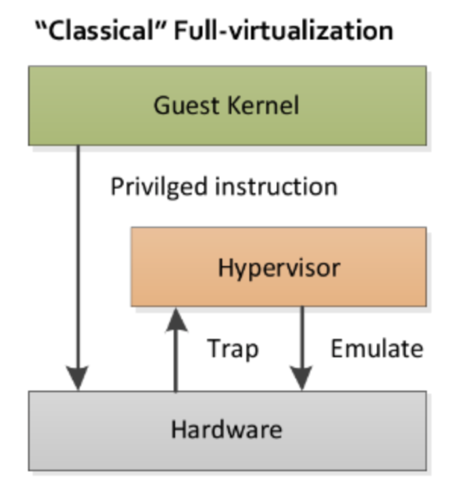
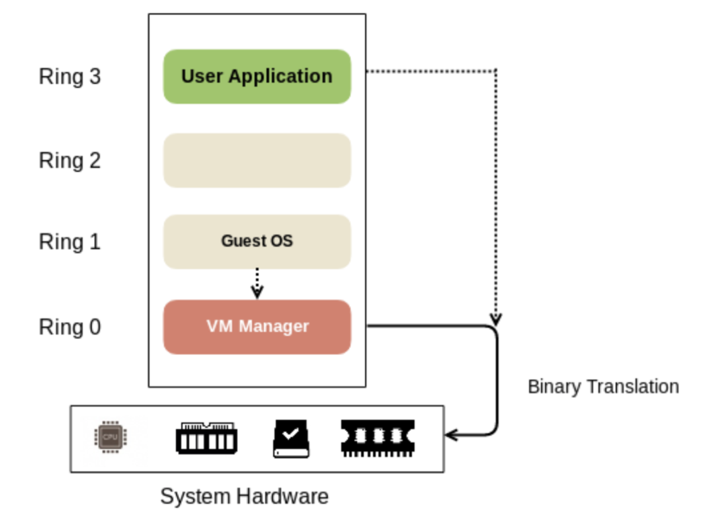
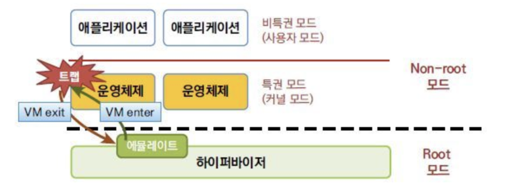
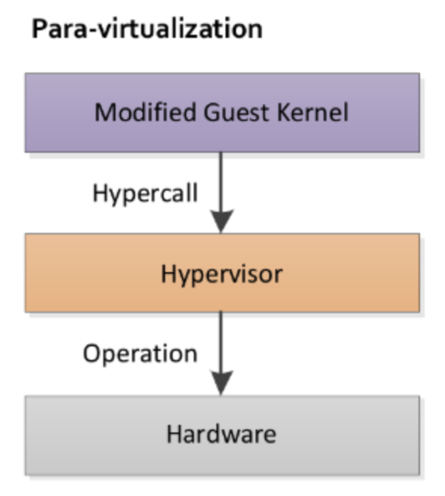
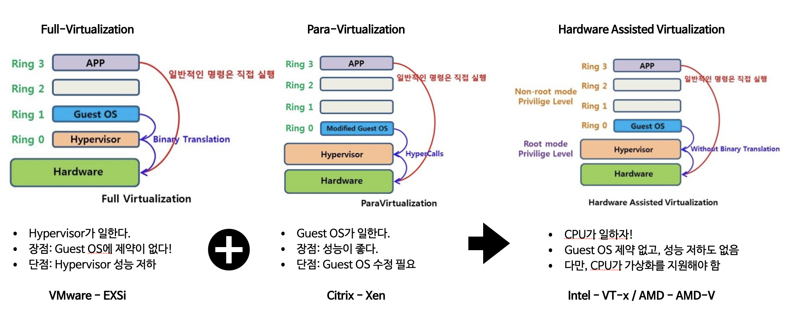

# 전가상화와 반가상화 쉽게 이해하기

<!-- 2021. 10.25 -->

[지난 게시글](03_vm-and-hypervisor.md)에서 하이퍼바이저의 두 종류, Bare-Metal (Type-1) 하이퍼바이저와 Hosted (Type-2) 하이퍼바이저에 대해 알아봤다. 하드웨어 위에 별도의 Host OS 없이 하이퍼바이저가 바로 구현되는 Bare-Metal 하이퍼바이저는 다시 전가상화(full virtualization)와 반가상화(para virtualization)로 구분되는데, 각각에 대해 알아보자.

## 전가상화(Full Virtualization)

전가상화는 하드웨어를 완전히 가상화하는 방식이다. 하드웨어가 완전히 가상화되었다는 말은 즉, 각 Guest OS는 자신이 가상화되어 있다는 사실을 전혀 알지 못한다는 뜻이다. 전가상화에서는 가상 머신이 구동할 Guest OS를 수정하지 않고 그대로 사용할 수 있다. 물리 환경에서 동작하는 운영체제와 장치의 드라이버들을 그대로 가상 머신에서 사용할 수 있다는 것이다.

하지만, 가상 시스템은 서로 다른 OS를 가질 수 있다는 것을 상기해 보자. 서로 다른 OS는 서로 다른 명령 체계를 가진다. 다양한 종류의 Guest OS를 구동하는 하나의 하드웨어가 있다면, 이 하드웨어가 Linux의 명령, Windwos의 명령, MAC의 명령을 모두 처리하는 것이 가능할까? 누군가는 중간에서 이 명령을 중재하거나 번역하는 역할을 해야 할 것이다.

전가상화에서는 하이퍼바이저가 그 모든 역할을 담당한다. 하이퍼바이저는 Guest OS의 중요한 명령을 중재하고 처리하며, 하이퍼바이저가 중간 역할을 착실하게 해주기 때문에 Guest OS는 그 과정에 대해 전혀 신경을 쓰지 않는다.

VMware의 ESXi와 MS의 Hyper-V는 전가상화 방식을 사용하는 대표적인 하이퍼바이저다.

### 전가상화의 장단점

전가상화의 장점은 Guest OS를 별도로 수정할 필요 없이 사용할 수 있다는 것이다. 하지만, 전가상화는 하이퍼바이저가 모든 명령을 중재하기 때문에 성능이 느리다는 단점이 있다.

### 전가상화의 모드

전가상화에서는 하이퍼바이저가 모든 명령을 중재하므로, 하이퍼바이저는 root 모드에서 동작하고, Guest OS와 애플리케이션은 non-root 모드에서 동작한다. 만약 Guest OS가 특권 명령(previleged instruction)을 처리해야 하는 상황이 오면, 하이퍼바이저가 반드시 개입하여 Trap & Emulate 방식으로 명령을 처리해 주어야 한다.

### Trap & Emulate

특권 명령을 실행할 권한이 없는 Guest OS에서 특권 명령을 실행할 때 시스템에 발생하는 예외를 Trap이라고 한다. Guest OS에서 Trap 이 발생하면, Trap handler는 VM exit을 통해 제어권을 하이퍼바이저에 넘기고, 하이퍼바이저가 해당 명령을 처리한다. 이렇게 하이퍼바이저가 명령을 대신 처리하는 것을 emulate 한다고 한다. 해당 명령 처리가 끝나면, VM enter를 통해 실행 결과와 제어권을 다시 Guest OS에 넘겨준다.

Trap & Emulate 방식은 비용이 크다. 모든 Guest VM에서 특권 명령을 실행할 때마다 이 모든 과정을 거치는 것은 시스템의 오버헤드를 증가시킨다.

### 이진 변환(Binary Translation)

이진 변환(Binary Translation)은 시스템 오버헤드가 크다는 Trap & Emulate의 단점을 해결하기 위해 VMware에서 선보인 기술이다. Guest OS에서 특권 명령을 수행하려고 할 때 하이퍼바이저가 그 명령을 매번 대신 처리해 주는 대신, 바이너리 연산을 통해 Guest OS의 요청을 하드웨어가 인식할 수 있는 명령어로 변환하여 전달하는 방식이다. Guest OS의 특권 명령을 실행하기 위해서는 여전히 하이퍼바이저가 개입해야 하지만, 명령을 대신 실행해 주고 Guest OS에 결과를 넘겨주는 복잡한 과정 대신, 단순히 번역 정도만 담당하게 되어 시스템 오버헤드를 개선할 수 있다.

## 반가상화(Para-Virtualization)

VMware는 전가상화의 성능적인 문제점을 이진 변환 방식으로 해결했지만, Citrix는 '반가상화'라는 방식으로 문제를 해결했다. 

반가상화는 하드웨어가 반만 가상화되었다는 뜻으로, 반가상화 모드에서 하드웨어는 완전히 가상화되지 않는다. 각 Guest OS는 스스로 가상화된 환경임을 인지하고 있으며, 가상화 환경에서는 자신의 명령 체계의 번역이 필요함을 알고 있다. 따라서, 반가상화에서 Guest OS가 특권 명령을 실행할 때는 명령을 직접 번역하여 하이퍼바이저에 전달하는데, 이를 HyperCall이라고 한다.

하이퍼바이저에 Hyper Call을 보내는 동작은 일반적인 OS가 할 수 있는 기능이 아니다. 따라서, Guest OS가 Hyper Call을 보낼 수 있도록 Guest OS의 커널을 수정하고, 장치 드라이버를 설치하는 등의 과정이 필요하다. 즉, 반가상화 모드에서는 Guest OS를 그대로 사용할 수 없으며, 가상화를 지원하도록 일부 수정되어야 한다.

Citrix의 Xen은 반가상화 방식을 사용하는 대표적인 하이퍼바이저다.

### 반가상화의 장단점

반가상화는 Guestt OS가 직접 Hyper Call을 보냄으로써 명령을 처리하므로, 전가상화에 비해 성능이 빠르다. 하지만, Guest OS 수정이 필요하다는 단점이 있다. Citrix Xen에서는 가상화를 위해 Guest OS를 수정할 수 있는 기능을 제공하고 있기 때문에, 최근에는 이것이 큰 문제가 되지는 않는다고 한다.

## HAV(Hardware-Assisted Virtualization)

[카페24 The 퍼펙트한 호스팅 _ 가상화 기술의 유형](https://blog.cafe24.com/1621)에서 그림을 참조했다.

전가상화와 반가상화를 요약하면 다음 그림과 같다. 쉽게 표현하면, 전가상화는 하이퍼바이저가 열심히 일하는 구조이며, 반가상화는 Guest OS가 열심히 일하는 구조이다. 이때의 '일'은 간단히 표현하면 Guest OS의 명령을 하드웨어가 인식할 수 있도록 번역하는 작업이 될 것이다.

그런데, Guest OS나 하이퍼바이저가 번역을 하지 않고, 그냥 하드웨어가 여러 형태의 명령을 알아들을 수는 없을까? 그것을 구현한 방식이 HAV(Hardware Assisted Virtualization)이다. HAV에서는 Guest OS도 하이퍼바이저도 번역을 하지 않으며, 모든 명령 처리는 하드웨어인 CPU에서 담당한다. 이 경우, 시스템의 성능 저하도 없고, Guest OS의 수정도 필요하지 않다. 하지만, CPU가 가상화를 지원해야 한다는 제약이 있는데, Intel의 VT-x, AMD의 AMD-V 등 최근의 CPU들은 대부분 가상화를 지원하고 있다고 한다.

## Reference

- [3. [Cloud Computing] 전가상화와 반가상화](https://m.blog.naver.com/alice_k106/220218878967)
  + 이해가 쉬우니 꼭 읽어보길 추천한다.
- [[Server] 하드웨어 가상화(Virtualization)의 종류 및 차이 (2/2)](https://mangkyu.tistory.com/87)
- [카페24 The 퍼펙트한 호스팅 _ 가상화 기술의 유형](https://blog.cafe24.com/1621)