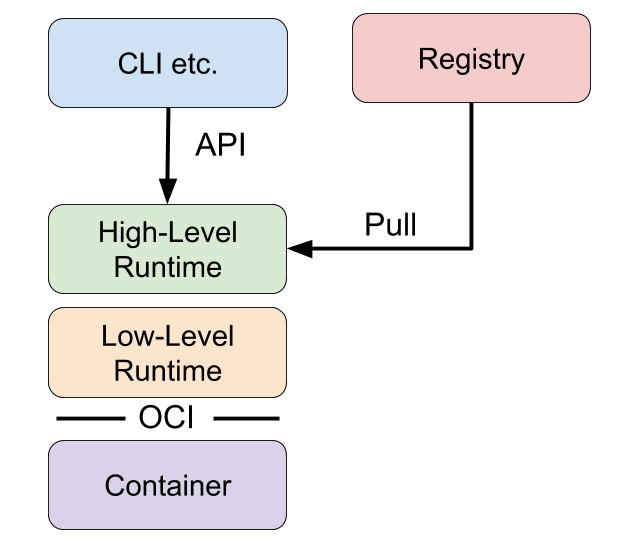

# 컨테이너의 개념과 발전 (LXC, Docker, Kubernetes)

## 컨테이너(Container)

### VM과 컨테이너

VM은 자체 OS를 갖는 가상 컴퓨팅 환경이다. VM의 등장으로 우리는 하나의 하드웨어 위에서 서로 다른 OS를 가진 VM을 생성하고 실행할 수 있다. 하지만, 가상 머신이 OS를 갖는다는 것은 항상 바람직한 일일까?

그렇지만은 않다. 대표적으로, VM은 OS를 포함하기 때문에 이미지 용량이 크다는 단점이 있다. Windows OS 설치 파일만 약 5GB인 것을 고려하면, 모든 가상 환경이 OS를 갖고 있다는 것이 때로는 부담이 될 수도 있을 것이다. 또한, VM은 하드웨어 가상화에 포커스가 있어 배포와 관리 측면에서 어려움이 있을 수도 있다. 성능 측면에서도 무겁고 느리다. 특히 사용할 수 있는 리소스와 기능이 제한되어 있다면, 적은 자원으로도 빠르게 애플리케이션을 배포할 수 있는 경량화된 가상화 기술이 적합할 것이다.

따라서, 사람들은 조금 더 가벼운 방식으로 가상화를 구현하는 방법을 고민하기 시작했다. OS 격리 없이 동일한 OS 내에서 프로세스만 격리하는 방법이 고안되었고, 그것이 바로 컨테이너다.

### 컨테이너

컨테이너는 서버 가상화 기술의 일종으로, 호스트 OS 상에 논리적인 구획을 만들고, 애플리케이션을 작동시키기 위해 필요한 라이브러리나 파일 등을 하나로 모아둔 것을 말한다. 컨테이너는 마치 별도의 서버처럼 동작한다.

컨테이너는 VM과 달리 별도의 Guest OS를 갖지 않는다. 그 대신, 호스트 OS의 리소스를 빠르고 간편하게 사용한다. 호스트 OS는 각 컨테이너의 프로세스가 접근할 수 있는 자원의 양을 제어함으로써 컨테이너 프로세스를 격리한다.

컨테이너는 VM에 비해 오버헤드가 적고, 가볍고, 고속으로 동작할 수 있으며, 이식성이 뛰어나다는 특징을 갖는다.

## 리눅스 컨테이너(Linux Container)

### chroot

chroot는 change root directory의 약자로, linux에서 root 디렉터리(/)를 변경하는 명령어다. 어떤 폴더의 디렉터리 주소를 잘 보면, '/home'과 같이 주소의 맨 처음에 '/'이 있는 것을 쉽게 볼 수 있을 것이다. 이 '/' 기호는 root 디렉터리를 의미한다. root 디렉터리는 파일 시스템의 최상위 디렉터리이며, 시스템의 모든 디렉터리와 파일은 루트 디렉터리 아래에 존재한다.

chroot 명령어는 루트 디렉터리를 변경할 수 있게 만드는 명령어로, chroot를 사용하면 어떤 디렉터리를 최상위 디렉터리로 둘 지 선택할 수 있다.

이때, chroot로 특정 디렉터리를 루트 디렉터리로 설정하면 chroot jail 이라는 환경이 생성된다. chroot jail은 말 그대로 디렉터리 감옥을 의미하며, chroot jail 안에서는 바깥의 파일과 디렉터리에 접근할 수 없다. chroot jail은 디렉터리 경로를 격리하여 서버 정보 유출과 피해를 최소화 하는데 주로 사용된다.

아래 그림과 같은 파일 시스템이 있다고 해보자. 이 파일 시스템에서 root 디렉터리는 가장 상위의 '/' 이다. 이 시스템에서 어떤 프로세스 R이 실행되면, 이 프로세스는 root 디렉토리(/)에서부터 파일 탐색을 시작한다.

만약 chroot 명령어를 사용하여 root 디렉터리를 A 폴더로 변경하면 어떻게 될까? root 디렉터리를 A로 변경한 후에 프로세스 K를 실행한다면, 프로세스 K는 루트인 A 디렉터리에서부터 파일 탐색을 시작할 것이다. 프로세스는 root 바깥의 디렉터리나 파일에 접근할 수 없으므로, 프로세스 K는 A의 바깥에 위치한 '/', '/B', '/C' 등의 디렉터리에는 접근할 수 없다.

chroot는 linux에서 파일과 디렉터리를 격리시키는 간단하지만 중요한 방식이다. 하지만, chroot만으로는 파일 시스템 외의 네트워크나 프로세스 등의 자원을 제어할 수는 없다.

### Linux Container(LXC)

Linux는 chroot의 개념을 확장시켜 LXC(LinuX Container)라는 시스템 레벨의 가상화를 제공하기 시작했다. LXC는 linux의 namespace와 cgroup 기능을 통해 격리된 컨테이너를 생성한다.

Linux namespace는 하나의 시스템에서 리소스를 격리시켜주는 가상화 기능이다. 일반적으로 시스템에서 프로세스들은 시스템의 리소스를 공유하며 실행되는데, 이는 단일 namespace라고 생각할 수 있다.

여러 개의 namespace를 사용하면 프로세스를 실행할 때 각 네임스페이스 별로 리소스를 분리해서 실행하는 것이 가능하다. 예를 들어, 네트워크 네임스페이스는 프로세스 별로 고유한 네트워크 환경을 구축할 수 있도록 도와준다. namespace의 종류에는 PID, IPC, Network, UID, Mount, UTS 등이 있다.

cgroup은 control group의 약자로, 리소스들을 중앙에서 제어하는 역할을 한다. namespace에서 리소스를 격리하고 나면, cgroup은 프로세스에 리소스를 할당하거나 제한하는 역할을 한다. cgroup은 파일 시스템이나 프로세스뿐 아니라 CPU, 메모리, 디바이스, 네트워크 등 다양한 리소스를 관리한다.

LXC는 프로세스에 대해 chroot 등의 기능을 사용하여 특정 디렉터리를 root 디렉터리로 인식하게 만들고, cgroups와 namespace 기능을 사용하여 다양한 자원을 격리함으로써 가상 환경을 구현한다.

## 컨테이너 런타임(Container Runtime)

LXC는 컨테이너 기능을 구현해 주었지만, LXC의 구조를 이해하고 사용하는 것은 꽤 어려운 일이었다. 따라서 컨테이너의 생성과 관리, 배포를 쉽게 도울 수 있게 등장한 것이 컨테이너 런타임으로, 대표적으로 Docker가 있다. Docker를 사용하면, 컨테이너 이미지를 이용해서 손쉽게 컨테이너를 생성하고 배포할 수 있다.

컨테이너 런타임은 저수준 컨테이너 런타임과 고수준 컨테이너 런타임으로 나뉜다.

### 저수준 컨테이너 런타임(Low Level Container Runtime)

저수준 컨테이너 런타임은 오로지 컨테이너를 실행하는 기능만 제공하며, OCI 런타임으로도 불린다. OCI는 Open Container Initiative의 약자로, 표준화된 컨테이너 런타임을 의미한다.

저수준 컨테이너 런타임은 namespace와 cgroup의 설정 및 실행을 담당한다. 간단한 CLI 또는 라이브러리 형태로 존재하며, 고수준 컨테이너 런타임에 의해 호출되는 방식으로 사용된다.

현재 OCI를 준수하는 저수준 컨테이너 런타임으로 가장 잘 알려진 것은 runC이다. runC는 원래 Docker에서 컨테이너를 실행하기 위해 개발되었으나, OCI 런타임 표준을 위해 독립적인 라이브러리로 사용되기 시작했다.

### 고수준 컨테이너 런타임(High Level Container Runtime)

고수준 컨테이너 런타임은 이미지 관리, 압축 해제, 저수준 컨테이너 런타임 호출 등 더 고수준의 작업을 수행한다. 일반적으로 daemon 방식으로 동작하고 remote API를 제공하기 때문에, 외부에서 컨테이너를 실행하거나 모니터링하는 것이 가능하다.

고수준 컨테이너 런타임에는 containerd가 있으며, 이 또한 Docker를 위해 개발되었으나 현재는 독립적인 라이브러리로 사용된다.

### Docker

Docker는 high level과 low level로 분리되어 다음과 같은 모듈로 구성된다.

dockerd는 Docker daemon으로 REST API를 제공하며, client로부터 컨테이너 관련 요청을 받는다. 대부분의 요청은 containerd로 위임하지만, 이미지 빌드, 네트워킹 등 일부 작업은 직접 수행하기도 한다.

docker-containerd는 고수준 컨테이너 런타임 기능을 담당하며, daemon 방식으로 REST API를 제공한다.

docker-runc는 저수준 컨테이너 런타임 기능을 담당하며, 런타임 환경이 구현해야 하는 spec이 포함되어 있다. runc는 컨테이너를 생성한 후에 바로 종료된다.

## CRI (Container Runtime Interface)

CRI는 Kubernetes에서 만든 컨테이너 런타임 인터페이스다. 초기의 Kubernetes는 컨테이너를 실행하기 위해 Docker를 사용했었는데, docker의 동작에 대한 정보는 kubelet 소스코드 내부에 통합되어 있었다. 이것은 kubelet 코드를 복잡하게 만들었고, 유지 보수 오버헤드를 발생시켰다.

이 문제를 해결하기 위해 Kubernetes는 CRI라는 표준 인터페이스를 만들어 명확한 추상화 계층을 제공하기 시작했다. 컨테이너 런타임 인터페이스를 표준화함으로써 kubelet의 코드를 수정하지 않고도 다양한 컨테이너 런타임을 지원할 수 있게 되었다. 새로운 컨테이너 런타임은 CRI 스펙에 맞춰서 CRI 컴포넌트를 구현하면 되는 구조가 되었다. 

## 컨테이너 오케스트레이션(Container Orchestration)

Docker와 Kubernetes의 차이는 무엇일까? 결론부터 말하면, Docker는 컨테이너 런타임, Kubernetes는 컨테이너 오케스트레이션이다. 이 둘은 어떻게 다를까?

Docker를 사용하면 서버 위에 여러 개의 컨테이너를 생성하고 배포할 수 있다. 하지만 서버가 늘어나면 어떻게 될까? 관리자는 모든 서버에 Docker를 설치하고, 각 서버의 Docker를 모두 관리해야 하는 불편함이 생길 것이다. 이러한 불편함을 해결하기 위해 등장한 것이 컨테이너 오케스트레이션으로, 대표적으로 Kubernetes가 있다. 컨테이너 오케스트레이션은 많은 컨테이너를 여러 서버에서 관리하는 기능을 지원한다.

### Kubernetes

Kubernetes는 여러 컨테이너 애플리케이션을 여러 대의 서버에 배치하고 관리하는 작업을 자동화한다. Kubernetes를 사용하면 개발자는 더 이상 각각의 컨테이너를 직접 하나씩 관리하지 않아도 된다. 개발자가 각 컨테이너의 조건과 자원 사용 방식을 정의해두면, Kubernetes가 그 정의서에 따라 컨테이너를 배치하고 관리한다.

## Reference

- [Linux) Doker와 Container의 탄생과 설명, 차이점](https://hwan-shell.tistory.com/116)
- [컨테이너란? 리눅스의 프로세스 격리 기능](https://www.44bits.io/ko/keyword/linux-container#리눅스-네임스페이스linux-namespace)
- [Container Runtime과 Docker](https://cwal.tistory.com/31)
- [Container Runtimes Part 3: High-Level Runtimes](https://www.ianlewis.org/en/container-runtimes-part-3-high-level-runtimes)
- [흔들리는 도커(Docker)의 위상 - OCI와 CRI 중심으로 재편되는 컨테이너 생태계](https://post.naver.com/viewer/postView.nhn?volumeNo=28882881)