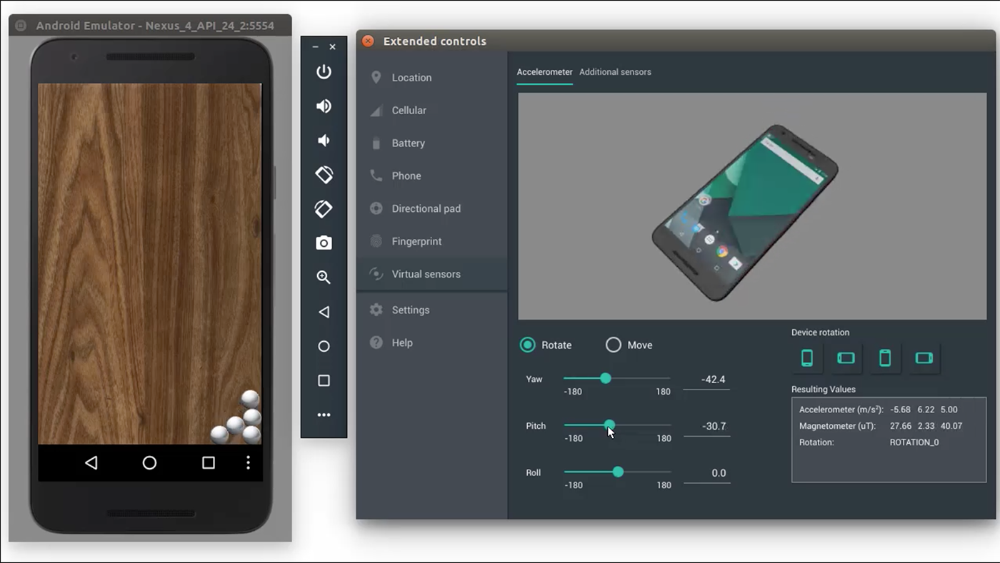
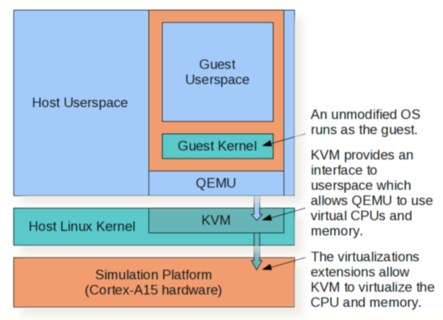

# QEMU-KVM 이해하기

## 에뮬레이션과 시뮬레이션

QEMU는 대표적인 에뮬레이터이다. QEMU와 KVM에 대해 이해하기 위해 먼저 에뮬레이션과 시뮬레이션의 차이를 알아보자. 에뮬레이션과 시뮬레이션은 둘 다 어떤 시스템을 흉내 낸다는 공통점이 있지만, 가상 머신을 구현하는 방식에 차이가 있다.

### 에뮬레이션(Emulation)

에뮬레이션은 호스트 하드웨어에 존재하지 않는 하드웨어나 아키텍처를 가상머신에 제공하는 것이다. 에뮬레이션은 호스트의 하드웨어나 리소스를 이용하지 않고, 필요한 아키텍처를 소프트웨어적으로 구현하여 다른 시스템을 흉내 내도록 만든다.

예를 들어, Windows 환경에서 Android 애플리케이션 개발을 한다고 생각해 보자. Windows 데스크톱에서 코드를 짠 후에 기능이 잘 동작하는지 테스트를 하고 싶은데, 매번 휴대폰에 파일을 옮겨 테스트를 하는 것은 상당히 번거로운 일이다. 개발자는 Windows에서 개발하는 동시에 테스트까지 진행하고 싶을 것이다. Windows에서 Android 애플리케이션을 실행하는 것이 가능할까?

Windows와 Android는 운영체제, CPU 아키텍처 등 하드웨어적으로 큰 차이가 있기 때문에, Windows의 자원을 그대로 사용하여 Android 실행 환경을 구현하는 것은 불가능하다. 이럴 때 필요한 것이 "Android 에뮬레이터"이다. Android 에뮬레이터는 안드로이드 애플리케이션 실행을 위한 모든 하드웨어의 동작을 소프트웨어로서 구현한 하이퍼바이저로, 이를 사용하면 Windows 위에서도 Android 가상 환경을 생성할 수 있다. 

안드로이드 에뮬레이터는 가상 머신에서 생성된 안드로이드 명령어를 호스트 하드웨어가 인식할 수 있는 형태로 번역해 준다. [이전 게시물](04_full-and-para-virtualization.md)에서 정리했던 전가상화의 이진 변환을 수행하는 것이다. 따라서, 에뮬레이터 위의 가상 머신이 호스트와 다른 하드웨어적 특성을 요구하더라도 호스트에서 실행될 수 있다.

하지만, 에뮬레이터는 하드웨어 동작을 소프트웨어로 구현한 것이기 때문에 상대적으로 매우 느리다는 단점이 있다. Android 에뮬레이터를 실제로 사용해 보면, 꽤 버벅대는 것을 알 수 있을 것이다.

### 시뮬레이션(Simulation)

시뮬레이션은 호스트 머신에 존재하는 하드웨어와 아키텍처를 가상머신에 제공하는 것이다. 예를 들어, x86 기반 Ubuntu 서버에서 x86 기반 CentOS 가상 머신을 생성하는 것은 시뮬레이션에 해당된다.

시뮬레이션에서 가상 머신은 호스트 머신과 동일한 하드웨어 구조를 갖기 때문에, 이진 변환 등 하이퍼바이저의 번역 없이 호스트의 하드웨어가 가상 머신의 명령을 수행할 수 있다. 따라서 시뮬레이터는 에뮬레이터에 비해 속도가 빠르고 성능이 좋다.

## QEMU와 KVM

### QEMU(Quick Emulator)

QEMU(Quick Emulator)는 대표적인 에뮬레이터 중 하나로, 매우 다양한 종류의 하드웨어를 소프트웨어로 구현해둔 하이퍼바이저이다. 에뮬레이터는 가상 머신의 모든 실행 환경을 전가상화로 구현하며, CPU, 장치 등의 자원들을 소프트웨어로 구현해야 한다. 이런 방식을 사용함으로써 QEMU는 다양한 OS를 구현할 수 있지만, 성능은 매우 떨어진다.

QEMU가 CPU 및 장치를 사용하는 방식은 호스트 머신의 입장에서는 사용자 영역에서의 애플리케이션 요청에 불과하다. 따라서 QEMU에서 실행되는 프로세스는 호스트의 커널 프로세스에 비해 우선순위가 낮을 수 밖에 없다. 호스트 커널에서 처리해야 하는 프로세스가 많다면, 자연스럽게 QEMU의 작업은 우선순위가 밀리고 성능이 저하된다.

### KVM(Kernel-based Virtual Machine)

QEMU의 성능 저하를 해결하기 위해 하드웨어적으로도 QEMU의 가상화를 지원할 수 있는 방식이 고민되었고, HAV(Hardware Assisted Virtualization)이 등장했다. HAV에 대해서는 [지난 포스트](04_full-and-para-virtualization.md)에 정리되어 있다.

HAV는 하드웨어(CPU) 레벨에서 가상화 기능을 제공하는 것을 말한다. 하드웨어의 자원과 기능을 관리하는 것이 OS의 역할이므로, 호스트 OS는 CPU의 가상화 기능을 종합적으로 관리하는 역할을 수행해야 한다. 리눅스에서 이러한 역할을 담당하기 위해 등장한 것이 KVM(Kernel-based Virtual Machine)이다. KVM은 리눅스에 내장된 가상화 지원 모듈로, 하드웨어와 사용자 영역의 하이퍼바이저 사이의 인터페이스 역할을 한다.

KVM은 사용자 영역의 소프트웨어가 하드웨어의 가상화 기능을 사용할 수 있도록 인터페이스를 제공한다. 사용자 영역의 애플리케이션은 간단한 입출력 제어 함수(ioctl)를 사용하여 KVM 인터페이스에 접근할 수 있으며, QEMU 또한 ioctl 함수를 호출하는 방식으로 동작한다. QEMU와 KVM은 다음과 같은 구조로 동작한다.

QEMU와 KVM은 서로의 단점을 보완하는 관계에 있기 때문에, 함께 사용되는 경우가 많다. KVM은 호스트의 커널 영역에서 가상화 인터페이스를 지원함으로써 QEMU의 성능 감소를 해결해 주고, QEMU는 다양한 OS를 에뮬레이션함으로써 게스트 머신의 OS 및 장치 드라이버의 수정 없이 전가상화를 지원한다.

## Reference

- [[네이버클라우드 기술&경험] 가상화 개념 이해하기#1, QEMU vs KVM](https://medium.com/naver-cloud-platform/네이버클라우드-기술-경험-가상화-개념-이해하기-1-qemu-vs-kvm-962113641799)
- [121. [Qemu + KVM] Qemu와 KVM의 개념 - 에뮬레이션과 가상화](https://blog.naver.com/PostView.nhn?blogId=alice_k106&logNo=221179347223&parentCategoryNo=7&categoryNo=&viewDate=&isShowPopularPosts=true&from=search)
- [VM port on ARM Cortex-A15 Fast Models](http://www.virtualopensystems.com/en/solutions/guides/kvm-on-arm/)
- [QEMU와 KVM - 1](https://selfish-developer.com/entry/QEMU와-KVM-1?category=825819)
- [QEMU와 KVM - 2](https://selfish-developer.com/entry/QEMU와-KVM-2?category=825819)