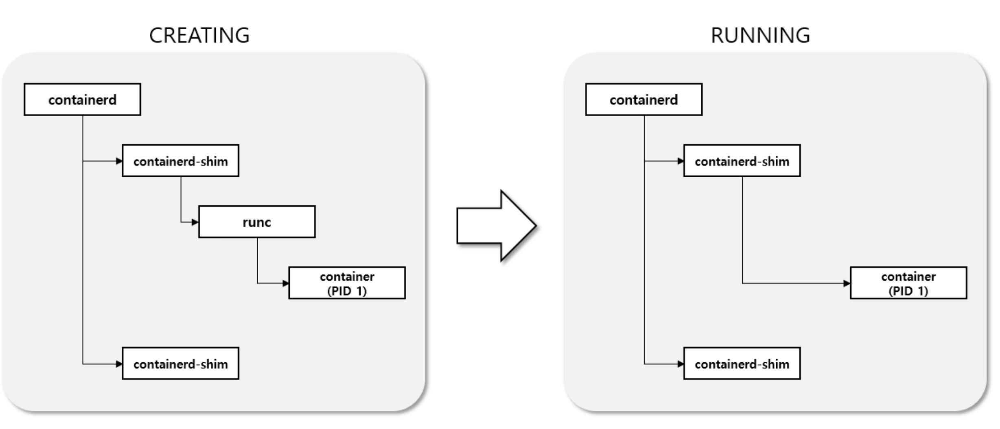
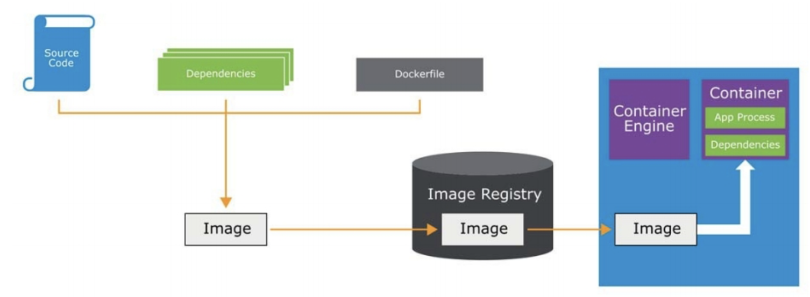
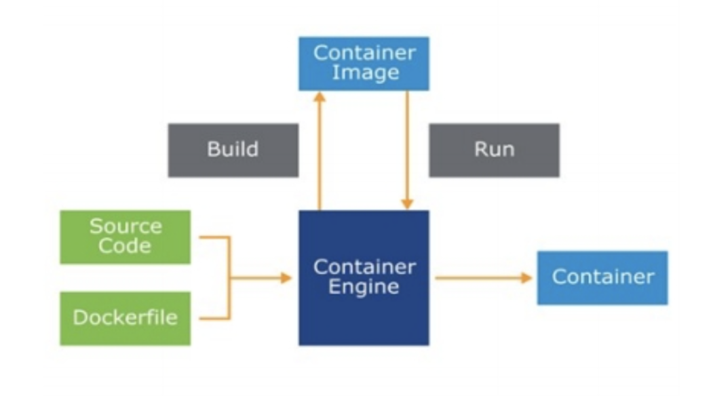

# #1 Containers Overview

### 컨테이너 장점

- Velocity: 개발하고 배포하는 속도를 높일 수 있다.
- Portability: 리눅스 베이스 환경이랄 면 어디서든 실행할 수 있다.
- Reliability: 컨테이너 이미지를 지속적으로 재생산할 수 있어 배포가 간편하고 오류가 줄어든다.
- Efficiency: 자원 사용을 극대화할 수 있다.
- Self-Service: 개발 생산성이 향상된다.
- Isolation: 의존성 충돌 문제를 해결할 수 있다.

### Kernel space vs. User space

- Kernel space는 OS에서 보호되어야 하는 중요한 공간으로, 하드웨어와 상호 작용, 데이터 I/O, 파일 관리, 프로세스 스케줄링 등의 기능을 담당한다.
- User space는 커널 밖에서 동작하는 모든 코드 영역을 말한다.

### Applicattion in VM vs. Container

- VM은 full OS를 캡슐화하며, OS 내에서 동작하는 프로세스들, 메모리 관리, 장치 드라이버, 데몬 및 라이브러리 등 OS와 관련된 모든 것을 포함한다.
- 컨테이너는 OS가 이미 동작한다는 전제하에 하나의 프로세스만을 캡슐화한다. 컨테이너로 캡슐화된 프로세스는 같은 OS 위에서 동작하는 다른 프로세스들과 격리된다.
- VM은 user space와 kernel space를 모두 캡슐화하며, 컨테이너는 user space만 캡슐화한다.

### Container Runtime Component

#### kubelet
- kube-api server로부터 명령을 받아 cri-o, containerd, dockerd 와 같은 CRI 서비스를 호출한다. 이때, gRPC 등의 CRI API를 사용하여 CRI 서비스를 호출할 수 있다.

#### dockerd
- docker client(명령어)에 대응하는 서버 프로세스이다.
- docker client로부터 명령어를 받으면 dockerd는 명령에 따라 containerd를 제어한다. dockerd는 containerd에 의존하므로 dockerd를 실행하려면 container가 먼저 실행되어야 한다.

#### containerd
- containerd-shim 들의 부모 프로세스
- containerd는 high-level 런타임으로, runc를 호출하여 컨테이너를 구동하는 역할을 한다.
- containerd는 dockerd와 독립적으로 실행될 수 있다.

#### containerd-shim
- 컨테이너 내 PID 1 프로세스들의 부모 프로세스
- shim 이란 벽돌을 일정한 간격으로 배열하기 위해 사이에 끼우는 끼운 쇠를 의미하며, container-shim은 containerd와 container(PID 1) 사이에 간격을 유지하는 데 사용된다.
- 컨테이너의 실행 및 상태 조회 등의 기능을 수행한다. runc를 이용하여 컨테이너를 생성하고, 생성 완료된 컨테이너의 부모 프로세스가 된다. 컨테이너가 종료되면 종료 상태를 보고한다.

#### runc
- runc는 low-level 런타임으로, cgroup, namespace 등을 호출하여 컨테이너를 직접 구동한다.
- Docker, CRI-O 등에 의해 호출되어 사용된다.

#### 컨테이너 호출 흐름

1. docker run ... 명령어 입력
2. containerd가 자식 프로세스인 containerd-shim 생성
3. containerd-shim이 runc 호출
4. runc는 컨테이너를 생성하고 종료
5. 생성된 컨테이너(PID 1)는 containerd-shim의 자식 프로세스가 됨

### Container Workflow

일반적으로 컨테이너를 생성하기 위해서는 다음 과정을 거친다.

1. 소스코드 및 의존성, dockerfile 등을 합쳐 image를 build 한다.
2. image를 image registry에 전송한다.
3. image registry의 image는 컨테이너 호스트에게 전달되고, 이미지를 기반으로 컨테이너가 생성된다.

### Container Engines

각 컨테이너 호스트에는 컨테이너 엔진이 설치되어 있으며, 컨테이너 엔진은 컨테이너를 관리하는 역할을 한다.

컨테이너 엔진은 컨테이너 이미지를 생성하거나 이미지 저장소에 저장하는 등 이미지를 관리하는 역할을 한다. 또한, 이렇게 생성된 컨테이너 이미지를 사용하여 컨테이너를 생성하고, 재실행하고, 종료하는 등 컨테이너 관리의 역할도 맡는다.

### Container Image

- 컨테이너 이미지는 VM 스냅샷처럼 컨테이너 호스트에 로드될 컨테이너의 특정 상태를 포함하는 파일이다.
- 컨테이너 이미지는 애플리케이션 코드 및 의존성 등의 정보를 포함한다.
- 이미지는 dockerfile 등의 빌드 결과이며, 컨테이너는 이미지를 실행시킨 결과이다.

### Container Registry

- 컨테이너 저장소는 컨테이너 이미지를 모아두는 중앙 저장소이다.
- Docker Hub, Google Container Registry, Artifactory 등 다양한 컨테이너 저장소가 있다.

### Docker commands

#### Container 생성, 삭제

- `docker run`: 이미지로부터 컨테이너 생성
- `docker stop`: 실행 중인 컨테이너 중지
- `docker rm`: 정지된 컨테이너 삭제 (-f: 강제 종료)

#### Image 관리

- `docker build`: dockerfile으로부터 이미지 생성
- `docker imagaes`: 생성된 이미지 리스트 확인
- `docker rmi`: 이미지 제거
- `docker tag`: 이미지에 태그 추가
- `docker pull`, `docker push`: 이미지 저장소에 이미지 pull/push

### 기타 Docker 명령어

- `docker ps`: 실행 중인 컨테이너 리스트 확인
- `docker logs`: 컨테이너 로그 출력
- `docker exec`: 컨테이너에 명령 전달
- `docker network`: 네트워크 생성

