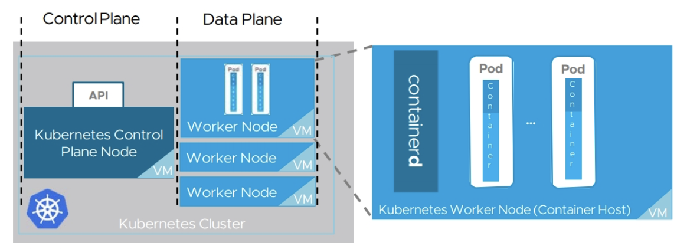
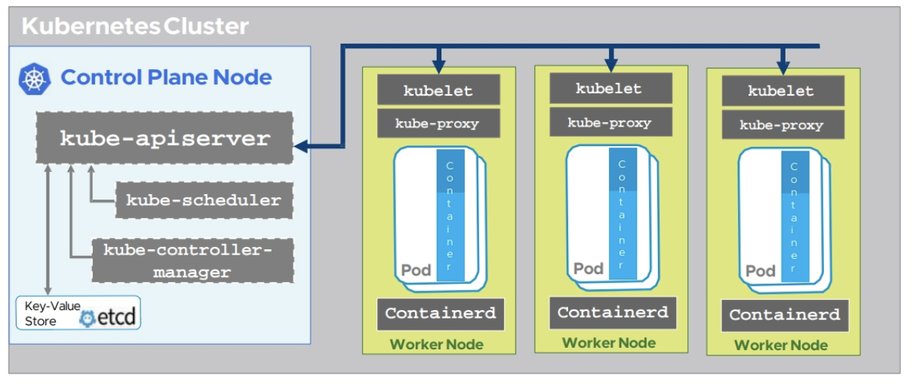
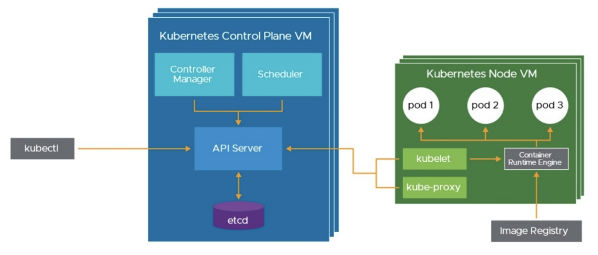
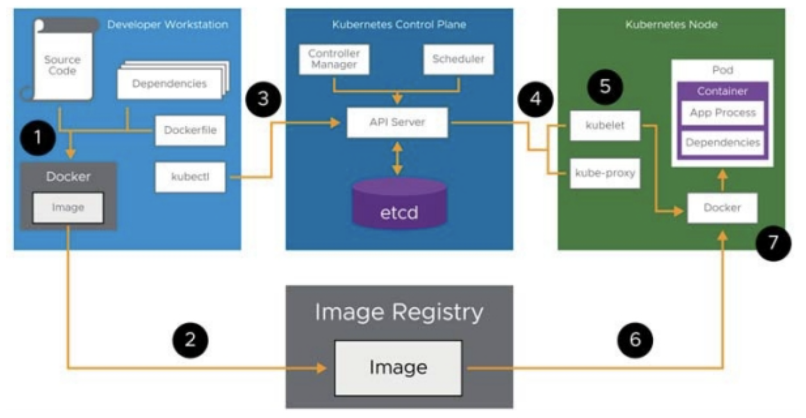

# #2 Kubernetes Overview

### Kubernetes Overview

#### Kubernetes

- 애플리케이션(컨테이너)의 배포, 관리 및 확장을 지원하는 도구이다.
- 베어메탈, 하이퍼바이저, 클라우드 서비스 등 다양한 환경에서 동작한다.
- Declarative configuration을 사용하며, 특정 명령을 내리는 것 대신 '바라는 상태'를 정의함으로써 시스템을 동작시킨다.

#### Docker vs. Kubernetes

Docker는 단일 호스트에서 컨테이너를 관리할 때 유용하다. 하지만, 다중 호스트에서 여러 대의 컨테이너를 관리해야 한다면, Docker는 다음과 같은 문제를 해결하지 못한다.

- 대규모의 컨테이너 관리
- 실패한 컨테이너 재실행
- 용량에 따라 컨테이너 스케일링
- 네트워킹 및 로드 밸런싱

Kubernetes는 컨테이너 orchestration 계층을 제공함으로써 이러한 문제를 해결한다.

#### yaml 파일

- Kubernetes에서 Pod를 포함한 모든 자원들은 yaml 파일을 통해 정의된다.
- yaml 파일에는 다음과 같이 리소스의 바라는 상태가 정의되어 있다.

    ```yaml
    apiVersion: v1
    kind: Pod
    metadata:
      name: my-nginx
      labels:
        app: nginx
    spec:
      containers:
      - name: nginx
        image: nginx:1.7.9
        ports:
          - containerPort: 80
    ```

### Kubernetes Building Blocks

Kubernetes는 크게 Pods, nodes, 그리고 clusters로 구성되어 있다.



#### Pods

- Kubernetes에서 Pod는 컨테이너를 배포하는 최소 단위이다. 컨테이너를 생성하기 위해서는 Pod를 생성해야만 한다.
- 하나의 Pod에는 하나의 컨테이너가 있거나, 면밀하게 연결된 여러 개의 컨테이너가 포함된다. Pod 내의 컨테이너들은 동일한 생성 및 소멸 주기를 갖는다.

#### Nodes

- Pod가 실행되는 일종의 컨테이너 호스트다. 실제 물리 서버 또는 VM을 사용한다.
- Node는 master node와 worker node 두 종류가 있다.
  + master node는 클러스터 내부의 이벤트에 반응하며, 클러스터와 관련된 글로벌한 결정을 내린다.
  + worker node는 Pod를 실제로 생성하는 역할을 한다.

#### Cluster



- Master node에 의해 관리되는 worker node들의 집합을 의미한다.
- Cluster는 control plane과 data plane으로 구분된다. 
  + control plane에는 master node가 위치하며 클러스터에 고가용성을 제공하는 역할을 한다.
  + data plane에는 여러 개의 worker node들이 위치해 있다.

### Kubernetes Architecture

Kubernetes는 다양한 component들로 구성되어 있다.



#### kubectl

- kubectl은 Kubernetes API를 사용하는 CLI이다.
- kubectl 명령어를 사용하여 Kubernetes API 서버에 접근한다.

#### kube-apiServer (master node)

- Kubernetes 시스템의 진입 포인트로, 모든 요청을 받아 처리한다.
- REST API로 요청을 받아 JSON 파일로 상태를 정보를 반환한다.

#### etcd (master node)

- Kubernetes에서 데이터베이스 역할을 하는 component다.
- 클러스터의 상태와 설정 등 모든 정보를 key-value 형태로 저장한다.
- apiServer를 통해 노드와 통신하며 노드의 현재 상태를 파악한다. 그리고 현재 상태와 데이터 스토어에 저장된 바라는 상태 사이의 차이점을 찾아낸다.

#### kube-controller-manager (master node)

- apiserver를 관찰함으로써 클러스터 내의 변화를 감지한다.
- 클러스터 내에 변화가 있을 경우, 바라는 상태에 도달하도록 다양한 컨트롤러들을 실행시키고 관리한다.

#### kube-scheduler (master node)

- 정책을 기반으로 각 노드에 workload를 분산하는 역할을 한다.
- Pod 배치를 결정할 때는 affinity, 자원 상태 등이 고려된다.

#### kubelet (worker node)

- kubelet은 node agent로, node 내에서 컨테이너들이 잘 실행되고 있는지 관찰한다.
- kubelet은 apiServer와 통신하며 node 내 컨테이너 실행 상태를 전달하고, 새로운 work를 부여받는다.

#### kube-proxy (worker node)

- 트래픽을 컨테이너로 라우팅하기 위해 네트워크 규칙을 설정한다.
- 로드 밸런싱을 하거나 가상 IP 주소를 만드는 등의 역할을 한다.

#### docker (worker node)

- docker(containerd)가 위치하며, kubelet의 요청에 의해 컨테이너를 생성한다.

#### Typical Kubernetes Workflow Example

Kubernetes 에서 컨테이너를 생성하는 것은 다음 흐름으로 동작한다.



1. kubectl: 소스 코드와 의존성으로부터 이미지 build
2. kubectl: image registry에 이미지 저장
3. kubectl: kkubernetes apiserver에 이미지 및 pod 생성 요청 api 전송
4. apiServer: scheduler가 pod가 실행될 node를 선정하고, 해당 node로 명령어 전달
5. kubelet: pod 생성 명령 승인
6. docker: image registry로부터 이미지를 가져와 pod 내에 컨테이너 생성

### Kubernetes kubectl CLI

#### API: REST

- Kubernetes의 모든 내부, 외부 컴포넌트들은 REST JSON-based API를 통해 통신한다.

#### API: CLI

- Kubernetes에서 사용하는 API를 위한 command-line interface를 kubectl이라고 부르며, kubectl은 Kubernetes cluster를 관리하기 위해 사용된다.
- kubectl은 명령어에 따른 적절한 REST API를 호출하며, kubectl에 전달된 yaml 파일을 JSON 파일로 변환하여 API에 넘겨준다.
- kubectl client 버전과 Kubernetes API 서비스 버전의 호환성이 맞아야 kubectl을 사용할 수 있다.

### Kubectl commaands

#### kubectl --help

- `kubectl --help` 명령어를 입력하면 kubectl 전체 명령어에 대한 설명을 볼 수 있다.

#### kubectl get

- `kubectl get`은 선택된 네임스페이스에 있는 객체에 대한 정보를 반환하는 명령어다.

    ```bash
    kubectl get pod <pod_name>
    kubectl get pods --all-namespaces   # 모든 namespace에서 검색
    ```

- 특정 네임스페이스를 선택하지 않으면 현재 활성화된 네임스페이스를 기준으로 조회한다. 네임스페이스는 다음과 같이 조회하거나 변경할 수 있다.

    ```bash
    kubectl config get-contexts   # 사용가능한 네임스페이스 리스트 조회
    kubectl config use-context <namespace>   # 활성 네임스페이스 변경
    ```

- `kubectl get nodes`를 사용하면 클러스터에 있는 노드 정보를 확인할 수 있다.

    ```bash
    kubectl get nodes -o wide   ## 자세한 정보 조회
    ```

- `kubectl get events`를 사용하면 클러스터에서 발생한 이벤트 로그 기록을 확인할 수 있다. 이벤트 로그는 troubleshooting에 도움이 되며, 기본적으로 1시간 저장된다.

    ```bash
    kubectl get events
    ```

#### kubectl describe

- `kubectl describe`는 객체에 대한 더 자세한 정보를 반환하는 명령어다. describe 결과는 객체가 발생한 이벤트 로그까지 포함한다.
  
    ```bash
    kubectl describe pod <pod_name>
    ```

#### kubectl apply

- `kubectl apply`는 yaml 파일의 내용을 적용하여 리소스를 생성하거나 업데이트하는 명령어다. 

    ```bash
    kubectl apply -f [ <file> | <dir> | <url> ]
    ```

#### kubectl create/replace/edit/patch

선언형이 아닌 명령형으로 리소스를 생성하거나 업데이트를 할 때는 다음 명령어가 사용된다.

- `kubectl create`: 파일로부터 새로운 리소스 생성
- `kubectl replace`: 파일로부터 기존 리소스 업데이트
- `kubectl edit`: editor를 사용하여 기존 리소스 업데이트
- `kubectl patch`: code snippet을 병합함으로써 기존 리소스 업데이트

#### kubectl delete

- `kubectl delete`는 리소스를 삭제하는 명령어다.
  
    ```bash
    kubectl delete pod <pod_name>
    ```

#### kubectl logs

- `kubectl logs`는 Pod 내의 컨테이너의 로그를 출력해준다.

    ```bash
    kubectl logs <pod_namae>
    ```

- 만약 pod에 하나 이상의 컨테이너가 있다면, -c 옵션을 사용하여 컨테이너를 특정할 수 있다.

    ```bash
    kubectl logs <pod_namae> -c <container_name>
    ```

### Reference

- [Kubernetets Documentation](https://kubernetes.io/ko/docs/)
- Kubernetes Fundamentals and Cluster Operations Lecture notes