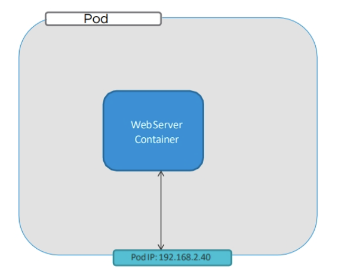
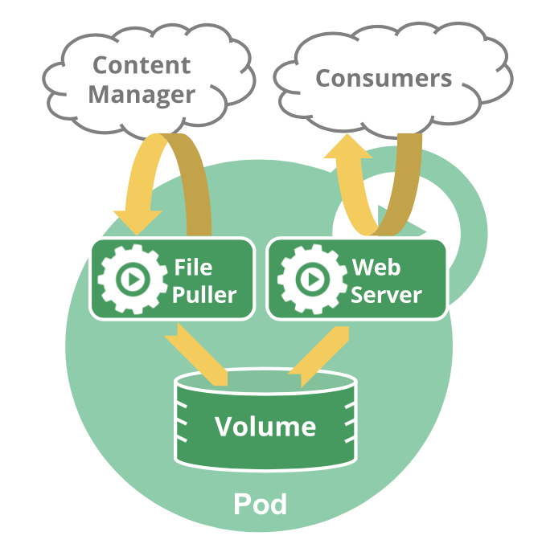
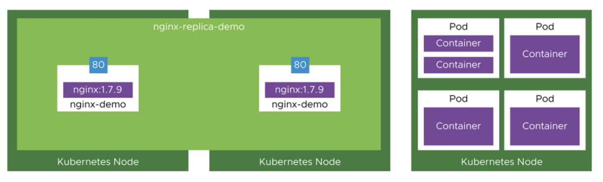
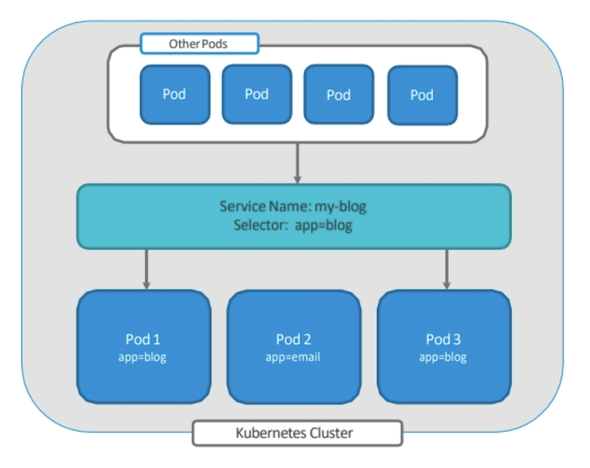
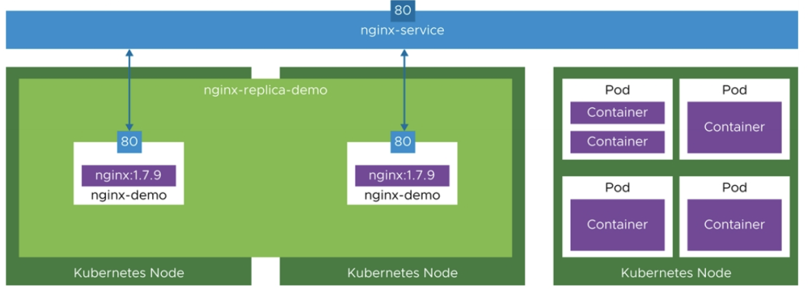
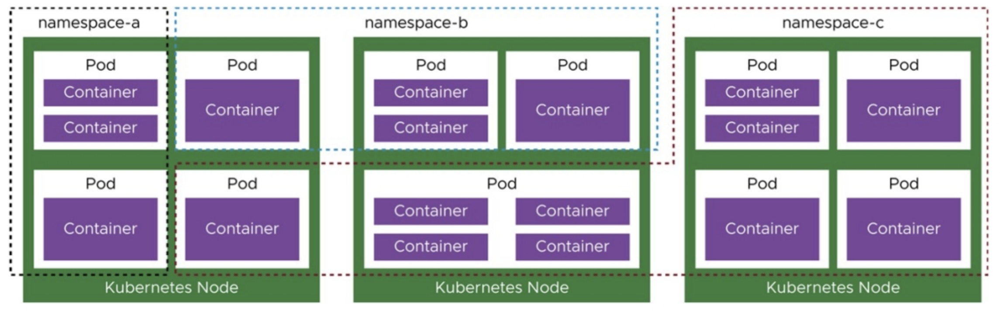

# #3 Basic Kubernetes Objects

## Kubernetes Objects

### Objects

- 쿠버네티스 오브젝트는 쿠버네티스 시스템에서 영속성을 가지는 오브젝트이다. 오브젝트를 생성하게 되면, 쿠버네티스 시스템은 그 오브젝트 생성을 보장하기 위해 지속적으로 작동할 것이다.
- 오브젝트는 두 개의 오브젝트 필드를 포함하는데, 오브젝트 `spec` 과 오브젝트 `status` 이다.
  + spec은 오브젝트가 의도하는 상태이며, status는 오브젝트의 현재 상태이다.
  + 쿠버네티스는 오브젝트의 status를 spec과 일치시키는 방향으로 동작한다.

### Object Spec

- 오브젝트 spec은 Kubernetes의 manifest 파일로, yaml 형식으로 작성된다.
- spec은 오브젝트의 바라는 상태를 명시하고 있으며, 해당 manifest가 적용되면 Kubernetes는 manifest에 명시된 상태를 유지한다.
- spec은 크게 apiVersion, kind, metadata, spec의 4 부분으로 구성된다.

    ```yaml
    apiVersion: apps/v1
    kind: Deployment
    metadata:
    name: nginx-deployment
    spec:
    selector:
        matchLabels:
        app: nginx
    replicas: 2 # tells deployment to run 2 pods matching the template
    template:
        metadata:
        labels:
            app: nginx
        spec:
        containers:
        - name: nginx
            image: nginx:1.14.2
            ports:
            - containerPort: 80
    ```

    + apiVersion: 이 오브젝트를 생성하기 위해 사용하고 있는 쿠버네티스 API 버전이 어떤 것인지
    + kind: 어떤 종류의 오브젝트를 생성하고자 하는지
    + metadata: 이름, UID, 네임스페이스 등 오브젝트를 유일하게 구분 지어 줄 데이터
    + spec: 오브젝트에 대해 어떤 상태를 의도하는지

## Pods

- Pod는 Kubernetes에서 생성하고 관리할 수 있는 배포 가능한 가장 작은 컴퓨팅 단위이다.
- Pod는 하나 이상의 컨테이너의 그룹이다. 이 그룹은 스토리지 및 네트워크를 공유하고, 해당 컨테이너를 구동하는 방식에 대한 명세를 갖는다. Pod의 콘텐츠는 항상 함께 배치되고, 함께 스케줄 되며, 공유 context에서 실행된다.

### Pod와 Container

- Kubernetes에서 컨테이너를 실행하기 위해서는 Pod가 생성되어야 한다.
- 하나의 Pod에 하나의 컨테이너가 있는 것이 가장 일반적인 방식이다.
  + 이 경우, Pod를 단일 컨테이너를 둘러싼 wrapper로 생각할 수 있다.
  + 쿠버네티스는 컨테이너를 직접 관리하는 대신 Pod를 관리한다.

    

### Multiple containers in a Pod

- 여러 컨테이너들이 밀접하게 결합되어 있고 리소스를 공유해야 하는 경우에는 여러 컨테이너를 하나의 Pod에 결합할 수 있다.
- 이렇게 함께 배치된 컨테이너는 하나의 결합된 서비스 단위를 형성한다. 예를 들어, 하나의 컨테이너는 공유 볼륨에 저장된 데이터를 퍼블릭에 제공하는 역할을 하고, 별도의 사이드카 컨테이너는 해당 파일을 새로 고치거나 업데이트하는 등 결합된 역할을 수행한다.
- Pod는 컨테이너, 스토리지 리소스, 임시 네트워크 ID를 단일 단위로 함께 캡슐화한다.
- 일부 Pod에는 앱 컨테이너뿐만 아니라 초기화 컨테이너도 포함되어 있다. 초기화 컨테이너는 앱 컨테이너가 시작되기 전에 실행되고 완료되는 컨테이너다.

    

## ReplicaSets

- ReplicaSets은 명시된 Pod 개수만큼 Pod가 생성되고 안정적으로 실행됨을 보장하는 목적으로 사용되는 오브젝트다.
- Replica pods는 하나의 동일한 노드에서 실행되기도 하고, 여러 개의 노드에서 실행되기도 한다.

  

### replicasets.yaml 파일 예시

```yaml
apiVersion: apps/v1
kind: ReplicaSet
metadata:
  name: frontend
  labels:
    app: guestbook
    tier: frontend
spec:
  # 케이스에 따라 레플리카를 수정한다.
  replicas: 3
  selector:
    matchLabels:
      tier: frontend
  template:
    metadata:
      labels:
        tier: frontend
    spec:
      containers:
      - name: php-redis
        image: gcr.io/google_samples/gb-frontend:v3
```

## Deployment

- Deployment는 Pod와 ReplicaSet에 대한 선언적 업데이트 기능을 제공한다.
  + Deployment Controller는 현재 상태에서 업데이트하고자 하는 상태로 비율을 조정하며 순차적으로 업데이트하는 rolling update 기능을 제공한다.
  + downtime 없이 이미지 업데이트를 가능하게 한다.
- Deployment은 하나의 manifest 파일로 Pod와 ReplicaSet 선언을 모두 할 수 있다.
- Deployment에서 업데이트되는 버전은 모두 저장되어 있으며, 현재 상태가 안정적이지 않은 경우 Deployment의 이전 버전으로 롤백 할 수 있다.

### deployment.yaml 파일 예시

```yaml
apiVersion: apps/v1
kind: Deployment
metadata:
  name: nginx-deployment
  labels:
    app: nginx
spec:
  replicas: 3
  selector:
    matchLabels:
      app: nginx
  template:
    metadata:
      labels:
        app: nginx
    spec:
      containers:
      - name: nginx
        image: nginx:1.14.2
        ports:
        - containerPort: 80
```

## Service

- Pod는 비영구적 리소스로, Deployment는 Pod를 동적으로 생성하고 제거할 수 있다. 각 Pod는 고유한 IP 주소를 갖지만, Deployment에서는
한 시점에 실행되는 Pod 집합이 잠시 후 실행되는 해당 Pod 집합과 다를 가능성이 있다.
- Service는 Pod의 논리적 집합과 그것들에 접근할 수 있는
정책을 정의하는 추상적인 개념이다. Service는 오브젝트들을 추상화하여 해당 오브젝트가 하나의 대표 IP 주소를 갖고 외부와 통신할 수 있도록 지원한다.

### Selector

- 서비스가 대상으로 하는 Pod 집합은 일반적으로 셀렉터가 결정한다.
- 아래 파일은 "my-service"라는 새로운 서비스 오브젝트를 생성하고, app=MyApp 레이블을 가진 파드의 TCP 9376 포트를 대상으로 한다.

    ```yaml
    apiVersion: v1
    kind: Service
    metadata:
    name: my-service
    spec:
    selector:
        app: MyApp
    ports:
        - protocol: TCP
        port: 80
        targetPort: 9376
    ```

    

- Kubernetes는 이 서비스에 서비스 프록시가 사용하는 IP 주소를 할당한다.

  

- 서비스 셀렉터의 컨트롤러는 셀렉터와 일치하는 Pod를 지속적으로 검색하고, "my-service"라는 엔드포인트 오브젝트에 대한 모든 업데이트를 POST한다.

## Namespace

- namespace는 단일 클러스터 내에서의 리소스 그룹 격리 메커니즘을 제공한다. 네임스페이스는 클러스터 자원을 여러 사용자 사이에서 나누는 방법이다.
  + 각 namespace에서는 CPU, memory, storage, kubernetes 오브젝트 등 모든 자원에 대한 limit을 설정할 수 있다.
- 리소스의 이름은 namespace 내에서 유일해야 하며, 모든 namespace 내에서 유일할 필요는 없다.
- Namespace 기반 오브젝트들(Deployment, Service 등)에는 namespace를 적용할 수 있으나, cluster 범위의 오브젝트들(Storage class, nodes, PersistentVolumne 네임스페이스 기반 분류를 적용할 수 없다.

  

- 단순히 약간 다른 리소스를 분리하기 위해 여러 네임스페이스를 사용할 필요는 없다. 이 경우 레이블을 사용하면 동일한 네임스페이스 내에서 리소스를 구별할 수 있다.

### 초기 namespace

쿠버네티스는 처음에 네 개의 초기 네임스페이스를 갖는다.

```bash
$ kubectl get namespace

NAME              STATUS   AGE
default           Active   1d
kube-node-lease   Active   1d
kube-public       Active   1d
kube-system       Active   1d
```

#### default

- namespace가 없는 오브젝트를 위한 기본 namespace

#### kube-system

- 쿠버네티스 시스템에서 생성한 오브젝트를 위한 namespace

#### kube-public

- 인증되지 않은 사용자를 포함하여 모든 사용자가 읽기 권한으로 이 namespace에 접근할 수 있다. 이 namespace는 주로 전체 클러스터 중에 공개적으로 드러나서 읽을 수 있는 리소스를 위해 예약되어 있다. 

#### kube-node-lease

- 클러스터가 스케일링될 때 노드 heartbeat의 성능을 향상시키는 리스(lease) 오브젝트에 대한 namespace
- 이 네임스페이스는 각 노드와 연관된 Lease 오브젝트를 갖는다. 노드 리스는 kubelet이 heartbeat을 보내서 컨트롤 플레인이 노드의 장애를 탐지할 수 있게 한다.

### namespace 설정 방법

- 네임스페이스를 설정하기 위해서 --namespace 플래그를 사용한다.

  ```bash
  kubectl run nginx --image=nginx --namespace=<namespace_name>
  kubectl get pods --namespace=<namespace_name>
  ```

- 모든 kubectl config 명령어를 통해 기본 네임스페이스를 context에 영구적으로 저장할 수 있다.
  
  ```bash
  kubectl config set-context --current --namespace=<namespace_name>
  ```

## Labels

- Label은 Pod 등의 오브젝트에 태그된 key-value 쌍이다.
- Label은 오브젝트의 특성을 식별하는 데 사용된다. 오브젝트의 하위 집합을 구성하고 활용할 수 있다. 이는 사용자에게 중요하지만, 코어 시스템에 직접적인 의미는 없다. 
- Label은 오브젝트를 생성할 때에 붙이거나 생성 이후에 붙이거나 언제든지 수정이 가능하다. 오브젝트마다 key-value 값으로 label을 정의할 수 있어야 하므로. 오브젝트의 key는 고유한 값이어야 한다.

### Label 예시

- Label을 이용하면 사용자가 느슨하게 결합한 방식으로 조직 구조와 시스템 오브젝트를 매핑할 수 있으며, 클라이언트에 매핑 정보를 저장할 필요가 없다.
- 다음과 같은 label이 일반적으로 사용된다.
  + `"release" : "stable"`, `"release" : "canary"`
  + `"environment" : "dev"`, `"environment" : "qa"`, `"environment" : "production"`
  + `"tier" : "frontend"`, `"tier" : "backend"`, `"tier" : "cache"`
  + `"partition" : "customerA"`, `"partition" : "customerB"`
  + `"track" : "daily"`, `"track" : "weekly"`

### Label 선언

- 다음과 같이 오브젝트를 선언할 때 metadata 내의 labels 영역에서 label을 지정할 수 있다.

```yaml
apiVersion: v1
kind: Pod
metadata:
  name: label-demo
  labels:
    environment: production
    app: nginx
spec:
  containers:
  - name: nginx
    image: nginx:1.14.2
    ports:
    - containerPort: 80
```

### Label Selector

- 사용자는 label 셀렉터를 통해 오브젝트를 식별하고 선택할 수 있으며, label 셀렉터는 쿠버네티스 코어 그룹의 기본이 된다.

#### 일치/불일치 기준 필터링

Label 셀렉터는 다음과 같이 label의 key와 value의 필터링을 허용한다.

- `= 또는 ==` 는 연산자의 일치성을 의미한다.
  + `environment = production`은 environment를 key로 가지는 것과 production을 value으로 가지는 모든 리소스를 선택한다.
- `!=` 는 불일치를 의미한다.
  + `tier != frontend`는 tier를 key로 가지는 오브젝트 중 frontend를 value로 가지는 오브젝트를 제외한 모든 리소스를 선택한다.

#### 집합성 기준 필터링

집합성 기준 레이블 요건에 따라 value 집합을 key로 필터링할 수 있다. `in`, `notin`, `exists` 3개의 연산자를 지원한다.

- `environment in (production, qa)`
  + key가 environment이고 value이 production 또는 qa인 모든 리소스를 선택한다.
- `tier notin (frontend, backend)`
  + key가 tier이고 값이 frontend와 backend를 가지는 리소스를 제외한 모든 리소스(공백 포함)를 선택한다.
- `partition`
  + 레이블의 value에 상관없이 key가 partition을 포함하는 모든 리소스를 선택한다.
- `!partition`
  + 레이블의 value에 상관없이 key가 partition을 포함하지 않는 모든 리소스를 선택한다.

### labelSelector.yaml

```yaml
apiVersion: v1
kind: Pod
metadata:
name: cuda-test
spec:
containers:
    - name: cuda-test
    image: "k8s.gcr.io/cuda-vector-add:v0.1"
    resources:
        limits:
        nvidia.com/gpu: 1
nodeSelector:
    accelerator: nvidia-tesla-p100
```

## Reference

- [Kubernetes Documentation](https://kubernetes.io/ko/docs/)
- Kubernetes Fundamentals and Cluster Operations Lecture notes