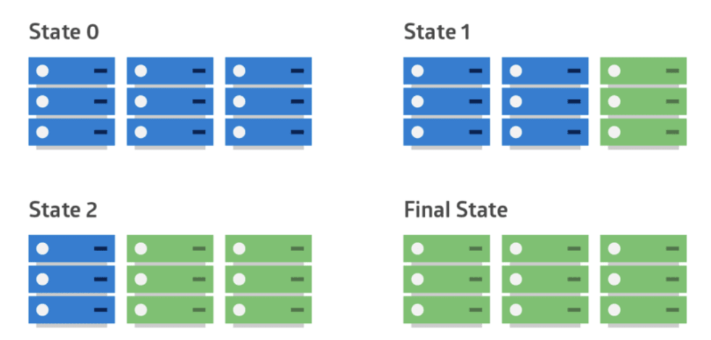
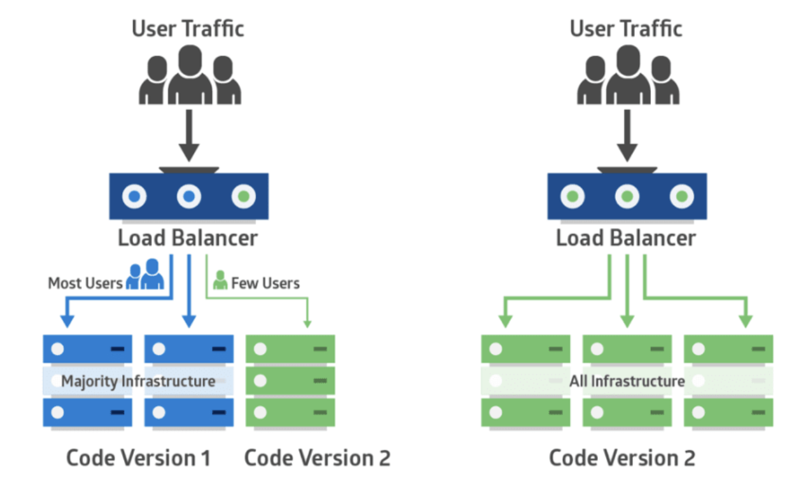
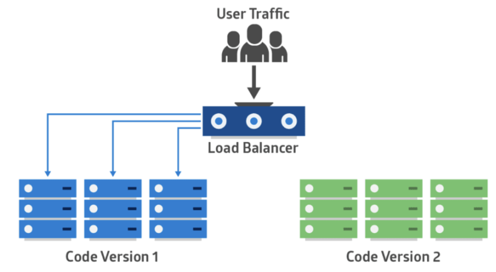
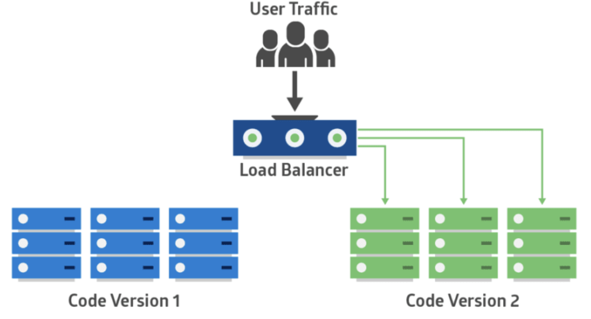

# #4 Deployment Management

## Deployment Strategies

- Deployment를 사용하면 ReplicaSets의 생성 및 업데이트를 쉽게 관리할 수 있다.
- Deployment 전략은 ReplicaSet이 업데이트되는 방식을 결정한다.
- 기본 내장된 Deployment 전략에는 `RollingUpdate`와 `Recreate` 두 가지 배포 전략이 있으며, 따로 지정하지 않는 경우에는 `RollingUpdate`가 기본 값으로 설정된다.

### RollingUpdate Deployment

- RollingUpdate 배포는 Pod를 점진적으로 새로운 것으로 업데이트하여 Deployment 업데이트가 서비스 중단 없이 이루어질 수 있도록 해준다. 새로운 Pod는 가용한 자원을 보유한 노드로 스케줄된다.
- ReplicaSet에서 업데이트가 적용될 경우 업데이트 정보가 적용된 새로운 ReplicaSet이 scale up 되며 생성되고, 그러면서 기존의 ReplicaSet은 서서히 scale down 되며 사라진다.
- 기본적으로, 업데이트가 이루어지는 동안 이용 불가한 Pod의 최대 개수와 생성 가능한 새로운 Pod의 최대 개수는 1개다. 이는 Pod의 개수 또는 백분율로 지정될 수 있다.
- Deployment 업데이트는 버전으로 관리되며, 업데이트는 언제든 이전의 안정적인 버전으로 원복이 가능하다.



### Recreate deployment
  
- Recreate 배포는 기존의 ReplicaSet의 Pod들을 모두 삭제하고, 그 후에 새로운 ReplicaSet에 새로운 Pod들을 생성하는 방식이다.
- Recreate는 서비스에 짧은 기간 순단이 발생할 것이다.

### Canary deployment

- Canary 배포는 위험을 빠르게 감지할 수 있는 배포 전략이다. 기존 버전의 ReplicaSet과 새로운 버전의 ReplicaSet을 모두 구성하고, 일부 트래픽을 새로운 ReplicaSet으로 분산하여 오류 여부를 판단한다.
- 트래픽을 분산하는 전략은 랜덤, 사용자 프로필 기반 등 다양한 방법을 사용할 수 있다. 분산 결과에 따라 업데이트 버전으로 전체 운영 환경을 대체할지, 다시 예전 버전으로 돌아갈지 결정한다.



### Blue/Green deployment

- Blue/Green 배포는 기존 버전에서 새 버전으로 일제히 전환하는 전략이다.
- 기존 버전의 ReplicaSet과 새로운 버전의 ReplicaSet을 동시에 나란히 구성하고 배포 시점이 되면 트래픽을 일제히 전환시킨다.
- 한 가지 버전으로 운영되므로 버전 관리 문제를 방지할 수 있고, 또한 빠른 롤백이 가능하다는 장점이 있다.
- 다만 시스템 자원이 두 배로 필요하고, 전체 플랫폼에 대한 테스트가 진행 되어야 한다.





## Controlling Deployments

### Pause/Resume

- 다음 명령어를 사용하여 배포를 일시정지하거나 재개할 수 있다.

  ```bash
  kubectl rollout [ pause | resume ] deployment <name>
  ```

### Roll back

- 다음 명령어를 사용하여 이전 버전으로 롤백 할 수 있다.

  ```bash
  kubectl apply -f deployment.yaml          # declarative
  kubectl rollout undo depolyment <name>    # imperative
  ```

### Deployment Options

- `progressDeadlineSeconds`
  + 배포에 소요되는 최대 시간을 지정한다.
- `minReadySeconds`
  + 새롭게 생성된 pod가 준비되기 위한 최소 시간을 지정한다. 기본값은 0이다.
- `revisionHistoryLimit`
  + rollback을 위해 유지할 ReplicaSets 버전의 수를 지정한다. 기본 값은 10이다.
- `Paused`
  + 배포를 일시정지한다. 이 값이 true일 경우, spec 변경이 배포를 trigger하지 않는다.

## Reference

- [Kubernetes Documentation](https://kubernetes.io/ko/docs/)
- Kubernetes Fundamentals and Cluster Operations Lecture notes
- [배포 전략: Rolling, Blue/Green, Canary](https://onlywis.tistory.com/10)
- [Intro to deployment strategies: blue-green, canary, and more](https://dev.to/mostlyjason/intro-to-deployment-strategies-blue-green-canary-and-more-3a3)