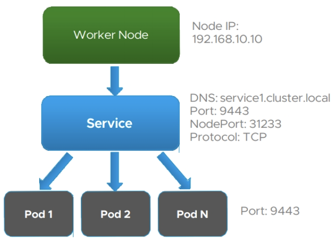

# #6 Kubernetes Networking

## Kubernetes Cluster Networking

### Within a Pod

- 동일 pod 내의 컨테이너들은 네트워크 네임스페이스를 공유하며, 이는 pod 내 모든 컨테이너가 localhost 에서 서로의 포트에 도달할 수 있음을 의미한다.

- pod 내의 컨테이너들은 localhost의 포트 사용을 조정하여 서로 통신할 수 있다.

### Pod to Pod

- 모든 pod는 고유의 IP 주소를 갖는다. Pod는 IP 주소를 사용하여 클러스터 내의 모든 곳에 라우팅 될 수 있다.

### Services to Pods

- Pod는 비영구적인 리소스로, deployment는 pod를 동적으로 생성하고 제거한다. 따라서 현재 실행 중인 pod는 잠시 후 실행될 pod와 다른 IP 주소를 가질 수 있다.
- 이러한 특징은 특정 서비스 또는 외부에서 pod에 지속적인 통신이 필요할 경우 문제가 된다. Kubernetes에서는 이것을 해결하기 위해 Service 오브젝트를 사용한다.

## Kubernetes Services



- Pod들은 동적으로 생성되거나 삭제될 가능성이 있으므로, 특정 pod와 직접 통신하는 대신 서비스라는 추상 네트워킹 계층과 통신한다.
- 서비스는 pod들을 논리적으로 그룹핑하는 추상적인 개념으로, 신뢰할 수 있는 안정적인 네트워킹을 제공한다.
- 서비스를 사용할 경우, 통신을 시도하는 외부 서버는 더 이상 pod의 상태나 pod의 IP 주소를 신경 쓸 필요가 없다.

### service.yaml

- 서비스는 다음과 같이 셀렉터를 사용함으로써, `app=MyApp`라는 label을 갖는 pod들을 하나의 서비스 집합으로 그룹핑한다.

```yaml
apiVersion: v1
kind: Service
metadata:
  name: my-service
spec:
  selector:
    app: MyApp
  ports:
    - protocol: TCP
      port: 80
      targetPort: 9376
```

## Service Types

- ServiceTypes의 기본값은 ClusterIP 이며, `ClusterIP` 는 클러스터 내에서만 서비스를 노출시킬 수 있다.
- 서비스를 클러스터 밖에 위치한 외부 IP 주소에 노출하기 위해서는 `NodePort` 또는 `LoadBalancer` ServiceTypes 을 지정해야 한다.
- 또 다른 방법으로는 Ingress(인그레스) 오브젝트를 사용하여 서비스를 노출시키는 것이 있다. 이는 아래에서 정리할 예정이다.

### ClusterIP


- ClusterIP는 클러스터 내에서 통신하기 위한 서비스 타입이다.
- 특정 pod들의 집합을 서비스 계층에 연결하면, 클러스터 내의 다른 pod들은 해당 ClusterIP가 가진 가상 IP에 접근할 수 있다. ClusterIP는 연결된 pod들에 네트워크 요청을 로드 밸런싱 한다.
- 클러스터 외부에서는 ClusterIP에 접근할 수 없다.

### NodePort


- NodePort는 정적 포트를 사용함으로써 클러스터 외부 통신을 지원하는 서비스 타입이다.
- NodePort를 설정하면 쿠버네티스의 control-plane은 지정된 범위에서 포트 번호를 할당한다. 특정 포트 번호를 지정하는 것도 가능하다.
- NodePort를 통해 외부에서 네트워크 요청을 받으면, 이것은 ClusterIP를 통해 pod로 로드 밸런싱된다.

```yaml
apiVersion: v1
kind: Service
metadata:
  name: my-service
spec:
  type: NodePort
  selector:
    app: MyApp
  ports:
      # 기본적으로 그리고 편의상 `targetPort` 는 `port` 필드와 동일한 값으로 설정된다.
    - port: 80
      targetPort: 80
      # 선택적 필드
      # 기본적으로 그리고 편의상 쿠버네티스 컨트롤 플레인은 포트 범위에서 할당한다(기본값: 30000-32767)
      nodePort: 30007
```

### LoadBalancer


- 외부 로드 밸런서를 지원하는 클라우드 공급자 상에서, type
필드를 LoadBalancer로 설정하면 서비스에 대한 로드 밸런서를 프로비저닝한다.
- 외부 로드 밸런서의 트래픽은 백엔드 pod로 전달된다.

```yaml
apiVersion: v1
kind: Service
metadata:
  name: my-service
spec:
  selector:
    app: MyApp
  ports:
    - protocol: TCP
      port: 80
      targetPort: 9376
  clusterIP: 10.0.171.239
  type: LoadBalancer
status:
  loadBalancer:
    ingress:
    - ip: 192.0.2.127
```

## Ingress


- 인그레스는 클러스터 내의 서비스에 대한 외부 접근을 관리하는 API 오브젝트다. 인그레스는 클러스터 외부에서 내부 서비스로 http와 https 경로를 노출하고, 인그레스 리소스에 정의된 규칙에 의해 트래픽이 라우팅 된다.
- 인그레스는 외부에서 접속 가능한 url, 로드 밸런스 트래픽, SSL/TLS 종료 및 이름 기반 가상 호스팅 등을 제공하도록 구성할 수 있다.
- 인그레스는 임의의 포트나 프로토콜을 노출하지 않으며, http/https 이외의 서비스를 노출하기 위해서는 `serviceType=NodePort` 또는 `serviceType=loadBalancer`를 사용한다.

### Ingress.yaml

```yaml
apiVersion: networking.k8s.io/v1
kind: Ingress
metadata:
  name: minimal-ingress
  annotations:
    nginx.ingress.kubernetes.io/rewrite-target: /
spec:
  rules:
  - http:
      paths:
      - host: "foo.bar.com"
        path: /testpath
        pathType: Prefix
        backend:
          service:
            name: test
            port:
              number: 80
```

- metadata
  + 인그레스의 이름은 유효한 DNS 서브도메인 이름이어야 한다.
- spec
  + 들어오는 요청과 일치하는 규칙 목록을 포함한다.

### Ingress 규칙

#### host

- host가 지정되면 규칙은 해당 호스트에 적용된다.
- host가 지정되지 않으면 들어오는 모든 트래픽에 대해 규칙이 적용된다.

#### path

- path(/testpath)에는 service.name, service.port.name, service.port.number 등이 정의된 백엔드가 위치해 있다. 로드 밸런서가 서비스로 트래픽을 보내기 전에, 로드 밸런서는 호스트와 경로가 모두 수신 요청의 내용과 일치하는지 확인한다.

#### pathType

- pathType은 경로 유효성 검사를 하는 방식이다. 다음 세 가지 옵션을 가질 수 있다.
  + `ImplementaaitonSpecific`: 이 경로 유형은 IngressClass에 따라 달라진다.
  + `Exact`: url의 대소문자까지 정확히 일치
  + `Prefix`: url 경로의 접두사를 '/'를 기준으로 분리한 값과 일치 시킨다.

#### backend

- `service backend`를 사용하면 트래픽을 어떤 서비스로 라우팅할지 결정한다.
- backend에서 service 대신 resource를 사용할 수도 있다. `resource backend`는 일반적으로 정적 오브젝트 스토리지 백엔드로 데이트를 수신하기 위해 사용한다.
- 만약 인그레스 오브젝트의 http 요청과 일치하는 호스트나 경로가 없다면, 트래픽은 `defaultBackend`로 라우팅 된다. `defaultBackend`는 인그레스 컨트롤러의 기본 옵션으로, 인그레스 리소스에 지정되어 있지 않다.

### Ingress Controller

- 인그레스가 작동하기 위해서는 반드시 인그레스 컨트롤러가 필요하다. 인그레스 컨트롤러는 클러스터와 함께 자동으로 실행되지 않으므로, 인그레스 컨트롤러 구현을 위한 적절한 솔루션을 선택해야 한다.

## Service Discovery

- 서비스, 인그레스, 로드 밸런서 등은 IP 트래픽을 라우팅하는 기능을 제공하지만, IP 주소는 여전히 변경의 여지가 있다.
- 서비스 디스커버리는 서비스 registry에 애플리케이션을 등록함으로써 이 문제를 해결한다. DNS와 유사하다.
- Kubernetes는 내부 DNS 시스템을 사용하여 네임스페이스에서 동작하는 서비스를 검색한다.


## Reference

- [Kubernetes Documentation - Service](https://kubernetes.io/ko/docs/concepts/services-networking/service/)
- [Kubernetes Documentation - Ingress](https://kubernetes.io/ko/docs/concepts/services-networking/ingress/)
- Kubernetes Fundamentals and Cluster Operations Lecture notes
