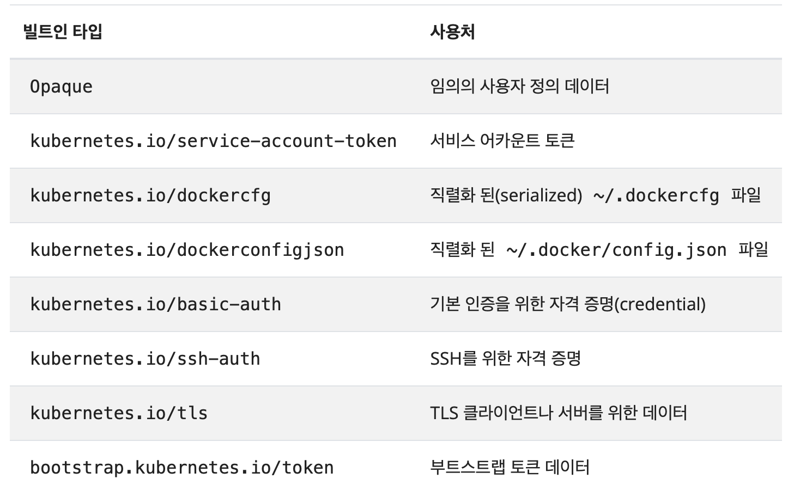
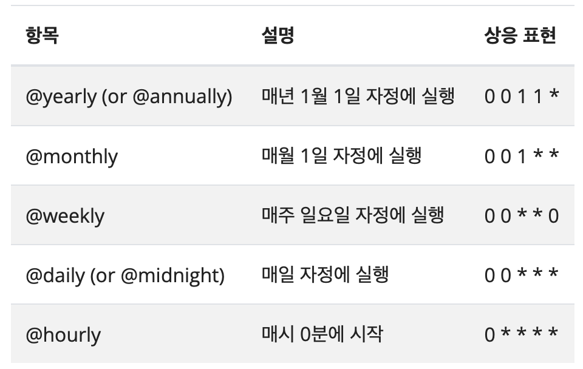

# #8 Additional Resources for Deploying Workloads

## ConfigMap

- ConfigMap은 코드와 별개로 구성 데이터를 key-value 형식으로 저장하는 데 사용하는 API 오브젝트이다.
- ConfigMap은 암호화나 보안을 제공하지 않는다. 기밀 데이터의 경우 Secret을 사용해야 한다.
- ConfigMap에 저장된 데이터는 1MiB를 초과할 수 없다. 이 제한보다 큰 설정을 저장해야 하는 경우, 볼륨을 마운트 하거나 별도의 DB 등을 사용해야 한다.

### ConfigMap Field

- 다른 오브젝트들과 달리 configMap은 `spec` 대신 `data` 및 `binaryData` 필드가 있다. 이 필드들은 key-value 쌍을 값으로 가질 수 있다.
- `data` 필드와 `binaryData` 필드는 모두 선택 사항이며, 두 필드의 키는 서로 겹치지 않아야 한다.

### ConfigMap과 Pod

- Pod는 configMap의 데이터를 참조하여 컨테이너를 구성할 수 있다.
- Pod와 configMap은 같은 네임스페이스에 있어야 한다.

#### configMap.yaml

```yaml
apiVersion: v1
kind: ConfigMap
metadata:
  name: game-demo
data:
  # 속성과 비슷한 키; 각 키는 간단한 값으로 매핑됨
  player_initial_lives: "3"
  ui_properties_file_name: "user-interface.properties"

  # 파일과 비슷한 키
  game.properties: |
    enemy.types=aliens,monsters
    player.maximum-lives=5    
  user-interface.properties: |
    color.good=purple
    color.bad=yellow
    allow.textmode=true  
```

#### game-demo를 사용한 pod 구성

```yaml
apiVersion: v1
kind: Pod
metadata:
  name: configmap-demo-pod
spec:
  containers:
    - name: demo
      image: alpine
      command: ["sleep", "3600"]
      env:
        # 환경 변수 정의
        # 참고로 여기서는 컨피그맵의 키 이름과 대소문자가 다르다.
        - name: PLAYER_INITIAL_LIVES
          valueFrom:
            configMapKeyRef:
              # 이 값의 컨피그맵
              name: game-demo          
              # 가져올 키 
              key: player_initial_lives
        - name: UI_PROPERTIES_FILE_NAME
          valueFrom:
            configMapKeyRef:
              name: game-demo
              key: ui_properties_file_name
      volumeMounts:
      - name: config
        mountPath: "/config"
        readOnly: true
  volumes:
    # 파드 레벨에서 볼륨을 설정한 다음, 해당 파드 내의 컨테이너에 마운트한다.
    - name: config
      configMap:
        # 마운트하려는 컨피그맵의 이름을 제공한다.
        name: game-demo
        # 컨피그맵에서 파일로 생성할 키 배열
        items:
        - key: "game.properties"
          path: "game.properties"
        - key: "user-interface.properties"
          path: "user-interface.properties"
```

### Immutable ConfigMap

- 만약 configMap을 변경할 수 없는 것으로 설정하고자 한다면 immutable로 표시할 수 있다. immutable configMap을 사용하면 다음과 같은 이점이 있다.
  + 원하지 않는 업데이트로부터 데이터를 보호할 수 있다.
  + immutable로 표시된 configMap에 대한 감시를 중단하여, kube-apiserver의 부하를 줄임으로써 클러스터 성능을 향상시킨다.
- configMap을 immutable로 설정하면 필드 내용을 변경하거나 immutable을 해제할 수 없다. 필요할 경우 configMap을 삭제하고 다시 작성할 수 있다.

```yaml
apiVersion: v1
kind: configMap
metadata:
  ...
data:
  ...
immutable: true
```

## Secret

- Secret은 configMap과 유사하지만 특별히 암호, 토큰, 키 등 소량의 중요한 데이터를 포함하는 오브젝트이다. Secret을 사용하면 기밀 데이터를 코드에 넣지 않아도 된다.
- Secret은 기본적으로 etcd에 암호화되지 않은 상태로 저장 된다. API 또는 etcd 접근 권한이 있는 모든 사용자는 Secret을 조회하거나 수정할 수 있다. 

### Secret Field

- Secret에는 `data` 및 `stringData` 필드가 있다. 이 필드들은 key-value 쌍을 값으로 가질 수 있다.
  + `data`: base64로 인코딩된 문자열
  + `stringData`: 인코딩되지 않은 일반 문자열
- `data` 필드와 `stringData` 필드는 모두 선택 사항이며, stringData의 내용은 인코딩되어 data와 합쳐진다. 만약 key가 중복된다면 stringData의 값이 우선적으로 사용된다.

### Secret과 Pod

- Pod는 secret을 참조하여 다음과 같은 방법으로 사용할 수 있다.
  + 컨테이너에 마운트 된 볼륨 내의 파일로서 사용
  + 컨테이너 환경 변수로서 사용
  + 파드의 이미지를 가져올 때 kubelet에 의해 사용

#### secret.yaml

```yaml
apiVersion: v1
kind: Secret
metadata:
  name: mysecret
type: Opaque
stringData:
  username: user01
  password: user1234@
```

### Secret Type

- Secret 타입을 명시할 경우 각 기밀 데이터의 종류에 따라 데이터를 용이하게 처리할 수 있다.
- Kubernetes는 몇 가지 내장 secret 타입을 제공한다.

#### Opaque Secret

- Secret 구성 파일에서 누락된 기본 시크릿 타입
- 이는 비어 있는 secret을 의미하며, generic이라는 하위 커맨드를 사용한다.

```bash
$ kubectl create secret generic empty-secret
```

#### 그 외 Secret type

- 다음과 같이 많은 secret type들이 있다. 필요할 경우 다음 페이지를 참고하여 추후 정리해 보도록 하자.
  + [Kubernetes Docs. - Secret](https://kubernetes.io/ko/docs/concepts/configuration/secret/)



## Job

- Job은 하나 이상의 pod를 생성하고 지정된 수의 pod가 성공적으로 종료될 때까지 계속해서 pod의 실행을 재시도한다.
- 지정된 수만큼 성공하면 job이 완료된다.
- Job을 삭제할 경우 job과 함께 생성된 pod들도 정리된다.
- 만약 job을 스케줄에 따라 구동하고 싶다면 cronJob을 사용할 수 있다.

### Job example

- 다음 예시는 파이(pi)의 2000자리까지 출력하는 job이다. job을 실행하면 pod가 생성되고 명시한 commaand를 입력하여 작업을 실행한다.

```yaml
apiVersion: batch/v1
kind: Job
metadata:
  name: pi
spec:
  template:
    spec:
      containers:
      - name: pi
        image: perl
        command: ["perl",  "-Mbignum=bpi", "-wle", "print bpi(2000)"]
      restartPolicy: Never
  backoffLimit: 4
```

#### spec.template

- `spec.template`은 spec의 유일한 필수 필드이다.
- template는 pod template으로, pod와 정확히 동일한 정의 방식을 갖는다.
- temeplate은 적절한 재시작 정책을 명시해야 한다. Never 또는 OnFailure 중 옵션을 선택할 수 있다.

### Job 실행 작업 유형

- Job으로 실행하기에 적합한 작업 유형은 크게 세 가지가 있다.

#### 비 병렬 job

- 일반적으로 pod가 실패하지 않는 한 하나의 pod만 실행한다.
- pod가 성공적으로 종료되면 즉시 job이 완료된다.
- `.spec.completions`과 `.spec.paralleelism` 모두 지정하지 않은 채로 둘 수 있으며, 지정하지 않을 경우 기본값인 1이 설정된다.

#### 고정적인 완료 횟수를 가진 병렬 job

- `.spec.completions`에 0이 아닌 양수 값을 지정한다.
- `.spec.completions`의 숫자만큼 성공한 pod가 있을 때 job이 완료된다.
- `.spec.paralleelism`은 설정할 수도 있으며, 설정하지 않을 경우 1이 기본으로 설정된다.

#### 작업 큐가 있는 병렬 job

- `.spec.completions`를 지정하지 않고 `.spec.paralleelism`에 음이 아닌 정수를 입력한다.
- pod는 작업 큐에서 최대 N 개의 항목을 일괄로 가져올 수 있으며, 모든 job을 완료시킨다.
- 하나 이상의 pod가 성공적으로 종료되고, 모든 pod가 종료되면 job은 성공적으로 완료된다.

### Job의 종료

- Job이 종료되면 pod가 더 이상 생성되지 않지만, 일반적으로는 삭제도 되지 않는다.
- Job 오브젝트는 완료된 후에도 상태를 볼 수 있도록 남아있다. 완료된 pod의 로그를 보며 출력을 확인할 수도 있다. 상태 확인 후 job을 삭제하는 것은 사용자의 몫이다.

## CronJob

- CronJob은 주어진 일정에 따라 주기적으로 job을 동작시키는 오브젝트다.
- CronJob은 백업, 리포트 생성 등 정기적인 작업을 수행하기 위해 사용된다.
- CronJob 스케줄은 timezone 처리를 지원하므로, 스케줄 시작 부분에 "CRON_TZ="을 설정하는 것을 권장한다.

### CronJob example

- 다음 예제는 현재 시간과 hello 메시지를 1분마다 출력한다.

```yaml
apiVersion: batch/v1
kind: CronJob
metadata:
  name: hello
spec:
  schedule: "*/1 * * * *"
  jobTemplate:
    spec:
      template:
        spec:
          containers:
          - name: hello
            image: busybox
            imagePullPolicy: IfNotPresent
            command:
            - /bin/sh
            - -c
            - date; echo Hello from the Kubernetes cluster
          restartPolicy: OnFailure
```

### Cron 스케줄 문법

- 스케줄은 다음 문법에 따라 작성할 수 있다.
- cronJob 스케줄 표현을 생성하기 위해 crontab.guru 같은 도구를 사용할 수도 있다.

```
#      ┌────────────────── 타임존 (옵션)
#      |      ┌───────────── 분 (0 - 59)
#      |      │ ┌───────────── 시 (0 - 23)
#      |      │ │ ┌───────────── 일 (1 - 31)
#      |      │ │ │ ┌───────────── 월 (1 - 12)
#      |      │ │ │ │ ┌───────────── 요일 (0 - 6) (일요일부터 토요일까지;
#      |      │ │ │ │ │                           특정 시스템에서는 7도 일요일)
#      |      │ │ │ │ │
#      |      │ │ │ │ │
# CRON_TZ=UTC * * * * *
```



## Reference

- [Kubernetes Documentation - ConigMap](https://kubernetes.io/ko/docs/concepts/configuration/configmap/)
- Kubernetes Fundamentals and Cluster Operations Lecture notes