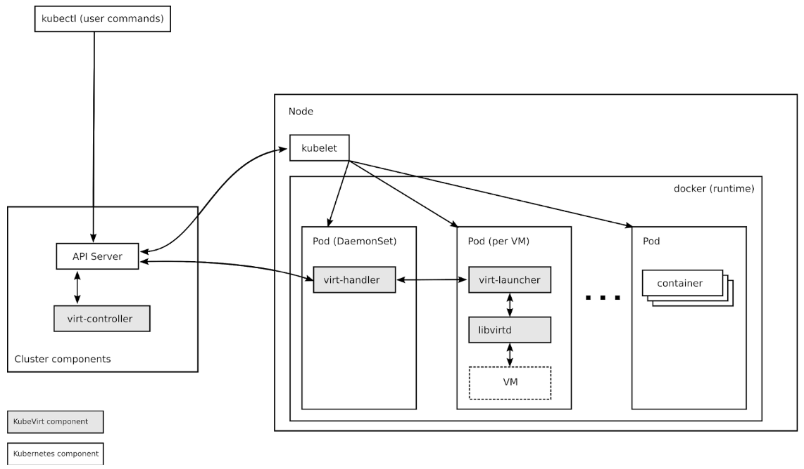

# [번역] KubeVirt 시작하기

- 원문([Getting to Know Kubevirt](https://kubernetes.io/blog/2018/05/22/getting-to-know-kubevirt/))을 읽고 번역한 글입니다.

당신이 Kubernetes에서 Linux 컨테이너 워크 로드를 실행하는 데 익숙해지면, 당신은 Kubernetes 클러스터에서 다른 종류의 워크 로드를 실행하기를 바라게 될 수 있다. 당신은 컨테이너용으로 설계되지 않았거나, 컨테이너 호스트에서 사용할 수 있는 것과 다른 버전의 Linux 커널 또는 모두 다른 운영체제가 필요한 애플리케이션을 실행해야 할 수도 있다.

이런 워크 로드들은 때로는 가상머신(VM)에서 실행하는 것이 적합하다. 그리고 KubeVirt는 Kubernetes에서 사용할 수 있는 가상 머신 관리 add-on 기능으로, 사용자가 Kubernetes 또는 Openshift 클러스터에서 컨테이너와 함께 VM을 바로 실행할 수 있도록 하는 것을 목표로 한다.

KubeVirt는 Kubernetes의 Custom Resource Definitions(CRD) API를 통해 VM과 VM 집합에 대한 리소스 유형을 추가함으로써 Kubernetes 기능을 확장한다. KubeVirt VM들은 표준 pod 네트워킹 및 스토리지에 접근할 수 있는 Kubernetes pods 내에서 실행되며, kubectl 등의 표준 Kubernetes 도구를 사용하여 관리될 수 있다.

Kubernetes로 VM을 실행하는 것은 oVirt나 OpenStack에 비해 약간의 적응이 필요하며, KubeVirt의 기본 아키텍처를 이해하는 것은 좋은 시작점이다.

이 게시물에서는 KubeVirt의 구성 요소에 대해 고수준에서 다뤄볼 예정이다. 우리가 다룰 구성 요소들은 CRDs, KubVirt virt-controller, virt-handler, virt-launcher, libvirt, storage, networking 등이 있다.

## KubeVirt Components



### Custom Resource Definitions (CRDs)

Kubernetes 리소스는 관련된 API 개체들의 집합을 저장하는 Kubernettes API의 끝점이다. 예를 들어, 기본 제공 pods 리소스는 Pod 개체의 집합이다. Kubernetes CRD API는 지정된 이름과 스키마로 새 개체를 정의함으로써 Kubernetes를 확장하는 것을 가능하게 한다. 클러스터에 사용자 리소스를 적용하면, Kubernetes API 서버는 사용자 지정 리소스의 저장소를 제공하고 처리한다.

KubeVirt의 주요 CRD는 Kubernetes API 서버 내에서 VM 개체 모음을 포함하는 VM 리소스다. VM 리소스는 CPU 유형, RAM 및 vCPU 용량, VM에서 사용할 수 있는 NIC의 유형과 수 등과 같이 VM과 관련된 모든 속성을 정의한다.

### virt-controller

virt-controller는 클러스터 전체의 가상화 기능을 담당하는 Kubernetes Operator이다. 새로운 VM 개체가 Kubernetes API 서버에 전달되면, virt-controller가 이를 인식하고 VM이 실행될 pod를 생성한다. pod가 특정 노드에 예약되면, virt-controller는 노드 이름으로 VM 개체를 업데이트하고 노드별 KubeVirt 구성요소인 virt-handler에게 다음 책임을 넘긴다.

## virt-handler

virt-controller와 유사하게 virt-handler도 반응형 인스턴트로, VM 개체의 변경사항을 감시하고 VM이 필요로 하는 요구 사항을 충족하도록 필요한 작업을 수행한다. virt-handler는 VM의 사양을 참조하고, VM의 pod에서 libvirtd 인스턴트를 사용하여 해당 도메인 생성을 알린다. VM 개체가 삭제되면 virt-handler는 삭제를 관찰하고 도메인을 끈다.

## virt-launcher

모든 VM 개체에 대해 하나의 pod가 생성된다. 이 pod의 기본 컨테이너는 virt-launcher라고 하는 KubeVirt의 구성 요소를 실행시킨다. virt-launcher pod의 주요 목적은 VM 프로세스를 호스팅 하는 데 사용할 cgroup과 네임스페이스를 제공하는 것이다.

virt-handler는 VM의 CRD 개체를 virt-laucnher에게 전달함으로써 virt-launcher에게 VM을 시작하라는 신호를 보낸다. 그러면 virt-launcher는 컨테이너 내의 로컬 libvirtd를 인스턴스를 사용하여 VM을 시작한다. VM이 시작되면 virt-launcher는 VM의 프로세스를 모니터링하고, VM이 종료되면 virt-launcher도 종료된다.

만약 VM이 종료되기 전에 Kubernetes 런타임이 virt-launcher를 종료하려고 시도하는 경우, virt-launcher는 Kubernetes에서 받은 신호를 VM 프로세스에 전달하고, VM이 성공적으로 종료될 때까지 pod 종료를 보류하려고 시도한다.

```vim
# kubectl get pods

NAME                                   READY     STATUS        RESTARTS   AGE
virt-controller-7888c64d66-dzc9p   1/1       Running   0          2h
virt-controller-7888c64d66-wm66x   0/1       Running   0          2h
virt-handler-l2xkt                 1/1       Running   0          2h
virt-handler-sztsw                 1/1       Running   0          2h
virt-launcher-testvm-ephemeral-dph94   2/2       Running       0          2h
```

### libvirtd

모든 VM pod에는 libvirtd 인스턴스가 있다. virt-launcher는 libvirtd를 사용해서 VM 프로세스의 수명 주기를 관리한다.

### Storage

KubeVirt VM은 볼륨으로 지원되는 디스크로 구성된다.

`Persistent Volume Claim`(영구 볼륨)은 Kubernetes가 VM에 디스크를 직접 연결함으로써 Kubernetes가 영구적인 볼륨을 제공한다. 이것은 KubeVirt VM에 영구 저장소를 제공하는 기본적인 방법이다. 현재는 영구적인 볼륨은 반드시 iscsi 블록 장치여야만 하지만, 파일 기반 pv 디스크를 가능하게 하는 작업이 진행 중에 있다.

`Ephemeral Volumes`(임시 볼륨)은 네트워크 볼륨을 읽기 전용 백업 저장소로 사용하는 쓰기 이미지의 로컬 복사본이다. KubeVirt는 VM이 ​​시작될 때 VM과 연결된 임시 이미지를 동적으로 생성하고, VM이 중지되면 임시 이미지를 버린다. 현재 임시 볼륨은 pvc 볼륨으로만 사용될 수 있다.

`Registry Disk` 볼륨은 qcow 또는 원시 디스크를 포함하는 도커 이미지를 참조한다. 이름에서 알 수 있듯이, 이러한 볼륨은 컨테이너 레지스트리에서 가져온다. 일반 임시 컨테이너 이미지와 마찬가지로 이러한 볼륨의 데이터는 pod가 살아있는 동안에만 유지된다.

`CloudInit NoCloud` 볼륨은 VM에 Cloud-init NoCloud 사용자 데이터 소스를 제공한다. 이 소스는 VM에 디스크로 추가되며, 여기서 cloud-init가 설치된 게스트에게 구성 세부 정보를 제공하는 데 사용할 수 있다. Cloud-init 세부 정보는 일반 텍스트, base64로 인코딩된 UserData 파일 또는 Kubernetes 비밀을 통해 제공될 수 있다.

### Network

일반 Kubernetes pod와 마찬가지로 기본 네트워킹 기능은 각 KubeVirt VM에 자동으로 제공된다. 특정 TCP 또는 UDP 포트는 일반 Kubernetes 서비스를 사용하여 외부에 노출될 수 있다. 특별한 네트워크 구성이 필요하지는 않다.

## Reference

- [Getting to Know Kubevirt](https://kubernetes.io/blog/2018/05/22/getting-to-know-kubevirt/)