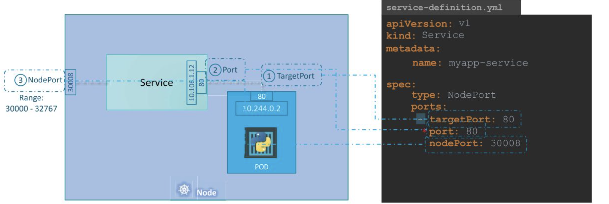
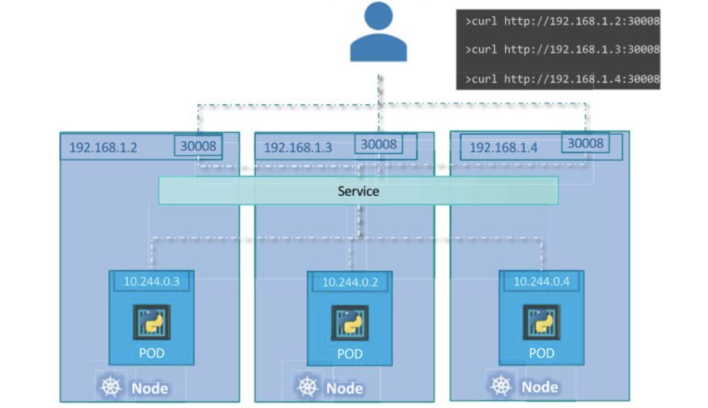

# [Udmey_CKA] #1 Core Concepts 

> Udemy의 CKA with Practical Test 강의를 듣고 정리합니다.

## Purpose of Kubernetes

- 애플리케이션을 컨테이너의 형태로 자동화하여 호스트하는 것
- 많은 컨테이너 인스턴스들을 쉽게 배포하고 관리하는 것

## Architecture Overview


### Master Node

- Master node: worker node 관리, 스케줄링, 모니터링 등 전체 클러스터를 관리하는 노드
- Etcd: key-value 형태로 클러스터의 데이터를 저장하는 데이터베이스
- kube-scheduler: 각 노드의 용량, 정책 등을 고려하여 컨테이너를 어떤 노드에 배치해야하는지 결정하는 역할
- controller-manager
    + 클러스터에서 발생하는 이슈를 해결하여 새로운 컨테이너들이 새로 생성될 수 있도록 지원
    + node-controller: 노드가 unavailable 또는 destroyed 상태일 때 해결하는 역할
    + replication-controller: 원하는 수의 컨테이너가 실행될 수 있도록 보장하는 역할
- kube-apiserver
    + 클러스터 내의 수 많은 컴포넌트들은 서로 어떻게 통신할까?
    + kube-apiserver를 거쳐서 서로 통신하고 역할을 함.
    + kubernetes의 가장 중요한 관리 컴포넌트.

### Worker node

- Worker node: 컨테이너를 실제로 호스트하는 노드
- container runtime engine
    + 노드에서 컨테이너가 실행되기 위해서는 컨테이너를 실행시킬 runtime이 필요하다.
    + 마스터 노드를 포함하여 모든 노드에 설치되어 있다.
    + 대표적으로 Docker가 있으며, containerd, rocket 등도 사용할 수 있음
- kubelet
    + 각 worker node의 대장 역할
    + 마스터 노드와 통신하고, 노드에서 일어나는 모든 일을 관리한다.
- kube-proxy
    + Node끼리 통신을 지원하는 컴포넌트
    
## ETCD

### ETCD란?

- key-value 형태로 클러스터 내의 정보들을 저장하는 데이터베이스

### ETCD 실행하기

- etcd를 시작하면 기본값으로 포트 2379로 서비스됨
- `etcdctl`: etcd와 통신하는 CLI 툴
- etcd 버전 2와 3이 있는데, 기본값은 2로 되어 있음. etcd 3으로 설정하고 싶은 경우 etcd-master에서 `export ETCDCTL_API=3` 을 설정해야함
- etcdctl이 etcd api server에 접근하기 위해서는 인증서 파일 path를 명시해야 하는데, 그것도 etcd-master에서 한다.
    
    ```bash
    --cacert /etc/kubernetes/pki/etcd/ca.crt
    --cert /etc/kubernetes/pki/etcd/server.crt
    --key /etc/kubernetes/pki/etcd/server.key
    ```
    

### ETCD in kubernetes

- ETCD 에 저장하는 데이터
    + nodes, pods, configs, secrets, accounts, roles, bindings 등
    + `kubectl get` 명령어를 입력하면 모두 ETCD에서 데이터를 가져온다.
- etcd를 직접 다운받을 경우, etcd.service 파일에서 `—advertise-client-urls` 부분이 etcd 서비스에서 사용하는 네트워크 정보 (포트 2379). 필요하면 이 부분 수정해야 함

## Kube-API Server

- Kube-api 에서 하는 일
    + kubectl 명령어를 사용하면 kube-apiserver로 전달
    + kube-apiserver에서 요청 검증 후 etcd에서 필요한 정보 조회
        * kube-api server는 etcd에 접근할 수 있는 유일한 요소이다.
        * scheduler는 apiserver를 모니터링하고 있다가 새로운 pod 생성이 감지되면 해당 pod를 적절한 node에 배치
    + apiserver에서 해당 node의 kubelet에 정보 전달 → kubelet이 container runtime engine에 애플리케이션 이미지를 전달하여 컨테이너 배포 요청
    + kubelet이 apiserver로 상태를 업데이트해주면, apiserver는 etcd에 업데이트된 정보 저장
- 정리하면,
    1. 사용자 인증
    2. 요청 검증
    3. etcd에서 적절한 데이터 가져오기
    4. etcd 업데이트
    5. 스케줄러
    6. kubelet

## Kube Controller Manager

- 클러스터 내에서 다양한 컴포넌트들을 모니터링하고 상황별로 적절한 액션을 취하는 곳
- Kube controller manager에서 하는 일
    1. 노드 상태 조회
    2. 상황을 해결하기 위해 필요한 액션 취하기

### node controller

- 5초마다 노드들의 상태 조회
    + node monitor period = 5s
- 노드가 잘 실행되고 있는지 모니터링하고, heartbeat가 들리지 않는다면 40초 지켜보고 해당 노드를 unreachable로 표시
    + node monitor grace period = 40s
- 노드가 unreachable로 표시된지 5분이 되면 해당 pod를 node에서 제거하고 새로 배포한다.
    + pod eviction timeout = 5m0s

### replication-controller

- 원하는 만큼의 POD가 정상적으로 실행중인지 체크

### others

- 그 외에도 각 오브젝트별 controller 등 매우 다양한 컨트롤러가 있다.

## Kube Scheduler

- **scheduler는 어떤 pod가 어떤 node에 배치될지만 결정한다.**
- 하는 일
    1. filter nodes
        + 조건에 맞지 않는 노드는 탈락 (자원 여유 공간 등)
    2. rank nodes
        + 해당 pod를 배치했다고 가정했을 때 여유 자원이 더 많은 곳에 높은 rank가 매겨짐

## Kubelet

- 각 노드에서 master와 통신하기 위한 유일한 통로. 노드 대장
- worker node의 kubelet이 하는 일
    1. node 등록
        + cluster 내에 node 등록
    2. pod 생성
        + container/pod 생성 명령을 받으면 container runtime engine에 image를 전달하고 인스턴스를 생성
    3. 노드, pods 모니터링

## kube-proxy

- 클러스터 내에서 노드간, POD간 네트워킹을 지원하는 컴포넌트
- kube-proxy는 새로운 서비스를 탐색하고, 해당 서비스로 트래픽을 보내는 역할을 하는 컴포넌트
- POD Network
    + 내부 가상 네트워크인 서비스를 생성하여 클러스터에 있는 모든 노드를 연결하고, 각 노드의 POD까지 도달할 수 있다.

## POD

### POD란?

- 쿠버네티스는 컨테이너를 노드 위에 바로 배포할 수 없다. 컨테이너를 POD로 캡슐화하여 노드에 배포한다.
- 일반적으로 컨테이너 1개에 POD 1개를 할당한다. 스케일을 추기하고 싶으면 새로운 POD를 배포한다.
- 하나의 POD에 여러 개의 컨테이너를 포함하여 배포할 수 있다. 하지만 이 때, 다수의 컨테이너는 서로 연관성이 높다는 특징을 갖는다.
    + 메인 컨테이너 1개 + helper 컨테이너 여러 개
    + POD 내의 여러 컨테이너는 localhost를 통해 쉽게 통신할 수 있다.
- Kubectl 명령어
    
    ```bash
    kubectl run nginx --image nginx
    kubectl get pods
    ```
    

### PODs with yaml

- 기본 field
    + apiVersion: 쿠버네티스 api 버전
        * POD, Service: v1
        * ReplicaSet, Deployment: apps/v1
    + kind: 어떤 오브젝트를 생성할 것인지
    + metadata: 오브젝트에 대한 데이터
        * 라벨, 이름 등
        * dictionary 형태로 데이터가 저장된다. (app: myapp)
    + spec: 오브젝트에 대한 요구사항을 작성하는 곳
        * documentation을 잘 읽고 필요한 것을 작성하자.
        * pod의 경우 containers 라는 List/Array에 데이터를 저장한다.
        * ‘-‘ 는 리스트에서 첫 번째 아이템임을 알려주는 기호.
- yaml 예시

    ```yaml
    apiVersion: v1
    kind: Pod
    metadata:
    name: myapp-pod
    labels:
        app: myapp
        type: front-end
    spec:
    containers:
        - name: nginx-container
        image: nginx
    ```
    

## ReplicaSets

- 쿠버네티스의 컨트롤러 중 하나로 고가용성(high availability)를 지원한다. 항상 N개의 pod가 실행되도록 보장해준다. 1개여도 그 한 개가 항상 돌아가도록 보장.
- 여러 노드를 관리하며 로드 밸런싱, 스케일링을 지원한다.

### Replication Controller vs. Replica Set

- 둘이 비슷하지만 동작하는 방식이 좀 다르다. 최근에는 replicaSet 권장
- Replication Controller
    
    ```yaml
    apiVersion: v1
    kind: ReplicationController
    metadata:
      name: myapp-rc
      labels:
        apps: myapp
        type: front-end
    spec:
      template:
        metadata:
          name: myapp-pod
          labels:
            app: myapp
            type: fornt-end
        spec:
          containers:
          - name: nginx-container
            image: nginx
      replicas: 3
    ```
    
- Replica Set
    + apiVersion 차이 있음
    + replicaSet은 selector를 지원한다.
    
    ```yaml
    apiVersion: apps/v1
    kind: ReplicaSet
    metadata:
      name: myapp-replicaset
      labels:
        apps: myapp
        type: front-end
    spec:
      template:
        metadata:
          name: myapp-pod
          labels:
            app: myapp
            type: fornt-end
        spec:
          containers:
          - name: nginx-container
            image: nginx
      replicas: 3
      selector:
        matchLabels:
          type: front-end
    ```
    

### Labels and Selectors

- Selector를 사용하면 직접 특정 pod를 지정하지 않아도 해당 label을 달고 있는 pod를 모니터링하다가 적용할 수 있다.

### Scale ReplicaSets

- 한 번 정의한 replicaSet을 확장하고 싶다면?
    + yaml 파일을 수정하고 apply 하는 방법
    + kubectl scale 명령어를 사용하는 방법
        * `kubectl scale —replicas=6 -f replicaset-definition.yml`
        * `kubectl scale —replicas=6 replicaset myapp-replicaset`

### commands

```bash
kubectl create -f replicaset-definition.yml
kubectl get replicaset
kubectl delete replicaset myapp-replicaset
kubectl replace -f replicaset-definition.yaml
kubectl scale --replicas=6 -f replicaset-definition.yml
```

## Deployment

- 여러 개의 pod를 배포하고, 모든 pod를 업그레이드해야한다고 생각해보자. 각 pod를 직접 업그레이드하면 오래 걸리고, 업그레이드 실패 등을 대응하는 것도 복잡하다.
- deployment를 사용하여 pod를 연결해두면, 업그레이드 등의 pod 관리 작업을 편하게 할 수 있다.
    + rollingupdate: 순차적으로 업그레이드 지원
    + rollback: 업그레이드 이전 버전으로 복구 지원
    + 계층 구조: deployment → replicaSets → pods
- yaml 파일은 replicaSet과 거의 비슷하다.
    
    ```yaml
    apiVersion: apps/v1
    kind: Deployment
    metadata:
      name: myapp-replicaset
      labels:
        apps: myapp
        type: front-end
    spec:
      template:
        metadata:
          name: myapp-pod
          labels:
            app: myapp
            type: fornt-end
        spec:
          containers:
          - name: nginx-container
            image: nginx
      replicas: 3
      selector:
        matchLabels:
          type: front-end
    ```
    

## Namespace

- 다른 namespace를 만들어서 자원을 격리시킬 수 있다.
- 각 namespace는 각자의 정책을 가지고 resource limit을 설정함
- 기본 ns: default, kube-system, kube-public 등
- 기본적으로 default namespace로 설정되어 있으며, 다른 ns를 검색하려면 `—namespace=kube-system` 등을 뒤에 붙여서 검색해야함

### DNS

- namespace 안의 자원들은 이름을 통해 통신할 수 있음
    + ex) connect(“db-service”)
- 서로 다른 namespace 의 자원들이 통신하려면 자원의 이름에 namespace를 적어줘야함
    + ex) connect(“db-service.dev.svc.cluster.local”)
        * db-service: 서비스 네임
        * dev: namespace
        * svc: service
        * cluster.local: domain

### Namespace 생성 및 변경

- yaml 파일로 생성하는 방법
    
    ```yaml
    apiVersion: v1
    kind: Namespace
    metadata:
      name: dev
    ```
    
- 명령어로 생성하는 방법
    
    `kubectl create namespace dev`
    
- 아래 명령어로 기본 ns 를 변경할 수 있다.
  
    `kubectl config set-context $(kubectl config current-context) —namespace=dev`

### Resource Quota

- ResourceQuota 오브젝트를 사용하여 ns에 resource limit을 걸어줄 수 있다.

    ```yaml
    apiVersion: v1
    kind: ResourceQuota
    metadata:
    name: compute-auota
    namespace: dev
    spec:
    hard:
        pods: "10"
        requests.cpu: "4"
        requests.memory: 5Gi
        limits.cpu: "10"
        limits.memory: 10Gi
    ```

## Service

- POD와 POD, POD와 사용자를 연결하는 역할을 한다.


- 서비스는 node의 IP + port 번호를 사용하여, port로 들어오는 트래픽을 POD로 전달해준다.
- 서비스에는 3가지 타입이 있다.


### NodePort

- 노드의 포트를 노드 내부의 POD에 연결하는 방식




- TargetPort: POD에 연결될 포트 번호
- Port: 서비스에 연결될 포트 번호 (필수로 지정)
- NodePort: 노드에 연결할 포트 번호 (외부에서 접근 가능)
    - Range: 30000-32767까지만 사용 가능
    - 지정하지 않으면 범위 내에서 남는 포트 줌


- Selector: 어떤 POD에 연결할건지 명시
    - 만약에 여러 개의 POD를 하나의 서비스에 연결해야할 경우에는 각 POD에 같은 label을 지정해주면 됨
    - 서비스는 연결된 모든 POD를 기준으로 랜덤으로 로드 밸런싱하며 트래픽을 전송함



- POD가 여러 노드에 분포되어 있을 경우에도 서비스로 연결할 수 있음. 이 경우 각 노드 IP 중 아무거나에 접근해도 로드 밸런싱 다 된다.

### ClusterIP

- 클러스터에 가상 IP를 생성하여 다른 서비스들과 통신할 수 있게 하는 방식
- POD들을 그룹핑하고 해당 그룹에 IP를 할당하여 다른 POD에서 접근할 수 있도록 서비스를 지원한다.


```yaml
apiVersion: v1
kind: Service
metadata:
  name: back-end
spec:
  type: ClusterIP
  ports:
    - targetPort: 80
      port: 80
  selector:
    app: myapp
    selector: back-end  
```

### LoadBalancer

- 외부 클라우드 서비스 등에서 제공하는 load balancer등을 사용하기 위한 서비스
- user가 front-end 서버에 접근하기 위해서는 url이 필요하다. 그런데 서비스가 커서 node가 많다보면 url 주소도 매우 많아진다.
- 이 경우 외부 load balancer 서비스를 사용하여 user의 트래픽을 분산할 수 있고, 쿠버네티스의 LoadBalancer 서비스는 외부 load balancer와 내부 서비스를 연결하는 역할을 한다.