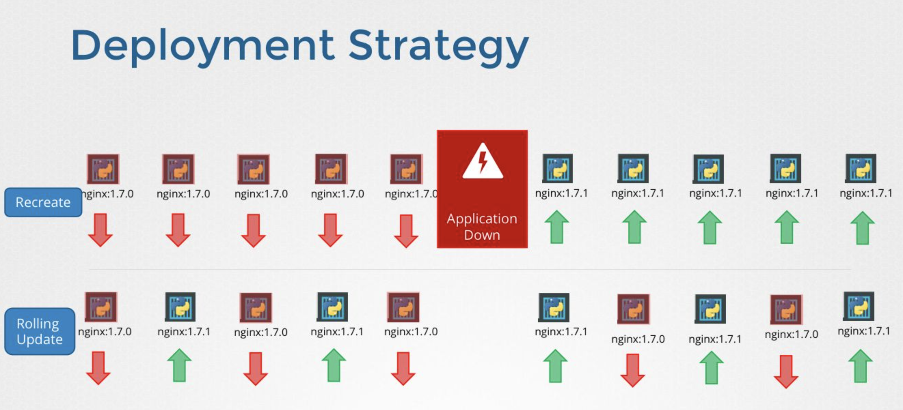
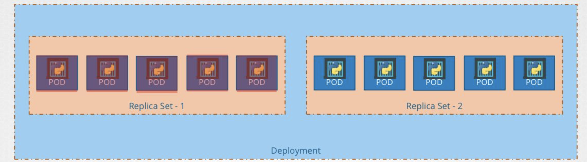
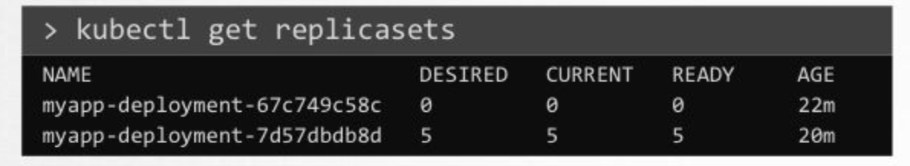
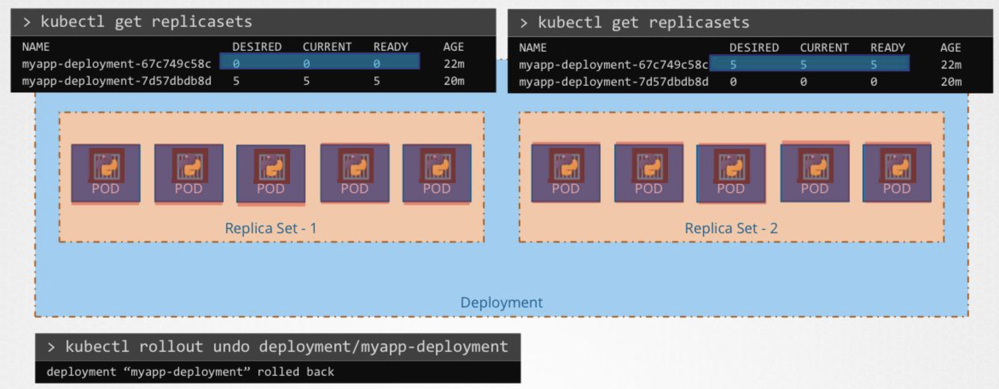
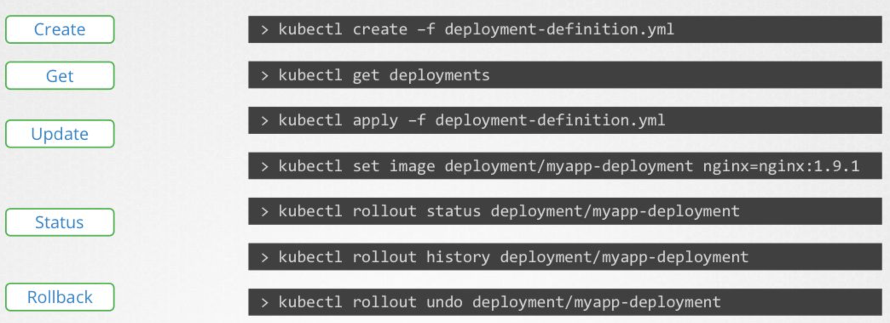

# [Udmey_CKA] #4 Application Lifecycle Management

> Udemy의 CKA with Practical Test 강의를 듣고 정리합니다.

## Rolling Updates and Rollbacks

### Rollout and Versioning

- Rollout: 새로운 버전을 배포하는 것
- Rollout command

```yaml
# 배포 명령어
kubectl rollout status deployment/myapp-deployment
# 배포 기록 조회 명령어
kubectl rollout history deployment/myapp-deployment
```

### Deployment Strategy



- Recrete Strategy
    - 기존 버전을 모두 삭제하고 새로운 버전을 배포하여 업그레이드
    - 단점: 애플리케이션 다운타임이 발생한다.
- Rolling Update
    - 기존 버전을 새로운 버전으로 하나씩 대체하며 업그레이드
    - 애플리케이션 다운타임 없이 업그레이드를 진행할 수 있다.
    - deployment upgrade의 default 전략

### Upgrades



- Deployment 업그레이드를 할 때 내부에 ReplicaSet을 새로 만들어서 업그레이드를 진행한다.
- replicaset을 조회하면 다음과 같이 두 개의 replicaset이 조회되며, 업그레이드 이전 버전은 replica 값이 0으로 설정되어 있다.



### Rollback



- Rollback 명령어를 입력하면 기존 replicaset의 desired replicas 수를 증가시켜 이전 버전으로 복구시킬 수 있다.

### Summarize Commands



## Commands and Arguments

- 컨테이너 실행 후에 명령어를 자동으로 입력하려면 다음과 같이 yaml 파일을 작성할 수 있다.

    ```yaml
    apiVersion: v1
    kind: Pod
    metadata:
    name: ubuntu-sleeper-pod
    spec:
    containers:
        - name: ubuntu-sleeper
        image: ubuntu-sleeper
        command: ["sleep2.0"]
        args: ["10"]
    ```

## ENV Variables in Kubernetes

- Kubernetes에서 환경 변수를 지정하는 방법은 다음과 같은 방법들이 있다.
    + Plain key-value
    
    ```yaml
    env:
      - name: APP_COLOR
        value: pink 
    ```
    
    + ConfigMap
    
    ```yaml
    env:
      - name: APP_COLOR
        valueFrom:
    .     configMapKeyRef: 
    ```
    
    + Secrets
    
    ```yaml
    env:
      - name: APP_COLOR
        valueFrom: 
          secretRef:
    ```
    
### ConfigMaps

- ConfigMaps는 kubernetes에서 key-value 형태로 config 데이터를 전달하는 방법이다.
- Pod를 생성할 때 ConfigMap을 사용하여 필요한 환경 변수 등을 전달할 수 있다.
- ConfigMap 생성
    + Imperative
    
    ```bash
    # key-value 직접 입력
    kubectl create configmap
        <config-name> --from-literal=<key>=<value>
    
    # example
    kubectl create configmap \
        app-config --from-literal=APP_COLOR=blue \
                   --from-literal=APP_MOD=prod
    
    # 파일 입력
    kubectl create configmap
        <config-name> --from-file=<path-to-file>
    
    # example
    kubectl create configmap
        app-config --from-file=app_config.properties
    ```
    
    + Declarative
    
    ```yaml
    kubectl create -f config-map.yaml
    
    # config-map.yaml
    apiVersion: v1
    kind: ConfigMap
    metadata:
      name: app-config
    data:
      APP_COLOR: blue
      APP_MODE: prod
    ```
    
- ConfigMap 조회
    
    ```yaml
    kubectl get configmap
    ```
    
- Pod에 ConfigMap 주입
    
    ```yaml
    apiVersion: v1
    kind: Pod
    metadata:
      name: simple-webapp-color
      labels:
        name: simple-webapp-color
    spec:
      containers:
      - name: simple-webapp-color
        image: simple-webapp-color
        ports:
          - containerPort: 8080
        envFrom:
          - configMapRef:
              name: app-config
    ```
    
    + 다음과 같이 single key 만 주입할 수도 있다.
    
        ```yaml
        env:
        - name: APP_COLOR
            valueFrom:
            configMapKeyRef:
                name: app-config
                key: APP_COLOR
        ```
    
    + configMap을 volume 내의 파일로서 사용할 수 있다.
    
        ```yaml
        volumes:
        - name: app-config-volume
            configMap:
            name: app-config
        ```
    

### Secrets

- ConfigMap과 유사하나 변수들을 암호화하여 전달하는 방법이다.
- Secret 생성
    + imperative
    
    ```bash
    # key-value pair 전달
    kubectl create secret generic
        <secret-name> --from-literal=<key>=<value>
    
    # example
    kubectl create secret generic
         app-secret --from-literal=DB_Host-mysql
                    --from-literal=DB_User=root
                    --from-literal=DB_Password=passrd
    
    # secret 파일 전달
    kubectl create secret generic
        <secret-name> --from-file=<path-to-file>
    
    #example
    kubectl create secret generic
        app-secret --from-file=app_secret.properties
    ```
    
    + declarative
    
    ```yaml
    kubectl create -f secret-data.yaml
    
    # secret-data.yaml
    apiVersion: v1
    kind: Secret
    metadata:
      name: app-secret
    data:
      DB_Host: bXlzcWw=
      DB_User: cm9vdA==
      DB_Password: cGFzd3Jk
    ```
    
    + encode/decode secrets
        
        ```bash
        # encode
        echo -n 'mysql' | base64
        echo -n 'root' | base64
        echo -n 'passwrd' | base64
        
        # decode
        echo -n 'bXlzcWw=' | base64 --decode
        echo -n 'cm9vdA==' | base64 --decode
        echo -n 'cGFzd3Jk' | base64 --decode
        ```
        
- Secret 조회
    
    ```bash
    kubectl get secrets
    kubectl describe secrets
    ```
    
- Pod에 Secret 주입
    
    ```yaml
    apiVersion: v1
    kind: Pod
    metadata:
      name: simple-webapp-color
      labels:
        name: simple-webapp-color
    spec:
      containers:
      - name: simple-webapp-color
        image: simple-webapp-color
        ports:
          - containerPort: 8080
        envFrom:
          - secretRef:
              name: app-secret
    ```
    
    + key 하나만 주입하는 방법
    
        ```yaml
        env:
        - name: APP_COLOR
            valueFrom:
            secretRef:
                name: app-secret
                key: DB_Password
        ```
    
    + volume으로 가져오는 방법
    
        ```yaml
        volumes:
        - name: app-secret-volume
            secret:
            secretName: app-secret
        ```
    

## Multi Container PODs

- web 서버와 log 서버 등 동일한 life-cycle을 공유하는 컨테이너의 경우 하나의 POD 내에 한 번에 배포될 수 있다.
- 하나의 POD 내에 있는 여러 개의 컨테이너들은 동일한 lifecycle을 가지며, network와 storage를 공유한다.

```yaml
apiVersion: v1
kind: Pod
metadata:
  name: simple-webapp
  labels:
    name: simple-webapp
spec:
  containers:
    - name: simple-webapp
      image: simple-webapp
      ports:
        - containerPort: 8080
    - name: log-agent
      image: log-agent
```