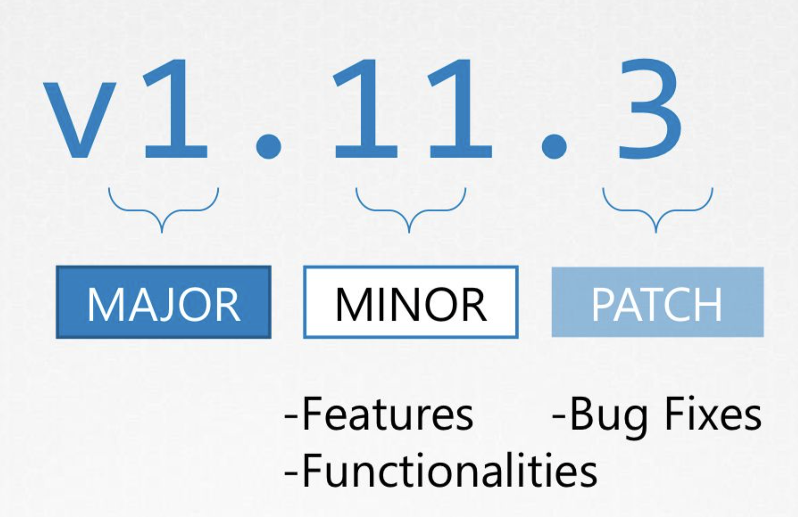

# [Udmey_CKA] #5 Cluster Maintanence

> Udemy의 CKA with Practical Test 강의를 듣고 정리합니다.

## OS Upgrades

- 만약 어떤 노드에 문제가 생기면, 다운된 노드는 즉시 복구를 시도한다.
- 만약 노드가 5분 이상 다운되어 있다면 pod들은 해당 노드에서 종료되고, kubernetes는 해당 pod들을 죽은 것으로 간주된다.
    + 만약 죽은 pod가 replicaset에 포함된 pod라면, pod는 다른 노드에 다시 배포되며, replicaset에 포함되지 않은 pod는 사라진다.
    + master node는 node를 죽은 것으로 간주하기 전에 5분간 기다리는데, 이 기다리는 시간을 eviction time이라고 한다. default 값은 5분으로 설정되어 있다.
    
    ```bash
    kube-controller-manager --pod-evection-timeout=5m0s
    ```
    
    + eviction time 이후에 노드가 다시 올라오면, 해당 노드에는 어떠한 pod도 스케줄되지 않은 상태로 올라온다.

### drain

- 만약 노드를 업그레이드할 계획에 있는데 노드가 5분 안에 정상적으로 올라올지 확신이 없다면, 노드를 drain할 수 있다.
    
    ```bash
    kubectl drain node01
    ```
    
- 노드를 drain 하면 해당 노드에서 동작하던 pod들이 모두 종료되고 replicaset 등에 따라 다른 노드에서 재실행된다. 또한 해당 노드는 별도의 restrict 상태 해제 전까지 unschedulable 한 상태를 유지한다.
- 다만, replicaset 에 해당되지 않은 pod는 다른 노드에서 재실행되지 않고 종료된다.

### cordon

- cordon은 drain과 유사하게 노드를 unschedulable 상태로 만드나, 해당 노드에 있는 pod들을 이동시키지는 않는다. cordon은 노드에 새로운 pod가 생성되지 않도록 하는 기능을 한다.
    
    ```bash
    kubectl cordon node01
    ```
    
### uncordon

- 노드 업그레이드가 완료될 경우 아래 명령어를 사용하여 pod를 정상 상태로 복구한다.
    
    ```bash
    kubectl uncordon node01
    ```
    
- 기존에 drain 명령어를 통해 다른 노드로 이동시켰던 pod들은 자동으로 복구되지는 않는다.

## Kubernetes Software Versions

- 쿠버네티스 버전은 `v1.11.3`  와 같이 표시되며, `.` 기호를 기준으로 세 가지 부분으로 나뉜다.
    
    

    + major version (`v1`)
    + minor version (`.11`)
        * 주요 특징, 기능 등에 수정이 있을 때 바뀐다. 몇 달에 한 번 발생한다.
    + patch version (`.3`)
        * 버그 수정 등의 패치에 따라 바뀐다. 빈번하게 발생한다.
        * 
- 그 외에도 안정적인 정식 버전이 배포되기 전의 alpha, beta 버전이 있다.
    
    
    
    + alpha 버전: 전문가의 테스트 및 수정, 보완이 필요한 불안정한 버전. 추가되는 기능들은 disable한 형태로 배포한다.
    + beta 버전: 코드가 꽤 테스트되었지만 여전히 불안정한 일반 사용자 테스트 버전. 추가되는 기능들을 enable한 형태로 배포한다.
    + release: 안정화된 버전을 배포한다.
    

## Cluster Upgrade Process

- Cluster에서 각 컴포넌트들은 서로 다른 쿠버네티스 release 버전을 사용할 수 있다.

    
    
    + kube-apiserver는 가장 중요한 컴포넌트이므로, 클러스터에서 kubectl을 제외하고 kube-apiserver보다 높은 버전을 갖는 컴포넌트는 존재할 수 없다.
    + controller-manager와 kube-scheduler는 kube-apiserver보다 한 단계 낮은 버전까지 사용할 수 있다.
    + kubelet와 kube-proxy는 kube-apiserver보다 두 단계 낮은 버전까지 사용할 수 있다.
    + kubectl은 kube-apiserver를 기준으로 한 단계 높거나 한 단계 낮은 버전까지 사용할 수 있다.
- 언제 쿠버네티스 버전 업그레이드를 해야할까?
    + 쿠버네티스는 가장 최근 배포 버전을 기준으로 최대 3개의 minor 버전을 지원한다. 만약 가장 최근 버전이 1.12라면, 1.12, 1.11, 1.10 세 버전을 지원하는 것이다.
    + 따라서, 지원이 끝나기 전에 업그레이드를 진행해야 한다.
- 쿠버네티스 버전을 한 번에 여러 단계 업그레이드 할 수 있을까?
    + 그렇지 않다. 한 번에 하나의 minor 버전을 업그레이하는 것이 권장된다.

### Upgrade 방법

- 만약 GCP 등 외부 클라우드 서비스를 사용하고 있다면, 클릭 몇 번 만으로도 업그레이드를 진행할 수 있다.
- kubeadm 등의 툴을 사용하고 있다면 다음 명령어를 사용하여 업그레이드를 진행할 수 있다.
    
    ```bash
    kubeadm upgrade plan
    kubeadm upgrade apply
    ```
    
- 쿠버네티스 클러스터를 메뉴얼로 관리하고 있다면, 직접 하나씩 업그레이드를 진행해야 한다.

## Backup and Restore

### Resource Configuration

- 기존에 리소스를 정의했던 yaml 파일 등을 사용하여 백업이나 복구를 할 수 있다.
- 소스 코드들을 git 등에 보관하면 버전 관리가 가능하다.
- 다음 명령어를 사용하면 모든 리소스의 manifest 파일을 추출할 수 있다.
    
    ```bash
    kubectl get all --all-namespaces -o yaml > all-deploy-services.yaml
    ```
    

### ETCD Cluster

- ETCD는 리소스의 상태를 모두 저장한다. etcdctl 명령어를 사용하여 간편하게 현재 etcd 상태의 snapshot을 생성할 수 있다.
- ETCD를 사용한 백업
    + 다음 명령어를 사용하여 etcd snapshot을 생성한다.
        
        ```bash
        ETCDCTL_API=3 etcdctl snapshot save snapshot.db
        ```
        
- ETCD를 사용한 복원
    + apiserver 서비스를 중단한다.
        
        ```bash
        service kube-apiserver stop
        ```
        
    + 복원하고자 하는 디렉터리를 사용하여 etcd 상태를 복원한다.
        
        ```bash
        ETCDCTL_API=3 etcdctl snapshot restore snapshot.db \
        	--data-dir /var/lib/etcd-from-backup
        ```
        
    + /etc/kubernetes/manifests/etcd.yaml 파일에서 volumes의 hostPath 영역을 새로운 디렉터리로 수정한다.
    + etcd를 재실행한다.
        
        ```bash
        systemctl daemon-reload
        service etcd restart
        service kube-apiserver start
        ```