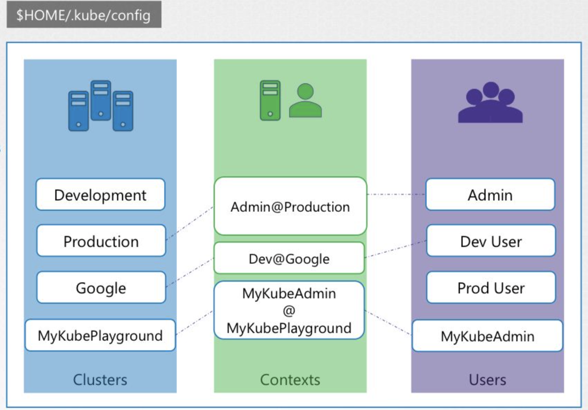
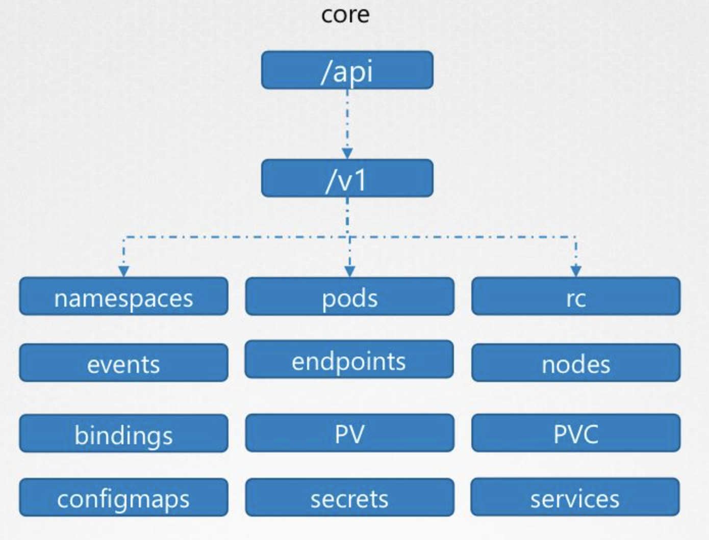
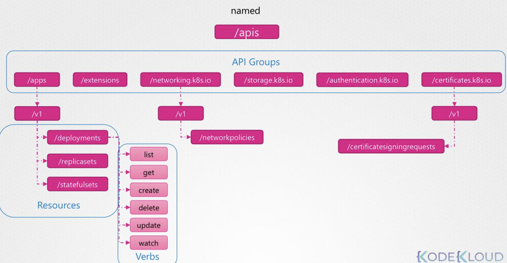
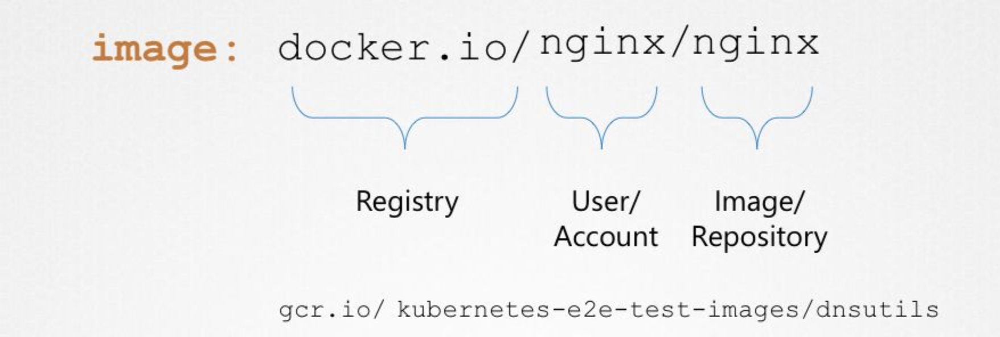

# [Udmey_CKA] #6 Security

> Udemy의 CKA with Practical Test 강의를 듣고 정리합니다.

## Kubernetes Security Primitives

- 기본적으로 클러스터 내의 pod들을 서로 접근이 가능하다. 네트워크 정책을 사용하여 pod간 접근을 제한할 수 있다.

## Authentication

- 사용자가 kubectl 을 사용하여 명령어를 입력하면, kube-apiserver는 요청을 처리하기 전에 사용자를 인증하는 절차를 거친다.
    - 인증은 다음과 같은 다양한 방식으로 인증할 수 있다.
        - static password file
        - static token file
        - certificates
        - identity service

### Auth Mechanisms - Basic

- 간단하게 Static password file 또는 static token file으로 사용자 인증을 할 수 있지만, 보안상 권장하는 방법은 아니다.
- static password file
    - 다음과 같이 user-detail.csv 파일을 작성한다.
    
    ```bash
    password123,user1,u0001,group1
    password123,user2,u0002,group2
    password123,user3,u0003,group2
    ```
    
    - kube-apiserver.service에 `—-basic-auth-file=user-details.csv` 옵션을 추가한다.
- static token file
    - 다음과 같이 token 파일을 작성한다.
    
    ```bash
    Kpjvdiojr3rwekldsds,user10,u0010,group1
    fjgklajwfemd12wdfdk,user11,u0011,group2
    ```
    
    - kube-apiserver.service에 `—-token-auth-file=user-details.csv` 옵션을 추가한다.
    

## TLS Basic

### TLS Certificate

- 두 그룹간 통신에서 신뢰성을 보장하기 위해 사용하는 것

### Symmetric Encryption (대칭 키 방식)

- 수신 그룹의 암호화와 송신 그룹의 복호화 과정에서 동일한 키를 사용하는 것
- 수신 그룹과 송신 그룹이 동일한 키를 갖기 위해서는 꼭 한 번 키를 교환하는 과정이 필요한데, 키를 교환하는 과정에서 해커가 키를 탈취할 수 있다는 위험성이 있다.

### Asymmetric Encryption (비대칭 키 방식)

- 비대칭 키 방식에서는 두 개의 키를 사용하며, 각각은 private key와 public key 이다. public key는 모든 사람이 갖고 있을 수 있으며, private key는 아무에게도 주지 않고 본인만 가지고 있어야 한다.
    - public key 형식: *.crt, *.pem
    - private key 형식: *.key, *-key.pem
- public key를 가지고 있는 사람은 데이터를 public key로 암호화한 후에 private key를 가진 사용자에게 전송한다. private key를 갖고 있는 사용자는 private key를 사용하여 이를 해독하고 데이터를 얻을 수 있다.
- 예를 들어, 클라이언트가 어떤 서버에 https로 접근하면 해당 서버의 public key를 얻게 된다. 사용자는 얻은 public key를 사용하여 대칭 키를 암호화하여 서버로 보내고, 서버는 자신이 가진 private key를 사용하여 사용자가 보낸 대칭 키를 얻는다. 이 과정에서 데이터를 스니핑 당하더라도 해커는 private key를 갖고 있지 않기 때문에 대칭 키를 얻을 수 없으며, 서버와 클라이언트는 안전하게 통신할 수 있다.
- 이러한 모든 과정을 PKI(Public Key Infrastructure) 라고 부른다.

### CA(Certificate Authorities)

- 서버는 public key를 보낼 때 인증서를 함께 보내게 되는데, 인증서에는 인증서를 발급한 주체와 public key에 대한 정보가 포함되어 있다.
- 만약 인증서가 CA에서 발급을 인정한 정식 인증서가 아닌 경우, 브라우저는 그 사실을 사용자에게 알려줌으로써 해킹을 방지할 수 있다.

## TLS in Kubernetes


### Server Certificates for Server

- kube-apiserver, etcd, kubelet 서버들은 각각 public key와 private key를 생성한다.

### Client Certificates for Client

- admin, kube-scheduler, kube-controller-manager, kube-proxy는 kube-api 서버와 통신하기 위해 public key와 private key를 생성한다.

### Certificate Creation

- openssl 을 사용하여 ca.key를 발급받을 수 있으며, 통신을 하는 모든 서버는 ca.key 사본을 갖고 있어야 한다.

## Certificate API (Certificate Signing Requests)

- 일반적으로 쿠버네티스에서는 검증된 root CA 대신 private root CA를 사용한다. 쿠버네티스의 CSR(Certificate Signing Requests)는 쿠버네티스 클러스터에서 사용하고 있는 private root CA로부터 인증서를 발급 받는 기능을 제공한다.
- CSR 기능을 사용하면 다음과 같은 과정을 거쳐 인증서를 발급 받을 수 있다.
    + 인증서의 private key 생성
        
        ```bash
        openssl genra -out jane.key 2048
        ```
        
    + 생성한 인증서의 private key를 사용하여 CSR 파일 작성
        
        ```bash
        openssl req -new -key jane.key -sub "/CN=jane" -out jane.csr
        ```
        
    + 생성한 CSR 파일의 내용을 base64로 인코딩한 문자열을 사용하여 쿠버네티스의 CSR manifest 작성 및 인증서 발급 요청
        
        ```bash
        cat jane.csr | base64 # 인코딩
        ```
        
        ```yaml
        apiVersion: certificates.k8s.io/v1
        kind: CertificateSigningRequest
        metadata:
          name: jane
        spec:
          groups:
          - system:authenticated
          request: # csr 파일 인코딩 결과
          signerName: kubernetes.io/kube-apiserver-client
          usages:
          - client auth
        ```
        
    + 인증서 발급 수락
        
        ```yaml
        kubectl certificate approve jane  # 수락
        kubectl certificate deny jane     # 거절
        ```
        

## KubeConfig

- kubeconfig 파일은 클러스터에 대한 접근을 구성하는 데 사용되는 파일이다. kubectl 는 kubeconfig 파일을 사용하여 클러스터를 선택하고, 클러스터의 API 서버와 통신하기 위한 정보를 찾는다.
- 기본적으로 kubectl은 $HOME/.kube 디렉터리에서 config 라는 이름의 파일을 찾는다.
- 다른 kubeconfig 파일을 사용하기 위해서는 KUBECONFIG 환경 변수를 지정하거나, —kubeconfig 플래그를 지정하여 다른 경로를 설정할 수 있다. KUBECONFIG 환경 변수는 kubeconfig 파일 목록을 보유하며, KUBECONFIG 환경 변수가 없을 경우애는 기본 kubeconfig 파일인 $HOME/.kube/config 를 사용한다.

### kubeConfig 파일



- Cluster, Contexts, Users 영역으로 나뉜다.
- Cluster와 User 정보를 연결하기 위해서 Contexts를 매개체로 사용한다.
    
    ```yaml
    apiVersion: v1
    kind: Config
    current-context: dev-user@google
    clusters:
    - name: my-kube-playground
      cluster:
        certificate-authority: ca.crt
        server: https://my-kube-playground:6443
    contexts:
    - name: my-kube-admin@my-kube-playground
      context:
        cluster: my-kube-playground
        user: my-kube-admin
        namespace: namespace01
    users:
    - name: my-kube-admin
      user:
        client-certificate: admin.crt
        client-key: admin.key
    ```
    
- Context 가 여러 개 있을 경우, `current-context` field를 통해 기본으로 사용할 context 정보를 지정한다.
- context 영역에는 namespace 를 지정하여 특정 namespace에서 context가 사용되도록 할 수 있다.

## API Groups

- 쿠버네티스에서 사용하는 api server에 다음과 같이 url 및 포트 번호를 사용하여 접속할 수 있다.

```bash
curl https://kube-master:6443/version       # api version 반환
curl https://kube-master:6443/api/v1/pods   # pod 정보 반환
```

- 쿠버네티스 api는 그 목적에 따라 다음과 같은 그룹으로 구분된다.
    + `metrics`, `healthz` : 클러스터 상태 모니터링을 위한 API
    + `logs`: third-party 앱과 결합하기 위한 API
    + `version`: 클러스터의 버전 정보 확인을 위한 API
    + `api`, `apis`: 클러스터 기능과 관련된 API
        * `api`: core group 으로 모든 주요 기능들이 위치해있는 API
            
            
            
            - namespace, pods, replication controller, events 등
        * `apis`: named group으로 core 그룹에 속하지 않는 다른 리소스들과 관련된 엔드포인트 제공
            
            
            
- 다음 명령어로 api 그룹 리스트를 확인할 수 있다.
    
    ```bash
    curl http://localhost:6443 -k
    ```
    
- API 그룹에 있는 항목들에 대해 알고 싶을 경우 다음 명령어를 사용한다.
    
    ```bash
    curl http://localhost:6443/apis -k | grep "name"
    
    ```
    
- API server에 접근하기 위해서는 사용자 인증 파일을 함께 전달해야 하는데, 번거로움을 피하기 위해서는 `kubectl proxy` 명령어를 사용하여 미리 사용자 인증 파일을 api server에 전달할 수 있다.

## Authorization

- 사용자가 인증을 완료하여 클러스터에 접근했다고 하자. 이제 사용자는 어떤 권한을 갖고 무엇을 할 수 있을까? 이것을 정의하기 위해 authorization이 필요하다.
- Authorization 방식에는 Node, ABAC, RBAC, Webhook 등의 방식이 있다.

### Node

- apiserver에서 kubelet에 cert를 발급할 때 node를 그룹으로 묶어 권한을 부여한다. Node는 각 kubelet을 기준으로 권한을 설정하는 방식이다.

### ABAC (Attribute Based Authorization Controls)

- ABAC에서는 각 사용자 또는 그룹을 기준으로 권한을 부여한다. 이렇게 하기 위해서는 사용자별 policy 파일을 json 파일을 생성하여 API 서버로 보낸다.
- 새로운 사용자가 들어오거나 정책에 변화가 있을 때마다 json 파일을 직접 수정하고 kube-apiserver를 재시작 해야해서 관리가 어렵다는 단점이 있다.

### RBAC (Role Based Authorization Controls)

- RBAC는 Role을 정의하고, 해당 Role을 사용자 또는 그룹에 매칭시키는 방식이다. 관리가 용이하다는 장점이 있다.
- 다음과 같이 Role 을 정의한다.
    
    ```yaml
    apiVersion: rbac.authorization.k8s.io/v1
    kind: Role
    metadata:
      name: developer
    rules:
    - apiGroups: [""]
      resources: ["pods"]
      verbs: ["list", "get", "create", "update"]
    - apiGroups: [""]
      resources: ["ConfigMap"]
      verbs: ["create"]
      resourceNames: ["blue", "orange"]  # namespace 정의
    ```
    
- 정의한 Role을 기반으로 다음과 같이 Role-Binding 리소스를 정의한다.
    
    ```yaml
    apiVersion: rbac.authorization.k8s.io/v1
    kind: RoleBinding
    metadata:
      name: devuser-developer-binding
    subjects:
    - kind: User
      name: dev-user
      apiGroup: rbac.authorization.k8s.io
    roleRef:
      kind: Role
      name: developer
      apiGroup: rbac.authorization.k8s.io
    ```
    

### Webhook

- out-source 솔루션을 사용하고 싶을 경우 Webhook 방식을 사용할 수 있다. kube apiserver는 Webhook 방식으로 외부 third-party 솔루션에 권한 정보를 요청할 수 있다.

### AlwaysAllow, AlwaysDeny

- 그 외 권한 모드에는 AlwaysAllow 와 AlwaysDeny가 있다. 기본값은 AlwaysAllow이며, 이 경우 사용자 인증 없이 모든 사용자에게 권한을 부여한다.
- authrization-mode 옵션에 여러 방식을 기입할 수 있는데, 이 경우 시스템은 앞에서부터 차례로 사용자를 검색하여 권한을 부여한다.

### Check Access

- 어떤 명령어를 수행할 권한이 있는지 알고싶을 경우 can-i 옵션을 사용할 수 있다.
    
    ```yaml
    kubectl auth can-i create deployment
    kubectl auth can-i delete nodes
    
    kubectl auth can-i create deployment --as dev-user
    kubectl auth can-i create pods --as dev-user
    
    kubectl auth can-i create pods --as dev-user -n ns-name
    ```
    

## Cluster Roles and Role Bindings

- Role과 RoleBinding은 namespace 하위에 존재하는 자원으로, 옵션 없이 Role과 RoleBinding을 생성하면 default namespace를 기준으로 생성된다.

### clusterroles

- 클러스터를 기준으로 생성되는 Role으로, 모든 namespace를 기준으로 역할이 부여된다. clusterrole에서는 주로 노드를 관리하거나 PV 스토리지 등을 관리하는 역할을 생성한다.

```yaml
# cluster-admin-role.yaml

apiVersion: rbac.authorization.k8s.io/v1
kind: ClusterRole
metadata:
  name: cluster-administrator
rules:
- apiGroups: [""]
  resources: ["nodes"]
  verbs: ["list", "get", "create", "delete"]
```

### clusterrolebinding

- 클러스터를 기준으로 clusterrole과 사용자를 매칭하는 자원이다.

```yaml
# cluster-admin-role-binding.yaml

apiVersion: rbac.authorization.k8s.io/v1
kind: ClusterRoleBinding
metadata:
  name: cluster-admin-role-binding
subjects:
- kind: User
  name: cluster-admin
  apiGroup: rbac.authorization.k8s.io
roleRef:
  kind: ClusterRole
  name: cluster-administrator
  apiGroup: rbac.authorization.k8s.io
```

## Service Accounts

- Service 계정은 모니터링 솔루션, 로그 솔루션 등 쿠버네티스 클러스터와 통신 해야하는 서비스 계정으로 사용되는 것이다.
- 다음과 같이 create 옵션으로 service account를 생성하면, 자동으로 service account에 대한 토큰이 생성된다.
    
    ```yaml
    kubectl create serviceaccount account-name
    ```
    
    + 토큰은 secret object로 생성되며, describe 명령어로 확인할 수 있다.
- 쿠버네티스에는 기본적으로 default service account가 있으며, 이는 kubernetes API에 대한 정보가 들어있다. pod를 생성하면 자동으로 default service account 정보가 mount된다.
- default service account 외에 다른 service account를 사용하고 싶다면, pod manifest 파일에 사용하고자 하는 service account 이름을 명시해주면 된다.
    
    ```yaml
    apiVersion: v1
    kind: Pod
    metadata:
      name: my-dashboard
    spec:
      containers:
      - name: my-dashboard
        image: my-dashboard
      serviceAccountName: dashboard-db
    ```
    
- 만약 자동으로 default service account가 mount되는 것을 막고 싶다면, 다음과 같이 옵션을 설정한다.
    
    ```yaml
    apiVersion: v1
    kind: Pod
    metadata:
      name: my-dashboard
    spec:
      containers:
      - name: my-dashboard
        image: my-dashboard
      automountServiceAccountToken: false
    ```
    

## Image Security

- 이미지 이름은 `registry` + `user/account` + `image/repository` 조합으로 이루어져있다.



- private repository를 사용할 경우에는 credential 이 필요한데, 먼저 private docker repository에 접근할 수 있는 secret 오브젝트를 생성한 후에 해당 secret 정보를 사용하여 이미지를 가져올 수 있다.
- docker-registry에 사용할 secret은 다음과 같이 만들 수 있다.

    ```yaml
    kubectl create secret docker-registry private-reg-cred \
    --docker-username=dock_user \
    . --docker-password=dock_password \
    . --docker-server=myprivateregistry.com:5000 \
    . --docker-email=dock_user@myprivateregistry.com
    ```

    ```yaml
    apiVersion: v1
    kind: Pod
    metadata:
    name: nginx-pod
    spec:
    containers:
    - name: nginx
        image: private-registry.io/apps/internal-app
    imagePullSecrets:
    - name: regcred
    ```

## Security Context

- Security context란 pod 또는 컨테이너에 대한 권한 또는 특권을 정의한다. pod 수준에서 정의할 수도 있고, pod 내의 컨테이너 수준에서 권한을 정의할 수도 있으며, 컨테이너 수준의 권한이 pod 수준의 권한을 덮어쓴다.

```yaml
apiVersion: v1
kind: Pod
metadata:
  name: security-context-demo
spec:
  securityContext:
    runAsUser: 1000
    runAsGroup: 3000
    fsGroup: 2000
  volumes:
  - name: sec-ctx-vol
    emptyDir: {}
  containers:
  - name: sec-ctx-demo
    image: busybox
    command: [ "sh", "-c", "sleep 1h" ]
    volumeMounts:
    - name: sec-ctx-vol
      mountPath: /data/demo
    securityContext:
      allowPriviliegeEscalation: false
```

- runAsUser: Pod 내의 모든 프로세스들은 user id 1000번으로 실행된다.
- runAsGroup: Pod 내의 모든 프로세스들이 실행될 때 group id 3000번이 가장 높은 우선 순위를 갖는다. 만약 이 field가 정의되지 않을 경우 root(0)가 가장 높은 우선 순위를 갖는다.
- 새로운 파일이 생성될 경우에도 기본적으로 1000번 사용자와 3000번 그룹이 소유자가 된다.
- fsGroup: Pod 내의 모든 프로세스들은 2000번 그룹을 보조 그룹으로 갖는다.

### Network Policy

- NetworkPolicy 를 사용하여 어떤 pod의 ingress, egress 정책을 적용할 수 있다.

```yaml
apiVersion: networking.k8s.io/v1
kind: NetworkPolicy
metadata:
  name: db-policy
spec:
  podSelector:
    matchLabels:
      role: db
  policyTypes:
  - Ingress
  ingress:
  - from:
    - podSelector:              # pod 선택
        matchLabels:
          name: api-pod
      namespaceSelector:        # namespace 선택
        matchLabels:
          name: prod
    - ipBlock:
        cidr: 192.168.5.10/32   # 특정 ip 범위 차단
    ports:
    - protocol: TCP
      port: 3306
  egress:
  - to:
    - ipBlock:
        cidr: 192.168.5.10/32
    ports:
    - protocol: TCP
      port: 80 
```
