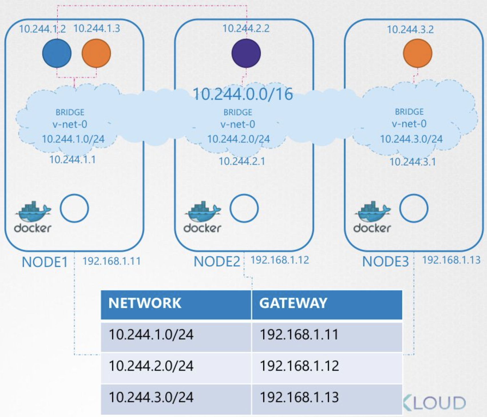

# [Udmey_CKA] #8 Network

> Udemy의 CKA with Practical Test 강의를 듣고 정리합니다.

## Network Basic

### Switching/Routing

- Switching: 같은 네트워크 대역에서 MAC 주소를 사용하여 데이터 전송
- Routing: 다른 네트워크 대역 사이에서 IP 주소를 사용하여 데이터 전송

### DNS

- DNS(Domain Name System)은 호스트의 도메인 이름을 호스트의 네트워크 주소로 바꾸거나 그 반대의 변환을 수행
- Linux 환경에서 DNS를 사용하는 방법은 /etc/hosts 파일에 DNS 정보를 저장하는 것이다. 시스템은 도메인 이름으로 IP를 검색할 때 이 파일을 가장 먼저 열어본다.
- 만약 host 파일에 원하는 DNS 정보가 없을 경우, 시스템은 /etc/resolv.conf 파일을 열어 도메인을 검색할 도메인 서버의 주소를 찾는다. 도메인 서버에서 원하는 DNS 레코드를 검색한다.

### CoreDNS

- CoreDNS는 CNCF에서 관리하는 프로젝트로, 쿠버네티스에서 사용을 권장하는 도메인 서버 서비스다.
- CoreDNS는 클러스터를 모니터링하며, 새로운 Service 또는 Pod이 추가되는 경우 도메인 서버에 이를 업데이트한다.

### Network Namespace

- 네트워크 네임스페이스는 네트워크 인터페이스, 라우팅, 방화벽 규칙 등을 격리한다.
- `veth`: 가상 이더넷 인터페이스(virtual ethernet interface)로, 항상 쌍으로 생성되어 연결된 상태를 유지하며, network namespace간 터널 역할을 한다.
- `ip link list` 를 입력하면 네트워크 인터페이스를 출력할 수 있다.
- `Bridge` : 네트워크를 segment 단위로 분할하여 네트워크 세그먼트 사이에서 트래픽을 전달하는 역할을 한다.

## Pod Networking

- 모든 Pod는 고유의 IP를 가지며, 같은 클러스터 내에 있는 POD들은 서로 통신할 수 있다.



- 각 Node에는 bridge 가 있으며, bridge는 할당 받은 네트워크 대역에서 container에 ip를 부여한다. 클러스터는 각 node가 사용할 수 있는 네트워크 대역을 저장하여 node간 통신을 가능하게 한다.

### CNI(Container Network Interface)

- Pod가 생성, 삭제될 때 호출되는 네트워크 API 의 구격과 인터페이스를 정의한 것이다.
    + IPAM(IP Address Management): Pod 생성, 삭제 시 IP 주소 할당 및 해제
    + Network: Pod 생성, 삭제 시 네트워크 연결을 구현
- 다음 명령어를 사용하여 kubelet에서 사용하는 cni 설정을 확인할 수 있다.
    
    ```yaml
    ps -aux | grep kubelet
    ```
    
- 쿠버네티스에서 사용할 수 있는 CNI 플러그인 /opt/cni/bin에서, CNI conf는 /etc/cni/net.d 에서 확인할 수 있다.

### CNI Weave

- WeaveWork는 CNI 플러그인 중 하나이다. Weave는 클러스터의 각 노드에 배포되어 노드간 네트워크 통신이 원할하게 되도록 역할을 한다.
- Weave 는 다음 명령어로 쉽게 배포할 수 있다. weave를 배포하면 각 node에 weave agent가 배포된다.
    
    ```yaml
    kubectl apply -f "https://cloud.weave.works/k8s/net?k8s-version=$(kubectl version | base64 | tr -d '\n')"
    ```
    

## DNS in Kubernetes

- 쿠버네티스에서는 hostname.namespace.type.root 의 형태로 DNS 정보를 생성한다.
- web-service.apps.svc.cluster.local 이라는 DNS 서비스를 보자.
    + `web-service`: 서비스 이름
    + `apps`: 네임스페이스
    + `svc`: 오브젝트 타입 (서비스)
    + `cluster.local`: 루트 클러스터 정보
- pod의 경우 pod의 ip 주소가 서비스 이름이 된다.
    + 예시: 10-244-2-5.apps.pod.cluster.local
        * `10-244-2-5`: 서비스 이름 (10.244.2.5 ip를 가진 pod)
        * `apps`: 네임스페이스
        * `pod`: 오브젝트 타입 (pod)
        * `cluster.local`: 루트 클러스터 정보

### CoreDNS in Kubernetes

- Ingress를 작동시키려면 클러스터에 Ingress controller를 실행해야 한다.
- CoreDNS는 쿠버네티스에서 권장하는 DNS 서버이다.
- /etc/coredns/Corefile 에 coreDNS에 대한 정보가 저장되어 있다.
- CoreDNS는 자동으로 생성되는 오브젝트의 DNS 정보를 저장한다.

## Ingress

- Ingress는 한 개의 IP 주소로 수십 개의 서비스에 접근이 가능하도록 지원해준다. 클라이언트가 http 요청을 ingress에 보내면, 요청한 호스트와 경로에 따라 어떤 서비스에 요청을 전달할 지 결정된다.
- 다음 예시는 [kubia.example.com](http://kubia.example.com)으로 요청되는 모든 http 요청을 kubia-nodeport 서비스의 포트 80으로 전송하는 규칙이다.
    
    ```yaml
    apiVersion: networking.k8s.io/v1
    kind: Ingress
    metadata:
      name: kubia
    spec:
      rules:
      - host: kubia.example.com
        http:
          paths:
          - path: /
            backend:
              service:
                name: kubia-nodeport
                port:
                  number: 80
    ```
    
- 다음 예제는 동일한 호스트의 다른 경로로 여러 서비스를 매핑하는 방법이다.
    
    ```yaml
    apiVersion: networking.k8s.io/v1
    kind: Ingress
    metadata:
      name: kubia
    spec:
      rules:
      - host: kubia.example.com
        http:
          paths:
          - path: /kubia
            pathType: Prefix
            backend:
              service:
                name: kubia
                port:
                  number: 80
          - path: /bar
            pathType: Prefix
            backend:
              service:
                name: bar
                port:
                  number: 80
    ```
    
- 다음 예제는 서로 다른 호스트로 서로 다른 서비스를 매핑하는 방법이다.
    
    ```yaml
    apiVersion: networking.k8s.io/v1
    kind: Ingress
    metadata:
      name: kubia
    spec:
      rules:
      - host: foo.example.com
        http:
          paths:
          - path: /
            pathType: Prefix
            backend:
              service:
                name: foo
                port:
                  number: 80
      - host: bar.example.com
        http:
          paths: 
          - path: /
            pathType: Prefix
            backend:
              service:
                name: bar
                port:
                  number: 80
    ```
